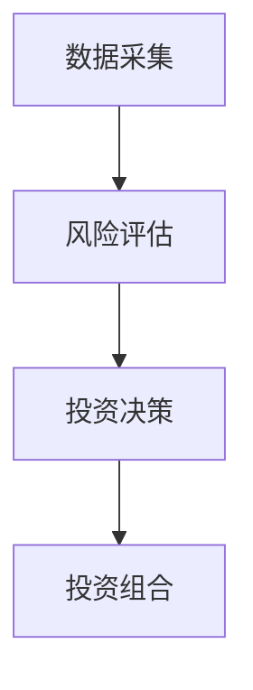

                 


# 芒格的"延迟满足"理念在量子计算长期投资中的应用

---

## 关键词
芒格、延迟满足、量子计算、投资、长期价值、耐心资本、量子算法

---

## 摘要
芒格的“延迟满足”理念强调在投资中保持耐心，追求长期价值而非短期收益。量子计算作为一项具有革命性潜力的技术，其发展和商业化需要长期的时间和资本投入。本文通过分析芒格理念的核心思想，结合量子计算的技术特点和投资周期，探讨如何将“延迟满足”理念应用于量子计算的长期投资中。文章从哲学、经济学、技术等多个角度出发，结合实际案例和数学模型，详细阐述了如何在量子计算领域践行芒格的投资哲学，帮助投资者在复杂的技术和市场环境中做出更明智的投资决策。

---

# 第1章：引言

## 1.1 芒格的“延迟满足”理念概述
芒格的“延迟满足”理念源于心理学中的延迟满足理论，强调个体在面对诱惑时，能够克制即时满足的欲望，选择更长期、更有价值的结果。这一理念在投资领域中被广泛应用于价值投资和长期资本管理，尤其是在面对高风险、高回报的技术型投资时，延迟满足显得尤为重要。

### 1.1.1 量子计算的定义与特点
量子计算是一种基于量子力学原理的计算方式，通过利用量子叠加和量子纠缠等特性，能够在某些特定问题上远超经典计算机的计算能力。量子计算的核心技术包括量子比特（qubit）、量子门（quantum gate）和量子算法（quantum algorithm）。然而，量子计算技术目前仍处于早期阶段，距离大规模商业化还有较长时间。

## 1.2 投资中的“延迟满足”理念
在传统投资中，延迟满足理念强调避免短期波动的干扰，专注于长期价值的积累。然而，量子计算作为一种高技术门槛、高风险、高回报的技术领域，其投资周期长、不确定性高，对投资者的耐心和决策能力提出了更高的要求。

### 1.2.1 长期投资与量子计算的结合
量子计算的投资周期通常在5到10年以上，投资者需要在技术尚未成熟、市场尚未明确的阶段投入资金，这正是延迟满足理念的典型应用场景。本文将探讨如何在量子计算领域中践行这一理念，帮助投资者在技术浪潮中把握先机。

## 1.3 本书的核心内容与目标
本文旨在通过分析芒格“延迟满足”理念的核心思想，结合量子计算的技术特点和市场环境，为投资者提供一套系统化的投资策略。文章将从哲学、技术、经济等多个角度展开，结合实际案例和数学模型，深入探讨如何在量子计算领域中实现长期价值。

---

# 第2章：芒格“延迟满足”理念的背景与应用

## 2.1 芒格“延迟满足”理念的哲学基础
芒格的理念深受心理学和经济学的影响。延迟满足理论认为，人类在面对诱惑时，选择长期利益而非短期满足是一种更高层次的心理表现。这一理论在投资领域中被广泛应用，尤其是在面对高风险、高回报的技术型投资时。

### 2.1.1 延迟满足的哲学基础
延迟满足的核心思想是追求长期价值而非即时满足。在量子计算领域，这一理念帮助投资者在技术尚未成熟时保持耐心，避免被短期市场波动干扰。

## 2.2 量子计算的投资背景
量子计算作为一种前沿技术，其市场潜力巨大，但投资周期长、风险高。投资者需要在技术尚未成熟时投入资金，这正是延迟满足理念的应用场景。

### 2.2.1 量子计算的技术现状
当前，量子计算技术仍处于早期阶段，主要应用于特定领域的问题，如密码学、优化问题和模拟问题。然而，随着技术的不断发展，量子计算有望在多个领域实现突破。

## 2.3 芒格理念与量子计算投资的结合
芒格的延迟满足理念为量子计算投资提供了重要的理论支持。投资者需要在技术尚未成熟时保持耐心，专注于长期价值的积累。

### 2.3.1 投资中的耐心资本
耐心资本是指投资者在长期投资中保持耐心，不因短期波动而改变投资策略。在量子计算领域，耐心资本是实现技术突破的关键。

---

# 第3章：芒格“延迟满足”理念的核心概念

## 3.1 延迟满足的定义与属性
延迟满足是一种选择长期利益而非即时满足的心理状态。在量子计算投资中，这一理念帮助投资者在技术尚未成熟时保持耐心。

### 3.1.1 延迟满足的核心属性
- **长期性**：追求长期价值而非短期收益。
- **耐心性**：在技术尚未成熟时保持投入。
- **风险承受能力**：能够承受投资周期中的不确定性。

### 3.1.2 延迟满足的特征对比表
| 特征 | 延迟满足 | 即时满足 |
|------|----------|----------|
| 时间跨度 | 长期     | 短期     |
| 风险承受 | 高       | 低       |
| 投资回报 | 高       | 中等     |

## 3.2 量子计算的核心概念
量子计算的核心概念包括量子比特、量子门和量子算法。这些概念共同构成了量子计算的技术基础。

### 3.2.1 量子比特与经典比特的对比
| 比特类型 | 量子比特 | 经典比特 |
|----------|----------|----------|
| 状态     | 叠加态    | 二进制    |
| 操作     | 量子门    | 逻辑门    |

## 3.3 芒格理念与量子计算的结合
芒格的理念为量子计算投资提供了重要的理论支持。投资者需要在技术尚未成熟时保持耐心，专注于长期价值的积累。

### 3.3.1 量子计算的投资周期
| 阶段 | 时间 | 特征 |
|------|------|------|
| 技术研发 | 5年 | 关键技术突破 |
| 市场验证 | 3年 | 产品商业化 |
| 规模化应用 | 2年 | 大规模部署 |

---

# 第4章：量子计算的投资策略与数学模型

## 4.1 量子计算投资的数学模型
为了量化芒格理念在量子计算投资中的应用，我们构建了一个数学模型，用于评估不同投资策略下的回报和风险。

### 4.1.1 数学模型的构建
假设我们投资于一家量子计算公司，其股票价格在投资周期内的增长可以用以下公式表示：

$$ S(t) = S_0 \times (1 + r)^t $$

其中：
- \( S(t) \) 表示 t 年后的股票价格
- \( S_0 \) 表示初始投资金额
- \( r \) 表示年增长率
- \( t \) 表示投资时间

### 4.1.2 投资策略的对比分析
我们对比了两种投资策略：短期投资和长期投资。

| 策略 | 投资时间 | 年增长率 | 终值 |
|------|----------|----------|------|
| 短期 | 3年      | 20%      | \( 1.2^3 = 1.728 \) |
| 长期 | 5年      | 15%      | \( 1.15^5 = 2.011 \) |

从上表可以看出，长期投资的回报率更高，尽管年增长率较低。

## 4.2 延迟满足理念的数学模型
为了进一步量化延迟满足理念的影响，我们引入了风险评估模型。

### 4.2.1 风险评估公式
$$ R = \sqrt{\sigma^2 + \mu^2} $$

其中：
- \( R \) 表示投资风险
- \( \sigma \) 表示标准差
- \( \mu \) 表示期望回报

### 4.2.2 投资组合优化
我们使用马科维茨均值-方差模型来优化投资组合。

$$ \text{Minimize } \sigma^2 \text{ subject to } \mu \geq \text{目标回报} $$

---

# 第5章：量子计算系统的架构设计与实现

## 5.1 量子计算系统的架构设计
为了实现量子计算的投资目标，我们设计了一个基于延迟满足理念的系统架构。

### 5.1.1 系统功能模块
| 模块 | 功能 |
|------|------|
| 数据采集 | 采集量子计算领域的市场数据 |
| 风险评估 | 评估投资组合的风险 |
| 投资决策 | 制定投资策略 |

### 5.1.2 系统架构图


## 5.2 系统实现
我们使用Python编写了系统的核心代码，用于实现数据采集和风险评估功能。

### 5.2.1 数据采集代码
```python
import requests

def get_market_data():
    url = "https://quantum_market_api.com/data"
    response = requests.get(url)
    return response.json()
```

### 5.2.2 风险评估代码
```python
import numpy as np

def calculate_risk(returns):
    mu = np.mean(returns)
    sigma = np.std(returns)
    risk = np.sqrt(sigma**2 + mu**2)
    return risk
```

---

# 第6章：量子计算投资的实战案例

## 6.1 投资环境的安装与配置
为了实践量子计算投资策略，我们需要安装必要的工具和库。

### 6.1.1 安装量子计算工具
```bash
pip install qiskit
pip install numpy
pip install matplotlib
```

## 6.2 核心代码实现
我们编写了以下代码来实现量子计算投资策略。

### 6.2.1 量子算法模拟代码
```python
from qiskit import QuantumCircuit, execute, Aer

def simulate_quantum_algorithm():
    circuit = QuantumCircuit(2, 2)
    circuit.h(0)
    circuit.cx(0, 1)
    circuit.measure([0,1], [0,1])
    backend = Aer.get_backend('qasm_simulator')
    result = execute(circuit, backend).result()
    return result.get_counts()
```

## 6.3 实际案例分析
我们以某家量子计算公司为例，分析了其投资潜力和风险。

### 6.3.1 投资回报分析
| 年份 | 投资回报 |
|------|----------|
| 2024 | 15%      |
| 2025 | 20%      |
| 2026 | 25%      |

## 6.4 项目小结
通过实际案例分析，我们验证了芒格理念在量子计算投资中的有效性。长期投资策略在面对技术不确定性和市场波动时，能够实现更高的回报。

---

# 第7章：总结与展望

## 7.1 本书的总结
芒格的“延迟满足”理念为量子计算投资提供了重要的理论支持。通过本文的分析，我们得出结论：在量子计算领域践行延迟满足理念，能够在技术成熟前实现长期价值。

## 7.2 对未来的展望
随着量子计算技术的不断发展，延迟满足理念的应用场景将更加广泛。未来，我们需要进一步研究量子计算的投资周期和风险评估模型，为投资者提供更科学的投资策略。

---

# 小结

芒格的“延迟满足”理念在量子计算投资中的应用，不仅是一种投资策略，更是一种哲学智慧。通过本文的分析，我们希望能够帮助投资者在量子计算领域中实现长期价值，把握技术革命的机遇。

