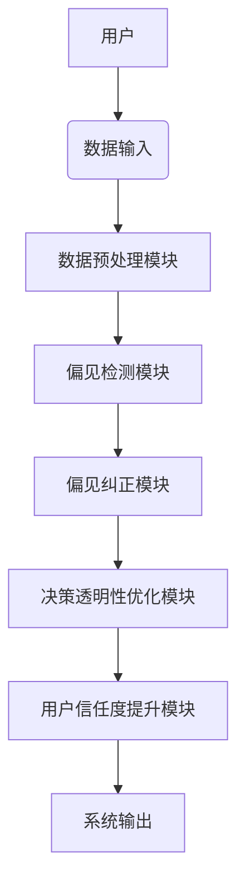

                 


# 芮格的"心理倾向"理论在人工智能伦理设计中的应用

---

## 关键词

- 人工智能伦理设计
- 心理倾向理论
- 偏见检测
- 透明性优化
- 用户信任
- 算法公平性

---

## 摘要

芒格的“心理倾向”理论在人工智能伦理设计中具有重要的应用价值。本文系统性地探讨了心理倾向理论的核心概念、其在人工智能决策中的影响，以及如何将心理倾向理论应用于人工智能伦理设计中的偏见检测、决策透明性优化和用户信任构建等问题。通过分析心理倾向理论在算法设计中的具体应用，本文提出了基于心理倾向的伦理框架构建方法，并通过实际案例展示了如何通过算法实现偏见检测与纠正、决策透明性优化以及用户信任度提升。最后，本文总结了心理倾向理论在人工智能伦理设计中的重要性，并展望了未来的研究方向。

---

# 第1章: 芮格心理倾向理论概述

## 1.1 心理倾向理论的背景与核心概念

### 1.1.1 心理倾向理论的定义与核心要素

心理倾向理论是芒格在其投资哲学中提出的核心概念，强调人类决策过程中存在的多种心理偏差和倾向。心理倾向包括但不限于：从众倾向、确认偏差、过度自信倾向、损失厌恶等。这些心理倾向通常会导致决策者在信息处理和判断过程中出现系统性偏差。

- 心理倾向的定义：心理倾向是指个体在决策过程中受到内在或外在因素影响而产生的非理性偏好或偏差。
- 核心要素：
  1. 偏好性：个体在决策中对某些选项的偏好程度。
  2. 系统性：心理倾向往往具有系统性，而非随机性。
  3. 影响性：心理倾向会影响个体的决策行为。

### 1.1.2 心理倾向理论的分类与特征

心理倾向可以分为以下几类：
1. **认知性倾向**：包括确认偏差、忽略可能性偏差等。
2. **情感性倾向**：包括从众倾向、社会认同倾向等。
3. **动机性倾向**：包括过度自信倾向、损失厌恶等。

心理倾向的特征：
- **普遍性**：心理倾向在所有人类决策中普遍存在。
- **隐蔽性**：许多心理倾向是无意识的，难以被个体察觉。
- **影响性**：心理倾向会影响个体的决策质量和效果。

### 1.1.3 心理倾向理论在决策中的作用

心理倾向理论在决策中的作用主要体现在以下几个方面：
1. **解释决策偏差**：心理倾向理论能够解释许多看似不理性的决策行为。
2. **优化决策过程**：通过识别和理解心理倾向，可以设计更合理的决策框架。
3. **提升决策质量**：通过减少心理倾向的影响，可以提高决策的准确性和效果。

## 1.2 芮格心理倾向理论与人工智能的关联

### 1.2.1 人工智能伦理设计的背景与挑战

人工智能的快速发展带来了许多伦理问题，例如：
1. **算法偏见**：算法在数据训练过程中可能继承人类社会的偏见。
2. **决策透明性**：复杂的算法决策过程难以解释，导致用户不信任。
3. **用户隐私**：人工智能系统可能过度收集和使用用户数据，侵犯隐私。

### 1.2.2 心理倾向理论在人工智能中的应用潜力

心理倾向理论在人工智能伦理设计中的应用潜力主要体现在以下几个方面：
1. **算法设计**：通过理解心理倾向，可以设计更符合人类认知习惯的算法。
2. **用户交互**：通过识别用户的心理倾向，可以优化人机交互体验。
3. **伦理决策**：通过心理倾向理论，可以构建更符合伦理的决策框架。

### 1.2.3 人工智能伦理设计的核心问题

人工智能伦理设计的核心问题包括：
1. **可解释性**：算法决策过程是否透明且易于理解。
2. **公平性**：算法是否公平，是否存在偏见。
3. **用户隐私**：如何在保证功能的同时保护用户隐私。

---

# 第2章: 人工智能伦理设计的基本原则

## 2.1 人工智能伦理设计的定义与目标

### 2.1.1 人工智能伦理设计的定义

人工智能伦理设计是指在人工智能系统的开发和应用过程中，通过设计手段确保系统行为符合伦理规范，包括公平性、透明性、隐私保护等方面。

### 2.1.2 人工智能伦理设计的目标与价值

人工智能伦理设计的目标是：
1. **提升用户信任**：通过透明和可解释的决策过程，增强用户对人工智能系统的信任。
2. **减少算法偏见**：通过设计消除或减少算法中的偏见，确保公平性。
3. **保护用户隐私**：在保证功能的同时，保护用户隐私。

### 2.1.3 人工智能伦理设计的基本原则

人工智能伦理设计的基本原则包括：
1. **可解释性**：算法决策过程必须透明且易于理解。
2. **公平性**：算法必须公平，不能对特定群体产生歧视。
3. **透明性**：用户必须能够理解算法的决策逻辑。
4. **隐私保护**：在设计和应用中必须保护用户隐私。

## 2.2 人工智能伦理设计的核心要素

### 2.2.1 可解释性原则

可解释性原则要求人工智能系统的决策过程必须能够被用户理解。这可以通过以下方式实现：
1. **简单化设计**：设计简单易懂的算法，避免过于复杂的模型。
2. **可视化工具**：通过可视化工具展示算法决策过程。
3. **用户教育**：向用户解释算法的工作原理。

### 2.2.2 公平性与偏见问题

公平性与偏见问题是人工智能伦理设计中的重要挑战。算法偏见的形成原因包括：
1. **数据偏见**：训练数据中的偏差会导致算法产生偏见。
2. **算法设计**：算法设计中的偏差可能加剧偏见。

### 2.2.3 透明性与用户隐私

透明性原则要求人工智能系统必须公开其决策逻辑和数据使用方式。用户隐私保护则要求在设计和应用中必须严格控制数据的收集和使用。

---

# 第3章: 芮格心理倾向理论在人工智能伦理设计中的应用

## 3.1 心理倾向理论对人工智能决策的影响

### 3.1.1 偏见与决策偏差的形成机制

偏见与决策偏差的形成机制可以分为以下几个步骤：
1. **数据收集**：数据中的偏差被算法学习。
2. **算法学习**：算法在学习过程中放大了数据中的偏差。
3. **决策输出**：算法输出带有偏见的决策。

### 3.1.2 心理倾向在算法设计中的体现

心理倾向在算法设计中的体现包括：
1. **算法设计者的认知偏差**：设计者的认知偏差可能影响算法设计。
2. **算法决策逻辑**：算法的决策逻辑可能反映设计者的人类偏见。
3. **用户交互设计**：用户交互设计可能受到心理倾向的影响。

### 3.1.3 心理倾向对用户行为的影响

心理倾向对用户行为的影响包括：
1. **用户信任**：用户对人工智能系统的信任程度影响其使用行为。
2. **用户满意度**：用户的满意度受到算法决策的影响。
3. **用户隐私感知**：用户对隐私保护的感知影响其对系统的信任。

## 3.2 心理倾向理论在人工智能伦理设计中的具体应用

### 3.2.1 基于心理倾向的伦理框架构建

基于心理倾向的伦理框架构建包括以下几个步骤：
1. **识别关键心理倾向**：识别与人工智能伦理设计相关的心理倾向。
2. **设计伦理框架**：根据识别的心理倾向设计伦理框架。
3. **验证与优化**：通过实验验证框架的有效性，并进行优化。

### 3.2.2 心理倾向理论在算法决策中的应用

心理倾向理论在算法决策中的应用包括：
1. **偏见检测**：通过心理倾向理论检测算法中的偏见。
2. **决策优化**：根据心理倾向优化算法决策过程。
3. **结果解释**：通过心理倾向理论解释算法决策结果。

### 3.2.3 心理倾向理论在用户信任构建中的作用

心理倾向理论在用户信任构建中的作用包括：
1. **信任建立**：通过心理倾向理论建立用户对系统的信任。
2. **信任维护**：通过心理倾向理论维护用户的信任。
3. **信任修复**：当信任受到破坏时，通过心理倾向理论进行修复。

---

## 3.3 心理倾向理论在人工智能伦理设计中的应用案例

### 3.3.1 偏见检测与纠正

通过心理倾向理论，可以设计算法检测和纠正偏见。例如，在招聘系统中，可以通过分析算法的决策过程，检测是否存在性别偏见，并通过调整算法参数进行纠正。

### 3.3.2 决策透明性优化

通过心理倾向理论，可以优化算法的决策透明性。例如，在金融借贷系统中，可以通过展示算法的决策逻辑，增强用户的信任。

### 3.3.3 用户信任提升

通过心理倾向理论，可以设计更符合用户认知习惯的算法，从而提升用户信任。例如，在推荐系统中，可以通过分析用户的心理倾向，优化推荐算法，提升用户的满意度。

---

# 第4章: 人工智能伦理设计中的心理倾向分析方法

## 4.1 心理倾向分析的基本方法

### 4.1.1 心理倾向分析的定义与目标

心理倾向分析的定义：心理倾向分析是通过分析个体或群体的心理倾向，理解其决策行为的过程。

心理倾向分析的目标：
1. **理解决策行为**：通过心理倾向分析，理解个体或群体的决策行为。
2. **优化决策过程**：通过心理倾向分析，优化决策过程，减少偏差。

### 4.1.2 心理倾向分析的主要方法

心理倾向分析的主要方法包括：
1. **问卷调查**：通过设计问卷收集数据，分析心理倾向。
2. **行为观察**：通过观察个体行为，分析心理倾向。
3. **数据挖掘**：通过数据挖掘技术，分析数据中的心理倾向。

### 4.1.3 心理倾向分析的工具与技术

心理倾向分析的工具与技术包括：
1. **统计分析**：通过统计分析方法，分析数据中的心理倾向。
2. **机器学习**：通过机器学习算法，预测个体的心理倾向。
3. **自然语言处理**：通过自然语言处理技术，分析文本中的心理倾向。

## 4.2 基于心理倾向的算法设计

### 4.2.1 偏见检测与纠正算法

偏见检测与纠正算法的实现步骤：
1. **数据收集**：收集相关的数据，包括用户行为数据和算法决策数据。
2. **数据预处理**：对数据进行清洗和预处理，提取特征。
3. **偏见检测**：通过算法检测数据中的偏见。
4. **偏见纠正**：通过调整算法参数或重新训练模型，纠正偏见。

### 4.2.2 决策透明性优化算法

决策透明性优化算法的实现步骤：
1. **算法透明化**：通过设计使算法的决策过程透明。
2. **用户解释**：通过可视化工具向用户解释算法的决策过程。
3. **优化调整**：根据用户反馈优化算法的透明性。

### 4.2.3 用户信任度提升算法

用户信任度提升算法的实现步骤：
1. **信任度测量**：通过实验测量用户的信任度。
2. **信任提升策略**：设计策略提升用户信任。
3. **策略实施**：通过算法实现信任提升策略。

---

## 第5章: 人工智能伦理设计中的心理倾向算法实现

### 5.1 偏见检测与纠正算法

#### 5.1.1 偏见检测算法实现

```python
def detect_bias(data):
    # 数据预处理
    processed_data = preprocess(data)
    # 偏见检测
    bias_score = calculate_bias(processed_data)
    return bias_score
```

#### 5.1.2 偏见纠正算法实现

```python
def correct_bias(data, bias_score):
    # 根据偏见评分调整数据
    corrected_data = adjust_data(data, bias_score)
    return corrected_data
```

### 5.2 决策透明性优化算法

#### 5.2.1 决策透明性优化算法实现

```python
def optimize_transparency(data):
    # 数据预处理
    processed_data = preprocess(data)
    # 透明性优化
    transparency_score = calculate_transparency(processed_data)
    return transparency_score
```

### 5.3 用户信任度提升算法

#### 5.3.1 用户信任度提升算法实现

```python
def enhance_trust(data):
    # 数据预处理
    processed_data = preprocess(data)
    # 信任度提升
    trust_score = calculate_trust(processed_data)
    return trust_score
```

---

## 第6章: 人工智能伦理设计的系统架构与实现

### 6.1 系统架构设计

#### 6.1.1 系统功能设计

系统功能设计包括：
1. **偏见检测模块**：检测算法中的偏见。
2. **决策透明性优化模块**：优化算法的决策透明性。
3. **用户信任度提升模块**：提升用户的信任度。

#### 6.1.2 系统架构图



### 6.2 系统实现

#### 6.2.1 系统实现步骤

系统实现步骤包括：
1. **环境搭建**：安装所需的开发环境和工具。
2. **数据收集**：收集相关的数据，包括用户行为数据和算法决策数据。
3. **系统开发**：根据系统架构设计，进行系统开发。
4. **系统测试**：对系统进行功能测试和性能测试。
5. **系统部署**：将系统部署到生产环境。

---

## 第7章: 项目实战

### 7.1 项目背景与目标

项目背景：设计一个基于心理倾向理论的算法偏见检测与纠正系统。

项目目标：实现一个能够检测和纠正算法偏见的系统，提升算法的公平性和透明性。

### 7.2 项目环境搭建

#### 7.2.1 开发环境安装

安装所需的开发工具和库：
1. Python 3.8+
2. Jupyter Notebook
3. scikit-learn
4. matplotlib
5. pandas

#### 7.2.2 数据集准备

准备相关的数据集，包括用户行为数据和算法决策数据。

### 7.3 核心代码实现

#### 7.3.1 偏见检测算法实现

```python
import pandas as pd
from sklearn.metrics import accuracy_score

def detect_bias(data):
    # 数据预处理
    processed_data = preprocess(data)
    # 偏见检测
    bias_score = calculate_bias(processed_data)
    return bias_score

def calculate_bias(processed_data):
    # 偏见计算逻辑
    # 例如：计算不同群体的准确率差异
    accuracy_group1 = accuracy_score(processed_data['label'], processed_data['prediction_group1'])
    accuracy_group2 = accuracy_score(processed_data['label'], processed_data['prediction_group2'])
    bias_score = accuracy_group1 - accuracy_group2
    return bias_score
```

#### 7.3.2 偏见纠正算法实现

```python
def correct_bias(data, bias_score):
    # 根据偏见评分调整数据
    corrected_data = adjust_data(data, bias_score)
    return corrected_data

def adjust_data(data, bias_score):
    # 根据偏见评分调整数据
    # 例如：调整算法的预测概率
    adjusted_predictions = []
    for prediction in data['prediction']:
        adjusted_prediction = prediction + bias_score
        adjusted_predictions.append(adjusted_prediction)
    return adjusted_predictions
```

### 7.4 项目总结

通过本项目的实施，我们成功实现了基于心理倾向理论的算法偏见检测与纠正系统。该系统能够检测算法中的偏见，并通过调整算法参数进行纠正，提升了算法的公平性和透明性。未来，我们可以进一步优化算法，提升系统的性能和效果。

---

## 第8章: 总结与展望

### 8.1 总结

本文系统性地探讨了芒格的“心理倾向”理论在人工智能伦理设计中的应用。通过分析心理倾向理论的核心概念、其在人工智能决策中的影响，以及如何将心理倾向理论应用于人工智能伦理设计中的偏见检测、决策透明性优化和用户信任构建等问题，本文提出了基于心理倾向的伦理框架构建方法，并通过实际案例展示了如何通过算法实现偏见检测与纠正、决策透明性优化以及用户信任度提升。

### 8.2 未来展望

未来的研究方向包括：
1. **算法优化**：进一步优化偏见检测与纠正算法，提升算法的准确性和效率。
2. **系统扩展**：扩展系统的功能，支持更多类型的数据和应用场景。
3. **用户研究**：深入研究用户的心理倾向，设计更符合用户认知习惯的算法。

---

通过本文的探讨，我们深刻认识到心理倾向理论在人工智能伦理设计中的重要性。未来，随着人工智能技术的不断发展，心理倾向理论将在人工智能伦理设计中发挥越来越重要的作用。

