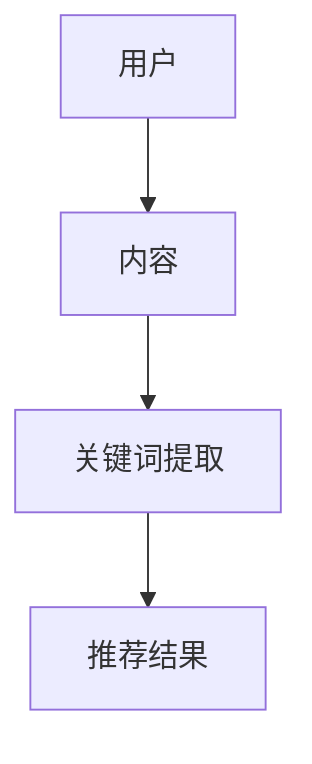
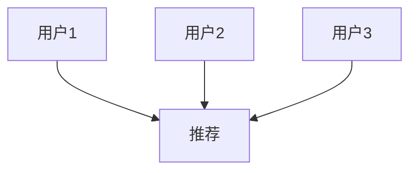
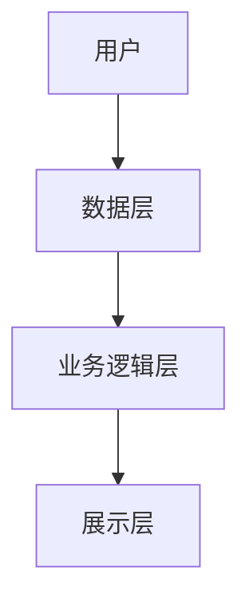

                 


# 芒格的"心理倾向"理论在社交媒体算法设计中的应用

## 关键词：芒格心理倾向，社交媒体算法，推荐系统，用户行为分析，算法优化

## 摘要：本文探讨了芒格的"心理倾向"理论在社交媒体算法设计中的应用，分析了心理倾向对用户行为的影响，详细讲解了如何将心理倾向理论融入算法设计，优化推荐系统，提升用户体验。

---

# 第1章: 芒格的"心理倾向"理论概述

## 1.1 心理倾向理论的起源与核心概念

### 1.1.1 芒格心理倾向理论的提出背景
芒格的心理倾向理论起源于对人类决策偏差的研究，旨在揭示人们在决策过程中常见的心理倾向及其对行为的影响。这些倾向包括确认偏差、过度自信、沉没成本谬误等，这些倾向在社交媒体用户行为中表现得尤为明显。

### 1.1.2 心理倾向的核心定义与特征
心理倾向是指个体在决策过程中倾向于某种行为模式的心理特征。其核心特征包括：
- **普遍性**：心理倾向是人类共同的心理特征。
- **情境性**：心理倾向的表现受环境和情境的影响。
- **可预测性**：通过分析心理倾向，可以预测用户的某些行为。

### 1.1.3 心理倾向在决策中的作用机制
心理倾向通过影响用户的信息处理方式、决策偏好和行为模式，进而影响社交媒体上的互动行为。例如，确认偏差会导致用户倾向于关注与自己观点一致的信息，从而影响内容的传播。

---

## 1.2 社交媒体算法的基本原理

### 1.2.1 社交媒体算法的定义与分类
社交媒体算法是一种用于推荐内容、用户匹配和信息分发的技术。常见的算法包括基于内容的推荐、协同过滤推荐和混合推荐。

### 1.2.2 算法在社交媒体中的应用场景
社交媒体算法广泛应用于个性化推荐、信息流分发、用户画像构建等领域。例如，算法可以根据用户的兴趣推荐相关内容，提升用户的使用体验。

### 1.2.3 算法对用户行为的影响
算法通过影响用户看到的内容，间接影响用户的互动行为。例如，推荐算法可能导致用户更多地参与某些话题的讨论，从而影响内容的传播趋势。

---

## 1.3 心理倾向理论与社交媒体算法的结合

### 1.3.1 心理倾向在社交媒体用户行为中的体现
用户在社交媒体上的行为受心理倾向的驱动。例如，用户倾向于点击与自己观点一致的内容，这种行为受到确认偏差的影响。

### 1.3.2 算法如何利用心理倾向进行用户画像
通过分析用户的行为数据，算法可以识别出用户的心理倾向，并据此构建更精准的用户画像。

### 1.3.3 心理倾向理论对社交媒体算法优化的启示
心理倾向理论为算法优化提供了理论依据。例如，算法可以利用确认偏差的特点，优先推荐用户感兴趣的内容，从而提高用户的参与度。

---

## 1.4 本章小结
本章介绍了芒格心理倾向理论的核心概念及其在社交媒体算法设计中的应用背景。通过分析心理倾向对用户行为的影响，为后续算法优化提供了理论基础。

---

# 第2章: 心理倾向的核心概念与分类

## 2.1 心理倾向的主要类型

### 2.1.1 确认偏差
确认偏差是指用户倾向于寻找与自己已有观点一致的信息。在社交媒体中，这种倾向会导致用户更倾向于关注和传播与自己观点一致的内容。

### 2.1.2 过度自信
过度自信是指用户对自己判断的过度信任。在社交媒体中，这种倾向可能导致用户在互动中过于坚持自己的观点，影响信息的多样性。

### 2.1.3 沉没成本谬误
沉没成本谬误是指用户因为已经投入了时间和精力，而继续参与某项活动。在社交媒体中，这种倾向可能导致用户继续参与无意义的讨论。

### 2.1.4 社会认同效应
社会认同效应是指用户因归属于某个群体而产生行为趋同。在社交媒体中，这种倾向可能导致用户更倾向于传播群体认同的内容。

### 2.1.5 预期效用理论
预期效用理论是指用户根据预期的收益和损失做出决策。在社交媒体中，这种倾向影响用户对内容的偏好和互动行为。

---

## 2.2 心理倾向的特征与属性对比

### 2.2.1 不同心理倾向的对比分析
通过对比分析，可以发现不同心理倾向在用户行为中的表现和影响方式。例如，确认偏差和过度自信都可能导致用户对信息的选择性接受。

### 2.2.2 心理倾向的强度与持久性
心理倾向的强度和持久性因人而异。例如，某些用户可能更容易受到确认偏差的影响，而另一些用户则可能表现出更强的独立思考能力。

### 2.2.3 心理倾向的个体差异性
心理倾向在个体之间的表现存在显著差异。例如，某些用户可能更容易受到社会认同效应的影响，而另一些用户则可能更倾向于独立判断。

---

## 2.3 心理倾向与用户行为的关系

### 2.3.1 心理倾向如何影响用户决策
心理倾向通过影响用户的信息处理方式和决策偏好，进而影响用户的互动行为。例如，确认偏差可能导致用户更倾向于选择与自己观点一致的内容。

### 2.3.2 用户行为的模式化特征
通过分析用户行为数据，可以发现用户行为的模式化特征。例如，用户倾向于点击与自己兴趣相关的内容。

### 2.3.3 心理倾向在用户画像中的应用
心理倾向可以作为用户画像的重要特征。例如，可以通过分析用户的点击行为，识别出用户的确认偏差倾向。

---

## 2.4 本章小结
本章详细分析了心理倾向的主要类型及其特征，并探讨了心理倾向对用户行为的影响。这些分析为后续算法设计提供了重要的理论依据。

---

# 第3章: 社交媒体算法的基本原理与实现

## 3.1 算法推荐的核心机制

### 3.1.1 基于内容的推荐算法
基于内容的推荐算法通过分析内容的特征（如文本、标签）进行推荐。例如，可以使用TF-IDF算法提取关键词，并基于关键词进行推荐。



### 3.1.2 基于协同过滤的推荐算法
基于协同过滤的推荐算法通过分析用户的相似性进行推荐。例如，可以使用余弦相似度计算用户之间的相似性，并基于相似用户的偏好进行推荐。



### 3.1.3 基于矩阵分解的推荐算法
基于矩阵分解的推荐算法通过将用户-物品矩阵分解为用户特征和物品特征进行推荐。例如，可以使用奇异值分解（SVD）算法进行矩阵分解。

### 3.1.4 混合推荐算法
混合推荐算法结合多种推荐算法的优点，通过集成学习的方法进行推荐。例如，可以将基于内容的推荐和协同过滤推荐的结果进行加权融合。

---

## 3.2 用户行为分析与建模

### 3.2.1 用户点击行为的建模
用户点击行为可以通过马尔可夫链模型进行建模。例如，可以使用状态转移矩阵分析用户的点击路径。

### 3.2.2 用户偏好分析
用户偏好可以通过聚类分析进行建模。例如，可以使用K-means算法将用户分为不同的兴趣群组。

### 3.2.3 用户行为序列分析
用户行为序列可以通过时间序列分析进行建模。例如，可以使用ARIMA模型预测用户的未来行为。

---

## 3.3 算法优化的关键技术

### 3.3.1 算法的实时性优化
通过使用分布式计算框架（如Spark），可以实现算法的实时性优化。例如，可以将数据处理任务分布式计算，提升处理效率。

### 3.3.2 算法的可扩展性优化
通过使用增量学习方法，可以实现算法的可扩展性优化。例如，可以将新数据逐步融入模型，避免模型训练的全量计算。

### 3.3.3 算法的准确性优化
通过使用特征选择方法，可以实现算法的准确性优化。例如，可以使用LASSO回归进行特征选择，去除冗余特征。

---

## 3.4 本章小结
本章详细介绍了社交媒体算法的核心机制和优化技术，为后续基于心理倾向的算法设计提供了技术基础。

---

# 第4章: 心理倾向驱动的社交媒体算法设计

## 4.1 心理倾向在算法设计中的应用

### 4.1.1 利用心理倾向优化推荐系统
通过分析用户的心理倾向，可以优化推荐系统的推荐策略。例如，可以根据用户的确认偏差倾向，优先推荐与用户已有观点一致的内容。

### 4.1.2 心理倾向与推荐算法的结合
通过将心理倾向特征融入推荐算法，可以提升推荐系统的个性化能力。例如，可以在协同过滤算法中引入心理倾向特征，进行加权融合。

### 4.1.3 心理倾向在用户画像中的应用
通过分析用户的心理倾向，可以构建更精准的用户画像。例如，可以将用户的确认偏差倾向作为用户画像的重要特征。

---

## 4.2 基于心理倾向的推荐算法设计

### 4.2.1 算法设计的核心思想
基于心理倾向的推荐算法设计的核心思想是通过分析用户的心理倾向，优化推荐系统的推荐策略。例如，可以通过分析用户的确认偏差倾向，优先推荐与用户已有观点一致的内容。

### 4.2.2 算法设计的关键步骤
1. 数据采集与预处理
2. 心理倾向分析
3. 推荐策略优化
4. 算法实现与测试

### 4.2.3 算法实现的代码示例
```python
def心理倾向分析（用户行为数据）：
    # 数据预处理
    # 心理倾向分析
    return 心理倾向特征
```

### 4.2.4 算法优化的技术细节
通过使用机器学习模型（如逻辑回归、随机森林）进行心理倾向分析，可以提升算法的准确性。例如，可以使用随机森林模型进行心理倾向分类。

---

## 4.3 本章小结
本章详细介绍了心理倾向在算法设计中的应用，并提出了基于心理倾向的推荐算法设计方法。通过结合心理倾向理论和推荐算法技术，可以显著提升推荐系统的个性化能力。

---

# 第5章: 项目实战

## 5.1 环境安装与配置

### 5.1.1 环境搭建
需要安装Python、Jupyter Notebook、Pandas、Scikit-learn等工具。

### 5.1.2 数据集准备
需要准备用户行为数据和内容数据。例如，可以使用公开的数据集（如Movielens数据集）。

---

## 5.2 系统功能设计

### 5.2.1 功能需求
1. 用户画像构建
2. 心理倾向分析
3. 个性化推荐

### 5.2.2 系统架构设计


### 5.2.3 接口设计
1. 用户行为数据接口
2. 推荐结果接口
3. 用户画像接口

---

## 5.3 系统实现与代码解读

### 5.3.1 核心代码实现
```python
def推荐算法（用户数据，内容数据）：
    # 数据预处理
    # 心理倾向分析
    # 推荐策略优化
    return 推荐结果
```

### 5.3.2 代码应用解读
通过分析用户的点击行为和互动数据，算法可以识别出用户的确认偏差倾向，并据此优化推荐策略。

---

## 5.4 案例分析与效果评估

### 5.4.1 案例分析
通过分析一个具体的案例，展示心理倾向驱动的推荐算法在实际应用中的效果。

### 5.4.2 效果评估
通过对比实验，评估心理倾向驱动的推荐算法在提升用户参与度和内容传播效果方面的作用。

---

## 5.5 本章小结
本章通过一个具体的项目实战，展示了心理倾向驱动的社交媒体算法设计的具体实现和效果。通过实际案例分析，验证了心理倾向理论在算法设计中的应用价值。

---

# 第6章: 心理倾向驱动的社交媒体算法应用中的伦理与挑战

## 6.1 应用中的伦理问题

### 6.1.1 隐私问题
心理倾向分析需要收集大量的用户数据，可能引发隐私问题。例如，用户的行为数据可能被滥用。

### 6.1.2 公平性问题
心理倾向驱动的推荐算法可能导致信息茧房效应，限制用户的视野。例如，算法可能只推荐用户感兴趣的内容，导致用户视野的狭窄。

### 6.1.3 透明性问题
用户可能无法理解算法如何利用心理倾向进行推荐。例如，用户可能不知道算法如何利用他们的行为数据进行心理倾向分析。

---

## 6.2 应用中的挑战

### 6.2.1 数据质量与完整性
心理倾向分析需要高质量的数据支持。例如，数据的缺失或偏差可能影响算法的准确性。

### 6.2.2 算法的可解释性
心理倾向驱动的推荐算法可能缺乏可解释性，导致用户难以理解推荐结果的原因。例如，用户可能不知道为什么算法推荐了某些内容。

### 6.2.3 技术实现的难度
心理倾向分析需要复杂的算法实现，例如，需要使用深度学习模型进行心理倾向分类。

---

## 6.3 最佳实践与注意事项

### 6.3.1 数据隐私保护
在进行心理倾向分析时，必须遵守数据隐私保护的相关法律法规。例如，需要获得用户的授权。

### 6.3.2 算法的透明性
在推荐结果中，应该提供一定的透明性，例如，向用户解释推荐结果的原因。

### 6.3.3 用户教育与引导
通过用户教育和引导，可以提升用户的数字素养，帮助用户更好地理解算法的推荐机制。

---

## 6.4 本章小结
本章探讨了心理倾向驱动的社交媒体算法应用中的伦理与挑战，并提出了相应的解决方案。通过注意数据隐私保护、提升算法的透明性，可以更好地发挥心理倾向理论在算法设计中的应用价值。

---

# 第7章: 总结与展望

## 7.1 全文总结
本文探讨了芒格的"心理倾向"理论在社交媒体算法设计中的应用，分析了心理倾向对用户行为的影响，并提出了基于心理倾向的推荐算法设计方法。通过项目实战和案例分析，验证了心理倾向理论在算法设计中的应用价值。

## 7.2 未来展望
未来，随着人工智能技术的不断发展，心理倾向理论在社交媒体算法设计中的应用将更加广泛。例如，可以研究如何利用心理倾向理论优化社交媒体的用户体验，提升算法的推荐精度和用户参与度。

---

# 参考文献
1.芒格心理倾向理论的相关研究
2.社交媒体算法设计的经典文献
3.推荐系统领域的最新研究成果
4.数据隐私保护的相关法律法规

---

# 附录

## 附录A: 心理倾向分析的代码示例

```python
def心理倾向分析（用户行为数据）：
    # 数据预处理
    # 心理倾向分析
    return 心理倾向特征
```

---

## 附录B: 推荐算法的数学模型

$$推荐概率 = \sum_{i=1}^{n} w_i \cdot 特征_i$$

---

## 附录C: 系统架构图


---

通过以上章节的详细分析和探讨，本文系统地阐述了芒格的"心理倾向"理论在社交媒体算法设计中的应用，为相关领域的研究和实践提供了重要的理论依据和实践指导。

