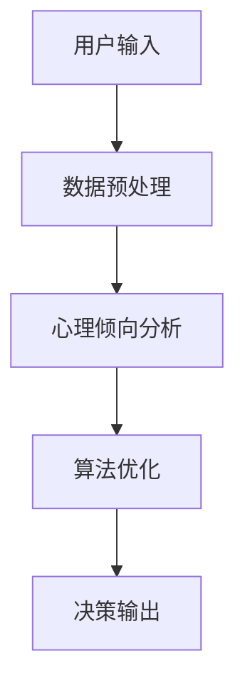

                 


# 芒格的"心理倾向"理论在量子人工智能伦理设计中的应用

**关键词：** 心理倾向理论、量子人工智能、伦理设计、决策偏差、量子计算

**摘要：**  
本文探讨了芒格的“心理倾向”理论在量子人工智能伦理设计中的应用。通过分析心理倾向对量子算法设计和决策过程的影响，提出了一种基于心理倾向的量子人工智能伦理框架。文章首先介绍了心理倾向理论和量子人工智能的基本概念，然后分析了心理倾向在量子人工智能伦理设计中的核心作用，提出了一个结合心理倾向的量子人工智能算法模型。最后，文章通过实际案例展示了心理倾向理论在量子人工智能伦理设计中的应用，并总结了未来的研究方向。

---

## 第一部分: 芒格的"心理倾向"理论与量子人工智能伦理设计的背景介绍

### 第1章: 芒格的"心理倾向"理论概述

#### 1.1 心理倾向理论的核心概念

##### 1.1.1 心理倾向的定义与特征
心理倾向是指个体在决策过程中表现出的心理特征和行为模式，包括从众、权威效应、自我证实偏差等。这些倾向通常源于人类认知的局限性和情感的驱动。

- 心理倾向的核心特征：
  1. **普遍性**：心理倾向是人类共同的心理特征。
  2. **隐蔽性**：许多心理倾向是无意识的，不易被察觉。
  3. **可塑性**：心理倾向可以通过教育和经验改变。

##### 1.1.2 芒格心理倾向理论的主要内容
芒格的心理倾向理论主要包括以下几种倾向：
- **从众倾向**：倾向于跟随多数人的意见。
- **权威效应**：倾向于信任权威人物的判断。
- **自我证实偏差**：倾向于选择与自身观点一致的信息。
- **损失厌恶**：对损失的厌恶程度远高于对收益的偏好。

##### 1.1.3 心理倾向在决策中的作用
心理倾向通过影响决策者的认知和行为模式，直接影响决策的合理性和科学性。例如，从众倾向可能导致集体决策中的“羊群效应”，而自我证实偏差可能导致决策者忽视反面证据。

#### 1.2 量子人工智能的基本概念

##### 1.2.1 量子计算与人工智能的结合
量子计算利用量子叠加和量子纠缠的特性，可以在短时间内完成传统计算机无法完成的复杂计算。量子人工智能则是将量子计算技术应用于人工智能领域，利用量子算法优化机器学习和数据分析。

##### 1.2.2 量子人工智能的核心优势
- **计算效率**：量子计算机可以在某些特定问题上实现指数级的计算速度提升。
- **数据处理能力**：量子人工智能能够处理海量数据，发现传统方法难以察觉的模式。
- **决策优化**：量子算法可以优化复杂决策问题的解决方案。

##### 1.2.3 量子人工智能的应用领域
量子人工智能在金融、医疗、能源、交通等领域有广泛应用潜力，尤其是在需要复杂优化和高精度预测的场景中。

---

### 第2章: 芒格心理倾向理论在量子人工智能中的应用背景

#### 2.1 问题背景与问题描述

##### 2.1.1 量子人工智能面临的伦理挑战
量子人工智能的强大计算能力使其在决策过程中可能面临伦理问题，例如：
- **算法偏见**：算法可能因为训练数据中的偏见而产生不公平的决策。
- **决策透明度**：量子算法的复杂性可能导致决策过程缺乏透明度。
- **责任归属**：当量子算法导致错误决策时，责任归属难以界定。

##### 2.1.2 心理倾向理论在伦理设计中的作用
心理倾向理论可以帮助设计者识别和纠正决策中的偏见，从而提高量子人工智能的伦理合规性。

##### 2.1.3 问题解决思路
通过引入心理倾向理论，量子人工智能的伦理设计可以避免决策中的认知偏差，从而实现更加公平和透明的决策过程。

#### 2.2 心理倾向理论与量子人工智能的结合

##### 2.2.1 心理倾向对量子算法设计的影响
心理倾向可能影响量子算法的设计者在算法开发过程中的决策。例如，从众倾向可能导致算法设计者忽略某些非主流但重要的特征。

##### 2.2.2 量子人工智能决策中的心理偏差
量子人工智能的决策过程可能受到决策者心理倾向的影响，例如：
- **自我证实偏差**：算法可能倾向于选择与开发者预设目标一致的结果。
- **权威效应**：算法可能过度依赖权威数据源，导致信息偏差。

##### 2.2.3 心理倾向对量子人工智能伦理设计的启示
通过识别和分析心理倾向，可以设计出更加稳健的量子算法，避免决策中的偏见和错误。

#### 2.3 心理倾向理论与量子人工智能的边界与外延

##### 2.3.1 心理倾向理论的适用范围
心理倾向理论适用于所有涉及人类决策的领域，包括量子人工智能的设计和应用。

##### 2.3.2 量子人工智能的伦理边界
量子人工智能的伦理设计需要在技术可行性和伦理合规性之间找到平衡点。

##### 2.3.3 心理倾向理论与量子人工智能的相互作用
心理倾向理论通过影响算法设计和决策过程，反过来又受到量子计算技术的影响。这种相互作用构成了量子人工智能伦理设计的核心内容。

---

## 第二部分: 心理倾向理论与量子人工智能的核心概念与联系

### 第3章: 心理倾向理论的核心原理

#### 3.1 心理倾向理论的核心原理

##### 3.1.1 心理倾向的分类与特征
- **分类**：
  1. **认知倾向**：如确认偏差、从众倾向。
  2. **情感倾向**：如损失厌恶、风险偏好。
  3. **社会倾向**：如权威效应、社会认同。

- **特征对比表**：

| 倾向类型 | 特征描述 | 示例场景 |
|----------|----------|----------|
| 从众倾向 | 倾向于跟随多数人的意见 | 群体决策中的“羊群效应” |
| 确认偏差 | 倾向于寻找支持已有假设的证据 | 投资者倾向于寻找支持其决策的信息 |
| 损失厌恶 | 对损失的厌恶程度高于对收益的偏好 | 投资者更倾向于避免损失而非追求收益 |

##### 3.1.2 心理倾向的数学模型
心理倾向可以用概率论和博弈论模型进行描述。例如，从众倾向可以通过概率分布函数来建模。

#### 3.2 量子人工智能的核心原理

##### 3.2.1 量子计算的基本原理
量子计算利用量子叠加和量子纠缠的特性，通过量子位（qubit）进行并行计算。量子位的状态可以表示为：

$$
| \psi \rangle = \alpha |0\rangle + \beta |1\rangle
$$

其中，$\alpha$ 和 $\beta$ 是概率幅度，满足 $|\alpha|^2 + |\beta|^2 = 1$。

##### 3.2.2 量子人工智能的算法模型
量子人工智能的核心算法包括量子机器学习和量子优化算法。例如，量子支持向量机（Q-SVM）是一种基于量子计算的机器学习算法。

##### 3.2.3 量子人工智能与传统人工智能的区别
量子人工智能的优势在于其计算速度和处理复杂问题的能力，但其算法设计和实现更加复杂。

---

## 第三部分: 心理倾向与量子人工智能的算法设计

### 第4章: 心理倾向对量子算法设计的影响

#### 4.1 心理倾向对量子算法设计的数学模型

##### 4.1.1 心理倾向的数学表示
心理倾向可以用概率分布函数表示，例如：

$$
P(\text{从众}) = p, \quad P(\text{独立}) = 1 - p
$$

其中，$p$ 是从众倾向的概率。

##### 4.1.2 心理倾向对量子算法的影响
心理倾向可以通过影响算法设计者的决策，间接影响量子算法的性能。例如，从众倾向可能导致算法设计者忽略某些非主流的优化方法。

---

## 第四部分: 量子人工智能系统的伦理设计与实现

### 第5章: 量子人工智能系统的伦理设计框架

#### 5.1 系统功能设计

##### 5.1.1 系统功能模块
- **心理倾向分析模块**：识别和分析决策过程中的心理倾向。
- **算法优化模块**：根据心理倾向调整量子算法，避免决策偏差。

##### 5.1.2 系统功能流程
1. 收集决策数据。
2. 分析数据中的心理倾向。
3. 调整量子算法参数。
4. 输出优化后的决策结果。

#### 5.2 系统架构设计

##### 5.2.1 系统架构图


##### 5.2.2 系统接口设计
- **输入接口**：接收用户输入的决策数据。
- **输出接口**：输出优化后的决策结果。

#### 5.3 系统实现

##### 5.3.1 核心代码实现
```python
def quantum_algorithm(optimize_params):
    # 量子算法核心逻辑
    pass

def心理倾向分析(data):
    # 心理倾向分析逻辑
    pass
```

##### 5.3.2 代码解读
- `quantum_algorithm` 函数：实现量子算法的核心逻辑。
- `心理倾向分析` 函数：分析数据中的心理倾向，并调整算法参数。

---

## 第五部分: 项目实战与案例分析

### 第6章: 项目实战

#### 6.1 环境安装
- 安装必要的量子计算库和机器学习库。

#### 6.2 核心代码实现
```python
import numpy as np
from qiskit import QuantumCircuit, Aer, execute

def create_quantum_circuit(n_qubits):
    circuit = QuantumCircuit(n_qubits)
    return circuit

def心理倾向分析(data):
    # 实现心理倾向分析逻辑
    pass

# 示例代码
n_qubits = 2
circuit = create_quantum_circuit(n_qubits)
```

---

## 第六部分: 总结与展望

### 第7章: 总结与展望

#### 7.1 最佳实践 tips
- 在量子算法设计中，要充分考虑心理倾向的影响。
- 定期进行伦理审查，确保算法的公平性。

#### 7.2 小结
本文探讨了芒格的“心理倾向”理论在量子人工智能伦理设计中的应用，提出了一个基于心理倾向的量子人工智能伦理框架。通过案例分析，展示了心理倾向理论在实际应用中的重要作用。

#### 7.3 注意事项
- 量子人工智能的伦理设计需要综合考虑技术、法律和伦理等多个方面。
- 心理倾向分析需要结合具体场景进行调整。

#### 7.4 拓展阅读
建议读者进一步阅读相关领域的经典文献，深入了解心理倾向理论和量子人工智能的最新研究成果。

---

通过以上分析和设计，我们可以看到芒格的“心理倾向”理论在量子人工智能伦理设计中的重要性。未来的研究可以进一步探索心理倾向理论与量子算法的结合，为量子人工智能的伦理设计提供更加完善的解决方案。

