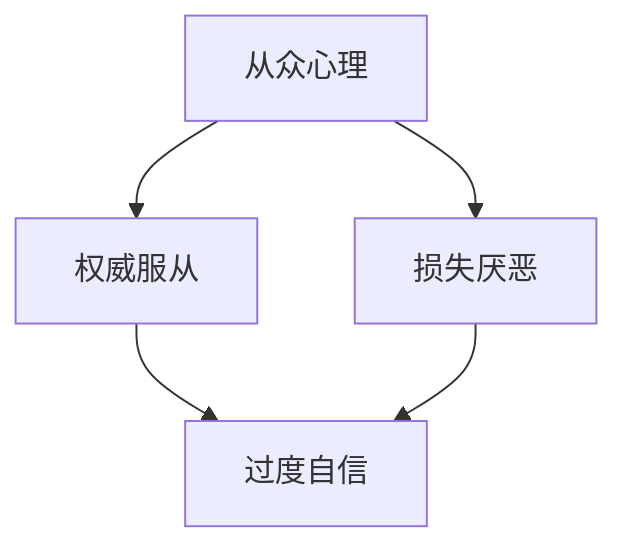
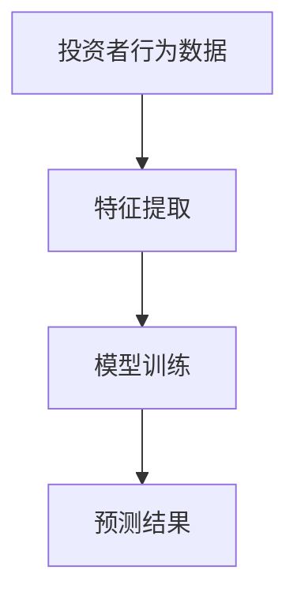
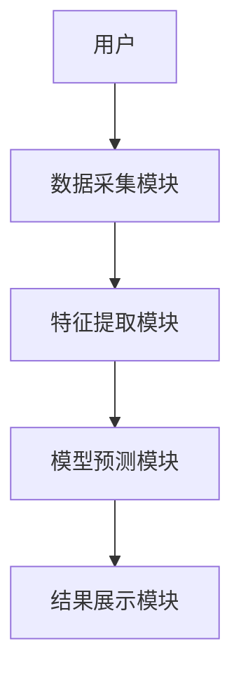

                 

# 芒格的"心理倾向"理论：理解市场行为

---

## 关键词：
芒格心理倾向、市场行为分析、投资决策、心理学原理、算法模型

---

## 摘要：
本文深入探讨了芒格的“心理倾向”理论，分析其在投资和市场行为中的应用。通过结合心理学原理和算法模型，本文详细阐述了心理倾向的核心概念、算法原理、系统架构设计及实际案例。旨在帮助读者理解市场行为背后的规律，提升投资决策的科学性。

---

## 第一部分：芒格心理倾向理论概述

### 第1章：芒格心理倾向理论的背景与核心概念

#### 1.1 芒格心理倾向理论的起源与意义

芒格的心理倾向理论源自其投资哲学，强调人类心理在市场行为中的作用。传统投资理论如现代资产组合理论关注市场效率，而芒格则认为市场参与者的行为受心理因素驱动。心理倾向理论通过分析投资者的心理偏差，帮助识别非理性决策，从而优化投资策略。

#### 1.2 心理倾向理论的定义与外延

心理倾向是指个体在特定情境下倾向于采取某种行为的内在驱动力。在投资领域，常见的心理倾向包括从众、权威服从、损失厌恶和过度自信。这些倾向影响投资者决策，导致市场波动和定价偏差。

---

## 第二部分：心理倾向的核心概念与联系

### 第2章：心理倾向的关键属性与特征

#### 2.1 心理倾向的主要类型

| 心理倾向类型 | 定义 | 主要表现 |
|--------------|------|----------|
| 从众心理     | 指个体倾向于跟随多数人的行为 | 投资者跟风买入热门股票 |
| 权威服从     | 个体倾向于服从权威人物的决策 | 投资者盲目追随专家建议 |
| 损失厌恶     | 个体对损失的厌恶程度超过对收益的追求 | 投资者害怕亏损而错过机会 |
| 过度自信     | 个体对自己判断的过度相信 | 投资者高估自己的分析能力 |

#### 2.2 心理倾向的对比分析

以下是心理倾向的对比分析图：

图1：心理倾向的对比分析图

---

## 第三部分：心理倾向的数学模型与算法原理

### 第3章：心理倾向的算法模型

#### 3.1 基于心理倾向的市场行为预测模型

市场行为预测模型通过分析心理倾向，预测投资者的决策行为。模型分为数据预处理、特征提取、模型训练和预测四个阶段。

模型输入包括投资者行为数据、市场数据和心理倾向指标。输出为市场行为预测结果。

模型训练使用强化学习算法，优化预测准确性。以下是模型流程图：

图2：市场行为预测模型流程图

模型数学公式如下：

$$ P(\text{行为}|x) = \sum_{i=1}^{n} w_i \cdot f_i(x) $$

其中，\( w_i \) 是特征权重，\( f_i(x) \) 是特征函数。

---

## 第四部分：系统架构与项目实战

### 第4章：心理倾向分析系统的架构设计

#### 4.1 系统功能设计

系统功能模块包括：

- 数据采集模块：收集投资者行为数据。
- 特征提取模块：提取心理倾向特征。
- 模型预测模块：预测市场行为。

系统架构设计如下：

图3：系统架构设计图

---

## 第五部分：案例分析与最佳实践

### 第6章：实际案例分析

#### 6.1 案例一：从众心理在股票市场中的表现

分析投资者跟风买入科技股的现象，利用模型预测市场波动。结果表明，从众心理导致市场的非理性波动。

#### 6.2 案例二：损失厌恶对投资决策的影响

研究投资者因害怕亏损而错失投资机会的现象，提出缓解策略。

---

### 第7章：总结与最佳实践

#### 7.1 心理倾向理论的总结

芒格的心理倾向理论揭示了市场行为中的非理性因素，帮助投资者识别和规避常见心理偏差。理论在投资决策中的应用需结合具体情境。

#### 7.2 投资与市场行为中的最佳实践

- 认识自身心理倾向，避免过度自信。
- 结合技术分析，优化投资策略。
- 长期投资，减少短期波动影响。

#### 7.3 小结与注意事项

心理倾向理论提供了理解市场行为的新视角，但需结合实际市场环境。投资者应保持理性，避免被心理倾向误导。

---

## 结语

芒格的心理倾向理论为理解市场行为提供了深刻洞察。通过分析心理倾向，投资者可以优化决策，提升投资效果。本文结合理论、算法和案例，为实践提供了科学指导。

