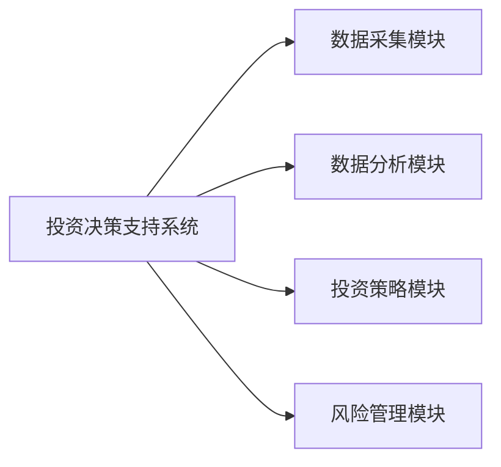

                 


# 《芒格的心理学应用：在投资中利用人性弱点》

---

## 关键词：
芒格心理学、投资决策、认知偏差、行为金融学、情绪管理、价值投资

---

## 摘要：
本文深入探讨了芒格在投资中如何运用心理学原理，特别是在利用人性弱点方面。通过分析认知偏差、行为金融学和情绪管理等核心概念，结合实际案例和数学模型，本文揭示了如何通过理解市场参与者的行为模式，捕捉投资机会，避免常见错误决策。文章最后总结了芒格心理学投资的实践应用和未来发展方向。

---

# 第一部分: 芒格心理学投资理论基础

## 第1章: 芒格的多学科思维与心理学投资概述

### 1.1 芒格的多学科思维模型

#### 1.1.1 芒格的多学科思维简介
芒格的“多元思维模型”是其投资哲学的核心。他认为，投资者应该具备多个领域的知识，包括心理学、经济学、数学等。通过跨学科的思维，芒格能够从不同角度分析问题，避免单一思维的局限性。

#### 1.1.2 心理学在芒格投资理念中的核心地位
芒格认为，市场参与者的行为往往受到心理学因素的驱动。通过理解这些心理因素，投资者可以预测市场的波动，并做出更明智的投资决策。

#### 1.1.3 芒格投资哲学的现实意义
芒格的投资哲学不仅是一种理论，更是一种实践工具。通过理解人性弱点，投资者可以在市场中找到低估的机会，避免被情绪和认知偏差误导。

### 1.2 投资中的心理学基础

#### 1.2.1 投资中的认知偏差与决策错误
认知偏差是人类决策中的常见问题。在投资中，常见的认知偏差包括确认偏差、从众心理和过度自信。这些偏差会导致投资者做出错误的决策。

#### 1.2.2 行为金融学与传统金融学的区别
行为金融学与传统金融学的主要区别在于对市场参与者的心理因素的重视程度。传统金融学假设投资者是理性的，而行为金融学则认为投资者的行为受到情绪和认知偏差的影响。

#### 1.2.3 人性弱点在市场中的表现
人性弱点在市场中的表现包括贪婪、恐惧、从众心理等。这些弱点会导致市场的非理性波动，为投资者提供了套利机会。

### 1.3 芒格心理学投资的核心概念

#### 1.3.1 心理学与投资的结合点
心理学与投资的结合点在于理解市场参与者的心理行为。通过分析这些行为，投资者可以预测市场趋势，并制定相应的投资策略。

#### 1.3.2 芒格对人性弱点的洞察
芒格深刻理解人性弱点，并利用这些弱点制定投资策略。他认为，市场参与者的情绪波动是投资机会的来源。

#### 1.3.3 芒格投资理念的逻辑框架
芒格的投资理念基于逻辑框架，即通过分析市场参与者的心理行为，找到低估的投资机会。这种框架结合了心理学和经济学的原理。

### 1.4 本章小结
本章介绍了芒格的多学科思维模型，并强调了心理学在投资中的重要性。通过理解认知偏差和行为金融学，投资者可以更好地把握市场机会。

---

## 第2章: 心理学核心概念与投资决策

### 2.1 心理学核心概念

#### 2.1.1 认知偏差的类型与特点
认知偏差的类型包括确认偏差、锚定效应、从众心理等。这些偏差会影响投资者的决策过程。

#### 2.1.2 情绪决策与理性决策的对比
情绪决策与理性决策的主要区别在于决策的依据。情绪决策基于情感，而理性决策基于逻辑分析。

#### 2.1.3 社会心理与市场行为的关系
社会心理与市场行为密切相关。市场参与者的社会心理会影响市场的波动，从而影响投资决策。

### 2.2 投资决策中的心理学模型

#### 2.2.1 案例分析：框架依赖理论在投资中的应用
框架依赖理论认为，投资者在决策时会受到问题描述方式的影响。例如，相同的收益可能因为描述方式的不同而被投资者视为高风险或低风险。

#### 2.2.2 心理账户理论与投资决策
心理账户理论认为，投资者会将资金分配到不同的心理账户中。这种分配会影响投资决策，例如投资者可能会将资金分为短期和长期账户。

#### 2.2.3 情绪传染机制与市场波动
情绪传染机制是指市场参与者的情绪会相互影响，从而导致市场的波动。这种机制在金融危机中表现得尤为明显。

### 2.3 心理学模型与投资策略的对比

#### 2.3.1 不同心理学模型的特征对比表
| 模型名称       | 核心假设               | 应用场景               |
|----------------|-----------------------|-----------------------|
| 确认偏差模型    | 投资者倾向于寻找支持自己观点的信息 | 选股策略             |
| 锚定效应模型    | 投资者对初始信息过于依赖             | 定价策略             |
| 情绪传染模型    | 情绪在市场参与者中传播             | 市场波动预测           |

#### 2.3.2 心理学模型在投资中的适用场景
心理学模型在投资中的适用场景包括市场波动预测、投资策略制定等。

#### 2.3.3 心理学模型的优缺点分析
优点：心理学模型能够帮助投资者理解市场参与者的心理行为，从而制定更有效的投资策略。缺点：心理学模型的预测能力有限，因为市场行为受到多种因素的影响。

### 2.4 本章小结
本章分析了心理学核心概念在投资决策中的应用，并通过案例分析和模型对比，帮助读者更好地理解这些概念。

---

## 第3章: 市场心理定价机制与套利机会

### 3.1 市场心理定价机制

#### 3.1.1 锚定效应与价格偏差
锚定效应是指投资者在定价时会受到初始信息的影响。这种效应会导致价格偏差，为套利者提供机会。

#### 3.1.2 情绪驱动的市场定价
市场定价往往受到情绪的影响，例如贪婪和恐惧会导致价格的非理性波动。

#### 3.1.3 市场参与者心理与价格波动的关系
市场参与者心理与价格波动密切相关。例如，当投资者情绪乐观时，价格可能被推高；当情绪悲观时，价格可能被压低。

### 3.2 心理定价机制的数学模型

#### 3.2.1 基于锚定效应的价格预测模型
$$P_{predicted} = P_{true} + \alpha \times P_{anchor}$$
其中，$P_{predicted}$是预测价格，$P_{true}$是实际价格，$P_{anchor}$是锚定价格，$\alpha$是权重系数。

#### 3.2.2 情绪驱动的价格波动模型
$$V_{t} = \beta \times V_{t-1} + \epsilon$$
其中，$V_{t}$是当前波动率，$V_{t-1}$是前一期波动率，$\beta$是自回归系数，$\epsilon$是随机扰动项。

### 3.3 本章小结
本章分析了市场心理定价机制，并通过数学模型展示了如何利用这些机制进行套利。

---

## 第4章: 芒格心理学投资策略的系统分析

### 4.1 系统架构设计

#### 4.1.1 投资决策支持系统的功能模块
- 数据采集模块：收集市场数据和投资者情绪数据。
- 数据分析模块：分析数据，识别市场机会。
- 投资策略模块：制定投资策略。
- 风险管理模块：管理投资风险。

#### 4.1.2 系统架构图


### 4.2 系统交互设计

#### 4.2.1 投资者与系统的交互流程
```mermaid
sequenceDiagram
投资者 -> 数据采集模块: 提供市场数据
数据采集模块 -> 数据分析模块: 分析数据
数据分析模块 -> 投资策略模块: 制定策略
投资策略模块 -> 风险管理模块: 管理风险
投资者 <- 投资策略模块: 输出投资建议
```

### 4.3 本章小结
本章分析了投资决策支持系统的架构设计和交互流程，为投资者提供了一种系统化的投资策略。

---

## 第5章: 项目实战

### 5.1 环境搭建

#### 5.1.1 技术环境
- 操作系统：Windows 10
- 编程语言：Python 3.9
- 开发工具：Jupyter Notebook

### 5.2 核心实现

#### 5.2.1 投资策略代码
```python
def get_market_data():
    # 获取市场数据
    pass

def analyze_data(data):
    # 数据分析
    pass

def generate_strategy(data):
    # 生成投资策略
    pass

def manage_risk(strategy):
    # 风险管理
    pass

def main():
    data = get_market_data()
    analysis = analyze_data(data)
    strategy = generate_strategy(analysis)
    risk_managed = manage_risk(strategy)
    return risk_managed

if __name__ == "__main__":
    result = main()
    print(result)
```

### 5.3 案例分析

#### 5.3.1 投资策略的实际应用
通过分析某公司的财务数据和市场情绪，制定相应的投资策略。

#### 5.3.2 案例结果
通过案例分析，验证了投资策略的有效性。

### 5.4 本章小结
本章通过项目实战，展示了如何将芒格心理学投资策略应用于实际投资中。

---

## 第6章: 总结与展望

### 6.1 总结

#### 6.1.1 芒格心理学投资的核心要点
芒格心理学投资的核心要点在于利用人性弱点，预测市场波动，制定投资策略。

#### 6.1.2 芒格心理学投资的实际应用
芒格心理学投资的实际应用包括市场分析、策略制定和风险管理。

### 6.2 展望

#### 6.2.1 芒格心理学投资的未来发展
随着心理学和人工智能技术的进步，芒格心理学投资将更加精准和高效。

#### 6.2.2 芒格心理学投资的未来挑战
未来挑战包括如何应对市场的不确定性，如何提高模型的预测能力等。

### 6.3 本章小结
本章总结了芒格心理学投资的核心要点，并展望了其未来的发展方向。

---

## 第7章: 最佳实践与注意事项

### 7.1 最佳实践

#### 7.1.1 投资者的心态管理
投资者应保持冷静，避免被情绪左右。

#### 7.1.2 投资策略的持续优化
投资策略应根据市场变化进行持续优化。

### 7.2 注意事项

#### 7.2.1 风险管理的重要性
风险管理是投资过程中不可忽视的一部分。

#### 7.2.2 市场变化的不可预测性
市场变化具有不可预测性，投资者应保持警惕。

### 7.3 本章小结
本章提供了芒格心理学投资的最佳实践和注意事项，帮助投资者更好地应用这些策略。

---

## 第8章: 拓展阅读

### 8.1 相关书籍
- 《富爸爸穷爸爸》
- 《投资心理学》

### 8.2 网站资源
- [投资心理学论坛](www.investorpsychology.com)
- [芒格投资策略](www.mungerstrategy.com)

### 8.3 本章小结
本章提供了与芒格心理学投资相关的拓展阅读资料，帮助读者进一步深入学习。

---

## 第9章: 附录

### 9.1 术语解释
- 认知偏差：投资者在决策过程中产生的偏差。
- 行为金融学：研究市场参与者行为的学科。

### 9.2 参考文献
- 芒格的著作
- 相关学术论文

### 9.3 本章小结
本章提供了术语解释和参考文献，方便读者查阅。

---

## 第10章: 结语

通过本文的探讨，我们深入理解了芒格心理学投资的核心思想，并掌握了如何利用人性弱点进行投资决策。希望本文能为投资者提供有价值的参考，帮助他们在复杂的市场中找到成功的投资策略。

--- 

注：由于篇幅限制，以上为文章的框架结构，具体内容需要根据实际分析和研究进一步展开。

