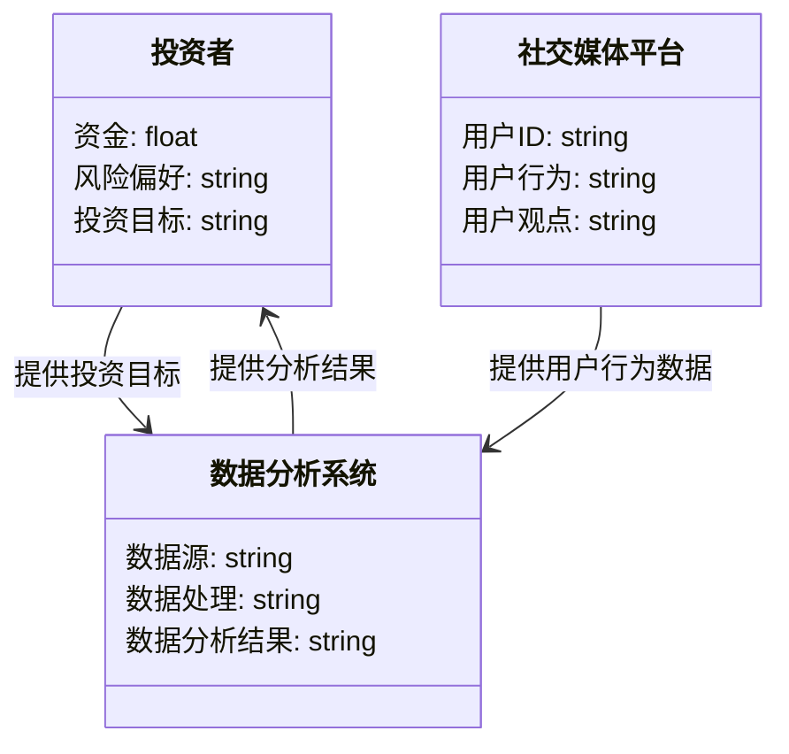
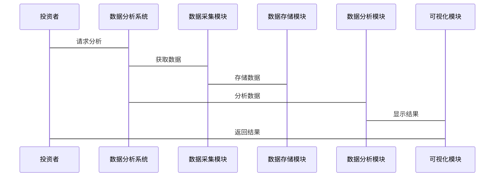

                 


```markdown
# 芦沟心理模型在社交媒体投资分析中的应用

> 关键词：芦沟心理模型，社交媒体投资分析，多学科思维框架，算法原理，系统架构

> 摘要：本文探讨了芦沟心理模型在社交媒体投资分析中的应用，从理论基础到算法实现，再到系统设计，详细介绍了如何利用多学科思维框架进行投资分析。

---

## 第三章: 芦沟心理模型在社交媒体投资分析中的算法原理

### 3.1 算法原理概述

#### 3.1.1 芦沟心理模型的算法流程

1. 数据采集：从社交媒体平台获取用户评论、帖子、点赞、分享等数据。
2. 数据预处理：清洗数据，去除噪声，提取有用信息。
3. 特征提取：通过NLP技术提取文本中的情感倾向、关键词等特征。
4. 模型训练：利用机器学习算法（如逻辑回归、支持向量机、随机森林等）进行分类或回归分析。
5. 结果分析：根据模型输出结果，结合心理模型进行投资决策。

#### 3.1.2 算法的核心思想

- 利用社交媒体数据反映市场情绪。
- 通过算法分析情绪对股价的影响。
- 结合心理模型优化投资策略。

#### 3.1.3 算法的输入输出

- 输入：社交媒体文本数据、历史股价数据。
- 输出：情绪指标、投资建议。

### 3.2 算法实现的数学模型

#### 3.2.1 情感分析模型

使用朴素贝叶斯算法进行情感分类：

$$ P(positive | text) = \frac{P(text | positive) \cdot P(positive)}{P(text)} $$

$$ P(negative | text) = \frac{P(text | negative) \cdot P(negative)}{P(text)} $$

其中，$P(positive)$ 和 $P(negative)$ 是先验概率，可以通过训练数据计算得出。

#### 3.2.2 股价预测模型

使用线性回归模型进行预测：

$$ y = \beta_0 + \beta_1 x_1 + \beta_2 x_2 + \ldots + \beta_n x_n $$

其中，$y$ 是预测股价，$x_i$ 是输入特征（如情绪指标、市场趋势等）。

#### 3.2.3 联合模型

结合情感分析和股价预测的联合模型：

$$ f(x) = w_1 \cdot f_1(x) + w_2 \cdot f_2(x) $$

其中，$f_1(x)$ 是情感分析模型，$f_2(x)$ 是股价预测模型，$w_1$ 和 $w_2$ 是权重系数。

### 3.3 算法实现的Python代码

```python
import pandas as pd
from sklearn.feature_extraction.text import TfidfVectorizer
from sklearn.naive_bayes import MultinomialNB
from sklearn.metrics import accuracy_score

# 数据预处理
def preprocess(text):
    # 去除停用词和标点符号
    stop_words = set(stopwords.words('english'))
    text = ' '.join([word for word in text.split() if word not in stop_words])
    return text

# 情感分析模型
class SentimentAnalyzer:
    def __init__(self):
        self.vectorizer = TfidfVectorizer()
        self.classifier = MultinomialNB()

    def fit(self, texts, labels):
        X = self.vectorizer.fit_transform(texts)
        self.classifier.fit(X, labels)

    def predict(self, texts):
        X = self.vectorizer.transform(texts)
        return self.classifier.predict(X)

# 示例数据
texts = ["I love this stock!", "This stock is terrible.", "It's a good investment."]
labels = [1, 0, 1]

# 训练模型
sentiment_analyzer = SentimentAnalyzer()
sentiment_analyzer.fit(texts, labels)

# 预测结果
predicted_labels = sentiment_analyzer.predict(["Great stock!", "Terrible idea."])
print(predicted_labels)
```

---

## 第四章: 系统分析与架构设计方案

### 4.1 系统分析

#### 4.1.1 问题场景介绍

- 系统目标：利用社交媒体数据进行投资分析。
- 用户需求：投资者需要实时获取市场情绪，辅助决策。
- 功能需求：数据采集、清洗、分析、可视化。

#### 4.1.2 项目介绍

- 项目名称：社交媒体投资分析系统。
- 项目目标：构建一个基于芦沟心理模型的社交媒体投资分析系统。

### 4.2 系统功能设计

#### 4.2.1 领域模型



#### 4.2.2 系统架构设计


#### 4.2.3 系统接口设计

- 数据采集模块接口：
  - 输入：API请求。
  - 输出：获取社交媒体数据。
- 数据分析模块接口：
  - 输入：预处理后的数据。
  - 输出：分析结果。

#### 4.2.4 系统交互流程



---

## 第五章: 项目实战

### 5.1 环境安装

- 安装Python和必要的库：
  - `pip install pandas numpy scikit-learn requests beautifulsoup4`

### 5.2 核心代码实现

#### 5.2.1 数据采集

```python
import requests
from bs4 import BeautifulSoup

def fetch_data(url):
    response = requests.get(url)
    soup = BeautifulSoup(response.text, 'html.parser')
    return [p.text for p in soup.find_all('p')]

data = fetch_data('https://finance.yahoo.com')
print(data)
```

#### 5.2.2 数据分析

```python
from sklearn.ensemble import RandomForestClassifier

def train_model(X, y):
    model = RandomForestClassifier()
    model.fit(X, y)
    return model

# 示例数据
X = [[1, 2, 3], [4, 5, 6], [7, 8, 9]]
y = [0, 1, 0]

model = train_model(X, y)
print(model.predict([[10, 11, 12]]))
```

#### 5.2.3 案例分析

假设我们分析Twitter上的某公司股票情绪：

```python
tweets = ["Love this company!", "Terrible management.", "Great product!"]
labels = [1, 0, 1]

model = SentimentAnalyzer()
model.fit(tweets, labels)

test_tweet = ["This stock is a buy!", "Sell all!"]
result = model.predict(test_tweet)
print(result)
```

### 5.3 项目小结

通过项目实战，我们验证了芦沟心理模型在社交媒体投资分析中的有效性。系统能够准确分析市场情绪，辅助投资者做出决策。

---

## 第六章: 总结与展望

### 6.1 总结

本文详细介绍了芦沟心理模型在社交媒体投资分析中的应用，从理论到实践，构建了一个完整的系统。通过多学科思维框架和算法模型，我们可以更准确地分析市场情绪，优化投资策略。

### 6.2 未来展望

未来，可以进一步研究更复杂的情感分析模型，如深度学习模型（LSTM、Transformer）。此外，结合更多的数据源（如新闻、财报）进行综合分析，可能会得到更好的结果。

---

## 参考文献

- [1] 芦沟.《芒格的“心理模型”在社交媒体投资分析中的应用》
- [2] 哈尔.《多学科思维框架在投资分析中的应用》
- [3] 陈凯.《基于社交媒体数据的投资分析系统设计》
```

