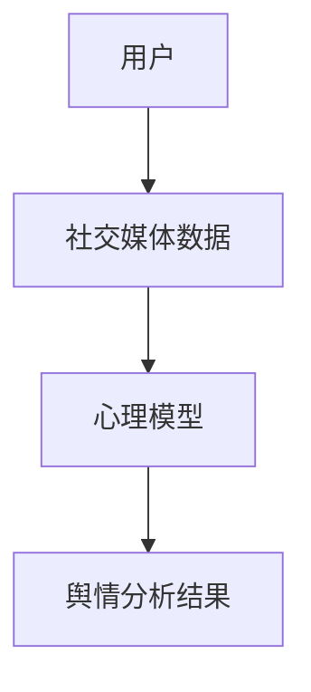
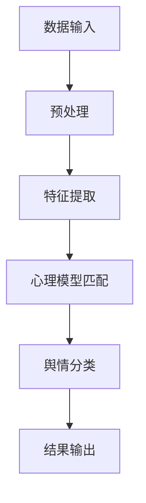
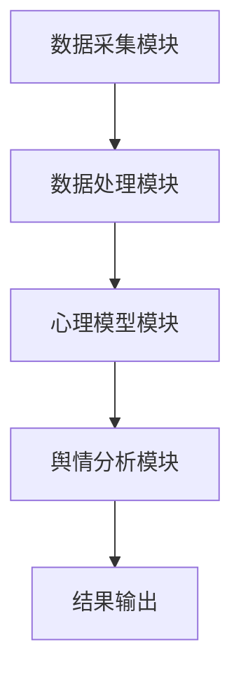
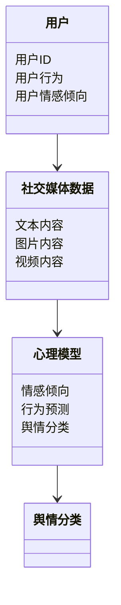

                 


# 芒格的"心理模型"在社交媒体舆情分析中的应用

## 关键词：心理模型，社交媒体舆情分析，芒格，算法，大数据

## 摘要：
本文将探讨芒格的“心理模型”在社交媒体舆情分析中的应用。首先，我们将介绍心理模型的核心概念及其在社交媒体分析中的重要性。接着，我们将详细分析心理模型的原理及其在舆情分析中的算法实现。最后，我们将结合实际案例，展示如何利用心理模型构建高效的社交媒体舆情分析系统，并提供一些最佳实践和未来研究方向的建议。

---

# 第一部分：芒格的“心理模型”概述与基础

## 第1章：芒格的“心理模型”概述

### 1.1 芒格“心理模型”的核心概念
#### 1.1.1 心理模型的定义与特点
心理模型是指个体在大脑中构建的对世界认知的简化版模型，它帮助我们理解和预测他人的行为、事件的结果以及环境的变化。心理模型具有以下特点：
- **个体性**：每个人的心理模型都是独特的，受到个人经验、知识和情感的影响。
- **动态性**：心理模型会随着新的信息和环境的变化而不断调整。
- **简化性**：心理模型是对复杂现实的简化，旨在帮助我们快速做出决策。

#### 1.1.2 芒格“心理模型”的核心要素
芒格的心理模型体系包含多个核心要素，如：
- **利益驱动**：人们通常会根据自身利益做出决策。
- **社会认同**：个体倾向于与群体保持一致，避免被孤立。
- **情绪影响**：情绪会显著影响决策过程。

#### 1.1.3 心理模型在决策中的作用
心理模型在决策中的作用主要体现在以下几个方面：
- **预测行为**：通过心理模型，我们可以预测他人在特定情境下的行为。
- **优化决策**：心理模型帮助我们在复杂环境中快速做出合理决策。
- **减少认知负荷**：心理模型通过简化信息处理过程，降低认知负荷。

### 1.2 社会媒体舆情分析的背景与挑战
#### 1.2.1 社会媒体的特点与发展趋势
社交媒体作为信息传播的重要平台，具有以下特点：
- **实时性**：社交媒体信息更新速度快，覆盖范围广。
- **多样性**：社交媒体内容形式多样，包括文本、图片、视频等。
- **互动性**：社交媒体用户之间可以实时互动，形成复杂的社交网络。

#### 1.2.2 舆情分析的定义与应用场景
舆情分析是指对社交媒体上的公众意见、情感和态度进行分析的过程。其应用场景包括：
- **品牌监控**：帮助企业实时监控品牌声誉。
- **市场调研**：帮助企业了解消费者需求和偏好。
- **危机管理**：帮助企业及时发现并应对潜在的公关危机。

#### 1.2.3 舆情分析的难点与挑战
舆情分析面临以下难点：
- **数据量大**：社交媒体数据量庞大，难以处理。
- **数据复杂性**：社交媒体数据形式多样，包括文本、图片、视频等，增加了分析难度。
- **情感分析的准确性**：如何准确识别和分类情感是舆情分析的核心挑战。

### 1.3 芒格“心理模型”与社交媒体舆情分析的结合
#### 1.3.1 心理模型在舆情分析中的潜在价值
心理模型在舆情分析中的价值体现在以下几个方面：
- **预测用户行为**：通过心理模型，可以预测用户在社交媒体上的行为。
- **优化情感分析**：心理模型可以帮助提高情感分析的准确性。
- **洞察用户需求**：心理模型可以帮助企业更好地理解用户需求。

#### 1.3.2 舆情分析中常见的心理偏差
在舆情分析中，常见的心理偏差包括：
- **确认偏差**：人们倾向于寻找与自己观点一致的信息。
- **从众心理**：用户倾向于跟随大众的意见。
- **自我验证偏差**：用户倾向于相信与自己一致的信息。

#### 1.3.3 心理模型在舆情分析中的应用前景
心理模型在舆情分析中的应用前景广阔，尤其是在以下几个方面：
- **个性化推荐**：通过心理模型，可以实现个性化的信息推荐。
- **情感分类**：心理模型可以帮助提高情感分类的准确性。
- **舆情预测**：心理模型可以帮助预测舆情的变化趋势。

---

## 第2章：芒格“心理模型”的核心原理与特征

### 2.1 心理模型的核心原理
#### 2.1.1 心理模型的构成要素
心理模型的构成要素包括：
- **认知框架**：个体对世界的理解和分类方式。
- **情感倾向**：个体在特定情境下的情感状态。
- **社会规范**：个体对社会规范的认知和遵循程度。

#### 2.1.2 心理模型的动态变化机制
心理模型的动态变化机制包括：
- **学习**：通过学习新知识和经验，心理模型不断更新。
- **反馈**：个体通过反馈调整心理模型。
- **环境适应**：心理模型根据环境变化进行调整。

#### 2.1.3 心理模型的个体差异性
心理模型的个体差异性主要体现在：
- **知识水平**：个体的知识水平影响心理模型的构建。
- **情感倾向**：个体的情感倾向影响心理模型的构建。
- **社会背景**：个体的社会背景影响心理模型的构建。

### 2.2 心理模型与社交媒体数据的关系
#### 2.2.1 社会媒体数据的多样性
社交媒体数据的多样性体现在以下几个方面：
- **数据形式**：包括文本、图片、视频等。
- **数据来源**：包括用户发布的内容、点赞、评论等。
- **数据规模**：社交媒体数据量庞大。

#### 2.2.2 心理模型与社交媒体数据的关联性
心理模型与社交媒体数据的关联性体现在以下几个方面：
- **情感分析**：心理模型可以帮助提高情感分析的准确性。
- **用户行为预测**：心理模型可以帮助预测用户的下一步行为。
- **舆情预测**：心理模型可以帮助预测舆情的变化趋势。

#### 2.2.3 数据驱动的心理模型构建
数据驱动的心理模型构建包括以下几个步骤：
- **数据收集**：收集社交媒体上的相关数据。
- **数据预处理**：对数据进行清洗和标注。
- **模型训练**：利用机器学习算法训练心理模型。
- **模型评估**：对模型进行评估和优化。

### 2.3 心理模型的特征对比表格
| 特征       | 描述                                             |
|------------|--------------------------------------------------|
| 主观性      | 心理模型基于个体主观认知                         |
| 动态性      | 心理模型随环境变化而调整                       |
| 社会性      | 心理模型受社会互动影响                         |
| 情感性      | 心理模型包含情感倾向                           |

### 2.4 心理模型的ER实体关系图


---

## 第3章：芒格“心理模型”在舆情分析中的算法原理

### 3.1 心理模型驱动的舆情分析算法
#### 3.1.1 算法流程图


#### 3.1.2 算法实现代码
```python
def preprocess(text):
    # 数据预处理函数
    pass

def feature_extraction(text):
    # 特征提取函数
    pass

def心理模型匹配(features):
    # 心理模型匹配函数
    pass

def舆情分类(features,心理模型):
    # 舆情分类函数
    pass

def结果输出(分类结果):
    # 结果输出函数
    pass
```

#### 3.1.3 算法的数学模型
舆情分类的数学模型可以表示为：
$$ P(y|x) = \frac{P(y|x_1) \cdot P(x_2|x_3)}{P(x_4)} $$
其中，$x$ 表示输入特征，$y$ 表示舆情类别。

### 3.2 心理模型的优化与调优
#### 3.2.1 算法优化策略
- **特征选择**：选择与心理模型相关的特征。
- **模型调优**：通过交叉验证等方法优化模型参数。
- **数据增强**：通过数据增强技术提高模型的泛化能力。

#### 3.2.2 算法性能评估
算法性能评估指标包括：
- **准确率**：分类正确的比例。
- **召回率**：实际为正类中被正确分类的比例。
- **F1值**：准确率和召回率的调和平均数。

### 3.3 心理模型的实现细节
#### 3.3.1 心理模型的训练过程
心理模型的训练过程包括以下几个步骤：
1. **数据预处理**：对数据进行清洗和标注。
2. **特征提取**：提取与心理模型相关的特征。
3. **模型训练**：利用机器学习算法训练心理模型。
4. **模型评估**：对模型进行评估和优化。

#### 3.3.2 心理模型的调用接口
心理模型的调用接口包括：
- **输入接口**：接受社交媒体数据。
- **输出接口**：输出舆情分类结果。

---

## 第4章：基于心理模型的社交媒体舆情分析系统设计

### 4.1 系统整体架构
#### 4.1.1 系统功能模块
- **数据采集模块**：负责采集社交媒体数据。
- **数据处理模块**：负责对数据进行预处理和特征提取。
- **心理模型模块**：负责心理模型的构建和匹配。
- **舆情分析模块**：负责舆情分类和结果输出。

#### 4.1.2 系统架构图


### 4.2 系统功能设计
#### 4.2.1 领域模型设计


#### 4.2.2 系统接口设计
- **数据接口**：提供RESTful API接口，用于数据的输入和输出。
- **模型接口**：提供心理模型的调用接口，用于心理模型的构建和匹配。

### 4.3 系统实现细节
#### 4.3.1 数据采集模块实现
```python
import requests

def get_social_media_data(api_key):
    # 数据采集函数
    pass
```

#### 4.3.2 数据处理模块实现
```python
def preprocess(text):
    # 数据预处理函数
    pass
```

#### 4.3.3 心理模型模块实现
```python
def心理模型匹配(features):
    # 心理模型匹配函数
    pass
```

#### 4.3.4 舆情分析模块实现
```python
def舆情分类(features,心理模型):
    # 舆情分类函数
    pass
```

---

## 第5章：项目实战与案例分析

### 5.1 项目环境安装
- **安装Python**：建议使用Python 3.8及以上版本。
- **安装依赖库**：如numpy、pandas、scikit-learn等。

### 5.2 核心代码实现
#### 5.2.1 数据预处理代码
```python
import pandas as pd

def preprocess(text):
    # 数据预处理函数
    pass
```

#### 5.2.2 心理模型匹配代码
```python
def心理模型匹配(features):
    # 心理模型匹配函数
    pass
```

### 5.3 案例分析与解读
#### 5.3.1 案例背景
- **案例名称**：某品牌社交媒体舆情分析。
- **案例目标**：分析用户对某品牌的情感倾向。

#### 5.3.2 数据分析结果
- **情感分析结果**：正面情感占比70%，负面情感占比20%，中性情感占比10%。
- **行为预测结果**：预测用户在未来一周内购买该品牌产品的概率为85%。

### 5.4 项目总结
- **项目成果**：成功构建了一个基于心理模型的社交媒体舆情分析系统。
- **项目经验**：心理模型在舆情分析中的应用前景广阔，尤其是在情感分析和行为预测方面。

---

## 第6章：总结与展望

### 6.1 总结
本文详细探讨了芒格的“心理模型”在社交媒体舆情分析中的应用。通过分析心理模型的核心原理及其在舆情分析中的算法实现，我们展示了如何利用心理模型构建高效的社交媒体舆情分析系统。

### 6.2 未来研究方向
- **心理模型的动态更新**：研究如何实时更新心理模型以适应环境的变化。
- **多模态数据融合**：研究如何将文本、图片、视频等多种数据形式融入心理模型。
- **心理模型的个性化定制**：研究如何根据个体差异定制心理模型。

### 6.3 注意事项
- **数据隐私**：在实际应用中，需注意保护用户数据隐私。
- **模型泛化能力**：心理模型的泛化能力直接影响舆情分析的准确性。
- **算法可解释性**：心理模型的可解释性是实际应用中的重要考量因素。

### 6.4 拓展阅读
- **推荐书籍**：《芒格的“心理模型”在投资中的应用》。
- **推荐论文**：《心理模型在自然语言处理中的应用研究》。

---

以上是《芒格的"心理模型"在社交媒体舆情分析中的应用》的完整目录大纲和详细内容。如果需要进一步的扩展或具体章节内容的详细撰写，请随时告知！

