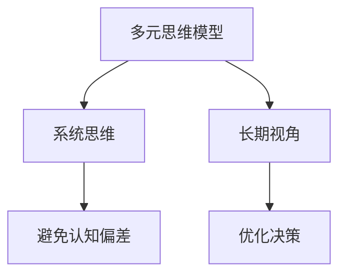
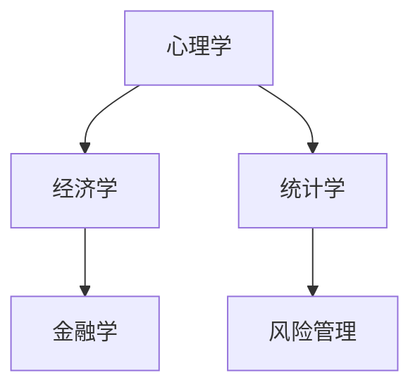
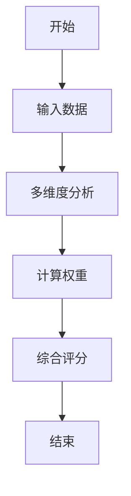
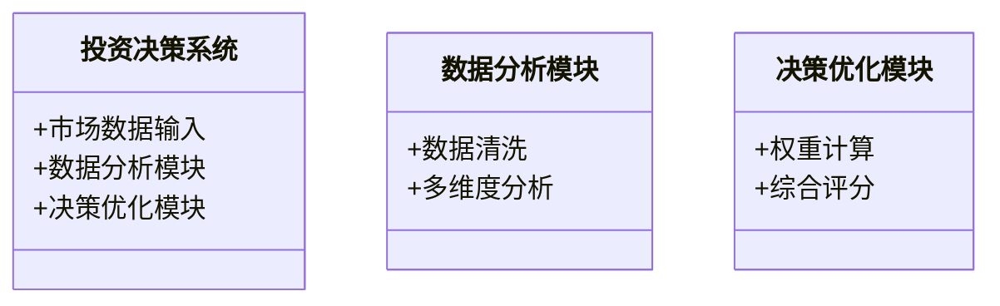

                 


# 芒格的"心理模型"：提高投资决策的质量和效率

## 关键词：
- 芒格心理模型
- 投资决策
- 多元思维模型
- 认知偏差
- 系统思维
- 决策优化

## 摘要：
芒格的"心理模型"是一种通过多元思维模型和系统思维来优化投资决策的方法。本文将深入探讨心理模型的核心概念、算法原理、数学模型、系统架构以及实际应用案例，帮助读者提升投资决策的质量和效率。

---

## 第一部分：芒格心理模型的背景与核心概念

### 第1章：心理模型的背景与核心概念

#### 1.1 心理模型的起源与发展
- **1.1.1 什么是心理模型**  
  心理模型是指个体对某一事物或系统的内在认知和理解，它帮助我们预测和解释行为。芒格的心理模型强调通过多元思维模型来优化决策。

- **1.1.2 芒格对心理模型的贡献**  
  芝加哥学派的代表人物，芒格提出多元思维模型，认为投资者应通过多个学科的交叉应用来避免认知偏差。

- **1.1.3 心理模型的结构与特点**  
  心理模型以系统思维为核心，强调多维度分析和长期视角。

#### 1.2 心理模型的核心概念
- **1.2.1 多元思维模型的定义**  
  多元思维模型是指通过多个学科的交叉应用来理解问题，避免单一视角的局限性。

- **1.2.2 多元思维模型的特点**  
  通过对比表格展示多元思维模型与其他投资方法的差异：

| 特性             | 多元思维模型       | 单一思维模型       |
|------------------|-------------------|-------------------|
| 分析维度         | 多维度             | 单一维度           |
| 决策准确性       | 高                 | 低                 |
| 适用场景         | 复杂问题           | 简单问题           |

- **1.2.3 心理模型与其他投资方法的对比**  
  使用Mermaid图展示不同投资方法之间的关系：



---

## 第二部分：多元思维模型的原理与应用

### 第2章：多元思维模型的原理与应用

#### 2.1 多元思维模型的原理
- **2.1.1 多元思维模型的结构**  
  使用Mermaid图展示多元思维模型的结构：



- **2.1.2 多元思维模型的属性特征对比**  
  通过对比表格展示多元思维模型在不同学科中的应用：

| 学科     | 应用案例                     |
|----------|------------------------------|
| 心理学   | 避免认知偏差                 |
| 统计学   | 数据分析与概率评估           |
| 经济学   | 市场分析与投资决策           |

- **2.1.3 多元思维模型的动态性与可扩展性**  
  通过动态调整模型参数，适应市场变化。

#### 2.2 多元思维模型的应用
- **2.2.1 在投资决策中的应用**  
  通过Python代码示例展示多元思维模型的应用：

```python
import numpy as np
import pandas as pd

# 示例：多元思维模型应用于投资决策
def multi_dimensional_analysis(data):
    # 数据预处理
    processed_data = data.dropna()
    # 计算各维度的权重
    weights = np.random.dirichlet([1,1,1], size=len(processed_data))
    # 综合评分
    scores = np.dot(processed_data, weights.T)
    return scores.mean()

data = pd.DataFrame({
    'market': [8,7,9,6],
    'financials': [7,8,6,7],
    'management': [6,7,8,5]
})

result = multi_dimensional_analysis(data)
print(f"综合评分：{result}")
```

- **2.2.2 在风险控制中的应用**  
  使用多元思维模型评估风险因素。

---

## 第三部分：心理模型的算法原理

### 第3章：心理模型的算法原理

#### 3.1 心理模型的算法原理
- **3.1.1 算法的核心思想**  
  多元思维模型通过多维度分析，优化投资决策。

- **3.1.2 算法的实现步骤**  
  使用Mermaid流程图展示算法流程：



- **3.1.3 算法的数学模型**  
  使用数学公式表示：

$$
\text{综合评分} = \sum_{i=1}^{n} w_i \times x_i
$$

其中，\( w_i \) 为第 \( i \) 个维度的权重，\( x_i \) 为该维度的评分。

---

## 第四部分：心理模型的数学模型与系统分析

### 第4章：心理模型的数学模型与系统分析

#### 4.1 心理模型的数学模型
- **4.1.1 概率论在心理模型中的应用**  
  使用贝叶斯定理进行概率评估：

$$
P(A|B) = \frac{P(B|A) \times P(A)}{P(B)}
$$

- **4.1.2 心理模型的优化算法**  
  使用线性回归模型优化投资组合：

$$
\text{收益} = \beta \times \text{市场回报} + \alpha
$$

- **4.1.3 心理模型的评估指标**  
  使用夏普比率评估投资组合的风险调整后收益。

#### 4.2 心理模型的系统分析
- **4.2.1 系统功能设计**  
  使用Mermaid类图展示系统功能：



- **4.2.2 系统架构设计**  
  使用Mermaid架构图展示系统架构：


---

## 第五部分：心理模型的项目实战

### 第5章：心理模型的项目实战

#### 5.1 项目环境与数据准备
- **5.1.1 环境安装**  
  安装必要的Python库，如numpy、pandas、scikit-learn。

- **5.1.2 数据来源**  
  使用公开的市场数据和公司财务数据。

#### 5.2 项目核心实现
- **5.2.1 数据预处理**  
  清洗数据，处理缺失值和异常值。

- **5.2.2 多维度分析**  
  使用Python代码实现多元思维模型：

```python
import numpy as np
import pandas as pd

# 示例：多元思维模型应用于投资决策
def multi_dimensional_analysis(data):
    processed_data = data.dropna()
    weights = np.random.dirichlet([1,1,1], size=len(processed_data))
    scores = np.dot(processed_data, weights.T)
    return scores.mean()

data = pd.DataFrame({
    'market': [8,7,9,6],
    'financials': [7,8,6,7],
    'management': [6,7,8,5]
})

result = multi_dimensional_analysis(data)
print(f"综合评分：{result}")
```

- **5.2.3 决策优化**  
  使用线性回归模型优化投资组合。

#### 5.3 项目小结
- **5.3.1 项目总结**  
  通过多元思维模型实现投资决策优化。

- **5.3.2 项目成果**  
  提高投资决策的准确性和效率。

---

## 第六部分：心理模型的最佳实践

### 第6章：心理模型的最佳实践

#### 6.1 心理模型的注意事项
- **6.1.1 避免认知偏差**  
  定期回顾和调整决策模型。

- **6.1.2 系统思维的应用**  
  通过系统思维优化投资策略。

#### 6.2 心理模型的拓展阅读
- **6.2.1 相关书籍推荐**  
  推荐《芒格的多元思维模型》和《投资的思维模型》。

- **6.2.2 相关课程推荐**  
  推荐在线课程“心理模型与投资决策优化”。

---

## 总结
芒格的"心理模型"通过多元思维模型和系统思维优化投资决策，帮助投资者提高决策质量和效率。本文详细探讨了心理模型的理论基础、算法原理、数学模型和实际应用，为读者提供了系统化的知识体系和实践指导。通过持续学习和应用，投资者可以更好地应对复杂的投资环境，实现长期稳健的投资回报。

---

**关键词：芒格心理模型、投资决策、多元思维模型、认知偏差、系统思维、决策优化**

