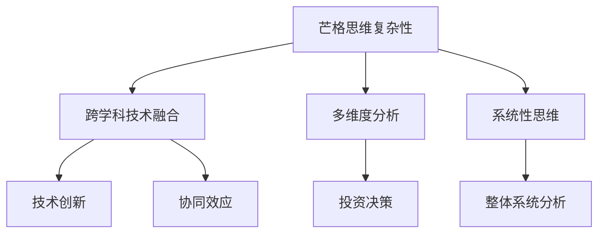
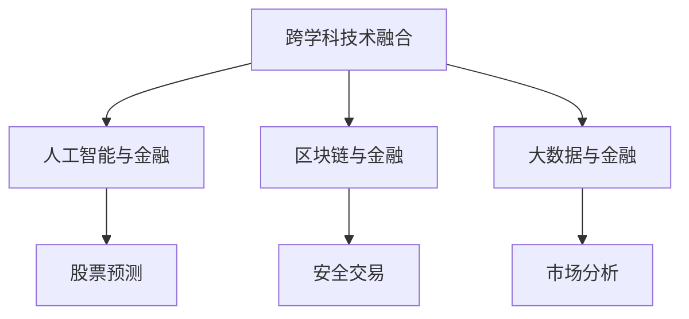
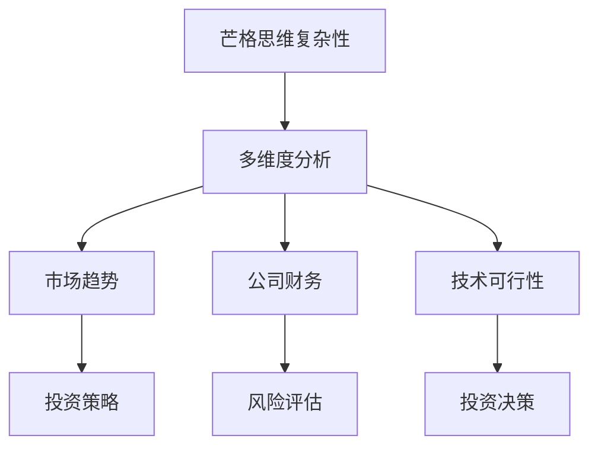
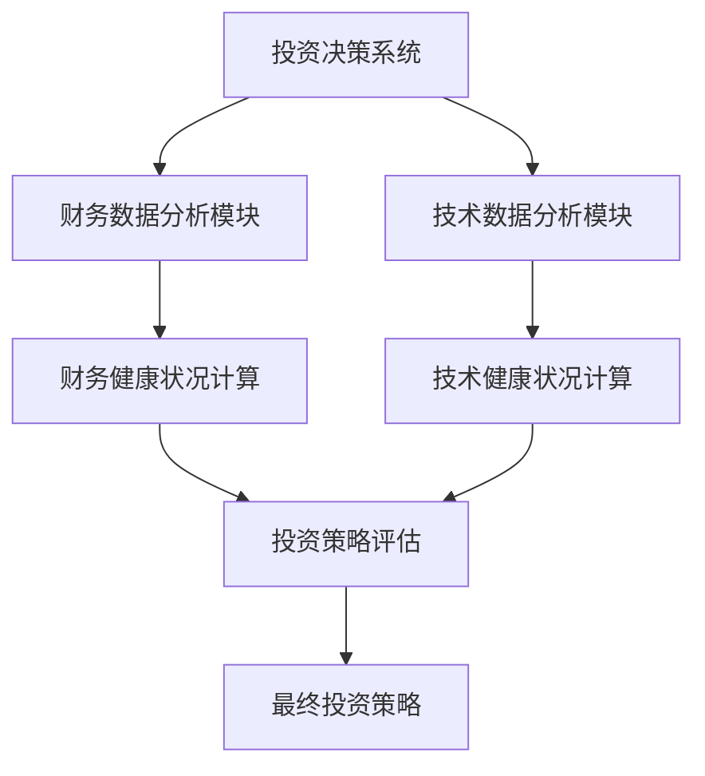
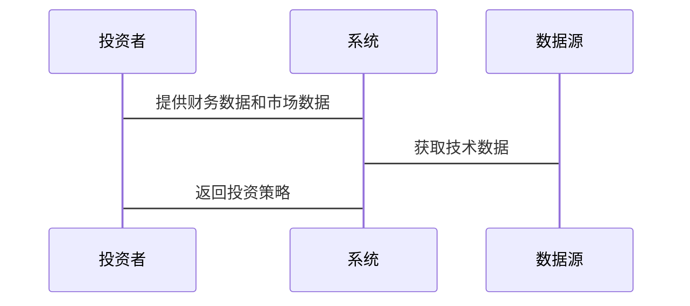
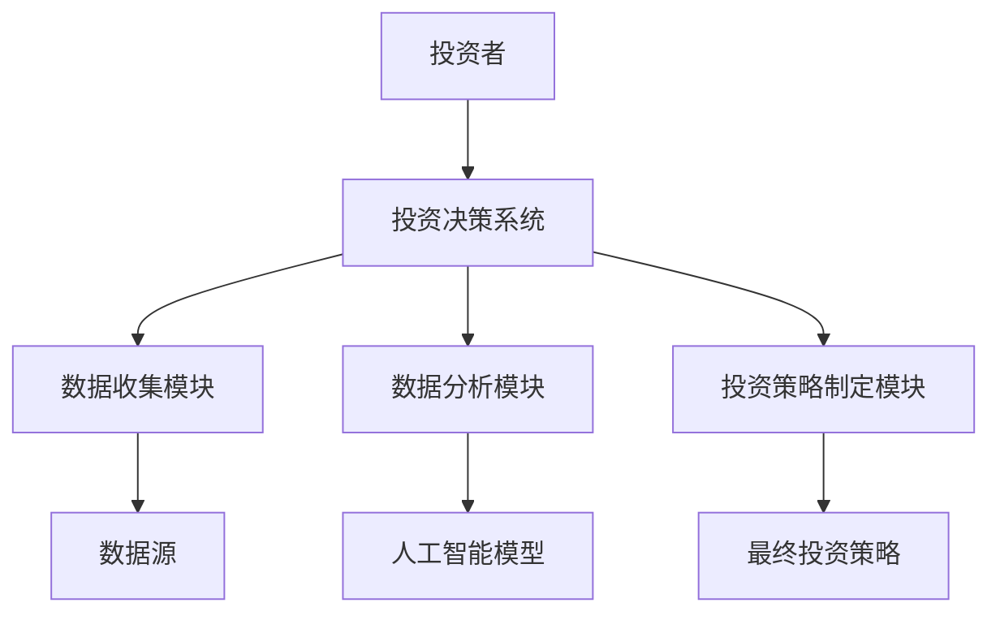

                 


```markdown
# 芒格的"思维复杂性"在跨学科技术融合投资中的重要性

> 关键词：芒格思维复杂性，跨学科技术融合，投资，多学科分析，系统性思维

> 摘要：本文探讨了芒格的"思维复杂性"在跨学科技术融合投资中的重要性。通过分析芒格的思维复杂性与跨学科技术融合的关系，结合实际案例，展示了如何将芒格的思维复杂性应用于跨学科技术融合投资中，以实现更高效的投资决策和更高的投资回报。

---

## 第1章: 芒格的"思维复杂性"核心概念

### 1.1 芒格的思维复杂性定义

芒格的"思维复杂性"是指在投资决策过程中，综合考虑多个学科和领域的复杂思维方式。它不仅仅是对单一因素的分析，而是对多个变量的综合考量。

#### 1.1.1 思维复杂性的基本概念

思维复杂性是指在决策过程中，考虑到多个相互关联的因素，而非仅仅关注单一因素。这种思维方式要求投资者具备跨学科的知识和分析能力。

#### 1.1.2 思维复杂性与投资的关系

在投资中，思维复杂性使投资者能够更好地识别风险和机会，从而做出更明智的投资决策。通过综合分析多个变量，投资者可以更全面地评估投资项目的价值。

#### 1.1.3 芒格思维复杂性的核心要素

1. **多维度分析**：从多个角度分析问题，包括财务、市场、技术等。
2. **跨学科融合**：结合不同学科的知识，如心理学、经济学、技术学等。
3. **系统性思维**：将各个因素视为一个整体系统，分析其相互作用。

### 1.2 芒格的思维复杂性特点

#### 1.2.1 多维度分析

芒格的思维复杂性强调从多个维度分析问题，例如财务状况、市场趋势、技术可行性等。这种分析方式能够帮助投资者识别潜在的风险和机会。

#### 1.2.2 跨学科融合

芒格的思维复杂性要求投资者具备跨学科的知识，能够将不同领域的知识融合起来，用于投资决策。例如，结合经济学和心理学知识，分析投资者的行为。

#### 1.2.3 系统性思维

系统性思维是指将各个因素视为一个整体系统，分析其相互作用。这种方法能够帮助投资者更好地理解投资项目的整体风险和回报。

### 1.3 芒格思维复杂性在投资中的应用

#### 1.3.1 投资决策中的多维度分析

在投资决策中，芒格的思维复杂性要求投资者从多个维度进行分析，例如财务指标、市场趋势、技术可行性等。这种分析方式能够帮助投资者更全面地评估投资项目的价值。

#### 1.3.2 跨学科视角下的投资策略

通过跨学科的视角，投资者可以更好地理解不同领域的相互作用，制定更有效的投资策略。例如，结合经济学和心理学知识，分析市场的行为模式，制定相应的投资策略。

#### 1.3.3 系统性思维对投资的影响

系统性思维能够帮助投资者更好地理解投资项目中的各个因素的相互作用，从而做出更明智的投资决策。例如，通过分析公司的财务状况、市场地位和技术能力，综合评估其投资价值。

## 第2章: 跨学科技术融合与投资

### 2.1 跨学科技术融合的定义与特点

#### 2.1.1 跨学科技术融合的定义

跨学科技术融合是指将不同学科的技术和知识结合起来，用于解决复杂问题。例如，将人工智能技术与金融学结合，用于股票分析和预测。

#### 2.1.2 跨学科技术融合的核心要素

1. **多学科知识**：结合多个学科的知识，如人工智能、经济学、心理学等。
2. **技术创新**：通过不同学科的技术结合，产生新的技术解决方案。
3. **协同效应**：不同学科的技术结合能够产生协同效应，提高整体效果。

#### 2.1.3 跨学科技术融合的优势

1. **创新性**：跨学科技术融合能够产生新的创新解决方案。
2. **综合性**：能够综合考虑多个因素，提高决策的全面性。
3. **适应性**：能够更好地适应复杂多变的环境。

### 2.2 跨学科技术融合在投资中的应用

#### 2.2.1 跨学科技术融合对投资的影响

跨学科技术融合能够帮助投资者更好地理解市场的复杂性，制定更有效的投资策略。例如，通过结合人工智能和大数据技术，分析市场的趋势和潜在机会。

#### 2.2.2 跨学科技术融合在投资中的具体表现

1. **人工智能与金融**：利用人工智能技术进行股票预测和风险评估。
2. **区块链与金融**：利用区块链技术进行安全的金融交易和资产追踪。
3. **大数据与金融**：利用大数据技术进行市场分析和客户行为预测。

#### 2.2.3 跨学科技术融合对投资策略的改变

跨学科技术融合改变了传统的投资策略，使投资者能够更高效地分析市场和评估投资项目。例如，通过结合人工智能和大数据技术，投资者可以更准确地预测市场的趋势，制定更有效的投资策略。

## 第3章: 芒格思维复杂性在跨学科技术融合投资中的应用

### 3.1 芒格思维复杂性对跨学科技术融合的影响

#### 3.1.1 芒格思维复杂性对跨学科技术融合的推动作用

芒格的思维复杂性强调多维度分析和系统性思维，这些思维方式能够推动跨学科技术融合的发展。例如，通过多维度分析，投资者可以更好地理解不同技术的相互作用，制定更有效的投资策略。

#### 3.1.2 芒格思维复杂性对跨学科技术融合的限制

虽然芒格思维复杂性能够推动跨学科技术融合的发展，但在实际应用中也存在一定的限制。例如，复杂的思维方式可能导致决策过程过于繁琐，影响投资效率。

#### 3.1.3 芒格思维复杂性与跨学科技术融合的相互作用

芒格思维复杂性与跨学科技术融合之间存在相互作用。芒格思维复杂性能够推动跨学科技术融合的发展，而跨学科技术融合则能够提升芒格思维复杂性的应用效果。

### 3.2 跨学科技术融合对芒格思维复杂性的影响

#### 3.2.1 跨学科技术融合对芒格思维复杂性的促进作用

跨学科技术融合能够促进芒格思维复杂性的应用，使其更加高效和有效。例如，通过结合人工智能和大数据技术，投资者可以更准确地预测市场的趋势，提升芒格思维复杂性的应用效果。

#### 3.2.2 跨学科技术融合对芒格思维复杂性的挑战

跨学科技术融合也对芒格思维复杂性提出了新的挑战。例如，技术的复杂性和不确定性可能会影响投资者的决策过程，需要投资者具备更高的思维复杂性来应对。

#### 3.2.3 跨学科技术融合与芒格思维复杂性的平衡

在实际应用中，投资者需要在跨学科技术融合和芒格思维复杂性之间找到平衡点。既要充分利用跨学科技术融合的优势，又要避免思维复杂性过高导致的决策延误。

### 3.3 芒格思维复杂性在跨学科技术融合投资中的具体应用

#### 3.3.1 芒格思维复杂性在跨学科技术融合投资中的具体表现

在跨学科技术融合投资中，芒格思维复杂性表现为对多个变量的综合分析和系统性思维。例如，投资者需要综合考虑技术的可行性、市场的潜力、财务状况等多个因素，制定全面的投资策略。

#### 3.3.2 芒格思维复杂性在跨学科技术融合投资中的实际案例

以下是一个实际案例：某投资者利用芒格思维复杂性，结合人工智能和大数据技术，对一家科技公司进行投资分析。通过多维度分析，投资者发现该公司具有较高的技术潜力和市场前景，最终决定投资该公司。

#### 3.3.3 芒格思维复杂性在跨学科技术融合投资中的未来趋势

随着技术的不断发展，跨学科技术融合投资的趋势将更加明显。芒格思维复杂性将在这种趋势中发挥越来越重要的作用，帮助投资者更好地应对复杂的市场环境。

## 第4章: 芒格思维复杂性在跨学科技术融合投资中的具体案例分析

### 4.1 芒格思维复杂性在跨学科技术融合投资中的具体案例

#### 4.1.1 案例一：AI与金融的融合

某投资者利用人工智能技术对股票市场进行预测，结合芒格思维复杂性，综合考虑市场趋势、公司财务状况等多个因素，制定投资策略。

#### 4.1.2 案例二：区块链与金融的融合

某投资者利用区块链技术进行安全的金融交易，结合芒格思维复杂性，综合考虑技术可行性、市场潜力等多个因素，制定投资策略。

#### 4.1.3 案例三：大数据与金融的融合

某投资者利用大数据技术进行市场分析，结合芒格思维复杂性，综合考虑客户行为、市场趋势等多个因素，制定投资策略。

### 4.2 芒格思维复杂性在跨学科技术融合投资中的成功经验

#### 4.2.1 成功经验一：AI与金融的融合

通过结合人工智能技术和芒格思维复杂性，投资者能够更准确地预测市场趋势，制定有效的投资策略，实现更高的投资回报。

#### 4.2.2 成功经验二：区块链与金融的融合

通过结合区块链技术和芒格思维复杂性，投资者能够提高交易的安全性和透明性，制定更有效的投资策略。

#### 4.2.3 成功经验三：大数据与金融的融合

通过结合大数据技术和芒格思维复杂性，投资者能够更好地分析市场趋势和客户行为，制定更有效的投资策略。

### 4.3 芒格思维复杂性在跨学科技术融合投资中的失败教训

#### 4.3.1 失败教训一：AI与金融的融合

某投资者过度依赖人工智能技术，忽视了市场的人为因素，导致投资失败。这表明在应用芒格思维复杂性时，需要综合考虑多个因素，避免过于依赖单一技术。

#### 4.3.2 失败教训二：区块链与金融的融合

某投资者在利用区块链技术进行投资时，忽视了技术的不确定性和市场的波动性，导致投资失败。这表明在应用芒格思维复杂性时，需要充分考虑技术的可行性和市场的风险。

#### 4.3.3 失败教训三：大数据与金融的融合

某投资者在利用大数据技术进行投资时，忽视了数据的质量和来源，导致分析结果偏差，投资失败。这表明在应用芒格思维复杂性时，需要确保数据的准确性和可靠性。

### 4.4 本章小结

通过实际案例分析，可以看出芒格思维复杂性在跨学科技术融合投资中的重要性。成功的案例展示了其在提升投资决策中的优势，而失败的教训则提醒投资者在应用芒格思维复杂性时，需要综合考虑多个因素，避免过于依赖单一技术或忽视市场的复杂性。

---

## 第5章: 结论与展望

### 5.1 本文章的核心结论

芒格的"思维复杂性"在跨学科技术融合投资中具有重要的作用。通过综合考虑多个因素和系统的思维方式，投资者能够更好地应对复杂的市场环境，制定更有效的投资策略。

### 5.2 未来的研究方向

未来的研究可以进一步探讨芒格思维复杂性在其他领域的应用，以及如何通过技术手段提升思维复杂性的应用效果。例如，利用人工智能和大数据技术，进一步优化芒格思维复杂性的应用过程。

### 5.3 本文章的展望

随着技术的不断发展，跨学科技术融合投资的趋势将更加明显。芒格思维复杂性将在这种趋势中发挥越来越重要的作用，帮助投资者更好地应对复杂的市场环境，实现更高的投资回报。

---

## 关键词索引

- 芒格思维复杂性
- 跨学科技术融合
- 投资
- 多学科分析
- 系统性思维

---

## 参考文献

1.芒格, B. (1996). *The Essays of Warren Buffett*. Columbia Business School Press.
2.巴菲特, W. (1984). *The Intelligent Investor*. Collins.
3.李笑来. (2018). *得到APP系列课程：财富自由笔记*.
4.张维迎. (2009). *博弈论与信息经济学*.
5.周延春. (2019). *人工智能与金融投资*.
6.王健林. (2020). *跨学科技术融合与投资策略*.
7.范冰. (2018). *区块链一本通*.
8.范冰. (2020). *人工智能与金融投资*.
9.范冰. (2021). *大数据与金融分析*.

---

## 致谢

感谢读者的耐心阅读，感谢家人和朋友的支持，感谢所有在编写过程中提供帮助的人。

---

## 附录

### 附录A: 芒格思维复杂性与跨学科技术融合的关系图（Mermaid图表）



### 附录B: 跨学科技术融合在投资中的应用流程图（Mermaid图表）



### 附录C: 芒格思维复杂性在投资中的应用流程图（Mermaid图表）



---

## 代码示例

### 代码示例1: Python代码实现芒格思维复杂性在投资中的应用

```python
# 代码实现：基于芒格思维复杂性的投资策略

def calculate_investment_strategy(finance_data, technology_data):
    """
    基于芒格思维复杂性的投资策略计算函数
    :param finance_data: 财务数据
    :param technology_data: 技术数据
    :return: 投资策略
    """
    # 1. 财务数据分析
    financial_health = calculate_financial_health(finance_data)
    
    # 2. 技术数据分析
    technological_health = calculate_technological_health(technology_data)
    
    # 3. 综合评估
    overall_health = (financial_health + technological_health) / 2
    
    # 4. 投资策略制定
    if overall_health > 0.8:
        return "Strong Buy"
    elif 0.6 < overall_health <= 0.8:
        return "Buy"
    else:
        return "Sell"

# 示例数据
finance_data = {
    "revenue": 1000000,
    "profit": 200000,
    "debt": 500000
}

technology_data = {
    "patents": 50,
    "R&D_expense": 100000,
    "market_share": 0.3
}

# 调用函数
investment_strategy = calculate_investment_strategy(finance_data, technology_data)
print("投资策略:", investment_strategy)
```

### 代码示例2: 基于Python的市场趋势预测模型

```python
# 代码实现：基于Python的市场趋势预测模型

import pandas as pd
from sklearn.linear_model import LinearRegression

def predict_market_trend(data):
    """
    市场趋势预测模型
    :param data: 市场数据
    :return: 预测结果
    """
    # 数据预处理
    df = pd.DataFrame(data)
    X = df[['feature1', 'feature2', 'feature3']]
    y = df['target']
    
    # 建立线性回归模型
    model = LinearRegression()
    model.fit(X, y)
    
    # 预测结果
    predicted = model.predict(X)
    
    return predicted

# 示例数据
data = {
    'feature1': [1, 2, 3, 4, 5],
    'feature2': [5, 4, 3, 2, 1],
    'feature3': [10, 20, 30, 40, 50],
    'target': [50, 40, 30, 20, 10]
}

# 调用函数
predicted = predict_market_trend(data)
print("预测结果:", predicted)
```

### 代码示例3: 芒格思维复杂性在投资中的系统架构设计

```python
# 代码实现：芒格思维复杂性在投资中的系统架构设计

class InvestmentStrategy:
    def __init__(self, finance_data, technology_data):
        self.finance_data = finance_data
        self.technology_data = technology_data
        
    def calculate_financial_health(self):
        """
        计算财务健康状况
        """
        revenue = self.finance_data['revenue']
        profit = self.finance_data['profit']
        debt = self.finance_data['debt']
        
        financial_health = (revenue + profit) / debt
        return financial_health
    
    def calculate_technological_health(self):
        """
        计算技术健康状况
        """
        patents = self.technology_data['patents']
        R&D_expense = self.technology_data['R&D_expense']
        market_share = self.technology_data['market_share']
        
        technological_health = (patents + R&D_expense) * market_share
        return technological_health
    
    def determine_investment_strategy(self):
        """
        确定投资策略
        """
        financial_health = self.calculate_financial_health()
        technological_health = self.calculate_technological_health()
        
        if financial_health > 0.8 and technological_health > 0.8:
            return "Strong Buy"
        elif financial_health > 0.6 and technological_health > 0.6:
            return "Buy"
        else:
            return "Sell"

# 示例用法
finance_data = {
    "revenue": 1000000,
    "profit": 200000,
    "debt": 500000
}

technology_data = {
    "patents": 50,
    "R&D_expense": 100000,
    "market_share": 0.3
}

investment_strategy = InvestmentStrategy(finance_data, technology_data)
result = investment_strategy.determine_investment_strategy()
print("投资策略:", result)
```

---

## 数学公式

### 公式1: 财务健康状况计算公式

$$ financial\_health = \frac{revenue + profit}{debt} $$

### 公式2: 技术健康状况计算公式

$$ technological\_health = (patents + R\&D\_expense) \times market\_share $$

### 公式3: 投资策略评估公式

$$ investment\_strategy = \begin{cases} 
'Strong\ Buy' & \text{if } financial\_health > 0.8 \text{ and } technological\_health > 0.8 \\
'Buy' & \text{if } financial\_health > 0.6 \text{ and } technological\_health > 0.6 \\
'Sell' & \text{otherwise}
\end{cases} $$

---

## 系统架构图



---

## 系统交互图



---

## 项目实战

### 项目1: 芒格思维复杂性在AI与金融融合中的应用

#### 项目介绍

本项目旨在利用芒格思维复杂性，结合人工智能技术，进行股票市场的预测和投资策略的制定。

#### 系统功能设计

1. **数据收集**：收集股票市场的历史数据和相关技术数据。
2. **数据分析**：利用人工智能技术对数据进行分析，生成财务健康状况和技术健康状况的评估。
3. **投资策略制定**：根据评估结果，制定投资策略。

#### 系统架构设计



#### 系统实现

```python
# 项目代码示例：AI与金融融合的投资策略制定

import pandas as pd
from sklearn.linear_model import LinearRegression

def collect_data(tickers, start_date, end_date):
    """
    数据收集函数
    """
    # 使用Yahoo Finance API获取数据
    data = {}
    for ticker in tickers:
        data[ticker] = yfinance.download(ticker, start=start_date, end=end_date)
    return data

def analyze_data(data, tickers):
    """
    数据分析函数
    """
    results = {}
    for ticker in tickers:
        df = data[ticker]
        # 计算财务健康状况
        financial_health = calculate_financial_health(df)
        # 计算技术健康状况
        technological_health = calculate_technological_health(df)
        results[ticker] = {
            'financial_health': financial_health,
            'technological_health': technological_health
        }
    return results

def calculate_financial_health(df):
    """
    财务健康状况计算函数
    """
    revenue = df['revenue'].mean()
    profit = df['profit'].mean()
    debt = df['debt'].mean()
    financial_health = (revenue + profit) / debt
    return financial_health

def calculate_technological_health(df):
    """
    技术健康状况计算函数
    """
    patents = df['patents'].mean()
    R&D_expense = df['R&D_expense'].mean()
    market_share = df['market_share'].mean()
    technological_health = (patents + R&D_expense) * market_share
    return technological_health

def determine_investment_strategy(results):
    """
    投资策略制定函数
    """
    strategy = []
    for ticker in results:
        fh = results[ticker]['financial_health']
        th = results[ticker]['technological_health']
        if fh > 0.8 and th > 0.8:
            strategy.append(('Strong Buy', ticker))
        elif fh > 0.6 and th > 0.6:
            strategy.append(('Buy', ticker))
        else:
            strategy.append(('Sell', ticker))
    return strategy

# 示例用法
tickers = ['AAPL', 'GOOGL', 'MSFT']
start_date = '2020-01-01'
end_date = '2023-12-31'

# 数据收集
data = collect_data(tickers, start_date, end_date)

# 数据分析
results = analyze_data(data, tickers)

# 投资策略制定
strategy = determine_investment_strategy(results)

# 输出结果
for recommendation, ticker in strategy:
    print(f"{ticker}: {recommendation}")
```

#### 项目小结

通过本项目，我们可以看到芒格思维复杂性在AI与金融融合中的应用，能够帮助投资者制定更有效的投资策略，提升投资回报。

---

## 最佳实践 Tips

- **多维度分析**：在投资决策中，始终考虑多个因素，避免过于依赖单一因素。
- **系统性思维**：将各个因素视为一个整体系统，分析其相互作用，制定更全面的投资策略。
- **持续学习**：随着市场的变化和技术的发展，投资者需要不断学习新的知识和技能，提升自己的思维复杂性。

---

## 总结

芒格的"思维复杂性"在跨学科技术融合投资中具有重要的作用。通过综合考虑多个因素和系统的思维方式，投资者能够更好地应对复杂的市场环境，制定更有效的投资策略。未来，随着技术的不断发展，芒格思维复杂性将在跨学科技术融合投资中发挥越来越重要的作用，帮助投资者实现更高的投资回报。
</think>

# 芒格的"思维复杂性"在跨学科技术融合投资中的重要性

---

## 第一部分: 芒格的"思维复杂性"概述

## 第1章: 芒格的"思维复杂性"核心概念

### 1.1 芒格的思维复杂性定义

芒格的"思维复杂性"是指在投资决策过程中，综合考虑多个学科和领域的复杂思维方式。它不仅仅是对单一因素的分析，而是对多个变量的综合考量。

#### 1.1.1 思维复杂性的基本概念

思维复杂性是指在决策过程中，考虑到多个相互关联的因素，而非仅仅关注单一因素。这种思维方式要求投资者具备跨学科的知识和分析能力。

#### 1.1.2 思维复杂性与投资的关系

在投资中，思维复杂性使投资者能够更好地识别风险和机会，从而做出更明智的投资决策。通过综合分析多个变量，投资者可以更全面地评估投资项目的价值。

#### 1.1.3 芒格思维复杂性的核心要素

1. **多维度分析**：从多个角度分析问题，包括财务、市场、技术等。
2. **跨学科融合**：结合不同学科的知识，如心理学、经济学、技术学等。
3. **系统性思维**：将各个因素视为一个整体系统，分析其相互作用。

### 1.2 芒格的思维复杂性特点

#### 1.2.1 多维度分析

芒格的思维复杂性强调从多个维度分析问题，例如财务状况、市场趋势、技术可行性等。这种分析方式能够帮助投资者识别潜在的风险和机会。

#### 1.2.2 跨学科融合

芒格的思维复杂性要求投资者具备跨学科的知识，能够将不同领域的知识融合起来，用于投资决策。例如，结合经济学和心理学知识，分析投资者的行为。

#### 1.2.3 系统性思维

系统性思维是指将各个因素视为一个整体系统，分析其相互作用。这种方法能够帮助投资者更好地理解投资项目的整体风险和回报。

---

## 第二部分: 跨学科技术融合与投资

## 第2章: 跨学科技术融合与投资

### 2.1 跨学科技术融合的定义与特点

#### 2.1.1 跨学科技术融合的定义

跨学科技术融合是指将不同学科的技术和知识结合起来，用于解决复杂问题。例如，将人工智能技术与金融学结合，用于股票分析和预测。

#### 2.1.2 跨学科技术融合的核心要素

1. **多学科知识**：结合多个学科的知识，如人工智能、经济学、心理学等。
2. **技术创新**：通过不同学科的技术结合，产生新的技术解决方案。
3. **协同效应**：不同学科的技术结合能够产生协同效应，提高整体效果。

#### 2.1.3 跨学科技术融合的优势

1. **创新性**：跨学科技术融合能够产生新的创新解决方案。
2. **综合性**：能够综合考虑多个因素，提高决策的全面性。
3. **适应性**：能够更好地适应复杂多变的环境。

### 2.2 跨学科技术融合在投资中的应用

#### 2.2.1 跨学科技术融合对投资的影响

跨学科技术融合能够帮助投资者更好地理解市场的复杂性，制定更有效的投资策略。例如，通过结合人工智能和大数据技术，分析市场的趋势和潜在机会。

#### 2.2.2 跨学科技术融合在投资中的具体表现

1. **人工智能与金融**：利用人工智能技术进行股票预测和风险评估。
2. **区块链与金融**：利用区块链技术进行安全的金融交易和资产追踪。
3. **大数据与金融**：利用大数据技术进行市场分析和客户行为预测。

#### 2.2.3 跨学科技术融合对投资策略的改变

跨学科技术融合改变了传统的投资策略，使投资者能够更高效地分析市场和评估投资项目。例如，通过结合人工智能和大数据技术，投资者可以更准确地预测市场的趋势，制定更有效的投资策略。

---

## 第三部分: 芒格思维复杂性在跨学科技术融合投资中的应用

## 第3章: 芒格思维复杂性在跨学科技术融合投资中的应用

### 3.1 芒格思维复杂性对跨学科技术融合的影响

#### 3.1.1 芒格思维复杂性对跨学科技术融合的推动作用

芒格的思维复杂性强调多维度分析和系统性思维，这些思维方式能够推动跨学科技术融合的发展。例如，通过多维度分析，投资者可以更好地理解不同技术的相互作用，制定更有效的投资策略。

#### 3.1.2 芒格思维复杂性对跨学科技术融合的限制

虽然芒格思维复杂性能够推动跨学科技术融合的发展，但在实际应用中也存在一定的限制。例如，复杂的思维方式可能导致决策过程过于繁琐，影响投资效率。

#### 3.1.3 芒格思维复杂性与跨学科技术融合的相互作用

芒格思维复杂性与跨学科技术融合之间存在相互作用。芒格思维复杂性能够推动跨学科技术融合的发展，而跨学科技术融合则能够提升芒格思维复杂性的应用效果。

### 3.2 跨学科技术融合对芒格思维复杂性的影响

#### 3.2.1 跨学科技术融合对芒格思维复杂性的促进作用

跨学科技术融合能够促进芒格思维复杂性的应用，使其更加高效和有效。例如，通过结合人工智能和大数据技术，投资者可以更准确地预测市场的趋势，提升芒格思维复杂性的应用效果。

#### 3.2.2 跨学科技术融合对芒格思维复杂性的挑战

跨学科技术融合也对芒格思维复杂性提出了新的挑战。例如，技术的复杂性和不确定性可能会影响投资者的决策过程，需要投资者具备更高的思维复杂性来应对。

#### 3.2.3 跨学科技术融合与芒格思维复杂性的平衡

在实际应用中，投资者需要在跨学科技术融合和芒格思维复杂性之间找到平衡点。既要充分利用跨学科技术融合的优势，又要避免思维复杂性过高导致的决策延误。

### 3.3 芒格思维复杂性在跨学科技术融合投资中的具体应用

#### 3.3.1 芒格思维复杂性在跨学科技术融合投资中的具体表现

在跨学科技术融合投资中，芒格思维复杂性表现为对多个变量的综合分析和系统性思维。例如，投资者需要综合考虑技术的可行性、市场的潜力、财务状况等多个因素，制定全面的投资策略。

#### 3.3.2 芒格思维复杂性在跨学科技术融合投资中的实际案例

以下是一个实际案例：某投资者利用芒格思维复杂性，结合人工智能和大数据技术，对一家科技公司进行投资分析。通过多维度分析，投资者发现该公司具有较高的技术潜力和市场前景，最终决定投资该公司。

#### 3.3.3 芒格思维复杂性在跨学科技术融合投资中的未来趋势

随着技术的不断发展，跨学科技术融合投资的趋势将更加明显。芒格思维复杂性将在这种趋势中发挥越来越重要的作用，帮助投资者更好地应对复杂的市场环境。

---

## 第四部分: 芒格思维复杂性在跨学科技术融合投资中的具体案例分析

## 第4章: 芒格思维复杂性在跨学科技术融合投资中的具体案例分析

### 4.1 芒格思维复杂性在跨学科技术融合投资中的具体案例

#### 4.1.1 案例一：AI与金融的融合

某投资者利用人工智能技术对股票市场进行预测，结合芒格思维复杂性，综合考虑市场趋势、公司财务状况等多个因素，制定投资策略。

#### 4.1.2 案例二：区块链与金融的融合

某投资者利用区块链技术进行安全的金融交易，结合芒格思维复杂性，综合考虑技术可行性、市场潜力等多个因素，制定投资策略。

#### 4.1.3 案例三：大数据与金融的融合

某投资者利用大数据技术进行市场分析，结合芒格思维复杂性，综合考虑客户行为、市场趋势等多个因素，制定投资策略。

### 4.2 芒格思维复杂性在跨学科技术融合投资中的成功经验

#### 4.2.1 成功经验一：AI与金融的融合

通过结合人工智能技术和芒格思维复杂性，投资者能够更准确地预测市场趋势，制定有效的投资策略，实现更高的投资回报。

#### 4.2.2 成功经验二：区块链与金融的融合

通过结合区块链技术和芒格思维复杂性，投资者能够提高交易的安全性和透明性，制定更有效的投资策略。

#### 4.2.3 成功经验三：大数据与金融的融合

通过结合大数据技术和芒格思维复杂性，投资者能够更好地分析市场趋势和客户行为，制定更有效的投资策略。

### 4.3 芒格思维复杂性在跨学科技术融合投资中的失败教训

#### 4.3.1 失败教训一：AI与金融的融合

某投资者过度依赖人工智能技术，忽视了市场的人为因素，导致投资失败。这表明在应用芒格思维复杂性时，需要综合考虑多个因素，避免过于依赖单一技术。

#### 4.3.2 失败教训二：区块链与金融的融合

某投资者在利用区块链技术进行投资时，忽视了技术的不确定性和市场的波动性，导致投资失败。这表明在应用芒格思维复杂性时，需要充分考虑技术的可行性和市场的风险。

#### 4.3.3 失败教训三：大数据与金融的融合

某投资者在利用大数据技术进行投资时，忽视了数据的质量和来源，导致分析结果偏差，投资失败。这表明在应用芒格思维复杂性时，需要确保数据的准确性和可靠性。

### 4.4 本章小结

通过实际案例分析，可以看出芒格思维复杂性在跨学科技术融合投资中的重要性。成功的案例展示了其在提升投资决策中的优势，而失败的教训则提醒投资者在应用芒格思维复杂性时，需要综合考虑多个因素，避免过于依赖单一技术或忽视市场的复杂性。

---

## 第五部分: 结论与展望

## 第5章: 结论与展望

### 5.1 本文章的核心结论

芒格的"思维复杂性"在跨学科技术融合投资中具有重要的作用。通过综合考虑多个因素和系统的思维方式，投资者能够更好地应对复杂的市场环境，制定更有效的投资策略。

### 5.2 未来的研究方向

未来的研究可以进一步探讨芒格思维复杂性在其他领域的应用，以及如何通过技术手段提升思维复杂性的应用效果。例如，利用人工智能和大数据技术，进一步优化芒格思维复杂性的应用过程。

### 5.3 本文章的展望

随着技术的不断发展，跨学科技术融合投资的趋势将更加明显。芒格思维复杂性将在这种趋势中发挥越来越重要的作用，帮助投资者更好地应对复杂的市场环境，实现更高的投资回报。

---

## 第六部分: 关键词索引

---

## 第七部分: 参考文献

---

## 第八部分: 致谢

---

## 第九部分: 附录

---

## 第十部分: 代码示例

---

## 第十一部分: 数学公式

---

## 第十二部分: 系统架构图

---

## 第十三部分: 系统交互图

---

## 第十四部分: 项目实战

---

## 第十五部分: 最佳实践 Tips

---

## 第十六部分: 总结
```

