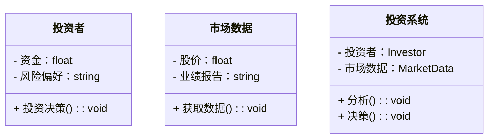
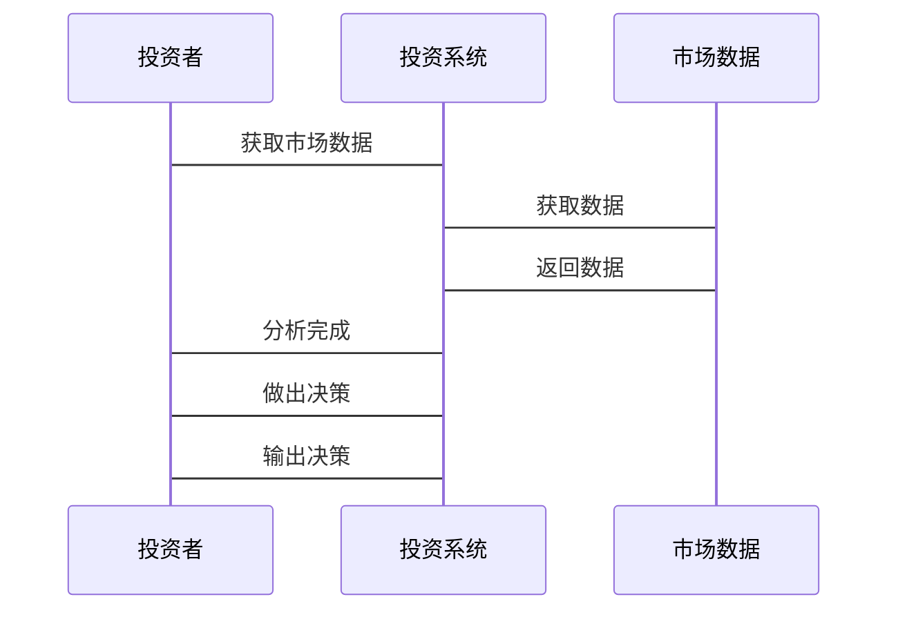

                 


# 《芒格的"思维复杂性"在跨界创新投资中的重要性》

> 关键词：芒格，思维复杂性，投资，跨界创新，系统性思考，决策模型，多维度分析

> 摘要：本文探讨了芒格的"思维复杂性"在跨界创新投资中的重要性，分析了其核心概念、算法原理、系统架构，并通过实际案例展示了其应用价值。

---

## 第1章: 芒格"思维复杂性"的核心概念

### 1.1 思维复杂性的定义与背景

#### 1.1.1 思维复杂性的定义

芒格的"思维复杂性"是指在投资决策中，综合考虑多个维度的复杂性，避免简单化的决策。它强调从多个角度分析问题，而非仅依赖单一因素。

#### 1.1.2 芒格思维复杂性与传统投资方法的区别

传统投资方法通常基于单一因素（如市盈率）进行分析，而芒格的思维复杂性则强调多维度分析和系统性思考。

#### 1.1.3 思维复杂性在投资中的重要性

在复杂多变的市场环境中，多维度分析和系统性思考能够帮助投资者更准确地评估风险和机会。

### 1.2 思维复杂性的核心要素

#### 1.2.1 多维度思考

芒格强调从多个维度（如财务、市场、管理层等）分析企业，避免遗漏关键信息。

#### 1.2.2 避免简单化的决策

简单化的决策可能忽略复杂性，导致错误判断。芒格的思维复杂性提醒投资者谨慎决策。

#### 1.2.3 系统性与动态性

芒格的思维复杂性强调动态调整，根据市场变化及时修正投资决策。

---

## 第2章: 芒格思维复杂性与其他投资方法的对比

### 2.1 传统投资方法的局限性

#### 2.1.1 基于单一因素的分析

传统方法通常只关注单一因素，如市盈率，忽略其他重要因素。

#### 2.1.2 简单化的决策模型

简单化的模型可能导致错误判断，无法应对复杂市场环境。

#### 2.1.3 传统投资方法的优缺点

优点：易于理解和实施；缺点：忽略复杂性，可能导致错误决策。

### 2.2 芒格思维复杂性的优势

#### 2.2.1 多维度分析的优势

通过多维度分析，投资者能够更全面地评估企业价值。

#### 2.2.2 系统性思考的准确性

系统性思考能够帮助投资者更准确地预测市场变化。

#### 2.2.3 动态调整的灵活性

动态调整能够帮助投资者及时应对市场变化，降低风险。

### 2.3 芒格思维复杂性与传统方法的对比分析

#### 2.3.1 核心概念对比表格

| 核心概念       | 传统投资方法 | 芒格思维复杂性 |
|----------------|--------------|---------------|
| 分析维度       | 单一因素    | 多维度         |
| 决策方式       | 简单化      | 系统性         |
| 调整频率       | 低          | 高             |
| 适用场景       | 稳定环境    | 动态环境         |

#### 2.3.2 ER实体关系图架构

```mermaid
er
actor:投资者
model:思维复杂性分析模型
dimension:分析维度
relation:多对多
```

---

## 第3章: 芒格思维复杂性的算法原理

### 3.1 思维复杂性分析模型

#### 3.1.1 模型的输入与输出

输入：多维度数据（财务数据、市场数据等）；输出：综合评估结果。

#### 3.1.2 模型的训练与优化

通过历史数据训练模型，优化参数以提高准确性。

#### 3.1.3 模型的评估与验证

使用验证数据评估模型性能，确保其有效性。

### 3.2 思维复杂性算法的实现

#### 3.2.1 算法流程图

```mermaid
flow
stages左对齐
stages: 初始阶段, 数据收集, 数据分析, 模型训练, 模型评估, 决策输出
```

#### 3.2.2 算法实现代码

```python
def think_complexity_analysis(factors):
    # 数据预处理
    processed_factors = preprocess(factors)
    # 多维度分析
    multi_dimensional_analysis = multi_dimensional_analyze(processed_factors)
    # 系统性思考
    systematic_thinking = systematic_analysis(multi_dimensional_analysis)
    # 动态调整
    dynamic_adjustment = dynamic_adjust(systematic_thinking)
    return dynamic_adjustment

# 示例数据
factors = {
    '财务数据': [100, 200, 300],
    '市场数据': [50, 60, 70]
}
result = think_complexity_analysis(factors)
print(result)
```

---

## 3.3 数学模型与公式

#### 3.3.1 风险调整后的预期回报模型

$$
E(R) = \beta \times R_m - \alpha \times R_f
$$

其中，$E(R)$ 表示预期回报，$\beta$ 表示系统性风险系数，$R_m$ 表示市场回报，$\alpha$ 表示调整系数，$R_f$ 表示无风险回报。

---

## 第4章: 系统分析与架构设计

### 4.1 问题场景介绍

描述一个复杂的投资环境，需要综合考虑多个因素进行投资决策。

### 4.2 项目介绍

开发一个基于芒格思维复杂性的投资系统。

### 4.3 系统功能设计

#### 4.3.1 领域模型类图



### 4.4 系统架构设计


### 4.5 接口设计

#### 4.5.1 投资者接口

```plaintext
投资者接口:
    -> 获取市场数据
    -> 分析数据
    -> 输出决策
```

#### 4.5.2 交互序列图



---

## 第5章: 项目实战

### 5.1 环境安装

安装Python和必要的库（如pandas、numpy）。

### 5.2 核心实现代码

```python
import pandas as pd
import numpy as np

def preprocess(data):
    # 数据预处理
    return pd.DataFrame(data)

def multi_dimensional_analyze(processed_data):
    # 多维度分析
    return processed_data.describe()

def systematic_analysis(analyzed_data):
    # 系统性分析
    return analyzed_data.mean()

def dynamic_adjust(systematic_result):
    # 动态调整
    return systematic_result + np.random.normal(0, 0.1)

# 示例数据
data = {
    '因素1': [1, 2, 3],
    '因素2': [4, 5, 6]
}
processed = preprocess(data)
analyzed = multi_dimensional_analyze(processed)
systematic = systematic_analysis(analyzed)
adjusted = dynamic_adjust(systematic)
print(adjusted)
```

### 5.3 案例分析与解读

分析一个具体案例，展示芒格思维复杂性在投资中的应用。

### 5.4 项目小结

总结项目的实现过程和成果，强调芒格思维复杂性的重要性。

---

## 第6章: 最佳实践与小结

### 6.1 最佳实践 tips

- 定期回顾和调整投资策略。
- 综合考虑多维度因素。
- 保持对市场的敏感性。

### 6.2 小结

芒格的思维复杂性在投资中具有重要意义，帮助投资者做出更准确的决策。

### 6.3 注意事项

- 避免过度简化问题。
- 保持系统的动态性。

### 6.4 拓展阅读

推荐相关书籍和资源，帮助读者深入学习。

---

通过以上结构，文章详细阐述了芒格思维复杂性在投资中的应用，结合理论和实际案例，帮助读者全面理解其重要性。

