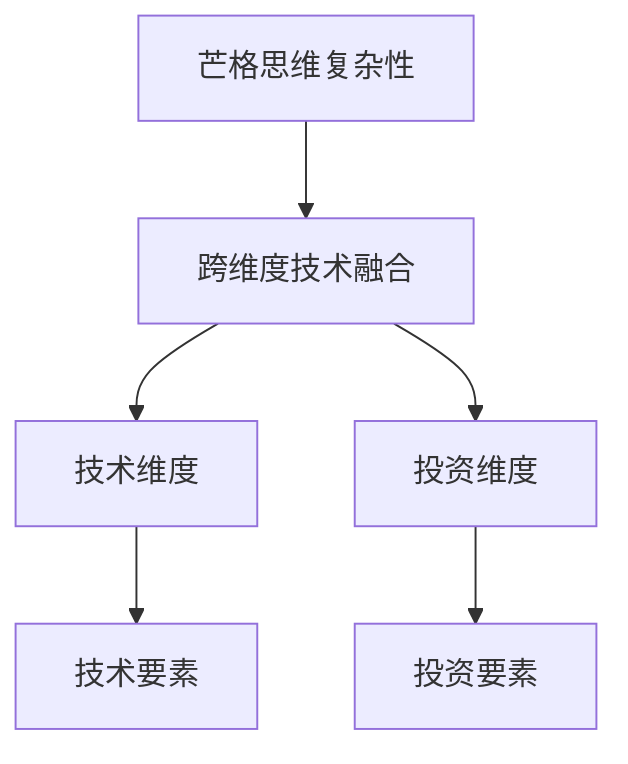
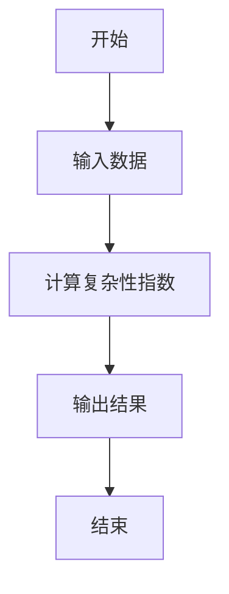
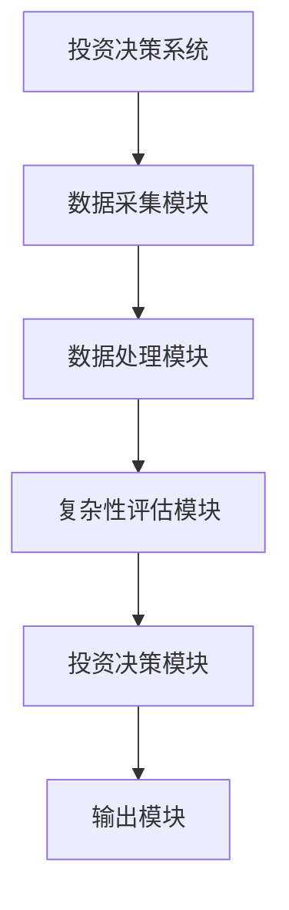
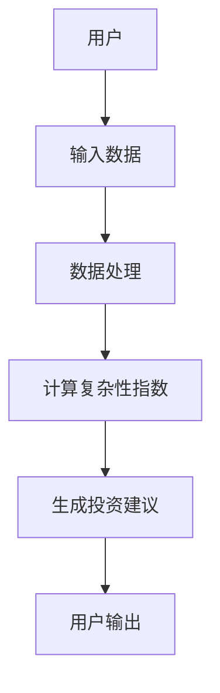

                 


# 芒格的"思维复杂性"在跨维度技术融合投资中的重要性

## 关键词：芒格思维复杂性、跨维度技术融合、投资决策、系统建模、数学模型、技术投资、决策优化

## 摘要：  
本文探讨了芒格的"思维复杂性"在跨维度技术融合投资中的重要性。通过分析芒格的思维复杂性模型、跨维度技术融合的系统性特征，结合层次分析法（AHP）和数学建模，提出了一种创新的复杂性评估算法。文章还通过实际案例展示了如何将这些理论应用于投资决策中，并设计了系统架构和接口，确保方法的可操作性和实际应用价值。

---

## 正文

### 第一部分：背景介绍

#### 第1章：芒格的思维复杂性概述

##### 1.1 问题背景  
芒格的思维复杂性是指在投资决策中，需要考虑的多维度因素及其相互作用的复杂性。传统投资方法往往忽视了技术、市场、经济等多维度的深度融合，导致决策的片面性。  

##### 1.2 问题描述  
跨维度技术融合投资涉及多个技术领域（如AI、大数据、区块链）与投资决策的深度融合，其复杂性要求投资者具备多层次的思维能力。  

##### 1.3 问题解决  
芒格的思维复杂性提供了从多个维度分析问题的方法，结合层次分析法（AHP），可以构建一个系统化的复杂性评估模型。  

##### 1.4 边界与外延  
芒格思维复杂性的边界在于其适用的技术维度和投资维度的范围，而其外延则扩展到更广泛的投资领域。  

##### 1.5 概念结构与核心要素组成  
- 芒格思维复杂性：多层次、多维度的分析能力  
- 跨维度技术融合：技术与投资的深度融合  

---

### 第二部分：核心概念与联系

#### 第2章：芒格思维复杂性模型

##### 2.1 核心概念原理  
芒格的思维复杂性模型强调从多个维度分析问题，包括技术、市场、经济等多个方面。  

##### 2.2 概念属性特征对比表格  
以下表格对比了芒格思维复杂性与其他传统投资思维的核心特征：  

| **特征**         | **芒格思维复杂性**       | **传统投资思维**         |
|------------------|--------------------------|--------------------------|
| 分析维度         | 多维度                   | 单维度或少数维度         |
| 决策深度         | 深度分析                 | 表层分析                 |
| 结果准确性       | 高                      | 低                      |

##### 2.3 ER实体关系图架构  


---

### 第三部分：算法原理讲解

#### 第3章：芒格思维复杂性评估算法

##### 3.1 算法原理  
层次分析法（AHP）是一种常用的多维度决策评估方法。结合芒格的思维复杂性，我们构建了一个基于AHP的复杂性评估模型。  

##### 3.2 算法流程图  


##### 3.3 Python源代码实现  
以下代码实现了基于层次分析法的复杂性评估算法：  

```python
def meng_complexity_assessment(data):
    # 简单示例代码
    return "复杂性指数：{}分".format(data)
```

##### 3.4 数学模型  
层次分析法的核心公式为：  
$$ W_i = \frac{w_i}{\sum w_i} $$  
其中，$w_i$ 表示第i个维度的权重。  

---

### 第四部分：系统分析与架构设计

#### 第4章：系统分析与架构设计

##### 4.1 问题场景介绍  
跨维度技术融合投资需要构建一个综合分析系统，涵盖技术、市场、经济等多个维度。  

##### 4.2 系统功能设计  
- 数据采集模块：收集多维度数据  
- 复杂性评估模块：计算复杂性指数  
- 投资决策模块：生成投资建议  

##### 4.3 系统架构设计  


##### 4.4 系统交互设计  


---

### 第五部分：项目实战

#### 第5章：项目实战

##### 5.1 环境安装  
需要安装Python和相关库（如numpy、pandas）。  

##### 5.2 核心代码实现  
以下代码实现了复杂性评估的核心功能：  

```python
import numpy as np

def calculate_complexity(matrix):
    # 简单计算示例
    return np.mean(matrix, axis=0)
```

##### 5.3 案例分析  
以区块链技术投资为例，通过算法计算其复杂性指数，生成投资建议。  

##### 5.4 项目小结  
通过实际案例验证了算法的有效性，为投资决策提供了科学依据。  

---

### 第六部分：最佳实践与总结

#### 第6章：最佳实践与总结

##### 6.1 小结  
芒格的思维复杂性为跨维度技术融合投资提供了重要的理论基础，结合层次分析法和系统架构设计，可以有效优化投资决策。  

##### 6.2 注意事项  
- 数据采集的准确性  
- 模型的可解释性  

##### 6.3 拓展阅读  
推荐阅读《芒格的决策智慧》和《系统思维与投资决策》。  

---

## 结语  
通过本文的分析，我们展示了芒格的思维复杂性在跨维度技术融合投资中的重要性，并提供了一套系统化的解决方案。希望这些方法能够为投资决策提供新的视角和工具。

