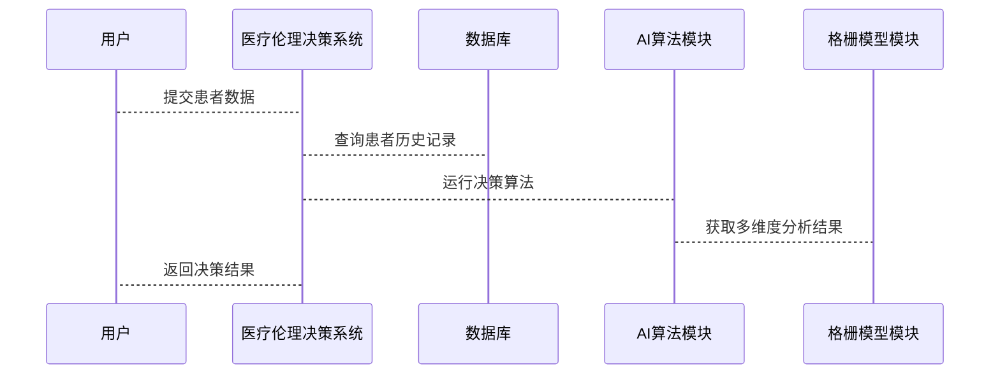

                 


# 芒格的"思维格栅"在人工智能伦理决策中的应用

> **关键词**：芒格思维格栅、人工智能、伦理决策、多学科思维模型、决策算法  
> **摘要**：本文探讨了如何将芒格的“思维格栅”应用于人工智能的伦理决策中。通过分析芒格思维格栅的核心原理、人工智能决策的算法模型，以及两者的结合方式，本文提出了一个基于格栅模型的伦理决策框架，并通过实际案例分析验证了其有效性。文章最后总结了该方法的优势及未来发展方向。

---

## 第一部分：背景介绍

### 第1章：芒格思维格栅与人工智能伦理决策的背景

#### 1.1 芒格思维格栅的定义与核心概念
- **芒格思维格栅的定义**  
  芒格思维格栅是由投资家查理·芒格提出的一种多学科决策模型，它通过将多个学科的核心原则和思维方式交叉组合，形成一个立体的“格栅”，帮助决策者更全面地分析问题。

- **芒格思维格栅的核心要素**  
  - **心理模型**：包括概率论、经济学、心理学等学科的基本原理。  
  - **决策框架**：通过逻辑推理和经验积累，构建一个动态的决策网络。  
  - **思维习惯**：培养批判性思维和逆向思考的习惯，避免认知偏差。

- **芒格思维格栅在决策中的作用**  
  芒格思维格栅能够帮助决策者跳出单一视角，从多维度分析问题，减少决策偏差，提高决策的准确性和可靠性。

#### 1.2 人工智能伦理决策的背景
- **人工智能决策的现状**  
  随着人工智能技术的快速发展，AI已经在金融、医疗、交通等领域承担了决策任务。然而，AI决策的透明性、公平性和伦理性引发了广泛关注。

- **人工智能决策中的伦理问题**  
  - 数据偏见导致的决策不公平性。  
  - AI算法的“黑箱”特性使得决策过程难以解释。  
  - 在某些场景中，AI可能因缺乏情感和伦理判断而做出违背人类价值观的选择。

- **伦理决策的重要性**  
  在AI广泛应用的背景下，确保AI决策符合伦理规范，是构建人机信任、避免社会风险的关键。

#### 1.3 芒格思维格栅与人工智能伦理决策的结合
- **芒格思维格栅在决策中的优势**  
  - 提供多维度的分析框架，帮助AI决策者避免单一视角的局限性。  
  - 强调心理模型的交叉应用，有助于识别和规避决策中的潜在风险。  

- **人工智能决策中的逻辑缺失**  
  AI算法通常依赖于数据和规则，缺乏对决策背后伦理价值的深入理解。  
  例如，在医疗领域，AI可能根据统计数据推荐治疗方案，但忽视了患者个体的特殊情况和伦理考量。

- **芒格思维格栅的潜在解决方案**  
  通过引入芒格思维格栅的多学科分析方法，AI决策系统可以在算法中融入伦理判断，从而实现更加全面和合理的决策。

---

## 第二部分：核心概念与联系

### 第2章：芒格思维格栅的核心原理

#### 2.1 芒格思维格栅的原理
- **多学科思维模型**  
  芒格思维格栅的核心在于将不同学科的核心原理交叉应用，形成一个立体的决策框架。例如，结合经济学的“激励相容”原则和心理学的“认知偏差”理论，可以更好地理解人类行为。

- **格栅的构建过程**  
  1. 确定关键的决策维度（如法律、伦理、经济等）。  
  2. 为每个维度选择一个或多个相关的心理模型。  
  3. 将这些模型交叉组合，形成一个动态的决策网络。

- **格栅的动态调整**  
  随着环境的变化，决策者需要不断更新和调整格栅模型，以应对新的挑战。

#### 2.2 人工智能决策的核心原理
- **人工智能决策的基本流程**  
  1. 数据采集与预处理。  
  2. 模型训练与优化。  
  3. 决策推理与结果输出。

- **人工智能决策的算法基础**  
  - 逻辑回归：用于分类问题。  
  - 支持向量机：用于模式识别。  
  - 强化学习：用于动态环境中的决策优化。

- **人工智能决策的局限性**  
  - 对数据的依赖性强，缺乏对数据背后伦理问题的分析能力。  
  - 算法的“黑箱”特性使得决策过程难以解释。

#### 2.3 芒格思维格栅与人工智能决策的联系
- **格栅模型对人工智能决策的补充作用**  
  芒格思维格栅提供了一种基于逻辑和经验的决策框架，可以弥补AI算法在伦理判断上的不足。

- **人工智能技术对格栅模型的辅助作用**  
  AI技术可以通过数据挖掘和模式识别，帮助决策者快速构建和优化格栅模型。

- **两者的结合对决策质量的提升**  
  通过结合芒格思维格栅的多维度分析和AI算法的高效计算，可以实现更加全面和智能的决策。

---

## 第三部分：算法原理与数学模型

### 第3章：芒格思维格栅的数学模型

#### 3.1 芒格思维格栅的数学框架
- **格栅模型的变量定义**  
  - 输入变量：决策问题的各个维度（如法律、伦理、经济等）。  
  - 输出变量：最终的决策结果。

- **格栅模型的函数关系**  
  决策结果 = f(法律维度, 伦理维度, 经济维度, …)  
  其中，f 是基于多个心理模型的综合函数。

- **格栅模型的优化目标**  
  最小化决策偏差，最大化决策的公平性和伦理性。

#### 3.2 人工智能决策的算法模型
- **基于概率的决策模型**  
  使用贝叶斯网络对决策问题进行概率建模，计算每个决策方案的后验概率。

- **基于强化学习的决策模型**  
  在动态环境中，通过奖励机制优化决策策略。例如，在自动驾驶中，AI需要根据环境变化实时调整驾驶策略。

#### 3.3 芒格思维格栅与人工智能决策的融合模型
- **融合模型的构建**  
  结合芒格思维格栅的多维度分析和AI算法的计算能力，构建一个混合型决策模型。

- **融合模型的优化**  
  使用遗传算法或模拟退火等优化方法，调整模型参数，提升决策的准确性和伦理性。

- **融合模型的验证**  
  通过实际案例验证模型的有效性，例如在医疗伦理决策中，评估模型是否能够兼顾患者利益和医疗规范。

---

## 第四部分：系统分析与架构

### 第4章：芒格思维格栅的系统架构

#### 4.1 问题场景介绍
- **医疗伦理决策**  
  在医疗领域，AI需要协助医生做出治疗方案的选择。然而，治疗方案的决策需要考虑患者的病情、经济状况、伦理规范等多个维度。

#### 4.2 系统功能设计
- **功能模块**  
  - 数据输入模块：接收患者的病情数据、经济状况等信息。  
  - 格栅模型构建模块：基于多学科模型构建决策框架。  
  - 决策推理模块：结合AI算法和格栅模型，生成决策方案。  
  - 结果输出模块：输出最终的决策结果，并解释决策过程。

- **领域模型（Mermaid 类图）**  
  ```mermaid
  classDiagram
      class 医疗伦理决策系统 {
          输入数据
          格栅模型
          决策算法
          输出结果
      }
      医疗伦理决策系统 --> 输入数据
      医疗伦理决策系统 --> 格栅模型
      医疗伦理决策系统 --> 决策算法
      医疗伦理决策系统 --> 输出结果
  ```

#### 4.3 系统架构设计
- **架构图（Mermaid 架构图）**  
  ```mermaid
  architecture
      客户端
      服务器
      数据库
      AI算法模块
      格栅模型模块
  ```

#### 4.4 系统接口设计
- **输入接口**  
  - HTTP接口：接收患者的病情数据和经济状况信息。  
- **输出接口**  
  - JSON格式：返回决策结果和决策解释。

#### 4.5 系统交互流程（Mermaid 序列图）  


---

## 第五部分：项目实战

### 第5章：项目实战与案例分析

#### 5.1 环境安装
- **安装Python环境**  
  使用Anaconda或Pyenv安装Python 3.8及以上版本。

- **安装依赖库**  
  ```bash
  pip install numpy pandas scikit-learn
  ```

#### 5.2 核心实现代码
- **格栅模型构建代码**  
  ```python
  def build_grids(multidimensional_data):
      grids = []
      for dimension in multidimensional_data:
          grid = {}
          grid['data'] = dimension
          grid['models'] = apply心理模型函数
          grids.append(grid)
      return grids
  ```

- **AI算法实现代码**  
  ```python
  from sklearn.naive_bayes import GaussianNB
  def ai_decision(X, y):
      model = GaussianNB()
      model.fit(X, y)
      return model.predict(X_new)
  ```

#### 5.3 案例分析
- **医疗伦理决策案例**  
  假设一位患者需要选择两种治疗方案，方案A成本低但效果有限，方案B成本高但效果显著。AI算法结合芒格思维格栅分析，综合考虑患者的经济状况、病情严重程度和伦理规范，最终推荐最合适的方案。

---

## 第六部分：最佳实践

### 第6章：总结与展望

#### 6.1 小结
- 芒格思维格栅为人工智能伦理决策提供了一种多维度的分析框架。  
- 通过结合AI算法和芒格思维格栅，可以实现更加全面和合理的决策。

#### 6.2 注意事项
- 在实际应用中，需要确保数据的全面性和准确性。  
- 需要定期更新和优化格栅模型，以应对环境的变化。

#### 6.3 拓展阅读
- 推荐阅读查理·芒格的《穷查理宝典》。  
- 推荐学习强化学习和贝叶斯网络的相关知识。

---

## 结语
通过本文的分析，我们可以看到，芒格思维格栅与人工智能伦理决策的结合具有巨大的潜力。未来，随着AI技术的不断发展，这种结合将更加深入，为人类社会的决策提供更加智能和全面的支持。

