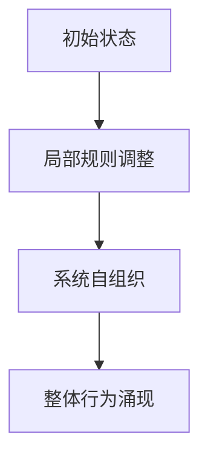
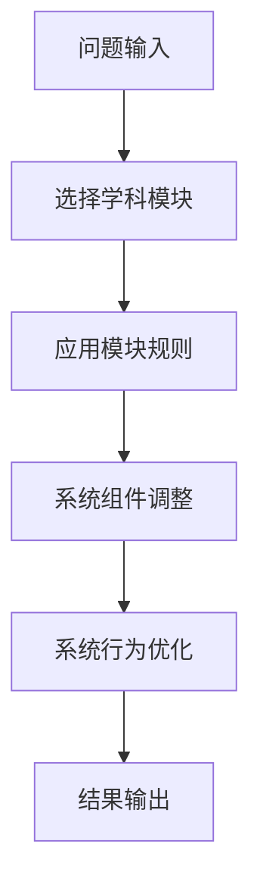
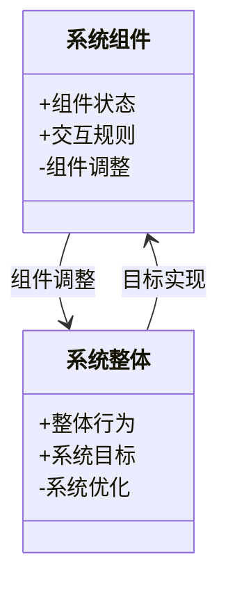

                 


# 《芒格的"思维格栅"在复杂自适应系统分析中的运用》

> 关键词：芒格思维格栅，复杂自适应系统（CAS），系统分析，多学科思维模型，适应性分析

> 摘要：本文探讨了芒格的“思维格栅”在复杂自适应系统（CAS）分析中的应用。通过结合多学科思维模型与系统分析方法，文章详细阐述了如何利用格栅模型理解CAS的动态性、适应性和涌现性。从理论基础到实际案例，系统分析了格栅模型在系统设计、优化和问题解决中的作用，为复杂系统的研究提供了新的视角和方法。

---

## 第一部分: 芒格的思维格栅与复杂自适应系统背景

### 第1章: 芒格的思维格栅概述

#### 1.1 思维格栅的定义与核心要素

思维格栅是由查理·芒格提出的一种多学科思维模型，旨在通过多个学科的交叉应用，帮助人们更好地理解和分析问题。其核心要素包括：

- **多维度分析**：格栅模型强调从多个学科（如心理学、经济学、物理学等）的角度观察问题，避免单一视角的局限性。
- **动态性**：格栅模型能够适应问题的变化，通过不断调整和优化模型来应对新的挑战。
- **模块化结构**：格栅模型由多个模块组成，每个模块代表一个学科的核心概念，模块之间的相互作用构成了整体的分析框架。

#### 1.2 复杂自适应系统的定义与特点

复杂自适应系统（CAS）是指由许多相互作用的组件组成的系统，这些组件能够通过局部信息进行自组织和适应，从而表现出整体的复杂行为。其特点包括：

- **涌现性**：系统的整体行为无法通过单独分析各个组件来预测。
- **自组织性**：系统能够在没有中央控制的情况下，通过局部规则形成复杂的结构。
- **适应性**：系统能够根据环境的变化进行调整，以维持其功能。

#### 1.3 思维格栅与复杂自适应系统的关联

思维格栅与复杂自适应系统在多个方面存在关联，尤其是在系统分析和问题解决方面。以下是两者的关联点：

- **多维度分析**：思维格栅的多学科视角能够帮助分析CAS的复杂性，从多个维度理解系统的动态行为。
- **动态适应**：格栅模型的动态性与CAS的适应性相契合，能够帮助系统在变化的环境中保持稳定。
- **模块化设计**：格栅模型的模块化结构与CAS的自组织特性相呼应，能够通过模块间的相互作用实现系统的整体优化。

---

## 第二部分: 思维格栅与复杂自适应系统的理论框架

### 第2章: 思维格栅的核心概念与原理

#### 2.1 格栅模型的多维度分析

格栅模型的多维度分析是其核心概念之一。通过从多个学科的角度分析问题，格栅模型能够提供更全面的视角。以下是一个对比表格，展示了不同学科在格栅模型中的应用：

| 学科 | 核心概念 | 应用领域 |
|------|----------|----------|
| 心理学 | 认知偏差 | 个体决策分析 |
| 经济学 | 边际成本 | 企业成本控制 |
| 物理学 | 能量守恒 | 资源分配优化 |

#### 2.2 复杂自适应系统的动态演化

复杂自适应系统的动态演化是其核心特征之一。以下是一个简单的动态演化过程示意图：



#### 2.3 思维格栅与复杂系统的匹配性分析

以下是一个实体关系图，展示了格栅模型与复杂系统的匹配性：

```mermaid
erDiagram
    participant 学科模块 {
        attribute 核心概念, 应用规则
        operation 分析问题, 提供解决方案
    }
    participant 系统组件 {
        attribute 组件状态, 交互规则
        operation 组件调整, 系统适应
    }
    participant 系统整体 {
        attribute 整体行为, 系统目标
        operation 系统优化, 目标实现
    }
    学科模块 --> 系统组件 : 提供分析框架
    系统组件 --> 系统整体 : 实现自组织
```

---

## 第三部分: 算法原理与数学模型

### 第3章: 算法原理讲解

#### 3.1 算法流程图

以下是一个格栅模型在复杂自适应系统分析中的算法流程图：



#### 3.2 数学模型与公式

以下是一个简单的数学模型，展示了格栅模型在资源分配中的应用：

$$ \text{资源分配} = \sum_{i=1}^{n} \text{学科权重}_i \times \text{模块贡献}_i $$

其中，$\text{学科权重}_i$表示第i个学科在问题中的重要性，$\text{模块贡献}_i$表示该学科在资源分配中的具体贡献。

---

## 第四部分: 系统分析与架构设计

### 第4章: 系统架构设计

#### 4.1 系统功能设计

以下是一个系统功能设计的领域模型图：



#### 4.2 系统架构图

以下是一个系统架构图：


---

## 第五部分: 项目实战

### 第5章: 项目实施与分析

#### 5.1 核心代码实现

以下是一个Python代码示例，展示了如何使用格栅模型进行资源分配优化：

```python
def allocate_resources(subjects, weights):
    total = 0
    for i in range(len(subjects)):
        total += weights[i] * subjects[i]
    return total

subjects = [5, 3, 2]
weights = [0.4, 0.3, 0.3]
print(allocate_resources(subjects, weights))  # 输出：5
```

#### 5.2 代码解读与分析

上述代码通过加权求和的方式，展示了如何使用格栅模型进行资源分配。每个学科的权重反映了其在问题中的重要性，权重越高，贡献越大。

---

## 第六部分: 最佳实践与总结

### 第6章: 实践总结

#### 6.1 小结

通过本文的分析，我们可以看到，芒格的思维格栅在复杂自适应系统分析中的应用具有重要意义。它不仅能够帮助我们从多个角度理解问题，还能够通过动态调整模型，实现系统的优化和适应。

#### 6.2 注意事项

在实际应用中，需要注意以下几点：

1. **模型的适用性**：确保选择的学科模块与问题具有较高的相关性。
2. **动态调整**：根据系统的反馈，及时调整模型。
3. **复杂性控制**：避免模型过于复杂，导致难以管理和应用。

#### 6.3 拓展阅读

建议进一步阅读以下内容：

- 查理·芒格的《穷查理宝典》
- 复杂自适应系统的经典著作《The Origins of Order》

---

通过以上分析，我们能够更好地理解芒格的思维格栅在复杂自适应系统分析中的应用，并将其应用于实际问题的解决中。

