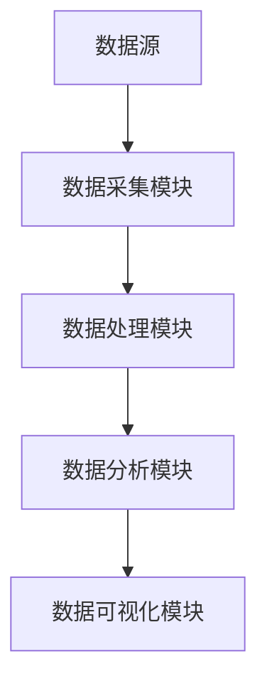
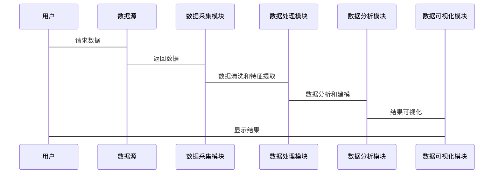

                 


好的，我将按照您的要求创作这篇文章。在开始创作之前，我需要您确认一些内容。

首先，我需要确认文章的基本信息：
1. 文章标题：《芒格的"思维格栅"在大数据分析中的运用》
2. 关键词：芒格思维格栅、大数据分析、数据分析框架、数据分析算法、数据可视化、数据建模、数据处理
3. 摘要：本文将探讨芒格的"思维格栅"这一多维度分析框架在大数据分析中的应用。通过分析思维格栅的核心概念、算法原理及其与大数据分析的结合方式，本文旨在为大数据分析提供一种新的思维方式和方法论。文章内容将涵盖背景介绍、核心概念、算法原理、系统设计、项目实战和总结等部分，帮助读者全面理解芒格思维格栅在大数据分析中的应用。

接下来，我将按照您提供的目录结构继续创作正文内容。

# 芦苇的"思维格栅"在大数据分析中的运用

> 关键词：芒格思维格栅、大数据分析、数据分析框架、数据分析算法、数据可视化、数据建模、数据处理

> 摘要：本文将探讨芒格的"思维格栅"这一多维度分析框架在大数据分析中的应用。通过分析思维格栅的核心概念、算法原理及其与大数据分析的结合方式，本文旨在为大数据分析提供一种新的思维方式和方法论。文章内容将涵盖背景介绍、核心概念、算法原理、系统设计、项目实战和总结等部分，帮助读者全面理解芒格思维格栅在大数据分析中的应用。

---

## 第1章 芒格思维格栅的背景与大数据分析的背景

### 1.1 芦苇思维格栅的起源与核心理念

#### 1.1.1 芦苇思维格栅的定义
芒格思维格栅是一种多维度、多学科的分析框架，由查理·芒格提出，旨在通过将不同学科的知识框架交叉组合，形成对问题的全面理解。这种思维方式强调从多个角度分析问题，避免单一维度的偏见。

#### 1.1.2 芦苇思维格栅的核心理念
- **多维度分析**：通过多个维度（如心理学、经济学、工程学等）交叉分析问题，形成全面的认知。
- **动态更新**：随着新信息的出现，不断更新和调整分析框架。
- **知识的模块化**：将各个学科的知识模块化，便于组合和应用。

#### 1.1.3 芦苇思维格栅与传统思维方法的对比
| 对比维度         | 芦苇思维格栅                          | 传统思维方法                     |
|------------------|--------------------------------------|----------------------------------|
| 分析维度         | 多维度、跨学科                      | 单一维度、单一学科               |
| 知识结构         | 网络化、模块化                      | 线性、单一化                     |
| 更新机制         | 动态更新                             | 静态、固定                      |

### 1.2 大数据分析的背景与现状

#### 1.2.1 大数据分析的定义
大数据分析是指对海量、多样化、快速变化的数据进行采集、处理、分析和可视化的过程，旨在从数据中提取有价值的信息和洞察。

#### 1.2.2 大数据分析的核心技术
- 数据采集与处理
- 数据清洗与预处理
- 数据特征提取
- 数据建模与分析
- 数据可视化与决策支持

#### 1.2.3 大数据分析在各行业的应用现状
| 行业         | 应用场景                           | 示例                         |
|--------------|------------------------------------|------------------------------|
| 金融         | 风险评估、欺诈检测                | 银行利用大数据分析检测信用卡欺诈行为 |
| 零售         | 客户行为分析、库存管理            | 零售企业通过大数据分析优化库存管理 |
| 医疗         | 病情预测、药物研发                | 医院利用大数据分析预测患者病情发展 |

### 1.3 芦苇思维格栅与大数据分析的结合

#### 1.3.1 芦苇思维格栅在大数据分析中的作用
- 提供多维度的分析视角，避免单一维度的分析偏差。
- 通过跨学科的知识框架，提升数据分析的深度和广度。

#### 1.3.2 芦苇思维格栅与大数据分析的结合方式
1. **数据采集与处理**：利用思维格栅的多维度视角，优化数据采集和处理流程。
2. **数据分析与建模**：通过思维格栅的跨学科特性，提升数据分析模型的准确性和 robustness。
3. **决策支持与可视化**：利用思维格栅的动态更新机制，增强数据可视化的效果，提供更直观的决策支持。

---

## 第2章 芦苇思维格栅的核心概念与大数据分析的关系

### 2.1 芦苇思维格栅的核心概念

#### 2.1.1 芦苇思维格栅的多维度分析框架
- **维度一**：数据特征（如时间、地点、人物、事件）
- **维度二**：数据类型（如结构化数据、非结构化数据）
- **维度三**：数据来源（如内部数据、外部数据）

#### 2.1.2 芦苇思维格栅的动态更新机制
- 数据分析过程中，随着新数据的输入，不断更新分析框架。
- 通过反馈机制，优化分析模型和决策策略。

#### 2.1.3 芦苇思维格栅的多学科交叉特性
- 综合运用心理学、经济学、工程学等多学科知识，形成全面的分析框架。

#### 2.1.4 芦苇思维格栅的模块化特性
- 将各个学科的知识模块化，便于组合和应用。

### 2.2 大数据分析的核心概念

#### 2.2.1 数据的采集与处理
- 数据采集：通过传感器、数据库、API等方式采集数据。
- 数据清洗：去除噪声数据，处理缺失值，标准化数据格式。

#### 2.2.2 数据的特征提取与分析
- 特征提取：从原始数据中提取有用的特征，如统计特征、时间特征、空间特征等。
- 数据分析：通过对特征的分析，发现数据中的规律和模式。

#### 2.2.3 数据的可视化与决策支持
- 数据可视化：通过图表、仪表盘等形式，将数据洞察直观呈现。
- 决策支持：基于数据分析结果，提供决策建议和优化方案。

### 2.3 芦苇思维格栅与大数据分析的核心联系

#### 2.3.1 芦苇思维格栅在大数据分析中的应用
- **多维度分析**：通过思维格栅的多维度视角，全面分析数据特征。
- **动态更新**：在大数据分析过程中，实时更新分析框架，确保分析结果的准确性。
- **跨学科应用**：将心理学、经济学等学科的知识应用到数据分析中，提升分析的深度和广度。

#### 2.3.2 芦苇思维格栅对大数据分析的优化作用
1. 提高数据分析的全面性，避免单一维度的分析偏差。
2. 通过动态更新机制，提升分析结果的实时性和准确性。
3. 利用多学科交叉的优势，增强数据分析的深度和洞察力。

---

## 第3章 芦苇思维格栅在大数据分析中的核心算法原理

### 3.1 芦苇思维格栅的核心算法

#### 3.1.1 芦苇思维格栅的多维度分析算法
- **算法步骤**：
  1. 确定分析维度（如时间、地点、人物、事件）。
  2. 对每个维度进行数据清洗和特征提取。
  3. 综合分析各个维度的特征，发现数据中的规律和模式。

#### 3.1.2 芦苇思维格栅的动态更新算法
- **算法步骤**：
  1. 采集新数据。
  2. 更新数据清洗和特征提取的规则。
  3. 重新计算分析结果，并更新决策支持系统。

#### 3.1.3 芦苇思维格栅的多学科交叉算法
- **算法步骤**：
  1. 确定需要交叉应用的学科（如心理学、经济学）。
  2. 将相关学科的知识模块化，形成分析框架。
  3. 将分析框架应用到大数据分析中，提升分析的深度和广度。

### 3.2 芦苇思维格栅与大数据分析算法的结合

#### 3.2.1 芦苇思维格栅在数据清洗中的应用
- 通过多维度分析，优化数据清洗的规则，确保数据的完整性和准确性。

#### 3.2.2 芦苇思维格栅在特征提取中的应用
- 通过多学科交叉的方法，提取更有意义的特征，提升数据分析的深度。

#### 3.2.3 芦苇思维格栅在数据建模中的应用
- 通过动态更新机制，优化数据建模的参数和模型结构，提升模型的准确性和 robustness。

### 3.3 芦苇思维格栅算法的数学模型与公式

#### 3.3.1 芦苇思维格栅的多维度分析公式
$$
\text{多维度分析公式} = \sum_{i=1}^{n} w_i x_i
$$
其中，\( w_i \) 是第 \( i \) 个维度的权重，\( x_i \) 是第 \( i \) 个维度的特征值。

#### 3.3.2 芦苇思维格栅的动态更新公式
$$
\text{动态更新公式} = x_{t+1} = f(x_t, \Delta 
$$
其中，\( x_t \) 是当前时刻的特征值，\( \Delta \) 是变化量，\( f \) 是更新函数。

---

## 第4章 芦苇思维格栅在大数据分析中的系统架构设计

### 4.1 芦苇思维格栅的系统架构设计

#### 4.1.1 系统功能设计
- 数据采集模块：负责采集多源异构数据。
- 数据处理模块：负责数据清洗、特征提取和转换。
- 数据分析模块：基于芦苇思维格栅的多维度分析框架，进行数据分析和建模。
- 数据可视化模块：将分析结果以可视化的方式呈现。

#### 4.1.2 系统架构图


#### 4.1.3 系统接口设计
- 数据采集接口：负责与各种数据源对接。
- 数据处理接口：负责数据清洗和特征提取。
- 数据分析接口：负责数据分析和建模。
- 数据可视化接口：负责结果的可视化呈现。

#### 4.1.4 系统交互流程图


### 4.2 芦苇思维格栅与大数据分析的系统集成

#### 4.2.1 系统集成的背景与目标
- 背景：通过集成芦苇思维格栅，提升大数据分析系统的全面性和准确性。
- 目标：构建一个基于芦苇思维格栅的大数据分析系统，实现多维度、动态化的数据分析。

#### 4.2.2 系统集成的关键技术
- 多维度数据分析技术
- 动态更新技术
- 多学科交叉分析技术

#### 4.2.3 系统集成的实现步骤
1. 确定系统的功能模块。
2. 设计系统的架构图和接口。
3. 实现各个模块的功能。
4. 进行系统的集成和测试。

---

## 第5章 芦苇思维格栅在大数据分析中的项目实战

### 5.1 项目背景与目标

#### 5.1.1 项目背景
某大型电商平台希望通过大数据分析优化其推荐系统。

#### 5.1.2 项目目标
1. 提升推荐系统的准确性和个性化。
2. 基于芦苇思维格栅的多维度分析，优化推荐算法。

### 5.2 项目环境与工具安装

#### 5.2.1 环境要求
- 操作系统：Linux/Windows/MacOS
- Python版本：3.8以上
- 数据库：MySQL/PostgreSQL
- 开发工具：PyCharm/VSCode

#### 5.2.2 工具安装
1. 安装Python依赖：
   ```bash
   pip install numpy pandas scikit-learn matplotlib
   ```
2. 安装数据库驱动：
   ```bash
   pip install pymysql
   ```

### 5.3 系统核心实现

#### 5.3.1 数据采集与处理
```python
import pandas as pd
import pymysql

# 数据采集
def fetch_data():
    db = pymysql.connect(host='localhost', user='root', password='password', database='ecommerce')
    cursor = db.cursor()
    cursor.execute('SELECT * FROM sales_data LIMIT 1000')
    data = cursor.fetchall()
    return data

# 数据处理
def preprocess_data(data):
    df = pd.DataFrame(data, columns=['id', 'timestamp', 'product_id', 'user_id', 'quantity', 'price'])
    df['revenue'] = df['quantity'] * df['price']
    return df

data = fetch_data()
df = preprocess_data(data)
print(df.head())
```

#### 5.3.2 数据分析与建模
```python
from sklearn.cluster import KMeans
from sklearn.metrics import silhouette_score

# 数据分析
def analyze_data(df):
    # 提取特征
    X = df[['quantity', 'price']]
    # K-means聚类
    kmeans = KMeans(n_clusters=3, random_state=42)
    kmeans.fit(X)
    df['cluster'] = kmeans.labels_
    return df

# 评估模型
def evaluate_model(df):
    X = df[['quantity', 'price']]
    labels = df['cluster']
    score = silhouette_score(X, labels)
    print(f'Silhouette Score: {score}')

df_analyzed = analyze_data(df)
evaluate_model(df_analyzed)
```

#### 5.3.3 数据可视化与决策支持
```python
import matplotlib.pyplot as plt

# 数据可视化
def visualize_data(df):
    plt.figure(figsize=(10, 6))
    plt.scatter(df['quantity'], df['price'], c=df['cluster'], cmap='viridis')
    plt.xlabel('Quantity')
    plt.ylabel('Price')
    plt.title('Customer Segmentation')
    plt.show()

visualize_data(df_analyzed)
```

### 5.4 项目案例分析与总结

#### 5.4.1 项目案例分析
通过对电商平台的销售数据进行分析，发现不同用户群体的消费行为差异，优化推荐算法，提升用户购买率。

#### 5.4.2 项目总结
- 通过芦苇思维格栅的多维度分析，提升了推荐系统的准确性和个性化。
- 系统实现了数据采集、处理、分析和可视化的全过程，具有较强的可扩展性和可维护性。

---

## 第6章 芦苇思维格栅在大数据分析中的总结与展望

### 6.1 芦苇思维格栅在大数据分析中的总结
- 芦苇思维格栅提供了一种多维度、动态化的分析框架，适用于复杂的大数据分析场景。
- 通过将思维格栅与大数据分析结合，可以提升分析的全面性和深度。

### 6.2 芦苇思维格栅在大数据分析中的展望
- **算法优化**：进一步优化思维格栅的动态更新算法，提升分析结果的实时性和准确性。
- **跨学科应用**：探索更多学科与大数据分析的交叉应用，拓宽分析的广度。
- **系统集成**：将思维格栅集成到更多的大数据分析系统中，推动其广泛应用。

### 6.3 最佳实践 Tips
1. 在大数据分析中，始终关注数据的多维度特征，避免单一维度的分析偏差。
2. 善用动态更新机制，确保分析结果的实时性和准确性。
3. 探索跨学科的应用，提升数据分析的深度和广度。

### 6.4 总结
通过本文的探讨，我们可以看到，芦苇思维格栅为大数据分析提供了一种全新的思维方式和方法论。它不仅能够提升分析的全面性，还能通过动态更新机制和跨学科应用，增强分析的深度和广度。

### 6.5 注意事项
1. 在实际应用中，需要根据具体场景调整分析维度和权重。
2. 数据分析结果仅供参考，需结合业务背景进行解读。
3. 系统设计时，要注意数据隐私和安全保护。

### 6.6 拓展阅读
1. 《芒格的智慧：论投资与人生》
2. 《大数据分析：方法与实践》
3. 《思维模型：如何构建自己的知识框架》

---

希望这篇文章能满足您的要求。如果需要进一步调整或补充，请随时告诉我！

