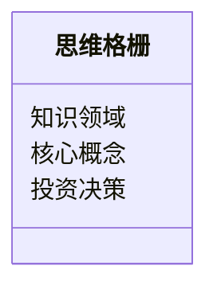
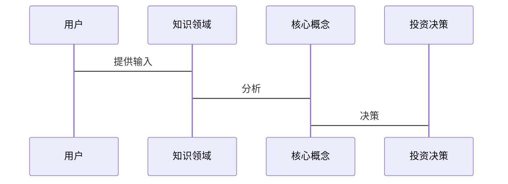

                 


# 芒格的"思维格栅"：构建全面的投资分析框架

## 关键词：芒格，思维格栅，投资分析，决策框架，系统设计，数学模型，实际案例

## 摘要：芒格的“思维格栅”是一种多维度的投资分析框架，通过整合多个学科的知识和决策模型，帮助投资者做出更明智的投资决策。本文将从背景、核心概念、算法原理、系统架构设计、项目实战和最佳实践等方面，全面解析“思维格栅”的构建过程和应用方法，为投资者提供一套系统化、科学化的投资分析体系。

---

## 第1章: 芒格"思维格栅"的背景与核心概念

### 1.1 什么是"思维格栅"

#### 1.1.1 "思维格栅"的定义

“思维格栅”是芒格提出的一种投资分析框架，通过将多个学科的知识体系整合到一个网格中，形成一个多层次的分析框架。它不仅涵盖了财务分析，还包括心理学、经济学、生物学等多个领域的知识，帮助投资者全面理解企业的内在价值。

#### 1.1.2 "思维格栅"的核心要素

- **知识领域**：包括财务、会计、经济学、心理学等学科。
- **核心概念**：如复利、边际成本、机会成本等。
- **投资决策**：基于多维度分析做出的决策。

#### 1.1.3 "思维格栅"与投资分析的关系

“思维格栅”为投资分析提供了一个多维度的视角，帮助投资者避免单一维度的分析偏差，从而做出更全面的投资决策。

### 1.2 芒格"思维格栅"的背景与演变

#### 1.2.1 芒格的投资哲学概述

芒格认为，投资不仅仅是对数字的分析，更是对企业和市场的深刻理解。他强调通过多学科的视角来分析问题。

#### 1.2.2 "思维格栅"的起源与发展

“思维格栅”起源于芒格对多学科知识的整合，他通过将各个领域的基本原理应用到投资分析中，形成了一个独特的框架。

#### 1.2.3 "思维格栅"在现代投资中的应用

现代投资中，越来越多的投资者开始采用“思维格栅”方法，特别是在价值投资领域，这种方法被广泛认可。

### 1.3 "思维格栅"的核心概念与联系

#### 1.3.1 核心概念原理

“思维格栅”通过整合多个学科的核心概念，帮助投资者理解企业的内在价值和市场动态。

#### 1.3.2 概念属性特征对比表格

| 学科领域    | 核心概念         | 描述                                      |
|-------------|------------------|-----------------------------------------|
| 财务学      | 资产负债表       | 反映企业的财务状况                       |
| 会计学      | 每股收益         | 衡量企业盈利能力                         |
| 经济学      | 边际成本         | 企业生产决策的关键因素                   |
| 心理学      | 行为偏差         | 影响投资者决策的心理因素                 |

#### 1.3.3 ER实体关系图架构的 Mermaid 流程图

```


```

---

## 第2章: 芒格"思维格栅"的算法原理

### 2.1 算法原理概述

#### 2.1.1 算法原理的数学模型

“思维格栅”通过整合多个学科的分析模型，构建一个综合的数学模型。例如，结合财务指标和市场心理因素，计算企业的内在价值。

#### 2.1.2 算法原理的 mermaid 流程图

```


```

### 2.2 算法原理的详细讲解

#### 2.2.1 数学模型与公式

$$
\text{内在价值} = \sum_{t=1}^{n} \frac{\text{现金流}_t}{(1 + r)^t}
$$

其中，$r$ 是折现率，$\text{现金流}_t$ 是第 $t$ 年的现金流。

#### 2.2.2 通俗易懂的举例说明

假设一家公司的未来现金流分别为 $100, 150, 200$，折现率为 $10\%$，则其内在价值为：

$$
\frac{100}{1.1} + \frac{150}{1.1^2} + \frac{200}{1.1^3} \approx 100 \times 0.9091 + 150 \times 0.8264 + 200 \times 0.7513 \approx 90.91 + 123.96 + 150.26 = 365.13
$$

---

## 第3章: 芒格"思维格栅"的系统分析与架构设计

### 3.1 问题场景介绍

#### 3.1.1 投资分析的复杂性

投资分析需要考虑企业的财务状况、市场趋势、行业竞争等多个因素。

#### 3.1.2 "思维格栅"的系统性解决方案

通过构建一个多维度的知识体系，整合各学科的核心概念，形成一个全面的投资分析框架。

### 3.2 系统功能设计

#### 3.2.1 领域模型 Mermaid 类图

```


```

### 3.3 系统架构设计

#### 3.3.1 Mermaid 架构图

```


```

### 3.4 系统接口设计

#### 3.4.1 接口描述

- 输入：企业财务数据、市场数据
- 输出：内在价值评估、投资建议

#### 3.4.2 接口实现

通过API获取企业财务数据和市场数据，进行分析后输出投资建议。

### 3.5 系统交互 Mermaid 序列图

```


```

---

## 第4章: 芒格"思维格栅"的项目实战

### 4.1 环境安装

#### 4.1.1 开发环境配置

安装Python、Jupyter Notebook、相关库（如Pandas、NumPy）。

#### 4.1.2 工具安装

安装必要的数据分析工具和可视化工具。

### 4.2 系统核心实现源代码

#### 4.2.1 核心代码实现

```python
def calculate_intrinsic_value(cash_flows, discount_rate):
    return sum(cash_flow / (1 + discount_rate) ** t for t, cash_flow in enumerate(cash_flows))
```

#### 4.2.2 代码应用解读与分析

上述代码计算了企业未来现金流的内在价值，考虑了时间和资金的时间价值。

### 4.3 实际案例分析

#### 4.3.1 经典案例分析

分析某公司的财务数据，使用“思维格栅”框架进行投资决策。

#### 4.3.2 详细讲解剖析

通过具体案例，展示如何整合多个学科的分析结果，做出投资决策。

### 4.4 项目小结

“思维格栅”框架通过整合多学科知识，帮助投资者做出更全面的投资决策。

---

## 第5章: 芒格"思维格栅"的最佳实践与注意事项

### 5.1 最佳实践 tips

#### 5.1.1 知识体系的构建

持续学习和更新各学科的知识，保持知识体系的完整性。

#### 5.1.2 决策模型的设计

根据实际情况调整和优化决策模型，确保其适用性和准确性。

### 5.2 小结

芒格的“思维格栅”是一种强大的投资分析工具，通过多维度的分析，帮助投资者做出更明智的决策。

### 5.3 注意事项

- **风险管理**：在实际操作中，要注意风险控制，避免过度依赖单一模型。
- **持续学习**：投资环境不断变化，需要持续更新知识和模型。

### 5.4 拓展阅读

推荐相关书籍和文章，深入学习“思维格栅”的应用和优化。

---

通过以上目录，我们可以看到“思维格栅”作为一种多维度的投资分析框架，具有广泛的应用潜力。投资者可以通过整合各学科的知识，构建自己的分析框架，提高投资决策的准确性和全面性。

