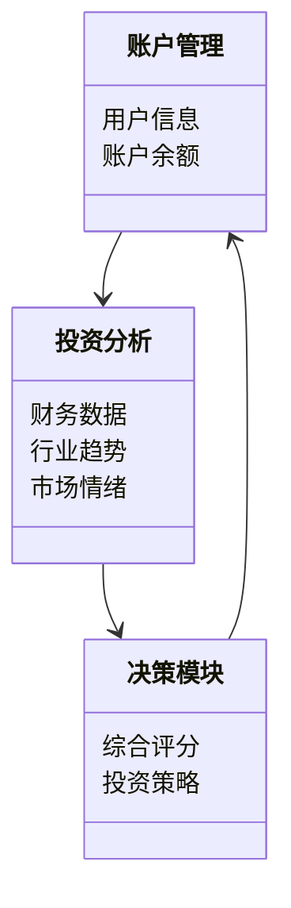
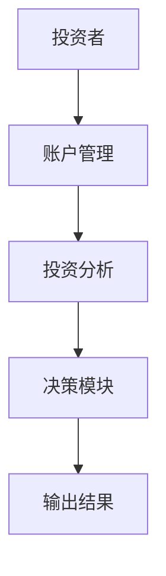

                 


# 芒格的思维模型：在投资中的应用

> 关键词：芒格思维模型，投资决策，多元化思维，逆向思维，系统性分析

> 摘要：芒格的思维模型是一种以多元思维、逆向思维和决策框架为核心的投资方法，结合心理学、经济学和决策科学的原理，帮助投资者做出更理性、更系统的决策。本文将详细分析芒格思维模型的核心概念、算法原理、系统架构，并通过实际案例展示其在投资中的应用。

---

## 第一部分：芒格思维模型的背景与基础

### 第1章：芒格思维模型的核心概念

#### 1.1 多元思维模型的定义与特点

**1.1.1 多元思维模型的定义**

多元思维模型（Diverse Thinking Models）是芒格思维模型的核心组成部分，强调通过多个学科和角度来分析问题。它认为，单一的思维方式难以全面捕捉问题的本质，因此需要整合物理学、心理学、经济学等学科的原理，构建一个多维度的分析框架。

**1.1.2 多元思维模型的核心特点**

- **多维度性**：涵盖多个学科和领域的知识。
- **互补性**：各学科模型相互补充，形成完整的分析体系。
- **动态性**：根据实际情况灵活调整模型的权重和应用顺序。

**1.1.3 多元思维模型与传统投资方法的区别**

| 特性             | 多元思维模型                  | 传统投资方法                  |
|------------------|-------------------------------|-----------------------------|
| 分析维度         | 多维，涵盖多个学科            | 单一，主要依赖财务指标        |
| 决策依据         | 综合考虑风险、收益、心理因素  | 侧重于财务数据和市场趋势      |
| 灵活性           | 高，能够根据环境变化调整模型   | 较低，通常基于固定策略        |

---

#### 1.2 芒格思维模型的哲学基础

**1.2.1 理性决策的哲学基础**

芒格思维模型深受理性决策理论的影响，强调基于事实和逻辑的分析。其核心思想是：人类的决策过程并非完全理性，但通过多维度的分析，可以最大限度地减少非理性偏差。

**1.2.2 心理学与行为经济学的结合**

芒格思维模型结合了心理学和行为经济学的原理，尤其是认知偏差（如确认偏差、过度自信等）对投资决策的影响。通过识别和克服这些偏差，投资者可以做出更理性的决策。

**1.2.3 芒格思维模型在投资中的重要性**

在投资领域，芒格思维模型可以帮助投资者避免情绪化决策，降低风险，同时提高对市场的洞察力。

---

#### 1.3 芒格思维模型的应用范围

**1.3.1 投资决策中的应用**

- 价值评估：通过多元思维模型分析企业的财务状况、行业地位和竞争优势。
- 风险管理：利用逆向思维模型识别潜在风险并制定应对策略。

**1.3.2 个人决策中的应用**

- 职业规划：通过多元思维模型分析职业发展方向和潜在风险。
- 生活决策：利用逆向思维模型评估重大生活决策的可行性。

**1.3.3 芒格思维模型的边界与外延**

- **边界**：适用于复杂决策场景，不适用于简单决策。
- **外延**：可以与其他决策模型（如凯利判据、蒙特卡洛模拟）结合使用，拓展应用场景。

---

## 第二部分：芒格思维模型的核心概念与联系

### 第2章：芒格思维模型的核心原理

#### 2.1 多元思维模型的原理

**2.1.1 多元思维模型的构成要素**

- **学科模型**：物理学（能量守恒）、心理学（认知偏差）、经济学（供需关系）等。
- **分析维度**：财务、行业、技术、法律、心理等。

**2.1.2 多元思维模型的数学模型**

$$
\text{综合评分} = \sum_{i=1}^{n} w_i \times \text{维度评分}_i
$$

其中，$w_i$ 为第 $i$ 个维度的权重，$\text{维度评分}_i$ 为该维度的评分。

**2.1.3 多元思维模型的属性特征对比表格**

| 属性     | 特点                          |
|----------|-------------------------------|
| 维度      | 多维                          |
| 权重      | 可调整                        |
| 输入      | 多个维度的数据                |
| 输出      | 综合评分                      |

---

#### 2.2 逆向思维的原理

**2.2.1 逆向思维的定义与特点**

逆向思维（Reverse Thinking）是指从反方向入手，通过分析问题的对立面来寻找解决方案。在投资中，逆向思维常用于识别市场泡沫、寻找被低估的资产。

**2.2.2 逆向思维的数学模型**

$$
\text{逆向评分} = \sum_{i=1}^{n} (-w_i \times \text{维度评分}_i)
$$

**2.2.3 逆向思维与正向思维的对比分析**

| 属性     | 正向思维                     | 逆向思维                     |
|----------|------------------------------|------------------------------|
| 输入      | 正面数据                     | 反面数据                     |
| 输出      | 正面结果                     | 反面结果                     |
| 适用场景 | 常规分析                     | 非常规分析                   |

---

#### 2.3 决策框架的原理

**2.3.1 决策框架的定义与特点**

决策框架（Decision Framework）是一个用于指导决策的系统性方法，通过明确的步骤和规则，帮助投资者在复杂场景中做出最优决策。

**2.3.2 决策框架的数学模型**

$$
\text{决策评分} = \sum_{i=1}^{n} w_i \times \text{决策维度评分}_i
$$

**2.3.3 决策框架的属性特征对比表格**

| 属性     | 特点                          |
|----------|-------------------------------|
| 输入      | 多个决策维度的数据            |
| 输出      | 综合决策评分                  |
| 权重      | 可调整                        |

---

## 第三部分：芒格思维模型的算法原理讲解

### 第3章：芒格思维模型的算法原理

#### 3.1 多元思维模型的算法流程

**3.1.1 多元思维模型的输入与输出**

- **输入**：多个维度的数据（如财务数据、行业趋势、市场情绪等）。
- **输出**：综合评分和分析报告。

**3.1.2 多元思维模型的算法步骤**

1. **数据收集**：收集相关维度的数据。
2. **权重分配**：根据经验或模型确定各维度的权重。
3. **评分计算**：计算各维度的评分并加权求和。
4. **结果分析**：根据综合评分做出决策。

**3.1.3 多元思维模型的流程图（Mermaid）**

```mermaid
graph TD
    A[开始] -> B[收集数据]
    B -> C[分配权重]
    C -> D[计算评分]
    D -> E[输出结果]
    E -> F[结束]
```

---

#### 3.2 逆向思维的算法流程

**3.2.1 逆向思维的输入与输出**

- **输入**：市场数据、行业趋势等。
- **输出**：逆向评分和分析报告。

**3.2.2 逆向思维的算法步骤**

1. **数据收集**：收集相关数据。
2. **逆向评分计算**：对各维度进行逆向评分。
3. **结果分析**：根据逆向评分做出决策。

**3.2.3 逆向思维的流程图（Mermaid）**

```mermaid
graph TD
    A[开始] -> B[收集数据]
    B -> C[计算逆向评分]
    C -> D[输出结果]
    D -> E[结束]
```

---

#### 3.3 决策框架的算法流程

**3.3.1 决策框架的输入与输出**

- **输入**：多个决策维度的数据。
- **输出**：综合决策评分和分析报告。

**3.3.2 决策框架的算法步骤**

1. **数据收集**：收集相关数据。
2. **权重分配**：确定各维度的权重。
3. **评分计算**：计算综合评分。
4. **结果分析**：根据评分做出决策。

**3.3.3 决策框架的流程图（Mermaid）**

```mermaid
graph TD
    A[开始] -> B[收集数据]
    B -> C[分配权重]
    C -> D[计算评分]
    D -> E[输出结果]
    E -> F[结束]
```

---

## 第四部分：芒格思维模型的系统分析与架构设计

### 第4章：芒格思维模型的系统分析

#### 4.1 问题场景介绍

在投资领域，投资者需要面对复杂多变的市场环境，单一的分析方法往往难以应对。芒格思维模型通过多维度的分析，帮助投资者做出更全面的决策。

#### 4.2 系统功能设计（领域模型）



---

#### 4.3 系统架构设计



---

## 第五部分：芒格思维模型的项目实战

### 第5章：芒格思维模型的项目实战

#### 5.1 投资案例分析

**案例背景**：假设某投资者考虑投资一家科技公司。

**分析步骤**：

1. **数据收集**：收集公司的财务数据、行业趋势、市场情绪等。
2. **权重分配**：分配各维度的权重（如财务50%，行业30%，市场20%）。
3. **评分计算**：计算综合评分。
4. **结果分析**：根据评分做出投资决策。

---

## 第六部分：芒格思维模型的最佳实践

### 第6章：芒格思维模型的最佳实践

#### 6.1 投资建议

- **长期视角**：关注企业的长期价值，而非短期波动。
- **分散投资**：通过多元思维模型分散投资风险。
- **持续学习**：不断更新知识库，保持对市场的敏感性。

#### 6.2 小结

芒格思维模型通过多维度的分析，帮助投资者做出更理性和系统的决策。通过实际案例的分析，我们可以看到，芒格思维模型在投资中的应用不仅可以提高决策的准确性，还可以降低投资风险。

---

### 结语

芒格思维模型是一种强大的工具，它通过整合多学科的知识和思维方式，帮助投资者在复杂多变的市场中做出更明智的决策。希望本文的分析能为投资者提供有价值的参考和启发。

