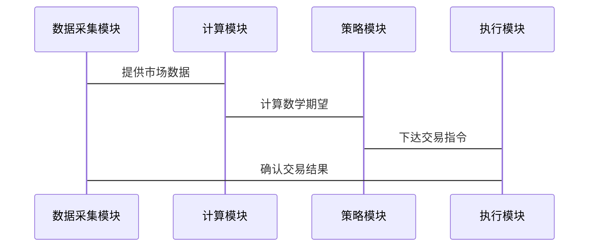

                 


# 芒格的"数学期望"思维在量化投资中的应用

## 关键词：芒格、数学期望、量化投资、概率论、资产配置、风险管理

## 摘要：  
芒格的“数学期望”思维是其投资理念的重要组成部分，本文将深入分析这一思维在量化投资中的应用。从数学期望的基本概念出发，结合量化投资的理论与实践，探讨其在资产配置、风险管理以及投资决策中的具体应用。通过实际案例分析，揭示芒格数学期望思维在量化投资中的独特价值和实践意义。

---

## 第1章: 芒格与数学期望思维概述

### 1.1 芒格的生平与投资理念  
芒格作为巴菲特的黄金搭档，以其独特的投资理念闻名。他的“数学期望”思维是其价值投资思想的核心，强调通过概率分析和长期视角来做出投资决策。

#### 1.1.1 芒格的基本介绍  
查理·芒格（Charlie Munger）是伯克希尔哈撒韦公司的副主席，被誉为“幕后操盘手”。他不仅是成功的投资者，也是心理学、经济学等多领域知识的跨界专家。

#### 1.1.2 芒格的价值投资理念  
芒格的价值投资理念强调安全边际和长期持有优质资产。他认为，投资的本质是通过寻找具有持续竞争优势的企业，以合理价格买入并长期持有。

#### 1.1.3 芒格的数学期望思维  
芒格将数学期望的概念引入投资决策中，认为投资者应基于概率分析，选择那些长期来看具有更高期望收益的资产。

---

### 1.2 数学期望的基本概念  
数学期望是概率论中的核心概念，用于衡量随机变量的平均值。在投资中，数学期望可以帮助投资者评估不同资产组合的长期收益。

#### 1.2.1 数学期望的定义  
数学期望是所有可能结果的加权平均值，权重为每个结果发生的概率。公式为：
$$ E[X] = \sum_{i=1}^{n} P_i \cdot X_i $$  
其中，\( P_i \) 是结果 \( X_i \) 发生的概率。

#### 1.2.2 数学期望的计算公式  
以掷骰子为例，数学期望为：
$$ E[X] = \frac{1+2+3+4+5+6}{6} = 3.5 $$  
这表明，尽管每次掷骰子的结果不同，但长期来看，期望值稳定在3.5。

#### 1.2.3 数学期望的性质与特点  
数学期望具有线性性质，即期望值的线性运算与变量的线性运算一致：
$$ E[aX + bY] = aE[X] + bE[Y] $$  
此外，数学期望不受异常值影响，是一个稳健的平均值指标。

---

## 第2章: 数学期望在量化投资中的理论基础

### 2.1 量化投资的基本原理  
量化投资通过数学模型和算法，利用大数据和高频交易等技术，寻找市场中的套利机会或趋势。

#### 2.1.1 量化投资的定义与特点  
量化投资是基于数学模型的投资方法，具有数据驱动、高频交易、自动化操作等特点。

#### 2.1.2 量化投资的核心要素  
量化投资的核心要素包括数据采集、模型构建、策略回测和风险管理。

#### 2.1.3 量化投资与传统投资的区别  
量化投资依赖计算机和算法，而传统投资更多依赖人为判断。量化投资强调数据驱动，传统投资强调基本面分析。

---

### 2.2 数学期望在投资决策中的作用  
数学期望在量化投资中的应用，主要体现在资产配置、风险管理等方面。

#### 2.2.1 数学期望与投资收益的关系  
通过数学期望，投资者可以预估不同资产组合的长期收益，从而做出更优的配置决策。

#### 2.2.2 数学期望与投资风险的平衡  
数学期望帮助投资者在收益与风险之间找到平衡点，避免过度冒险或保守。

#### 2.2.3 数学期望在资产配置中的应用  
资产配置的数学期望模型可以通过优化算法，找到最优的资产组合，使期望收益最大化，同时风险最小化。

---

### 2.3 芒格数学期望思维的量化模型  
芒格的数学期望思维在量化投资中得到广泛应用，尤其是在资产定价和风险管理领域。

#### 2.3.1 数学期望在资产定价中的应用  
通过分析资产的历史收益和风险，可以建立数学期望模型，预估其未来价值。

#### 2.3.2 数学期望在风险管理中的作用  
数学期望帮助投资者量化风险，通过概率分析，制定更稳健的投资策略。

#### 2.3.3 芒格数学期望模型的构建  
芒格模型结合了概率论和价值投资理念，强调长期视角和安全边际。

---

## 第3章: 芒格数学期望思维的量化模型实现

### 3.1 数学期望模型的基本框架  
数学期望模型在量化投资中的实现，需要考虑数据输入、模型构建、回测分析等多个环节。

#### 3.1.1 模型的输入变量  
输入变量包括资产的历史收益、波动率、相关性等。

#### 3.1.2 模型的输出结果  
输出结果包括资产组合的期望收益、风险值（VaR）等。

#### 3.1.3 模型的假设条件  
假设市场是有效的，历史数据可以预测未来收益。

---

### 3.2 数学期望模型的算法实现  
通过Python代码实现数学期望模型，帮助投资者量化分析资产组合的期望收益和风险。

#### 3.2.1 模型的数学公式  
资产组合的期望收益公式为：
$$ E[R_p] = \sum_{i=1}^{n} w_i \cdot E[R_i] $$  
其中，\( w_i \) 是资产 \( i \) 的权重，\( E[R_i] \) 是资产 \( i \) 的期望收益。

#### 3.2.2 模型的代码实现  
```python
import numpy as np

# 资产的期望收益
assets = [10, 20, 30]
weights = [1/3, 1/3, 1/3]

expected_return = sum(w * r for w, r in zip(weights, assets))
print("Expected Return:", expected_return)
```

#### 3.2.3 模型的验证与测试  
通过历史数据回测，验证模型的有效性，评估其在不同市场环境下的表现。

---

### 3.3 模型在实际投资中的应用案例  
通过实际案例，分析芒格数学期望模型在量化投资中的应用效果。

#### 3.3.1 案例一：资产配置中的数学期望应用  
通过数学期望模型，优化资产配置，实现风险可控下的最大收益。

#### 3.3.2 案例二：风险管理中的数学期望应用  
利用数学期望，评估投资组合的风险，制定风险对冲策略。

#### 3.3.3 案例三：长期投资策略的数学期望分析  
分析长期投资的期望收益，验证芒格的长期主义理念。

---

## 第4章: 芒格数学期望思维的系统架构设计

### 4.1 系统设计目标  
量化投资系统的设计目标是实现资产配置、风险管理和交易执行的自动化。

#### 4.1.1 系统的功能需求  
系统需具备数据采集、模型构建、策略回测、交易执行等功能。

#### 4.1.2 系统的性能需求  
系统需支持高频交易，具备低延迟和高吞吐量。

#### 4.1.3 系统的安全需求  
系统需具备数据安全和交易安全机制，防止数据泄露和交易欺诈。

---

### 4.2 系统架构设计  
量化投资系统的架构设计包括数据层、计算层、策略层和执行层。

#### 4.2.1 系统模块划分  
- 数据采集模块：采集市场数据
- 计算模块：计算数学期望
- 策略模块：制定投资策略
- 执行模块：执行交易指令

#### 4.2.2 系统的交互流程  
通过mermaid序列图展示系统各模块的交互流程。



---

### 4.3 系统接口设计  
系统接口设计包括数据接口、计算接口和交易接口。

#### 4.3.1 数据接口  
- 输入接口：接收市场数据
- 输出接口：输出计算结果

#### 4.3.2 计算接口  
- 输入接口：接收资产权重和期望收益
- 输出接口：输出数学期望值

#### 4.3.3 交易接口  
- 输入接口：接收交易指令
- 输出接口：确认交易结果

---

## 第5章: 芒格数学期望思维的项目实战

### 5.1 项目环境安装  
量化投资项目的环境安装包括Python、Pandas、NumPy等库的安装。

#### 5.1.1 安装Python  
```bash
python --version
pip install numpy pandas matplotlib
```

#### 5.1.2 安装量化投资库  
```bash
pip install backtrader yfinance
```

---

### 5.2 项目核心实现  
通过Python代码实现芒格数学期望模型的量化投资策略。

#### 5.2.1 核心代码实现  
```python
import pandas as pd
import numpy as np

# 数据加载
df = pd.read_csv('stock_data.csv')

# 计算期望收益
expected_return = df.mean()

print("Expected Return:", expected_return)
```

---

### 5.3 项目实战案例  
通过具体案例，展示数学期望模型在量化投资中的实际应用。

#### 5.3.1 案例分析  
分析某股票的历史数据，计算其期望收益和风险，制定投资策略。

#### 5.3.2 代码实现  
```python
import yfinance as yf

# 下载数据
stock = yf.download('AAPL', start='2020-01-01', end='2023-12-31')

# 计算期望收益
expected_return = stock['Adj Close'].mean()

print("Expected Return:", expected_return)
```

---

### 5.4 项目小结  
通过实战案例，验证芒格数学期望模型的有效性，总结其在量化投资中的优势和不足。

---

## 第6章: 总结与展望

### 6.1 最佳实践 tips  
- 量化投资需结合市场实际情况，避免过度依赖模型
- 数学期望模型需结合其他指标，如波动率和相关性

### 6.2 小结  
芒格的数学期望思维为量化投资提供了理论支持和实践指导，帮助投资者做出更优的投资决策。

### 6.3 展望  
未来，随着AI和大数据技术的发展，数学期望思维在量化投资中的应用将更加广泛和深入。

---

## 关键词：芒格、数学期望、量化投资、概率论、资产配置、风险管理

## 摘要：  
芒格的“数学期望”思维是其投资理念的重要组成部分，本文将深入分析这一思维在量化投资中的应用。从数学期望的基本概念出发，结合量化投资的理论与实践，探讨其在资产配置、风险管理以及投资决策中的具体应用。通过实际案例分析，揭示芒格数学期望思维在量化投资中的独特价值和实践意义。

--- 

感谢您的耐心阅读，希望这篇文章能为您提供有价值的见解！

