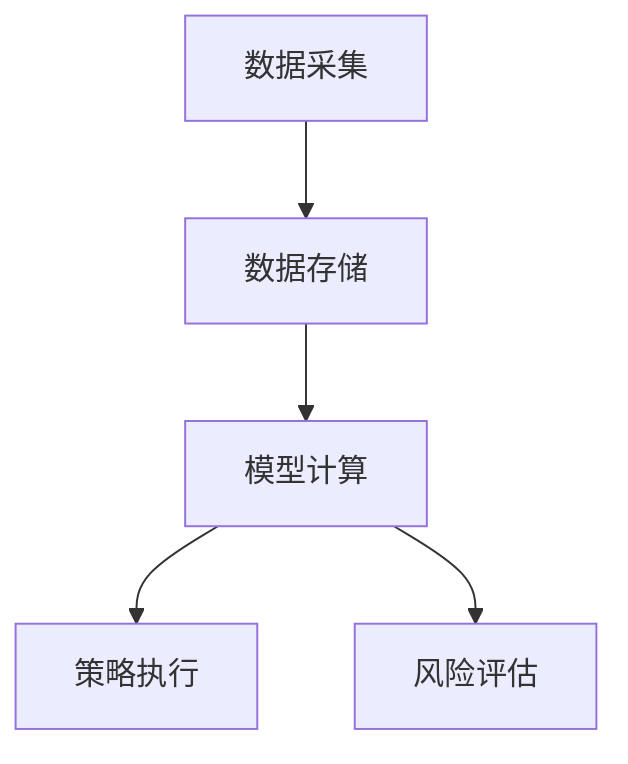

                 


# 《芒格的"数学期望"思维在量化投资策略优化中的应用》

---

## 关键词
- 芒格
- 数学期望
- 量化投资
- 策略优化
- 投资决策
- 风险管理

---

## 摘要
本文将深入探讨芒格的“数学期望”思维在量化投资策略优化中的应用。通过结合芒格的价值投资理念和数学期望的理论基础，分析其在资产配置、风险管理以及交易策略中的具体应用。同时，本文将从理论、算法、系统设计和实战等多个维度展开，详细阐述如何利用数学期望优化量化投资策略，帮助投资者在复杂市场环境中做出更科学的投资决策。

---

# 第1章：芒格的数学期望思维与量化投资概述

## 1.1 芒格的数学期望思维
### 1.1.1 数学期望的定义与性质
- 数学期望的定义：$E[X] = \sum_{i=1}^{n} x_i P(x_i)$
- 数学期望的性质：
  - 线性性：$E[aX + b] = aE[X] + b$
  - 非负性：如果 $X$ 是非负随机变量，则 $E[X] \geq 0$

### 1.1.2 芒格对数学期望的独特见解
- 芒格将数学期望与实际投资决策相结合，强调长期视角和风险控制。

## 1.2 量化投资的基本概念
### 1.2.1 量化投资的定义
- 量化投资：通过数学模型和算法进行投资决策的过程。
- 核心要素：数据、模型、交易策略、风险管理。

### 1.2.2 量化投资的特点
- 数据驱动：依赖大量历史数据进行分析。
- 系统性：通过模型和算法实现自动化交易。
- 理性化：减少人为情绪干扰，基于逻辑和数学模型做出决策。

## 1.3 芒格数学期望思维在量化投资中的应用背景
### 1.3.1 量化投资的现状
- 技术进步推动量化投资快速发展。
- 数据量和计算能力的提升为数学期望的应用提供了基础。

### 1.3.2 数学期望在投资决策中的重要性
- 数学期望是量化投资中评估投资回报的核心指标。
- 通过数学期望优化资产配置和风险管理。

---

# 第2章：数学期望在投资决策中的应用

## 2.1 数学期望与资产配置
### 2.1.1 资产配置的数学期望模型
- 资产配置的期望回报：$$E[R] = w_1 E[R_1] + w_2 E[R_2] + \dots + w_n E[R_n]$$
- 资产配置的风险：$$Var(R) = w_1^2 Var(R_1) + w_2^2 Var(R_2) + \dots + w_n^2 Var(R_n) + 2w_i w_j Cov(R_i, R_j)$$

### 2.1.2 数学期望在风险分散中的作用
- 通过多元化配置降低风险，但数学期望可以帮助选择最优资产组合。

## 2.2 数学期望与风险管理
### 2.2.1 风险的数学期望定义
- 风险通常表示为资产回报的方差或标准差。
- 风险的期望值：$$E[Risk] = E[Var(R)]$$

### 2.2.2 数学期望在风险评估中的应用
- 计算VaR（Value at Risk）和CVaR（Conditional Value at Risk）。
- 例如，计算某资产在95%置信水平下的VaR。

## 2.3 数学期望与交易策略
### 2.3.1 交易策略的数学期望分析
- 通过数学期望评估交易策略的长期收益。
- 示例：计算某交易策略的平均收益和最大回撤。

---

# 第3章：芒格的数学期望思维在投资决策中的独特视角

## 3.1 芒格的投资理念与数学期望
### 3.1.1 芒格的价值投资理念
- 购买低于内在价值的资产，长期持有。

### 3.1.2 芒格思维中的数学期望特征
- 强调安全边际：通过数学期望优化资产选择。
- 降低投资组合的风险，追求长期稳定的回报。

## 3.2 芒格思维在投资决策中的具体应用
### 3.2.1 资产配置的优化策略
- 使用数学期望模型优化资产权重，降低整体风险。

### 3.2.2 风险管理的优化方法
- 通过VaR和CVaR等指标量化风险，结合数学期望优化风险控制。

---

# 第4章：数学期望在量化投资策略优化中的算法原理

## 4.1 数学期望优化的算法
### 4.1.1 均值-方差优化
- 优化目标：$$\min w^T \Sigma w$$
- 约束条件：$$w^T \mu = E[R]$$
- 使用拉格朗日乘数法求解。

### 4.1.2 风险指标的计算
- 计算VaR和CVaR，优化投资组合的风险。

## 4.2 算法实现
### 4.2.1 Python实现
```python
import numpy as np
from scipy.optimize import minimize

def mean_variance_optimization(returns, weights):
    n = len(returns)
    mu = np.mean(returns)
    Sigma = np.cov(returns)
    
    def objective(weights):
        return np.dot(weights.T, np.dot(Sigma, weights))
    
    constraints = [{'type': 'eq', 'fun': lambda w: np.sum(w) - 1},
                   {'type': 'eq', 'fun': lambda w: np.dot(weights, mu) - E_R}]
    
    result = minimize(objective, weights, constraints)
    return result.x
```

---

# 第5章：系统架构与实现

## 5.1 系统架构设计
### 5.1.1 系统模块划分
- 数据采集模块：获取市场数据。
- 模型计算模块：计算数学期望和风险指标。
- 策略执行模块：根据优化结果生成交易信号。

### 5.1.2 系统架构图


---

# 第6章：项目实战

## 6.1 环境搭建
- 安装Python和相关库（numpy, pandas, scipy.optimize）。

## 6.2 核心代码实现
```python
import numpy as np
from scipy.optimize import minimize

def optimize_portfolio(returns):
    n = len(returns)
    mu = np.mean(returns)
    Sigma = np.cov(returns)
    
    def objective(weights):
        return np.dot(weights.T, np.dot(Sigma, weights))
    
    constraints = [{'type': 'eq', 'fun': lambda w: np.sum(w) - 1},
                   {'type': 'eq', 'fun': lambda w: np.dot(weights, mu) - E_R}]
    
    result = minimize(objective, np.ones(n)/n, constraints)
    return result.x
```

---

# 第7章：总结与展望

## 7.1 本章小结
- 芒格的数学期望思维为量化投资提供了新的视角。
- 通过数学期望优化资产配置和风险管理，提升了投资策略的科学性。

## 7.2 未来展望
- 结合人工智能技术，进一步优化量化投资策略。
- 探索更多基于数学期望的创新应用。

---

通过以上目录和内容安排，本文将系统地介绍芒格的数学期望思维在量化投资中的应用，帮助读者从理论到实践全面理解如何利用数学期望优化投资策略。

