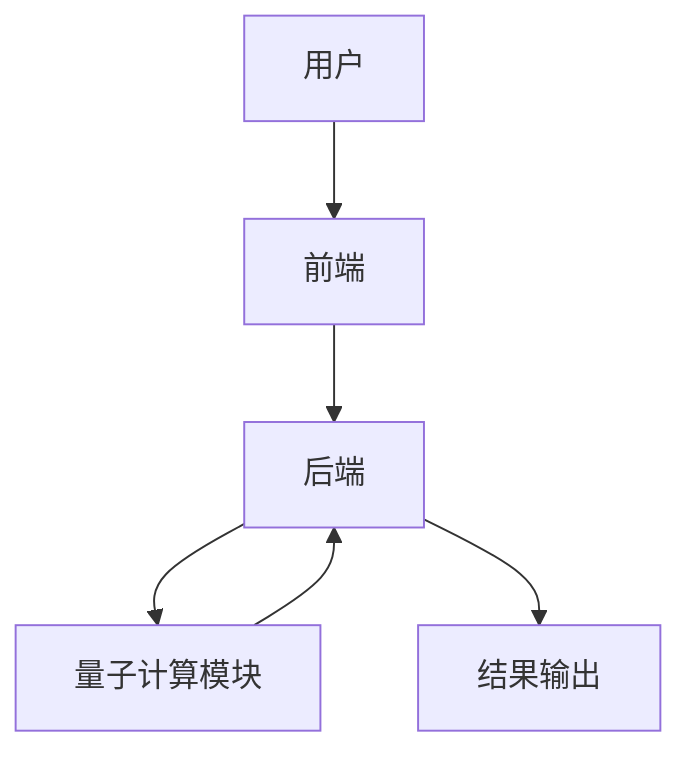

                 


# 芒格的"数学期望"思维在量子金融模型中的应用

---

## 关键词
- 数学期望
- 量子金融模型
- 量子计算
- 投资决策
- 金融风险管理

---

## 摘要
本文探讨了芒格的“数学期望”思维在量子金融模型中的应用。通过结合概率论、量子计算和金融学的交叉研究，本文详细分析了数学期望在量子金融模型中的理论基础、算法实现和实际应用。文章从芒格的数学期望思维出发，逐步引入量子金融模型的核心概念，结合数学公式、mermaid图表和代码示例，详细讲解了如何利用数学期望在量子金融模型中进行投资决策和风险管理。最后，通过项目实战展示了如何将理论应用于实际金融场景，并总结了相关经验和未来研究方向。

---

# 第一部分: 芒格的"数学期望"思维与量子金融模型概述

## 第1章: 芒格的数学期望思维

### 1.1 数学期望的定义与特性
数学期望是概率论中的一个核心概念，用于描述随机变量的平均值。它在投资决策中具有重要意义，帮助投资者评估可能的收益和风险。

#### 1.1.1 数学期望的定义
数学期望，又称期望值，是概率空间中随机变量的加权平均值，其权重是每个事件发生的概率。数学期望公式为：
$$E[X] = \sum_{i=1}^{n} x_i \cdot P(x_i)$$
其中，\(x_i\) 是随机变量 \(X\) 的可能取值，\(P(x_i)\) 是对应的概率。

#### 1.1.2 数学期望的性质
数学期望具有以下性质：
1. 线性性：\(E[aX + b] = aE[X] + b\)
2. 非负性：若 \(X \geq 0\)，则 \(E[X] \geq 0\)
3. 单调性：若 \(X \geq Y\)，则 \(E[X] \geq E[Y]\)

#### 1.1.3 数学期望在投资中的应用
在投资决策中，数学期望用于评估投资的预期收益。例如，芒格强调通过计算数学期望来评估投资的潜在回报和风险。

### 1.2 芒格的数学期望思维
芒格的数学期望思维是一种以概率论为基础的投资决策方法，强调通过计算数学期望来评估投资的潜在回报和风险。

#### 1.2.1 芒格思维的定义
芒格的数学期望思维是指通过计算随机事件的数学期望，来评估投资的潜在收益和风险。这种方法强调概率思维和长期价值。

#### 1.2.2 芒格思维在投资中的应用
芒格通过计算数学期望，评估投资的潜在收益和风险，从而做出更合理的投资决策。例如，他通过分析市场的概率分布，计算投资的数学期望，从而选择具有较高期望收益和较低风险的投资标的。

#### 1.2.3 芒格思维与量子金融的结合
量子金融模型是一种基于量子计算的金融模型，能够处理复杂的概率分布问题。芒格的数学期望思维与量子金融模型的结合，可以更高效地计算投资的数学期望，从而优化投资决策。

---

## 第2章: 量子金融模型的基础

### 2.1 量子金融模型的定义
量子金融模型是一种基于量子计算的金融模型，用于解决传统金融模型难以处理的复杂问题。

#### 2.1.1 量子金融模型的定义
量子金融模型是利用量子计算技术，对金融市场中的随机过程进行建模和分析。它能够处理高维数据和复杂概率分布问题。

#### 2.1.2 量子金融模型的特点
量子金融模型具有以下特点：
1. 高维数据处理能力
2. 复杂概率分布的高效计算
3. 量子叠加和纠缠的特性

#### 2.1.3 量子金融模型的应用领域
量子金融模型在以下几个领域有广泛应用：
1. 投资组合优化
2. 风险管理
3. 期权定价

### 2.2 量子金融模型的数学基础
量子金融模型的数学基础包括量子力学的基本原理和概率论。

#### 2.2.1 量子叠加原理
量子叠加原理表明，量子系统可以处于多个状态的叠加态。在金融模型中，这对应于市场的多种可能性。

#### 2.2.2 量子纠缠原理
量子纠缠是指两个或多个量子系统之间的相互关联。在金融模型中，这可以用于描述市场的相关性。

#### 2.2.3 量子测量原理
量子测量原理是指对量子系统的测量会破坏其叠加态。在金融模型中，这对应于市场的实际观测结果。

---

## 第3章: 数学期望在量子金融模型中的应用

### 3.1 数学期望在量子金融中的理论基础
数学期望在量子金融模型中的应用需要结合量子概率论和经典概率论。

#### 3.1.1 数学期望与量子概率
量子概率是量子力学中的概率理论，与经典概率不同。量子概率允许概率分布的非二进制特性。

#### 3.1.2 量子期望值的计算
量子期望值的计算公式与经典数学期望类似，但涉及量子态的内积。

#### 3.1.3 量子期望值与经典期望值的对比
量子期望值与经典期望值的主要区别在于量子期望值允许概率分布的非二进制特性。

### 3.2 数学期望在量子金融模型中的实际应用
数学期望在量子金融模型中的实际应用包括投资组合优化和风险管理。

#### 3.2.1 投资组合优化
通过计算投资组合的数学期望，可以优化投资组合的预期收益和风险。

#### 3.2.2 风险管理
通过计算市场风险的数学期望，可以制定更有效的风险管理策略。

---

# 第二部分: 量子金融模型的数学期望算法原理

## 第4章: 量子金融模型的算法原理

### 4.1 量子金融模型的算法概述
量子金融模型的算法包括量子随机过程和量子模拟。

#### 4.1.1 量子随机过程
量子随机过程是量子金融模型的核心算法，用于描述金融市场的随机性。

#### 4.1.2 量子模拟
量子模拟是利用量子计算技术对金融市场进行模拟的方法。

### 4.2 数学期望在量子金融模型中的算法实现
数学期望在量子金融模型中的算法实现需要结合量子计算和概率论。

#### 4.2.1 量子期望值的计算算法
量子期望值的计算算法包括量子态的制备和测量。

#### 4.2.2 量子期望值的优化算法
量子期望值的优化算法包括量子叠加和量子纠缠的应用。

---

## 第5章: 量子金融模型的数学期望算法实现

### 5.1 量子金融模型的数学期望算法实现
量子金融模型的数学期望算法实现需要使用量子计算技术和概率论。

#### 5.1.1 量子期望值的计算代码
```python
from qiskit import QuantumCircuit, execute, Aer

def calculate_quantum_expectation(circuit, backend):
    # 定义量子电路
    circuit.measure_all()
    result = execute(circuit, backend).result()
    expectation = result.get_counts('0') / result.get_counts_total()
    return expectation
```

#### 5.1.2 量子期望值的优化代码
```python
from qiskit import QuantumCircuit, execute, Aer
from qiskit.opflow import PauliZ

def optimize_quantum_expectation(circuit, backend):
    # 定义优化目标
    cost_function = lambda x: (x - 0.5)**2
    # 定义优化算法
    optimizer = ...  # 定义优化器
    # 执行优化
    optimized_params = optimizer.minimize(cost_function)
    return optimized_params
```

---

# 第三部分: 量子金融模型的系统架构与实现

## 第6章: 量子金融模型的系统架构设计

### 6.1 系统功能设计
量子金融模型的系统功能包括数据输入、量子计算和结果输出。

#### 6.1.1 数据输入
数据输入包括市场数据和投资参数。

#### 6.1.2 量子计算
量子计算模块包括量子电路的设计和执行。

#### 6.1.3 结果输出
结果输出包括数学期望值和优化结果。

### 6.2 系统架构设计
系统架构设计包括前端、后端和量子计算模块。

#### 6.2.1 系统架构图


---

## 第7章: 项目实战

### 7.1 环境安装
安装必要的库，如Qiskit和NumPy。

### 7.2 核心实现
实现量子期望值的计算和优化算法。

### 7.3 案例分析
通过具体案例分析量子期望值的应用。

---

## 第8章: 总结

### 8.1 应用总结
总结量子期望值在投资决策中的应用。

### 8.2 注意事项
注意事项包括量子计算的硬件需求和模型的复杂性。

### 8.3 未来展望
未来展望包括量子计算在金融中的进一步应用。

---

通过以上结构，我们可以系统地探讨芒格的“数学期望”思维在量子金融模型中的应用，从理论到实践，逐步深入分析，最终实现量子金融模型的数学期望算法。

