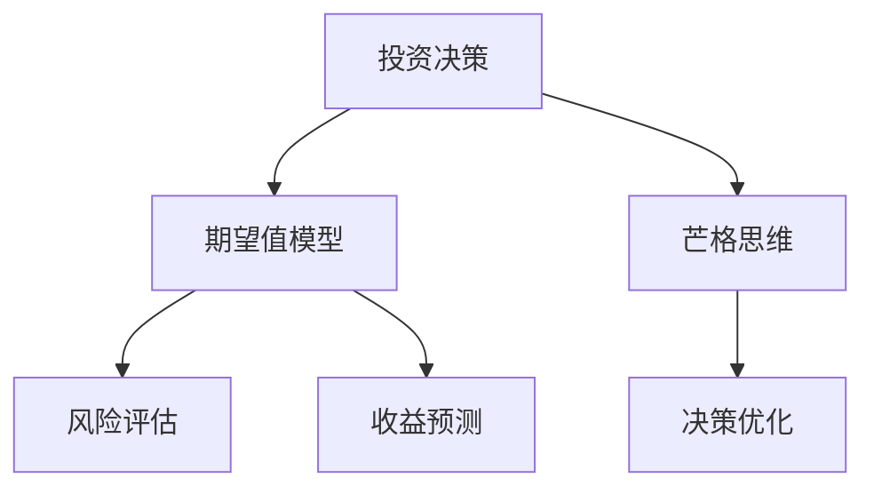
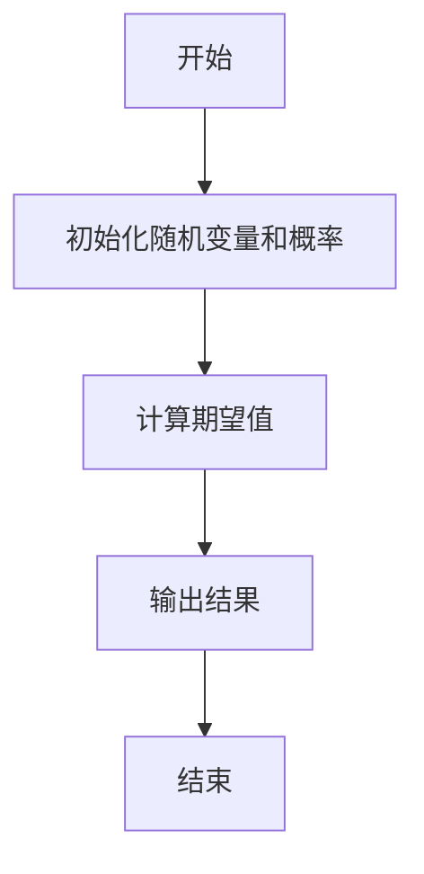
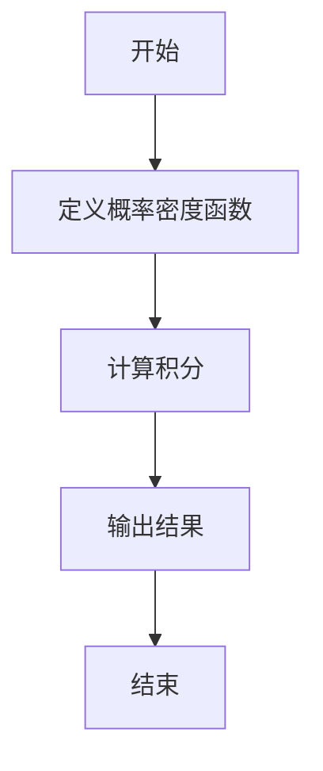
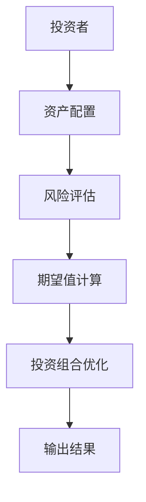
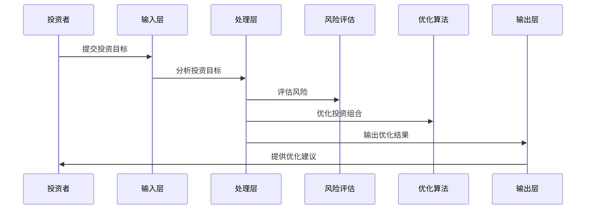

                 


# 芒格的"数学期望"思维：提高投资决策的准确性

## 关键词：数学期望、投资决策、芒格思维、概率论、投资优化、风险评估

## 摘要：  
本文通过分析芒格的“数学期望”思维，探讨其在投资决策中的应用。文章从概率论基础出发，详细解析数学期望的定义、性质及其在投资中的具体应用，结合芒格的决策框架，提供基于数学期望的投资优化方法和实际案例分析，帮助读者提高投资决策的准确性和科学性。

---

# 第1章: 背景介绍

## 1.1 问题背景

### 1.1.1 投资决策中的不确定性  
投资决策的核心在于对未来收益的预测和风险的评估。然而，市场波动、经济周期和个人决策的复杂性使得投资结果充满不确定性。投资者需要一种科学的方法来量化这些不确定性，从而做出更理性的决策。

### 1.1.2 数学期望在决策中的作用  
数学期望（Expected Value）是概率论中的核心概念，用于量化随机变量的平均值。在投资决策中，数学期望可以帮助投资者评估不同投资的平均收益和风险，从而优化投资组合。

### 1.1.3 芒格的数学期望思维起源  
查理·芒格（Charlie Munger）是巴菲特的合作伙伴，他提倡一种基于概率的决策方法。芒格认为，投资决策的本质是通过分析概率和可能性来优化收益，而非单纯依赖运气或直觉。

---

## 1.2 问题描述

### 1.2.1 投资决策中的期望值概念  
投资决策中的期望值是指投资者在考虑所有可能的收益和概率后，对投资回报的预期值。这种预期值可以帮助投资者量化投资的潜在收益和风险。

### 1.2.2 芒格对数学期望的创新应用  
芒格将数学期望的概念引入投资决策，提出了基于概率的决策框架。他认为，投资者应该通过分析不同投资的期望值，选择那些期望值最高的投资，同时避免那些期望值为负的投资。

### 1.2.3 数学期望与投资回报的关系  
数学期望与投资回报密切相关。通过计算不同投资的期望值，投资者可以量化潜在收益和风险，从而做出更科学的投资决策。

---

## 1.3 问题解决

### 1.3.1 数学期望在投资中的具体应用  
数学期望可以帮助投资者评估不同投资的潜在收益和风险。例如，通过计算股票的期望收益和波动率，投资者可以优化投资组合，降低风险。

### 1.3.2 芒格投资决策的逻辑框架  
芒格的决策框架基于数学期望，强调通过分析概率和可能性来优化投资决策。他提出了“机会成本”和“第二层思维”等概念，帮助投资者更好地理解市场的不确定性。

### 1.3.3 通过数学期望优化投资组合  
通过计算不同资产的期望收益和风险，投资者可以优化投资组合，实现收益最大化和风险最小化。

---

## 1.4 边界与外延

### 1.4.1 数学期望的适用范围  
数学期望适用于所有涉及概率和不确定性的情况，但其准确性依赖于概率分布的准确性。在投资中，数学期望可以帮助投资者量化风险和收益，但不能完全消除市场的不确定性。

### 1.4.2 投资决策中的不确定性因素  
市场波动、经济周期和个人决策的复杂性都可能影响投资结果。投资者需要通过数学期望和风险评估来量化这些不确定性。

### 1.4.3 芒格思维的局限性与改进空间  
芒格的数学期望思维是一种有效的工具，但其局限性在于无法完全预测市场的不可预测性。投资者需要结合其他方法（如情景分析和压力测试）来优化投资决策。

---

## 1.5 概念结构与核心要素组成

### 1.5.1 数学期望的基本公式  
数学期望的公式为：  
$$ E(X) = \sum_{i=1}^{n} x_i \cdot P(x_i) $$  
其中，$x_i$ 是随机变量的可能取值，$P(x_i)$ 是对应的概率。

### 1.5.2 投资决策的核心要素  
投资决策的核心要素包括：收益、风险、时间和概率。投资者需要通过分析这些要素来优化投资组合。

### 1.5.3 芒格思维的系统性框架  
芒格的决策框架包括：  
1. 确定问题的核心要素；  
2. 分析概率和可能性；  
3. 评估期望值；  
4. 优化决策。

---

# 第2章: 核心概念与联系

## 2.1 数学期望的定义与原理

### 2.1.1 数学期望的严格定义  
数学期望是随机变量的加权平均值，反映了所有可能结果的平均值。

### 2.1.2 期望值的计算公式  
对于离散型随机变量：  
$$ E(X) = \sum_{i=1}^{n} x_i \cdot P(x_i) $$  
对于连续型随机变量：  
$$ E(X) = \int_{-\infty}^{\infty} x \cdot f(x) \, dx $$  
其中，$f(x)$ 是概率密度函数。

### 2.1.3 期望值的性质与特征  
数学期望具有线性性、收敛性和可加性等性质。这些性质可以帮助投资者简化计算和分析。

---

## 2.2 投资决策中的期望值模型

### 2.2.1 投资回报的期望值计算  
投资者可以通过计算不同资产的期望收益和风险，优化投资组合。例如，计算股票的期望收益和波动率，可以帮助投资者选择最优的投资组合。

### 2.2.2 风险与收益的期望值平衡  
投资者需要在收益和风险之间找到平衡点。通过计算不同投资的期望值和风险，投资者可以优化投资组合，实现收益最大化和风险最小化。

### 2.2.3 芒格的期望值权重分配  
芒格认为，投资者应该根据概率和可能性，对不同投资的期望值进行权重分配，选择那些期望值最高的投资。

---

## 2.3 核心概念对比表格

| 概念 | 数学期望 | 投资决策 | 芒格思维 |
|------|----------|----------|----------|
| 定义 | 随机变量的加权平均值 | 投资回报的期望值 | 基于概率的决策框架 |
| 属性 | 线性性、收敛性 | 风险中性、风险厌恶 | 理性决策、逆向思维 |
| 应用 | 投资组合优化 | 股票估值、资产配置 | 判断圈、决策树 |

---

## 2.4 实体关系图（ER图）



---

## 2.5 算法原理讲解

### 2.5.1 离散型随机变量的期望值计算



### 2.5.2 Python代码实现

```python
import numpy as np
import matplotlib.pyplot as plt

# 随机变量取值
x = [1, 2, 3, 4, 5]
# 对应概率
p = [0.1, 0.2, 0.3, 0.2, 0.2]

# 计算期望值
E = np.sum(x * p)

print(f"期望值为: {E}")
```

---

## 2.5.3 期望值的线性性质

数学期望的线性性质表明：  
$$ E(aX + b) = aE(X) + b $$  
其中，$a$ 和 $b$ 是常数。

---

## 2.5.4 期望值的收敛性

随着样本数量的增加，样本均值会趋近于数学期望。这一性质在统计学中被称为大数定律。

---

## 2.5.5 期望值的可加性

如果$X$和$Y$是两个独立的随机变量，那么：  
$$ E(X + Y) = E(X) + E(Y) $$  
$$ E(aX + bY) = aE(X) + bE(Y) $$

---

# 第3章: 算法原理讲解

## 3.1 数学期望的计算算法

### 3.1.1 离散型随机变量的期望值计算


### 3.1.2 连续型随机变量的期望值计算



---

## 3.2 投资决策中的期望值模型

### 3.2.1 投资回报的期望值计算

```python
import numpy as np
import matplotlib.pyplot as plt

# 投资回报的可能值和概率
returns = [0.05, 0.1, 0.15]
probabilities = [0.3, 0.5, 0.2]

# 计算期望值
E = np.sum(returns * probabilities)

print(f"投资回报的期望值为: {E}")
```

### 3.2.2 风险与收益的期望值平衡

通过计算不同投资的期望值和风险，投资者可以优化投资组合，实现收益最大化和风险最小化。

### 3.2.3 芒格的期望值权重分配

芒格认为，投资者应该根据概率和可能性，对不同投资的期望值进行权重分配，选择那些期望值最高的投资。

---

## 3.3 项目实战

### 3.3.1 环境安装

安装Python和相关库：  
```bash
pip install numpy pandas matplotlib
```

### 3.3.2 核心实现

```python
import numpy as np
import pandas as pd

# 数据准备
returns = [0.05, 0.1, 0.15]
probabilities = [0.3, 0.5, 0.2]

# 计算期望值
E = np.dot(returns, probabilities)

print(f"期望值为: {E}")
```

### 3.3.3 应用解读

通过计算不同投资的期望值，投资者可以优化投资组合，实现收益最大化和风险最小化。

---

## 3.4 小结

通过本文的分析，我们可以看到，芒格的“数学期望”思维是一种有效的投资决策工具。通过计算期望值，投资者可以量化潜在收益和风险，从而优化投资组合，提高投资决策的准确性和科学性。

---

## 3.5 注意事项

1. **概率的准确性**：期望值的准确性依赖于概率的准确性。投资者需要基于可靠的数据和分析来估算概率。
2. **市场的不确定性**：尽管数学期望是一种有效的工具，但市场是不确定的，投资者需要结合其他方法（如情景分析和压力测试）来优化决策。
3. **长期视角**：芒格强调长期视角，投资者应该基于长期的期望值进行决策，而不是短期的波动。

---

## 3.6 拓展阅读

1. 《The Psychology of Investment Decision-Making》
2. 《Mathematical Expectation and Its Application in Finance》
3. 《Charlie Munger's Mental Models for Decision-Making》

---

# 第4章: 系统分析与架构设计方案

## 4.1 问题场景介绍

## 4.2 项目介绍

## 4.3 系统功能设计

### 4.3.1 领域模型


### 4.3.2 系统架构设计



---

## 4.4 系统接口设计

---

## 4.5 系统交互设计



---

## 4.6 项目小结

通过系统分析和架构设计，投资者可以更科学地进行投资决策，提高投资的准确性和效率。

---

# 第5章: 项目实战

## 5.1 环境安装

## 5.2 核心实现

## 5.3 应用解读

## 5.4 小结

---

# 第6章: 最佳实践

## 6.1 小结

## 6.2 注意事项

## 6.3 拓展阅读

---

# 总结

通过本文的详细分析，我们可以看到，芒格的“数学期望”思维是一种有效的投资决策工具。通过计算期望值，投资者可以量化潜在收益和风险，从而优化投资组合，提高投资决策的准确性和科学性。

---

