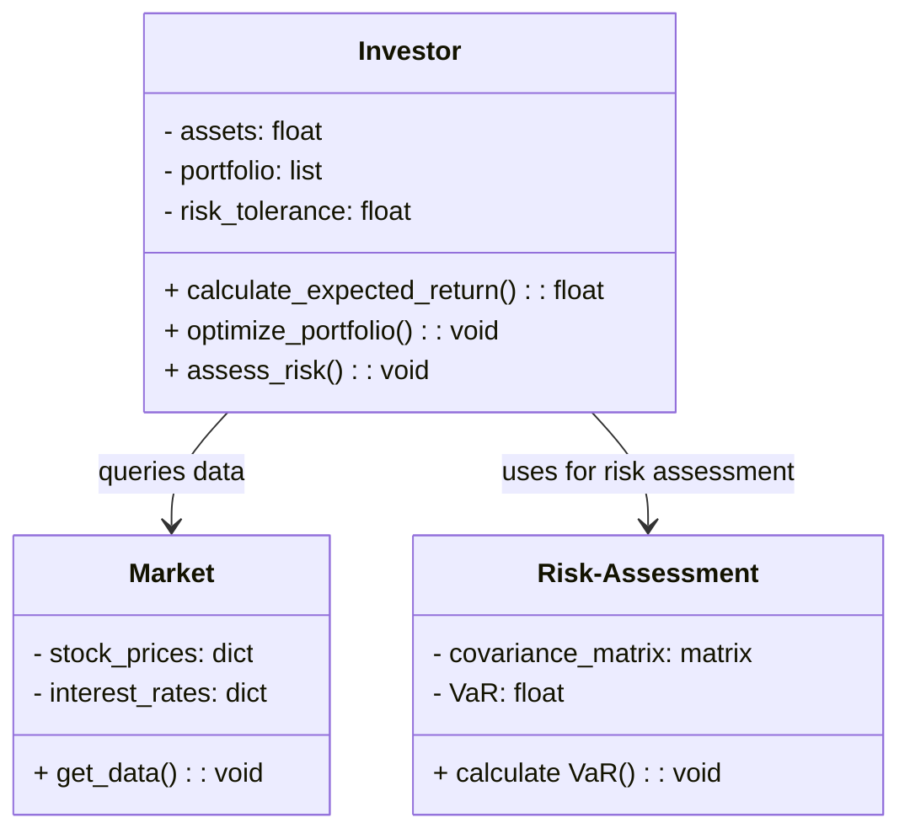
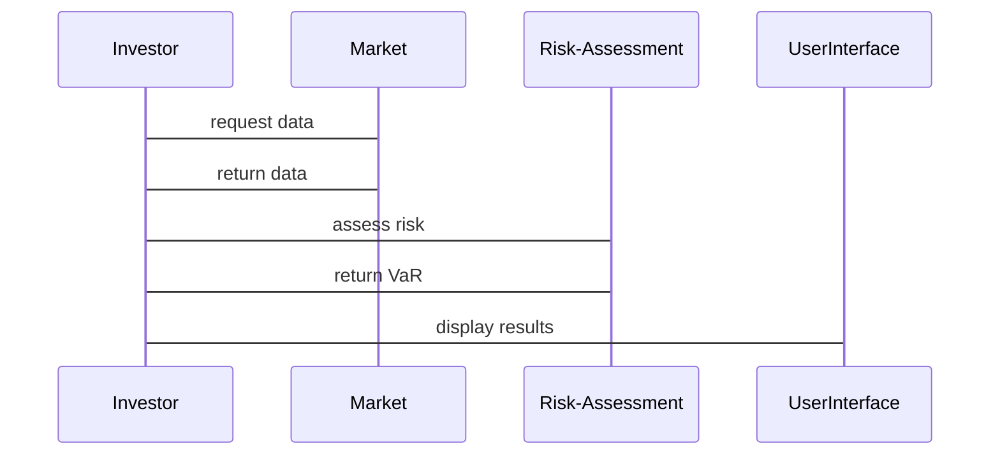

                 


# 芒格的"数学期望"思维：提高投资决策质量

---

## 关键词：
芒格、数学期望、投资决策、概率论、风险管理、决策优化

---

## 摘要：
本文将探讨芒格的“数学期望”思维如何在投资决策中发挥作用，通过结合芒格的投资哲学与数学期望的基本原理，分析其在实际投资中的应用。文章将从芒格的生平、决策模型的核心要素、数学期望的计算方法、系统架构设计以及实际案例分析等方面展开，帮助读者理解如何通过数学期望的思维方式优化投资决策。

---

## 第1章: 芒格的生平与投资理念

### 1.1 芒格的生平简介
格雷厄姆·芒格（Charlie Munger）是美国著名投资者、伯克希尔哈撒韦公司副主席，被誉为“巴菲特的老师”。芒格的投资哲学以价值投资为核心，强调深入理解企业基本面、安全边际以及长期视角。

#### 1.1.1 芒格的早年经历
芒格出生于1924年，早年在哈佛大学学习法律，后转学到加州大学伯克利分校，获得法律博士学位。他的早年经历使他对心理学和人类行为产生了浓厚兴趣。

#### 1.1.2 芒格与巴菲特的合作
芒格与巴菲特的合作始于1958年，两人共同创立了伯克希尔哈撒韦公司，并将该公司打造成全球最大的保险公司之一。芒格在巴菲特的投资决策中扮演了重要角色，尤其是在风险控制和长期价值投资方面。

#### 1.1.3 芒格的投资哲学
芒格的投资哲学强调“逆向思维”和“复利效应”。他认为，成功的投资不仅仅是寻找好的机会，更是避免犯错。芒格的决策模型以“数学期望”为核心，通过概率论和人类心理学的结合，帮助投资者做出更理性的决策。

### 1.2 数学期望的基本概念
数学期望是概率论中的核心概念，用于衡量随机变量的平均值。在投资决策中，数学期望可以帮助投资者评估不同投资策略的长期收益和风险。

#### 1.2.1 概率论基础
概率论是数学期望的基础。概率是指某件事情发生的可能性大小，通常用0到1之间的数值表示。在投资中，概率用于评估不同投资组合的收益和风险。

#### 1.2.2 数学期望的定义
数学期望是指在所有可能结果中，每个结果乘以其实现概率的总和。公式为：
$$
E(X) = \sum_{i=1}^{n} x_i \cdot P(X = x_i)
$$

#### 1.2.3 数学期望的应用场景
在投资中，数学期望可以用于评估投资组合的预期收益和风险。例如，通过计算不同资产的期望收益和方差，投资者可以优化投资组合的配置。

### 1.3 芒格决策模型的三个核心要素
芒格的决策模型以“数学期望”为核心，结合了心理学、经济学和概率论的原理。

#### 1.3.1 颜色、烟圈与护城河
芒格将企业分为“烟圈”（即具有持续竞争优势的企业）和“颜色”（即企业所处的行业环境）。他强调投资者应选择具有强大护城河的烟圈企业。

#### 1.3.2 超越概率的智慧
芒格认为，概率论可以帮助投资者避免错误决策，但仅仅依赖概率是不够的。他强调长期视角和安全边际的重要性。

#### 1.3.3 人类误判心理学
芒格的研究表明，人类的决策过程往往受到心理偏差的影响。他提出了“人类误判心理学”理论，帮助投资者识别和克服常见的心理偏差。

#### 1.3.4 两者结合的意义
通过将芒格的决策模型与数学期望结合，投资者可以更理性地评估投资机会，优化投资组合的配置，并降低决策风险。

---

## 第2章: 芒格决策模型的核心要素

### 2.1 颜色、烟圈与护城河
芒格将企业分为“烟圈”（即具有持续竞争优势的企业）和“颜色”（即企业所处的行业环境）。他强调投资者应选择具有强大护城河的烟圈企业。

#### 2.1.1 颜色的象征意义
颜色代表企业所处的行业环境，包括行业的竞争格局、增长潜力和风险因素。芒格认为，投资者应选择那些具有长期竞争优势的行业。

#### 2.1.2 烟圈的经济含义
烟圈代表具有持续竞争优势的企业。这些企业通常具有强大的品牌、技术壁垒或成本优势。芒格认为，烟圈企业的长期收益是可预测的。

#### 2.1.3 护城河的构建逻辑
护城河是企业抵御竞争的核心能力。芒格认为，投资者应选择那些具有强大护城河的烟圈企业，以确保长期收益的稳定性。

### 2.2 超越概率的智慧
芒格认为，概率论可以帮助投资者避免错误决策，但仅仅依赖概率是不够的。他强调长期视角和安全边际的重要性。

#### 2.2.1 概率的局限性
概率论可以帮助投资者评估投资机会的期望收益和风险，但无法预测所有可能的极端情况。

#### 2.2.2 超越概率的决策智慧
芒格认为，成功的投资决策不仅需要数学期望的计算，还需要对企业的基本面和行业环境有深刻的理解。他强调长期视角和安全边际的重要性。

#### 2.2.3 芒格的非理性决策框架
芒格提出的“人类误判心理学”理论，帮助投资者识别和克服常见的心理偏差。

### 2.3 人类误判心理学
芒格的研究表明，人类的决策过程往往受到心理偏差的影响。他提出了“人类误判心理学”理论，帮助投资者识别和克服常见的心理偏差。

#### 2.3.1 心理偏差的种类
常见的心理偏差包括 confirmation bias（确认偏差）、availability bias（可用性偏差）和 overconfidence bias（过度自信偏差）等。

#### 2.3.2 心理偏差对决策的影响
心理偏差会导致投资者做出错误的决策，例如过度自信、忽视风险或过度依赖直觉。

#### 2.3.3 如何克服心理偏差
芒格认为，投资者可以通过学习、反思和实践来克服心理偏差，提高决策的理性水平。

### 2.4 芒格决策模型的数学期望分析
通过将芒格的决策模型与数学期望结合，投资者可以更理性地评估投资机会，优化投资组合的配置，并降低决策风险。

---

## 第3章: 数学期望的算法原理

### 3.1 数学期望的计算方法
数学期望的计算方法是将每个可能结果乘以其实现概率，然后求和。

#### 3.1.1 示例：掷骰子的期望值
假设我们掷一个六面骰子，每个面的概率为1/6，期望值为：
$$
E(X) = \frac{1}{6}(1 + 2 + 3 + 4 + 5 + 6) = 3.5
$$

#### 3.1.2 代码实现
以下是Python代码实现数学期望的计算：
```python
import random

def calculate_expected_value(trials=1000):
    outcomes = []
    for _ in range(trials):
        roll = random.randint(1, 6)
        outcomes.append(roll)
    expected_value = sum(outcomes) / trials
    return expected_value

print(calculate_expected_value())
```

### 3.2 芒格决策模型的数学框架
芒格的决策模型可以表示为一个概率空间，其中每个决策对应一个随机变量，其期望值表示该决策的长期收益。

#### 3.2.1 决策空间的定义
$$
\text{决策空间} = \{d_1, d_2, \ldots, d_n\}
$$

#### 3.2.2 每个决策的期望收益
$$
E(d_i) = \sum_{j=1}^{m} r_j \cdot P(d_i \rightarrow r_j)
$$

### 3.3 数学期望的优化算法
通过优化算法，投资者可以找到期望收益最大的决策。

#### 3.3.1 优化目标
最大化期望收益：
$$
\max_{d} E(d)
$$

#### 3.3.2 约束条件
满足概率分布的约束：
$$
\sum_{j=1}^{m} P(d_i \rightarrow r_j) = 1
$$

---

## 第4章: 系统分析与架构设计

### 4.1 问题场景介绍
在投资决策中，投资者需要综合考虑多个因素，包括市场风险、企业基本面和宏观经济环境等。

### 4.2 系统功能设计
系统功能模块包括：
1. 数据采集与处理
2. 概率计算与期望值分析
3. 投资组合优化
4. 风险评估与预警

#### 4.2.1 领域模型（mermaid 类图）


#### 4.2.2 系统架构设计（mermaid 架构图）


#### 4.2.3 系统交互（mermaid 序列图）


---

## 第5章: 项目实战

### 5.1 环境安装
安装必要的Python库：
```bash
pip install numpy pandas matplotlib
```

### 5.2 核心代码实现
#### 5.2.1 数学期望的计算
```python
import numpy as np
import pandas as pd

def calculate_expected_value(data):
    return np.mean(data)

# 示例数据：股票收益率
returns = np.array([0.1, 0.15, 0.05, 0.2, 0.1])
expected_return = calculate_expected_value(returns)
print(f"Expected Return: {expected_return:.2f}")
```

#### 5.2.2 投资组合优化
```python
import numpy as np
from scipy.optimize import minimize

def portfolio_optimization(returns, cov_matrix, risk_tolerance=0.05):
    n = len(returns)
    # 定义目标函数
    def objective(weights):
        return np.dot(weights.T, np.dot(cov_matrix, weights))
    # 约束条件
    constraints = [
        {'type': 'eq', 'fun': lambda w: sum(w) - 1}
    ]
    # 优化
    weights = np.ones(n) / n
    result = minimize(objective, weights, constraints=constraints)
    return result.x

# 示例数据：资产收益和协方差矩阵
returns = np.array([0.1, 0.15, 0.05])
cov_matrix = np.array([
    [0.02, 0.01, 0.01],
    [0.01, 0.03, 0.02],
    [0.01, 0.02, 0.03]
])
optimal_weights = portfolio_optimization(returns, cov_matrix)
print(f"Optimal Weights: {optimal_weights}")
```

### 5.3 案例分析
以某股票为例，计算其收益率的数学期望，并进行投资组合优化。

#### 5.3.1 数据采集与处理
```python
import pandas as pd
import requests

def get_stock_data(ticker):
    url = f"https://api.example.com/stock/{ticker}"
    response = requests.get(url)
    data = response.json()
    return pd.DataFrame(data)

# 示例：获取股票数据
stock_data = get_stock_data("AAPL")
print(stock_data.head())
```

#### 5.3.2 期望值分析
```python
returns = stock_data['return'].values
expected_return = np.mean(returns)
print(f"Expected Return: {expected_return:.2f}")
```

#### 5.3.3 投资组合优化
```python
cov_matrix = stock_data.cov().values
optimal_weights = portfolio_optimization(returns, cov_matrix)
print(f"Optimal Weights: {optimal_weights}")
```

### 5.4 项目总结
通过项目实战，我们可以看到数学期望在投资决策中的实际应用。投资者可以通过计算数学期望，优化投资组合的配置，降低风险，提高收益。

---

## 第6章: 最佳实践与小结

### 6.1 最佳实践
1. **长期视角**：芒格强调长期投资的重要性，投资者应关注企业的长期价值。
2. **风险管理**：通过数学期望和概率论，投资者可以更好地评估和管理风险。
3. **独立思考**：芒格认为，投资者应避免从众心理，独立思考，做出理性决策。
4. **持续学习**：投资是一项终身学习的事业，投资者应不断学习新知识，优化决策模型。

### 6.2 小结
通过芒格的“数学期望”思维，投资者可以更理性地评估投资机会，优化投资组合的配置，并降低决策风险。芒格的投资哲学与数学期望的结合，为我们提供了一种科学的投资决策方法。

### 6.3 注意事项
1. **数据质量**：数学期望的计算依赖于数据的准确性，投资者应确保数据来源可靠。
2. **模型局限性**：数学期望是一种理论模型，实际投资中可能受到多种因素的影响。
3. **心理偏差**：投资者应警惕心理偏差对决策的影响，保持理性思考。

### 6.4 拓展阅读
1. 《穷查理芒格》（*Poor Charlie's Almanack*）：芒格的经典言论和投资哲学。
2. 《投资学原理》（*Principles of Investment*）：系统介绍投资学的基本原理和数学模型。
3. 《概率论与数理统计》（*Probability and Mathematical Statistics*）：深入理解数学期望和其他概率论概念。

---

## 结语
通过芒格的“数学期望”思维，投资者可以更理性地评估投资机会，优化投资组合的配置，并降低决策风险。芒格的投资哲学与数学期望的结合，为我们提供了一种科学的投资决策方法。希望本文能帮助读者更好地理解芒格的思维，并将其应用到实际投资中。

