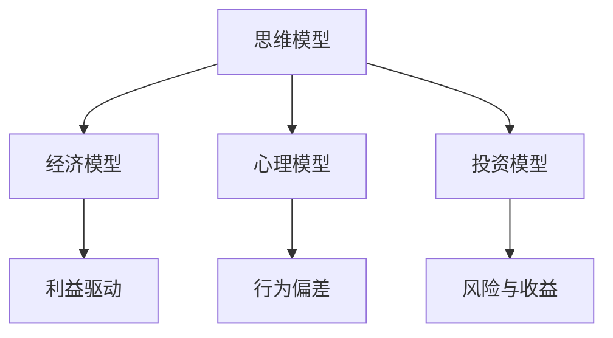
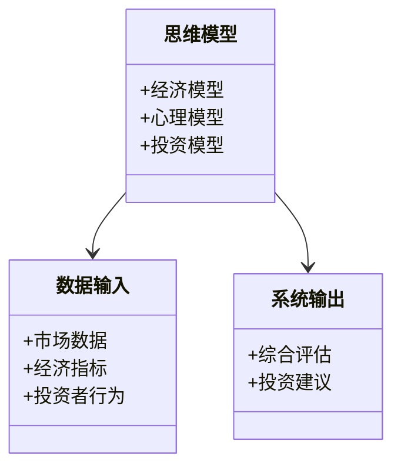
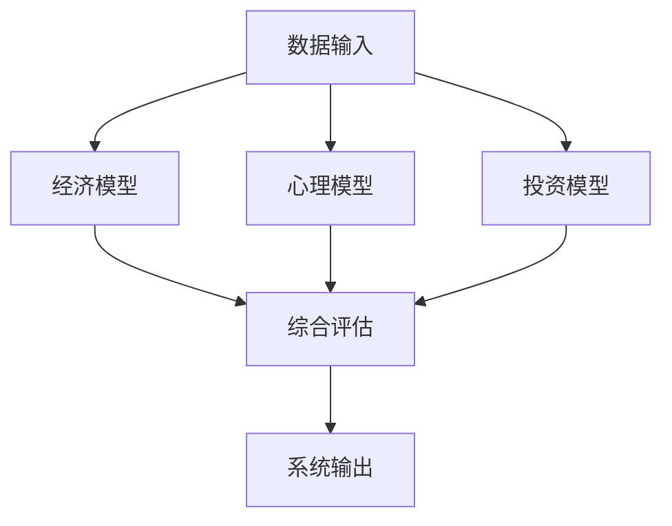
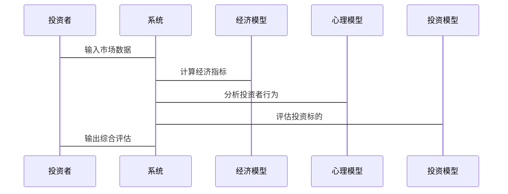

                 


# 芒格的"智力组合"理念：多元化思维在投资中的应用

> 关键词：芒格、智力组合、多元化思维、投资哲学、思维模型、系统架构

> 摘要：芒格的"智力组合"理念强调通过多元化思维模型来优化投资决策。本文从芒格的投资哲学出发，详细解析"智力组合"理念的核心概念，探讨其在投资中的应用，并结合算法原理和系统架构设计，提供实践指导和案例分析。通过本文，读者将全面理解"智力组合"理念的理论基础、数学模型、系统实现及其在投资中的实际应用。

---

# 第一部分: 芒格"智力组合"理念的背景与核心概念

## #1 芒格"智力组合"理念的背景与起源

### 1.1 芒格及其投资哲学概述

芒格是世界著名投资家巴菲特的导师，其投资哲学以"多元思维模型"为核心。芒格认为，投资者应该通过构建多个思维模型来优化决策过程，从而避免单一思维的局限性。

#### 1.1.1 芒格的生平简介

查理·芒格（Charlie Munger）出生于1924年，是美国著名投资家、作家和演讲家。他是巴菲特的导师，也是伯克希尔·哈撒韦公司的副主席。芒格的投资哲学和思维方式对全球投资者产生了深远影响。

#### 1.1.2 芒格的投资哲学核心思想

芒格的投资哲学强调"多元思维模型"，认为投资者应该通过跨学科的思维模型来优化决策。他主张将物理学、心理学、经济学等学科的原理应用于投资决策中。

#### 1.1.3 "智力组合"理念的提出背景

在传统的投资实践中，投资者往往依赖单一的分析框架，这可能导致决策偏差。芒格提出"智力组合"理念，旨在通过整合多个思维模型来提高投资决策的准确性。

### 1.2 "智力组合"理念的定义与特点

#### 1.2.1 什么是"智力组合"理念

"智力组合"理念是指通过构建多个跨学科的思维模型，将这些模型有机结合，以优化投资决策的过程。

#### 1.2.2 "智力组合"理念的核心特点

1. **跨学科性**：整合多个学科的思维模型，如经济学、心理学、物理学等。
2. **系统性**：将思维模型视为一个整体系统，而非独立的个体。
3. **动态性**：根据市场变化和实际情况，动态调整思维模型的权重。

#### 1.2.3 "智力组合"理念与传统投资理念的区别

传统的投资理念往往依赖单一的分析框架，而"智力组合"理念强调多元化的思维模型。传统投资理念可能忽略市场的复杂性，而"智力组合"理念则通过多维度的分析来捕捉市场的多面性。

### 1.3 "智力组合"理念的理论基础

#### 1.3.1 经济学基础

经济学基础包括市场均衡、供需关系等原理，帮助投资者理解市场的基本运作机制。

#### 1.3.2 心理学基础

心理学基础包括行为偏差、认知偏差等原理，帮助投资者理解投资者的心理行为。

#### 1.3.3 投资学基础

投资学基础包括资产定价、风险评估等原理，帮助投资者评估投资标的的价值。

---

## #2 "智力组合"理念的核心概念与联系

### 2.1 核心概念原理

#### 2.1.1 多元化思维模型的构成

多元化思维模型包括多个子模型，每个子模型代表一个特定的学科或领域的思维方式。

#### 2.1.2 思维模型的分类与特点

1. **经济学模型**：分析市场中的价格、供需关系等。
2. **心理学模型**：分析投资者的行为偏差。
3. **物理学模型**：分析系统的稳定性、复杂性等。

#### 2.1.3 思维模型之间的关系

思维模型之间相互关联，共同构成一个完整的分析框架。

### 2.2 核心概念属性特征对比表格

| 思维模型类型 | 核心特征 | 描述 |
|--------------|----------|------|
| 经济学模型    | 利益驱动 | 以利益最大化为目标 |
| 心理学模型    | 行为偏差 | 描述人类行为中的常见偏差 |
| 投资学模型    | 风险与收益 | 分析投资中的风险与收益关系 |

### 2.3 ER实体关系图架构



### 2.4 本章小结

本章从芒格的"智力组合"理念出发，详细介绍了其核心概念和理论基础。通过对比分析，明确了不同思维模型的特点及其在投资决策中的作用。

---

## #3 "智力组合"理念的算法原理讲解

### 3.1 算法原理概述

#### 3.1.1 多元化思维模型的算法特点

1. **多模型融合**：将多个思维模型的分析结果进行整合。
2. **动态调整**：根据市场变化动态调整各模型的权重。
3. **系统优化**：通过系统优化算法，提高投资决策的准确性。

#### 3.1.2 算法的核心思想

"智力组合"理念的算法核心在于通过多模型融合，实现对投资标的综合评估。

#### 3.1.3 算法的实现步骤

1. **构建多模型分析框架**：选择多个跨学科的思维模型。
2. **数据输入与模型计算**：将市场数据输入各模型进行计算。
3. **模型结果整合**：将各模型的分析结果进行整合，得出最终的投资决策。

### 3.2 算法原理的数学模型

#### 3.2.1 数学模型的定义

"智力组合"理念的数学模型通过加权平均的方式，将多个模型的分析结果进行整合。

#### 3.2.2 数学模型的公式推导

$$
\text{综合评估值} = \sum_{i=1}^{n} w_i \times r_i
$$

其中，\( w_i \) 表示第 \( i \) 个模型的权重，\( r_i \) 表示第 \( i \) 个模型的评估结果。

---

## #4 系统分析与架构设计方案

### 4.1 问题场景介绍

在实际投资中，投资者需要面对复杂的市场环境和多变的市场条件。传统的单一模型分析往往无法捕捉市场的多面性，容易导致决策偏差。

### 4.2 项目介绍

本项目旨在通过构建一个基于"智力组合"理念的多模型分析系统，帮助投资者优化投资决策。

### 4.3 系统功能设计

#### 4.3.1 领域模型设计



#### 4.3.2 系统架构设计



#### 4.3.3 系统接口设计

系统接口包括数据输入接口、模型计算接口和结果输出接口。

#### 4.3.4 系统交互设计



---

## #5 项目实战

### 5.1 环境安装

需要安装Python、numpy、pandas、matplotlib等库。

### 5.2 系统核心实现源代码

```python
import numpy as np
import pandas as pd
import matplotlib.pyplot as plt

def economic_model(data):
    # 经济模型计算
    return data['economic_indicators'].mean()

def psychological_model(data):
    # 心理模型计算
    return data['behavior'].std()

def investment_model(data):
    # 投资模型计算
    return data['market_data'].var()

def combined_model(data):
    # 多模型融合
    eco = economic_model(data)
    psy = psychological_model(data)
    inv = investment_model(data)
    weights = [0.4, 0.3, 0.3]
    return np.dot(weights, [eco, psy, inv])

# 示例数据
data = {
    'economic_indicators': [1.2, 1.3, 1.1],
    'behavior': [0.8, 0.9, 1.0],
    'market_data': [100, 105, 95]
}

result = combined_model(data)
print(f"综合评估值: {result}")
```

### 5.3 代码应用解读与分析

通过上述代码，我们可以看到"智力组合"理念如何通过多模型融合实现综合评估。每个模型的权重可以根据实际情况进行调整，以优化评估结果。

### 5.4 实际案例分析

以某股票为例，通过多模型融合分析，评估其投资价值。

### 5.5 项目小结

通过本项目实战，我们可以看到"智力组合"理念在实际投资中的应用价值。

---

## #6 最佳实践 tips

### 6.1 小结

芒格的"智力组合"理念通过多元化的思维模型优化投资决策，是值得投资者深入研究和实践的重要理念。

### 6.2 注意事项

1. **模型选择**：选择合适的模型，避免过多或过少。
2. **权重调整**：根据市场变化动态调整模型权重。
3. **数据质量**：确保输入数据的准确性和完整性。

### 6.3 拓展阅读

建议阅读芒格的《穷查理宝典》及相关文献，深入了解"智力组合"理念的细节。

---

# 结语

芒格的"智力组合"理念通过多元化思维模型优化投资决策，是投资领域的重要理论。通过本文的详细讲解，读者可以深入了解该理念的核心思想、数学模型和系统实现，并通过实际案例分析掌握其应用方法。未来的研究可以进一步探索如何将"智力组合"理念与人工智能技术结合，进一步提升投资决策的智能化水平。

