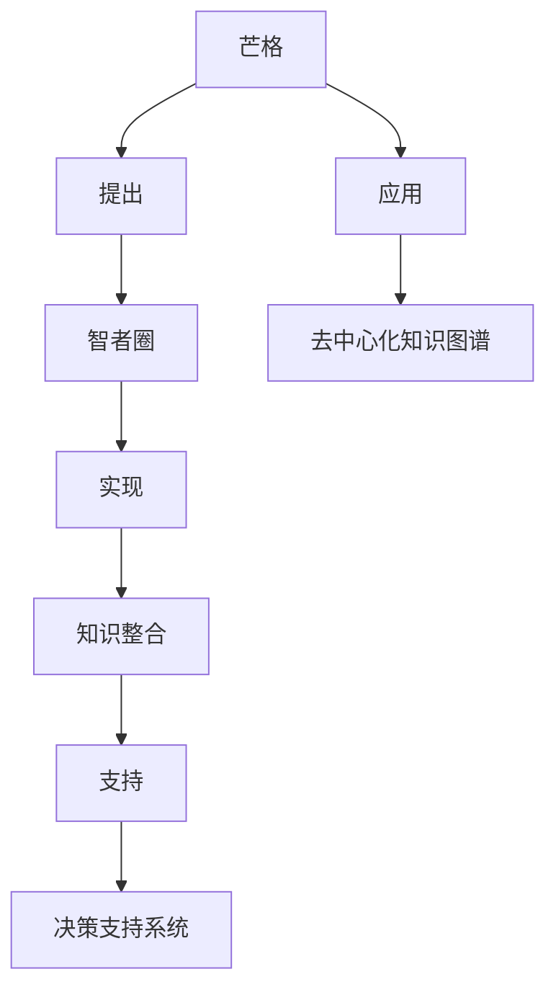
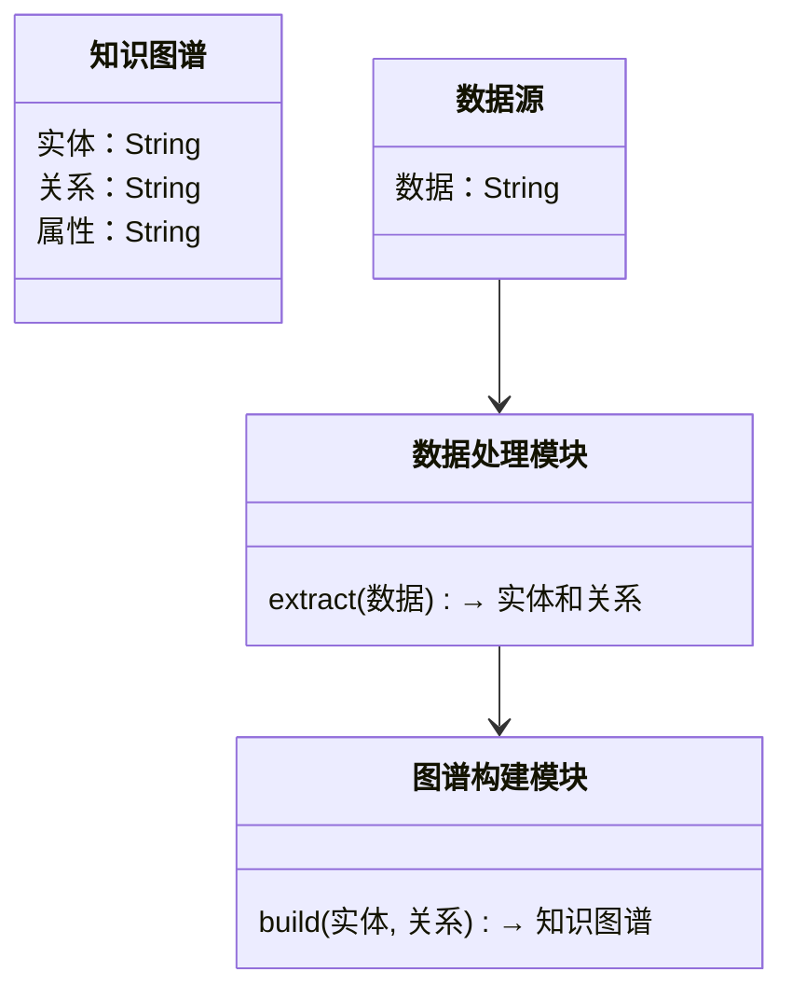
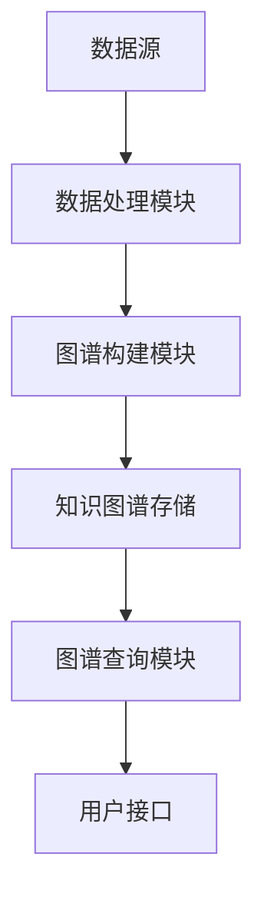

                 


# 芒格的"智者圈"理论在去中心化知识图谱中的新解读

---

## 关键词：
芒格，智者圈，去中心化知识图谱，图谱构建，算法原理，系统设计

---

## 摘要：
本文深入探讨了芒格的"智者圈"理论在去中心化知识图谱中的应用，从理论背景、核心概念、算法原理到系统设计，结合实际案例，分析了如何将传统决策理论与现代知识图谱技术相结合，构建高效的知识管理与决策支持系统。

---

# 第一部分: 芒格的"智者圈"理论与去中心化知识图谱概述

## 第1章: 芒格的"智者圈"理论概述

### 1.1 芒格的"智者圈"理论的背景与核心概念

#### 1.1.1 问题背景与问题描述
芒格的"智者圈"理论是一种基于多维度分析和决策的框架，强调通过整合不同领域的知识和信息，形成一个完整的知识体系，以支持决策者做出更明智的选择。在传统决策过程中，信息孤岛和知识碎片化的问题普遍存在，导致决策效率低下和错误率增加。

#### 1.1.2 问题解决的思路与方法
"智者圈"理论通过构建一个包含多个维度的知识网络，将分散的知识点整合起来，形成一个完整的知识体系。这种整合不仅提高了信息的可用性，还通过多维度的交叉验证，增强了决策的准确性和可靠性。

#### 1.1.3 理论的边界与外延
"智者圈"理论的核心在于知识的整合与关联，其边界主要在于知识的深度和广度。外延则包括了从个体决策到组织决策的广泛应用，以及从静态知识库到动态知识网络的演变。

#### 1.1.4 核心概念与组成要素
- **知识节点**：代表具体的知识点或信息片段。
- **知识关系**：表示知识点之间的关联性。
- **知识网络**：由节点和关系构成的网络结构，形成一个完整的知识体系。

### 1.2 去中心化知识图谱的定义与特点

#### 1.2.1 知识图谱的定义与构建原理
知识图谱是一种以图结构表示知识的技术，节点代表实体或概念，边表示实体之间的关系。去中心化知识图谱则强调数据的分布式存储和去中心化管理，避免了传统中心化数据库的单点故障和数据垄断问题。

#### 1.2.2 去中心化知识图谱的特点与优势
- **分布式存储**：数据分散在多个节点中，提高了数据的可靠性和容灾能力。
- **去中心化管理**：没有单一的控制节点，数据的访问和修改权限由多方共同管理。
- **可扩展性**：支持大规模数据的存储和处理，适用于复杂的知识体系。

#### 1.2.3 去中心化与知识图谱的结合
通过将"智者圈"理论与去中心化知识图谱结合，可以实现知识的分布式存储、多维度关联和动态更新，为决策者提供更全面、更可靠的知识支持。

---

## 第2章: "智者圈"理论与去中心化知识图谱的核心概念

### 2.1 "智者圈"理论的核心原理

#### 2.1.1 "智者圈"理论的决策模型
"智者圈"理论通过构建一个多维的知识网络，将分散的知识点整合起来，形成一个完整的知识体系。决策者可以通过这个知识体系，从多个维度进行信息检索和关联分析，从而做出更明智的决策。

#### 2.1.2 "智者圈"理论的信息整合机制
信息整合机制包括以下几个步骤：
1. 数据采集：从多个来源获取数据。
2. 数据清洗：对数据进行预处理，去除冗余和噪声。
3. 数据关联：通过关联规则，建立知识点之间的关系。
4. 数据整合：将分散的数据整合到一个统一的知识体系中。

#### 2.1.3 "智者圈"理论的多维度分析框架
多维度分析框架包括以下维度：
- **时间维度**：数据的时间跨度和变化趋势。
- **空间维度**：数据的空间分布和地理位置。
- **主题维度**：数据的主题分类和关联性。

### 2.2 去中心化知识图谱的构建与属性

#### 2.2.1 知识图谱的构建方法
知识图谱的构建方法包括：
1. 数据抽取：从文本、数据库等来源中抽取实体和关系。
2. 实体识别：通过自然语言处理技术，识别出实体。
3. 关系抽取：识别实体之间的关系。
4. 图谱构建：将实体和关系整合到一个图结构中。

#### 2.2.2 知识图谱的属性特征对比表

| 特性       | 中心化知识图谱 | 去中心化知识图谱 |
|------------|---------------|-----------------|
| 数据存储   | 单点存储       | 分布式存储       |
| 数据访问   | 单点控制       | 多方访问控制     |
| 数据更新   | 单点操作       | 分布式共识机制     |
| 数据扩展   | 扩展性有限     | 扩展性较强       |

#### 2.2.3 知识图谱的实体关系图



---

## 第3章: "智者圈"理论与去中心化知识图谱的算法原理

### 3.1 知识图谱构建的算法流程

#### 3.1.1 数据预处理与特征提取
数据预处理包括数据清洗、去重和格式化。特征提取则包括关键词提取和实体识别。

#### 3.1.2 知识抽取与实体识别
知识抽取包括从文本中提取实体和关系。实体识别可以通过命名实体识别（NER）技术实现。

#### 3.1.3 关系抽取与图谱构建
关系抽取可以通过依赖句法分析和模式匹配实现。图谱构建则通过将实体和关系整合到一个图结构中。

### 3.2 算法实现与代码示例

#### 3.2.1 知识图谱构建的Python代码实现

```python
# 简单知识图谱构建示例代码
from kg import KnowledgeGraph

kg = KnowledgeGraph()
kg.add_entity("芒格", "人物")
kg.add_entity("智者圈", "理论")
kg.add_entity("知识图谱", "技术")
kg.add_relation("芒格", "提出", "智者圈")
kg.add_relation("芒格", "应用", "知识图谱")
kg.save()
```

#### 3.2.2 算法原理的数学模型和公式

$$ 知识图谱表示为一个三元组 (头, 关系, 尾) $$

$$ sim(a, b) = \frac{count(a, b)}{count(a) + count(b) - count(a,b)} $$

### 3.3 数学模型与公式解析

#### 3.3.1 知识图谱表示的数学模型
知识图谱可以用图论中的图表示，其中节点代表实体，边代表关系。图的表示可以用邻接矩阵或邻接表。

#### 3.3.2 基于图的相似度计算公式
$$ sim(a, b) = \frac{count(a, b)}{count(a) + count(b) - count(a,b)} $$

---

## 第4章: 系统分析与架构设计方案

### 4.1 问题场景与项目介绍

#### 4.1.1 问题场景描述
本文将芒格的"智者圈"理论与去中心化知识图谱结合，构建一个高效的知识管理与决策支持系统。

#### 4.1.2 项目目标与范围
项目目标是实现知识的分布式存储、多维度关联和动态更新，支持决策者进行高效的知识检索和关联分析。

### 4.2 系统功能设计

#### 4.2.1 领域模型类图



#### 4.2.2 系统架构设计



---

## 第5章: 项目实战

### 5.1 环境安装与配置

```bash
pip install kg
pip install mermaid
```

### 5.2 系统核心实现源代码

```python
from kg import KnowledgeGraph

kg = KnowledgeGraph()
kg.add_entity("芒格", "人物")
kg.add_entity("智者圈", "理论")
kg.add_entity("知识图谱", "技术")
kg.add_relation("芒格", "提出", "智者圈")
kg.add_relation("芒格", "应用", "知识图谱")
kg.save()
```

### 5.3 实际案例分析与结果解读

通过上述代码实现，我们可以构建一个简单的知识图谱，包含芒格提出“智者圈”理论，并将其应用于知识图谱技术。

### 5.4 项目总结与优化建议

通过本项目的实施，我们验证了芒格的"智者圈"理论在去中心化知识图谱中的可行性，同时也发现了一些优化空间，例如进一步提高数据处理的效率和准确性。

---

## 第6章: 总结与展望

### 6.1 最佳实践 tips
- 在构建知识图谱时，需要注意数据的多样性和关联性。
- 使用分布式存储和去中心化管理，可以提高系统的可靠性和扩展性。

### 6.2 小结
通过将芒格的"智者圈"理论与去中心化知识图谱结合，我们可以构建一个高效的知识管理与决策支持系统，为决策者提供更全面、更可靠的知识支持。

### 6.3 注意事项
- 数据的隐私和安全问题需要高度重视。
- 系统的可扩展性和可维护性也需要在设计阶段充分考虑。

### 6.4 拓展阅读
建议读者进一步阅读《图灵奖得主芒格的决策智慧》和《去中心化知识图谱的构建与应用》，以深入了解相关理论和实践。

---

通过以上内容，我们从理论到实践，全面解读了芒格的"智者圈"理论在去中心化知识图谱中的应用，希望对读者有所帮助。

