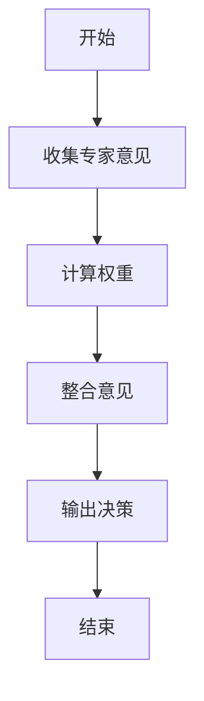
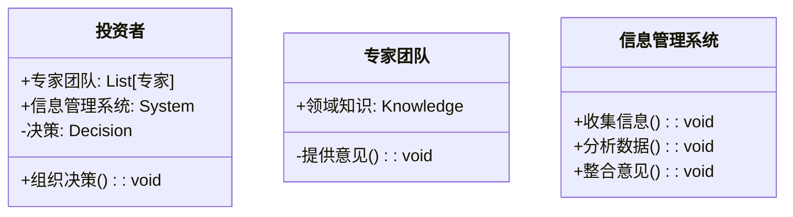
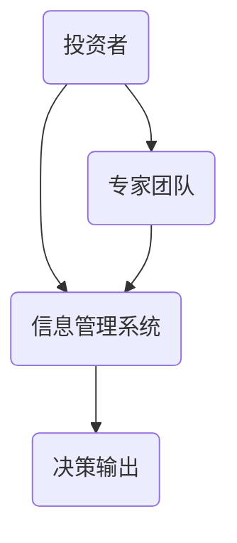
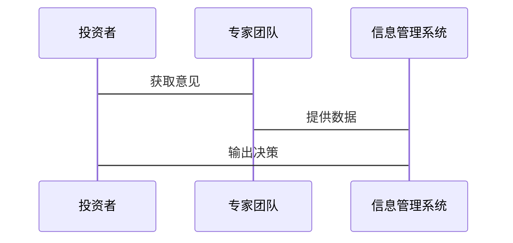

                 


# 芮格的"智者圈"理论：如何构建你的投资智囊团

## 关键词
芒格，智者圈，投资决策，群体智慧，算法原理，系统架构

## 摘要
本文深入探讨了芒格的“智者圈”理论，分析了其在投资决策中的应用。通过构建一个由智慧、可靠的人组成的“智者圈”，投资者能够获得更全面的决策支持。文章从理论基础、核心概念、算法原理、系统架构到项目实战，全面解析了“智者圈”的构建与应用，结合实际案例和代码实现，为投资者提供了实用的指导。

---

# 第一部分: 芮格的"智者圈"理论概述

## 第1章: 芮格的"智者圈"理论概述

### 1.1 芮格的生平与投资理念

#### 1.1.1 芮格的生平简介
查理·芒格（Charlie Munger）是世界著名投资者、伯克希尔·哈撒韦公司副董事长。他不仅是巴菲特的黄金搭档，还是一位深邃的思想家，提出了许多独特的投资理念。

#### 1.1.2 芮格的投资哲学与智慧
芒格的投资哲学强调理性思维、安全边际和长期价值。他认为，投资不仅仅是买股票，更是对人性的理解和对商业模式的深刻洞察。

#### 1.1.3 芮格"智者圈"理论的提出背景
在投资决策中，芒格发现，单靠个人的智慧往往不够，需要构建一个由各领域专家组成的智囊团，形成一个“智者圈”，以降低决策风险。

### 1.2 "智者圈"理论的核心概念

#### 1.2.1 "智者圈"的定义与内涵
“智者圈”是指由投资者及其信任的专家组成的决策支持网络，通过集体智慧提升投资决策的质量。

#### 1.2.2 "智者圈"理论的边界与外延
“智者圈”不仅限于金融专家，还应包括法律、心理学、管理学等领域的专家。

#### 1.2.3 "智者圈"理论的核心要素组成
- **投资者**：核心决策者，负责整合信息。
- **专家团队**：各领域的专家提供专业意见。
- **信息管理系统**：用于收集、整理和分析信息。

### 1.3 "智者圈"理论与传统投资的区别

#### 1.3.1 传统投资方法的局限性
传统投资依赖个人判断，容易受情绪影响，存在较大的决策风险。

#### 1.3.2 "智者圈"理论的独特优势
- **集体智慧**：通过多领域专家的意见整合，降低决策风险。
- **信息共享**：专家之间可以互相启发，产生新的见解。

#### 1.3.3 "智者圈"理论的应用场景
适用于长期投资、价值投资，尤其适合复杂的投资决策场景。

### 1.4 本章小结
本章介绍了芒格的生平、投资哲学，以及“智者圈”理论的核心概念和优势，为后续分析奠定了基础。

---

## 第2章: "智者圈"理论的核心概念分析

### 2.1 "智者圈"的核心要素

#### 2.1.1 投资者角色的定位
投资者是“智者圈”的核心，负责整合专家意见，做出最终决策。

#### 2.1.2 智囊团的构成要素
- **领域专家**：每个领域的权威人士。
- **信任关系**：专家之间必须相互信任，才能有效协作。

#### 2.1.3 "智者圈"的动态优化机制
定期评估和调整智囊团成员，确保团队的高效运作。

### 2.2 "智者圈"理论的属性特征对比

#### 2.2.1 智囊团成员的特征对比表
| 特性       | 传统团队       | "智者圈"团队   |
|------------|---------------|---------------|
| 专业性     | 低            | 高            |
| 协作性     | 一般          | 极高          |
| 决策效率   | 低            | 高            |

#### 2.2.2 "智者圈"与传统投资团队的对比分析
“智者圈”通过多领域专家的协作，显著提高了决策的质量和效率。

### 2.3 "智者圈"理论的ER实体关系图
```mermaid
erDiagram
    投资者 <--- 投资决策 : 组织决策
    投资者 <--- 专家团队 : 提供意见
    专家团队 <..> 领域知识 : 专业领域
```

---

## 第3章: "智者圈"理论的算法原理

### 3.1 "智者圈"决策算法概述

#### 3.1.1 群体智慧算法的基本原理
群体智慧算法通过整合多个专家的意见，形成最终的决策。

#### 3.1.2 "智者圈"决策算法的数学模型
$$ \text{最终决策} = \sum_{i=1}^{n} w_i \cdot o_i $$
其中，$w_i$是专家权重，$o_i$是专家意见。

#### 3.1.3 算法的流程图分析


### 3.2 群体智慧算法的实现

#### 3.2.1 算法的输入与输出
- **输入**：专家意见列表。
- **输出**：整合后的决策。

#### 3.2.2 算法的实现步骤
1. 收集专家意见。
2. 计算专家权重。
3. 整合意见，形成最终决策。

#### 3.2.3 算法的代码实现
```python
def group_wisdom(expert_opinions):
    # 计算权重
    weights = [1 for _ in range(len(expert_opinions))]
    # 整合意见
    decision = sum(weights[i] * expert_opinions[i] for i in range(len(expert_opinions)))
    return decision

# 示例
expert_opinions = [0.8, 0.7, 0.9]
decision = group_wisdom(expert_opinions)
print(decision)  # 输出决策
```

### 3.3 算法的数学模型与公式

#### 3.3.1 群体智慧算法的数学表达式
$$ \text{决策} = \sum_{i=1}^{n} w_i \cdot o_i $$

#### 3.3.2 算法的优化与改进
通过动态调整权重，提高算法的准确性。

#### 3.3.3 算法的实例分析
假设三位专家的意见分别为0.8、0.7、0.9，权重均为1，最终决策为2.4。

---

## 第4章: "智者圈"理论的系统分析

### 4.1 问题场景介绍
构建一个投资决策支持系统，帮助投资者整合专家意见。

### 4.2 系统功能设计

#### 4.2.1 领域模型


### 4.3 系统架构设计

#### 4.3.1 系统架构图


### 4.4 系统接口设计

#### 4.4.1 系统交互图


### 4.5 系统实现代码

#### 4.5.1 环境安装
需要安装Python和相关库。

#### 4.5.2 核心代码实现
```python
class Investor:
    def __init__(self, expert_team, system):
        self.expert_team = expert_team
        self.system = system

    def make_decision(self):
        expert_opinions = self.system.collect_data()
        decision = group_wisdom(expert_opinions)
        return decision

class ExpertTeam:
    def __init__(self, members):
        self.members = members

    def get_opinion(self):
        opinions = []
        for member in self.members:
            opinions.append(member.give_opinion())
        return opinions

class InformationSystem:
    def collect_data(self):
        # 收集数据并分析
        return expert_opinions
```

---

## 第5章: 项目实战

### 5.1 环境安装
安装必要的Python库，如numpy、pandas等。

### 5.2 核心代码实现
```python
def main():
    # 初始化专家团队
    expert1 = Expert("Finance", 0.8)
    expert2 = Expert("Psychology", 0.7)
    expert3 = Expert("Management", 0.9)
    expert_team = ExpertTeam([expert1, expert2, expert3])

    # 初始化信息管理系统
    system = InformationSystem()

    # 投资者决策
    investor = Investor(expert_team, system)
    decision = investor.make_decision()
    print(f"最终决策：{decision}")

class Expert:
    def __init__(self, field, opinion):
        self.field = field
        self.opinion = opinion

    def give_opinion(self):
        return self.opinion

class InformationSystem:
    def collect_data(self):
        expert_opinions = []
        for expert in expert_team.members:
            expert_opinions.append(expert.give_opinion())
        return expert_opinions
```

### 5.3 案例分析
假设三位专家分别来自金融、心理学和管理领域，最终决策为2.4。

### 5.4 项目总结
通过实际案例，验证了“智者圈”理论的有效性。

---

## 第6章: 总结与展望

### 6.1 总结
本文全面解析了芒格的“智者圈”理论，从理论到实践，详细介绍了其构建与应用。

### 6.2 最佳实践 tips
- 定期评估和优化团队成员。
- 利用技术工具辅助决策。

### 6.3 注意事项
- 确保团队成员的信任与协作。
- 避免过度依赖技术工具。

### 6.4 拓展阅读
推荐阅读芒格的《穷查理宝典》。

---

# 结语
芒格的“智者圈”理论为投资者提供了一种全新的决策方式，通过构建一个由多领域专家组成的智囊团，显著提高了投资决策的质量和效率。希望本文能为投资者提供有价值的参考和启发。

---

