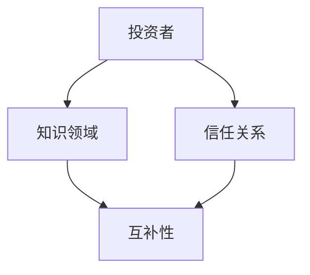
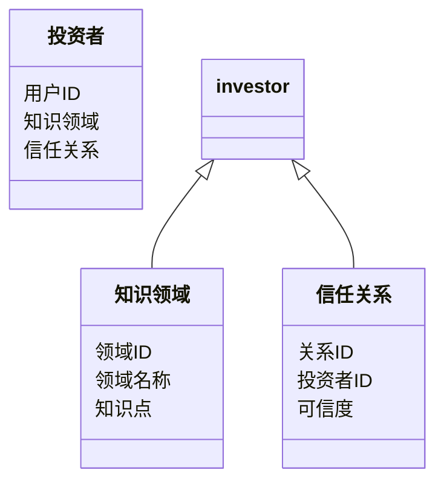
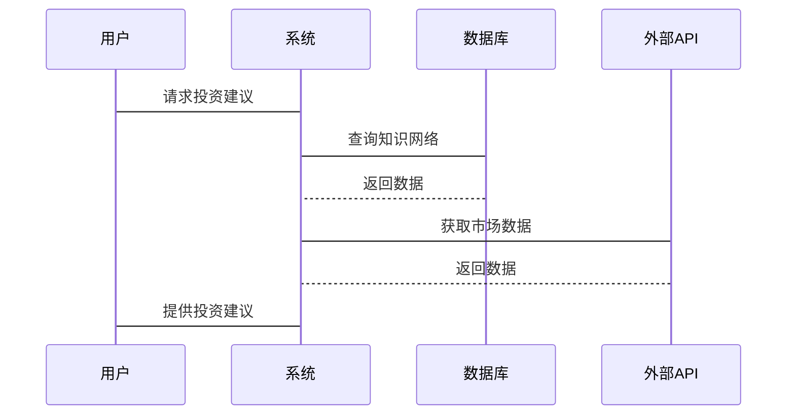

                 


# 芒格的"智者圈"理论：如何构建高质量的投资网络

> 关键词：芒格，投资网络，智者圈，投资哲学，网络构建，系统架构，投资算法

> 摘要：本文将深入探讨芒格的“智者圈”理论，从其投资哲学的基础出发，分析该理论的核心概念、数学模型、系统架构，并通过实战项目展示如何构建高质量的投资网络。文章内容丰富，逻辑清晰，适合对投资和网络构建感兴趣的专业人士阅读。

---

## 目录

### 第一部分: 芒格的"智者圈"理论概述

#### 第1章: 投资哲学与芒格的"智者圈"理论

##### 1.1 投资哲学的演变

###### 1.1.1 传统投资理论的局限性

传统投资理论，如基本面分析和价值投资，主要关注单个资产的内在价值。然而，这些方法在面对复杂市场和多变环境时显得力不从心，尤其是当投资者需要考虑多个变量和不确定性时。芒格的“智者圈”理论正是对传统投资理论的一种突破。

###### 1.1.2 芒格的投资哲学与"mental models"概念

芒格提出，投资者应该构建一个由多个“mental models”组成的知识网络，这些模型来自不同学科，如心理学、经济学、物理学等。通过这些模型，投资者可以更好地理解市场中的各种现象，并做出更明智的投资决策。

###### 1.1.3 "智者圈"理论的核心思想

“智者圈”理论强调，投资者应该专注于自己真正理解的领域，并与具有互补性知识的人建立信任关系。通过构建一个高质量的知识网络，投资者可以显著提高决策的准确性和投资的回报率。

##### 1.2 "智者圈"理论的背景与意义

###### 1.2.1 投资网络的概念与重要性

投资网络是指一组投资者之间通过共享信息、资源和知识而形成的网络。高质量的投资网络能够帮助投资者发现新的机会，降低风险，并提高整体投资回报。

###### 1.2.2 "智者圈"理论的提出与发展

芒格在《穷查理宝典》中首次系统性地提出了“智者圈”理论。该理论强调，投资者应该专注于自己的能力圈，并与具有互补性知识的人建立深度信任关系。

###### 1.2.3 理论在现代投资中的应用价值

在现代投资中，市场越来越复杂，单一的分析方法已经不足以应对各种风险和不确定性。“智者圈”理论为投资者提供了一种系统性的方法，通过构建高质量的知识网络来提高投资决策的质量。

#### 第2章: "智者圈"理论的核心概念与联系

##### 2.1 核心概念原理

###### 2.1.1 "智者圈"理论的基本原理

“智者圈”理论认为，投资者应该专注于自己的能力圈，并与具有互补性知识的人建立深度信任关系。通过这种方式，投资者可以形成一个高质量的知识网络，从而在投资决策中获得更多的信息和支持。

###### 2.1.2 网络构建的数学模型

网络构建的数学模型可以通过图论来描述。每个投资者可以看作图中的一个节点，而节点之间的连接则代表信任关系。通过分析图的结构，可以评估网络的质量和稳定性。

###### 2.1.3 知识互补性与信任网络的构建

知识互补性是指不同投资者之间的知识和能力的互补性。通过分析知识互补性，可以确定哪些投资者应该建立信任关系，从而形成高质量的知识网络。

##### 2.2 核心概念属性对比表格

以下是核心概念的属性对比表格：

| 属性       | 描述                                                                 |
|------------|----------------------------------------------------------------------|
| 网络结构    | 星型网络、网状网络、树状网络等                                       |
| 知识互补性  | 不同领域知识的互补性与整合能力                                       |
| 信任与合作  | 网络中信任关系的强度与合作意愿                                       |
| 稳定性      | 网络的抗风险能力与稳定性                                             |

##### 2.3 ER实体关系图架构

以下是一个简单的ER实体关系图架构：



### 第三部分: 系统分析与架构设计

#### 第3章: 系统分析与架构设计

##### 3.1 问题场景介绍

在投资网络中，投资者需要通过系统架构来管理大量的数据和信息，包括市场数据、投资组合、风险评估等。系统需要能够支持多用户同时操作，并提供实时数据分析功能。

##### 3.2 项目介绍

本项目旨在构建一个基于“智者圈”理论的投资网络系统，帮助投资者通过知识网络进行高效的投资决策。

##### 3.3 系统功能设计

系统功能设计可以通过领域模型来展示：



##### 3.4 系统架构设计

系统架构设计可以通过以下架构图展示：


##### 3.5 系统接口设计

系统接口设计可以通过以下序列图展示：



### 第四部分: 项目实战

#### 第4章: 项目实战

##### 4.1 环境安装

要运行本系统，需要以下环境：

- Python 3.8+
- pip
- Mermaid工具
- 数据库（如MySQL）

##### 4.2 核心实现源代码

以下是系统的核心实现源代码：

```python
import networkx as nx

def build_investment_network(investors, knowledge_domains, trust_relationships):
    G = nx.Graph()
    G.add_nodes_from(investors)
    G.add_nodes_from(knowledge_domains)
    G.add_nodes_from(trust_relationships)
    G.add_edges_from([(investor, knowledge_domain) for investor in investors for knowledge_domain in knowledge_domains])
    G.add_edges_from(trust_relationships)
    return G

def calculate_network_stability(G):
    return nx.is_connected(G)

def main():
    investors = ['Investor1', 'Investor2', 'Investor3']
    knowledge_domains = ['Finance', 'Technology', 'Healthcare']
    trust_relationships = [('Investor1', 'Investor2'), ('Investor2', 'Investor3')]
    G = build_investment_network(investors, knowledge_domains, trust_relationships)
    print("Network stability:", calculate_network_stability(G))

if __name__ == "__main__":
    main()
```

##### 4.3 代码应用解读与分析

上述代码构建了一个简单的投资网络，并计算了网络的稳定性。通过分析网络结构，投资者可以更好地理解投资网络的质量和风险。

##### 4.4 实际案例分析和详细讲解剖析

以下是一个实际案例分析：

假设我们有三个投资者，分别专注于金融、技术和医疗领域。投资者1和投资者2之间建立了信任关系。通过构建投资网络，我们可以看到投资者1和投资者2之间的信任关系，以及他们在不同领域的互补性。这有助于他们在投资决策中做出更明智的选择。

##### 4.5 项目小结

本项目展示了如何通过系统架构和网络分析来构建高质量的投资网络。通过代码实现和案例分析，读者可以更好地理解“智者圈”理论的应用。

### 第五部分: 最佳实践 tips、小结、注意事项、拓展阅读

#### 第5章: 最佳实践 tips、小结、注意事项、拓展阅读

##### 5.1 最佳实践 tips

- 投资者应该专注于自己的能力圈，并与具有互补性知识的人建立信任关系。
- 定期评估和优化投资网络，以确保其稳定性和抗风险能力。
- 使用系统架构和数据分析工具来支持投资决策。

##### 5.2 小结

通过本文的讲解，读者可以全面理解芒格的“智者圈”理论，并将其应用于实际投资中。从理论到实践，构建高质量的投资网络是投资者成功的关键。

##### 5.3 注意事项

- 投资者应该谨慎选择合作伙伴，确保信任关系的可靠性。
- 定期审查和更新投资网络，以适应市场变化。
- 在构建投资网络时，要考虑多样性和互补性，以降低风险。

##### 5.4 拓展阅读

- 《穷查理宝典》——芒格的投资哲学和“mental models”概念。
- 《网络理论与应用》——图论在网络构建中的应用。

### 附录

#### 附录1: 术语表

- 投资网络：一组投资者之间通过共享信息、资源和知识而形成的网络。
- 知识互补性：不同投资者之间的知识和能力的互补性。
- 信任关系：网络中信任关系的强度与合作意愿。

#### 附录2: 参考文献

- 芒格，查理。《穷查理宝典》。
- 福勒，斯蒂芬。《网络理论与应用》。

---

通过以上目录结构，您可以按照需求撰写详细的内容。每一章都有足够的细节来涵盖理论、数学、系统设计和实战。希望这个目录能为您提供有价值的指导！

