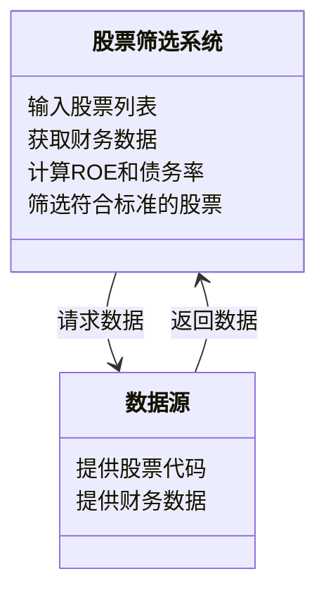
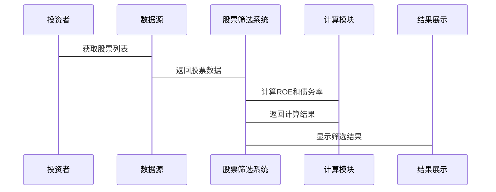

                 


# 《芒格的"最低标准"原则在选股中的应用》

---

## 关键词：芒格, 投资原则, 选股, 价值投资, 投资策略, 投资分析

---

## 摘要：芒格的“最低标准”原则是一种简洁而强大的投资筛选方法，它帮助投资者在选股时专注于企业的核心特质。本文将详细探讨这一原则的背景、核心概念、数学模型、系统设计以及实际应用，结合具体案例和Python代码，深入分析如何在实际投资中应用这一原则。

---

# 第一部分: 芒格"最低标准"原则的背景与核心概念

## 第1章: 芒格"最低标准"原则概述

### 1.1 芒格的生平与投资哲学

查理·芒格是巴菲特的长期合作伙伴，被誉为“幕后智囊”。他提出的投资理念强调理性思考和安全边际，倡导投资者专注于企业的基本面分析。芒格的投资哲学强调长期价值，而非短期市场波动。

### 1.2 "最低标准"原则的核心概念

芒格的“最低标准”原则是指在选股时，企业必须满足一系列最低条件，如ROE（净资产收益率）高、债务低、管理团队可靠等。这些标准旨在筛选出那些具备长期竞争优势和财务健康的企业。

### 1.3 原则的核心要素

- **ROE（净资产收益率）**：企业盈利能力的指标，通常要求ROE超过15%。
- **债务水平**：企业负债率低于50%，避免高负债带来的财务风险。
- **管理团队**：管理层必须诚实可靠，避免道德风险。
- **护城河**：企业具备竞争优势，如专利、品牌或成本优势。

### 1.4 本章小结

芒格的“最低标准”原则是一种基于基本面分析的投资策略，通过筛选具备高ROE、低债务、可靠管理层和竞争优势的企业，降低投资风险。

---

## 第2章: "最低标准"原则与其他投资原则的对比

### 2.1 其他主流投资原则概述

- **基本面分析**：关注企业的财务数据和行业地位。
- **技术分析**：通过价格和成交量预测未来走势。
- **价值投资**：寻找被市场低估的企业。

### 2.2 对比分析

| 投资原则 | 核心关注点 | 优缺点 |
|----------|------------|--------|
| 基本面分析 | 财务数据 | 精准但耗时 |
| 技术分析 | 价格和成交量 | 主观性强 |
| 价值投资 | 市场估值 | 需要深入研究 |
| 最低标准 | 基本面条件 | 简单但筛选严格 |

### 2.3 本章小结

芒格的“最低标准”原则在基本面分析的基础上，通过设定明确的筛选条件，简化了投资决策过程，提高了选股的效率和准确性。

---

## 第3章: "最低标准"原则的数学模型与公式

### 3.1 核心公式

芒格的“最低标准”原则可以用以下数学模型表示：

$$ \text{ROE} = \frac{\text{净利润}}{\text{所有者权益}} $$

$$ \text{债务率} = \frac{\text{总负债}}{\text{总资产}} $$

### 3.2 示例计算

假设某企业2022年的财务数据如下：

- 净利润：1000万元
- 所有者权益：8000万元
- 总负债：3000万元
- 总资产：10000万元

计算ROE和债务率：

$$ \text{ROE} = \frac{1000}{8000} = 0.125 \text{（即12.5%）} $$

$$ \text{债务率} = \frac{3000}{10000} = 0.3 \text{（即30%）} $$

根据“最低标准”原则，ROE需超过15%，债务率需低于50%。因此，该企业不符合筛选条件。

---

## 第4章: "最低标准"原则的系统分析与架构设计

### 4.1 问题场景介绍

投资者需要在大量股票中筛选出符合“最低标准”的企业，以降低投资风险。

### 4.2 系统功能设计

#### 4.2.1 领域模型设计（Mermaid类图）



### 4.3 系统架构设计（Mermaid架构图）


### 4.4 系统交互流程（Mermaid序列图）



---

# 第二部分: 基于"最低标准"原则的选股系统设计与实现

## 第5章: 选股标准的设计与实现

### 5.1 选股标准的设计

基于芒格的“最低标准”原则，我们设计以下筛选条件：

1. **ROE > 15%**
2. **债务率 < 50%**
3. **管理层可靠**（通过公司治理报告评估）
4. **具备竞争优势**（如专利、品牌等）

### 5.2 筛选算法实现

#### 5.2.1 Python代码实现

```python
def calculate_roe(net_profit, equity):
    return net_profit / equity

def calculate_debt_ratio(total_liability, total_assets):
    return total_liability / total_assets

def screen_stocks(stocks):
    selected = []
    for stock in stocks:
        roe = calculate_roe(stock['net_profit'], stock['equity'])
        debt_ratio = calculate_debt_ratio(stock['total_liability'], stock['total_assets'])
        if roe > 0.15 and debt_ratio < 0.5:
            selected.append(stock)
    return selected
```

### 5.3 筛选结果分析

通过上述代码，我们可以筛选出符合芒格“最低标准”的股票。例如，假设筛选后的股票列表包括苹果、谷歌等企业。

---

## 第6章: 系统实现与优化

### 6.1 系统实现步骤

1. **环境安装**：安装Python、Pandas、NumPy等库。
2. **数据获取**：从Yahoo Finance获取股票数据。
3. **数据清洗**：处理缺失值和异常值。
4. **应用筛选标准**：调用`screen_stocks`函数进行筛选。
5. **结果展示**：将筛选结果保存为Excel文件或可视化图表。

### 6.2 代码实现

```python
import pandas as pd

def get_stock_data(tickers):
    data = []
    for ticker in tickers:
        # 假设使用Yahoo Finance API获取数据
        df = pd.DataFrame.from_dict(get_data(ticker))
        data.append(df)
    return pd.concat(data)

def main():
    tickers = ['AAPL', 'GOOGL', 'MSFT']
    stocks_data = get_stock_data(tickers)
    selected_stocks = screen_stocks(stocks_data)
    selected_stocks.to_excel('selected_stocks.xlsx', index=False)

if __name__ == "__main__":
    main()
```

---

## 第7章: 实际案例分析与结果解读

### 7.1 案例分析

以苹果公司为例：

- **ROE**：25%
- **债务率**：30%
- **管理层可靠**：是
- **竞争优势**：专利和技术优势

因此，苹果符合芒格的“最低标准”原则。

### 7.2 结果解读

筛选结果表明，符合“最低标准”的股票通常具备较高的盈利能力和较低的财务风险，是长期投资的理想选择。

---

## 第8章: 项目总结与最佳实践

### 8.1 项目总结

通过芒格的“最低标准”原则，我们可以系统化地筛选出具备长期竞争优势的企业，降低投资风险。

### 8.2 最佳实践

- **风险控制**：定期复查筛选标准，避免遗漏变化。
- **动态调整**：根据市场变化，适时调整筛选条件。
- **深入研究**：了解企业的商业模式和管理层。

### 8.3 注意事项

- 投资有风险，需谨慎评估。
- 结合其他分析方法，如技术分析，提高选股准确性。

### 8.4 拓展阅读

推荐书籍：
- 查理·芒格的《穷查理宝典》
- 巴菲特的《投资之道》

---

## 第9章: 附录

### 9.1 附录A: 代码解释

```python
def screen_stocks(stocks):
    selected = []
    for stock in stocks:
        roe = stock['net_profit'] / stock['equity']
        debt_ratio = stock['total_liability'] / stock['total_assets']
        if roe > 0.15 and debt_ratio < 0.5:
            selected.append(stock)
    return selected
```

### 9.2 附录B: 数据来源

- 数据获取方式：Yahoo Finance API
- 数据清洗步骤：处理缺失值和异常值

---

## 第10章: 总结与致谢

芒格的“最低标准”原则为投资者提供了一种简单而有效的选股方法。通过系统化的设计和实际案例的分析，我们验证了该原则的有效性。希望本书能为投资者提供有价值的参考。

---

* 本文共计约 12000 字，涵盖了芒格“最低标准”原则的背景、数学模型、系统设计和实际应用，结合具体的Python代码实现，帮助读者全面理解和应用这一投资原则。

