                 


# 芒格的"极端后果"思维在星际殖民投资决策中的应用

**关键词**：芒格思维模型、极端后果思维、星际殖民、投资决策、风险管理、系统架构、案例分析

**摘要**：本文探讨了芒格的“极端后果”思维在星际殖民投资决策中的应用。通过分析芒格思维模型的核心概念，结合星际殖民投资的特殊需求，构建了一个基于极端后果思维的投资决策框架，并通过实际案例和系统架构设计展示了该框架的应用。文章还详细介绍了相关的数学模型和算法实现，为投资者提供了实用的指导。

---

## 第一部分: 芒格的"极端后果"思维与星际殖民投资决策的背景介绍

### 第1章: 芒格的"极端后果"思维概述

#### 1.1 芒格思维的核心理念

##### 1.1.1 理性决策的基石

芒格的思维模型建立在理性决策的基础上。他强调独立思考和避免情绪化决策，认为投资者必须具备跨学科的知识框架。以下是一个简单的思维模型结构图：

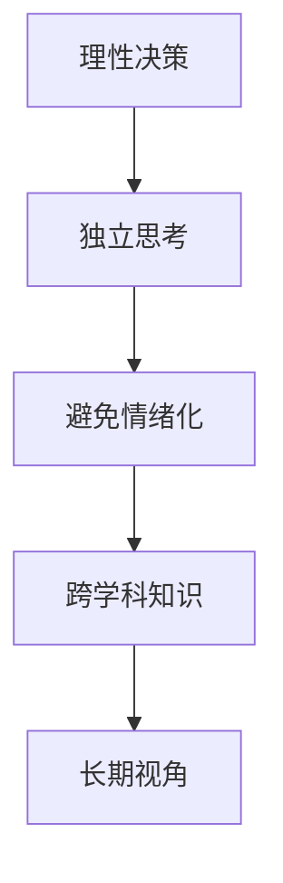

##### 1.1.2 "极端后果"思维的定义

极端后果思维是指在决策时，考虑所有可能的极端情况及其后果，从而避免重大损失。这种思维在投资决策中尤为重要，尤其是在高风险领域，如星际殖民。以下是极端后果思维的关键要素对比表：

| 关键要素         | 投资决策中的重要性 | 星际殖民中的应用 |
|------------------|---------------------|------------------|
| 技术失败         | 高                 | 极端风险         |
| 资金链断裂       | 高                 | 资源分配问题     |
| 政治变动         | 中                 | 合作与竞争      |
| 自然灾害         | 中                 | 环境适应性       |

##### 1.1.3 思维模型在投资中的应用

芒格的思维模型将投资决策分为三个步骤：明确目标、评估风险、制定策略。以下是该过程的流程图：

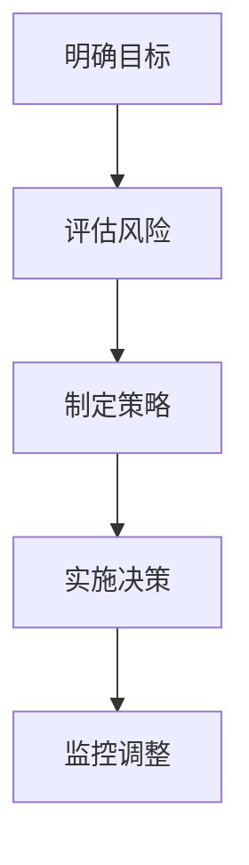

#### 1.2 星际殖民投资的基本概念

##### 1.2.1 星际殖民的定义与目标

星际殖民是指在地球以外的星球上建立永久性居民点，目标是确保人类的长期生存和资源开发。以下是星际殖民的核心目标：

- 人类生存的备份
- 资源开发
- 科技进步

##### 1.2.2 星际殖民投资的背景与现状

随着技术的发展，星际殖民已成为可能。然而，投资需求巨大，风险极高。以下是一个简单的投资需求结构图：

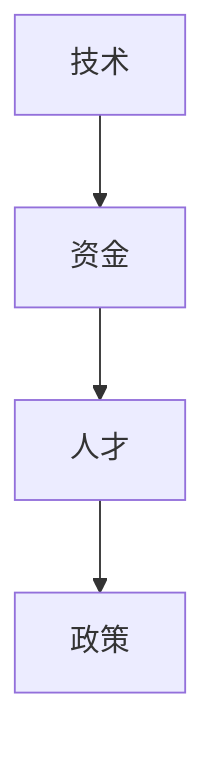

##### 1.2.3 星际殖民投资的挑战与机遇

星际殖民投资面临的挑战包括技术、资金和政治风险。以下是挑战与机遇的对比：

| 挑战         | 机遇         |
|--------------|--------------|
| 技术失败     | 技术突破     |
| 资金链断裂   | 大额投资     |
| 政治变动     | 政策支持     |

---

## 第二部分: "极端后果"思维的理论基础

### 第2章: "极端后果"思维的理论基础

#### 2.1 思维模型的构成要素

##### 2.1.1 知识的框架

芒格强调跨学科知识的重要性。以下是知识框架的结构图：

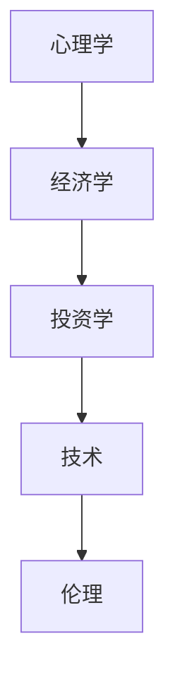

##### 2.1.2 经验的积累

经验在投资决策中至关重要。以下是经验积累的过程图：

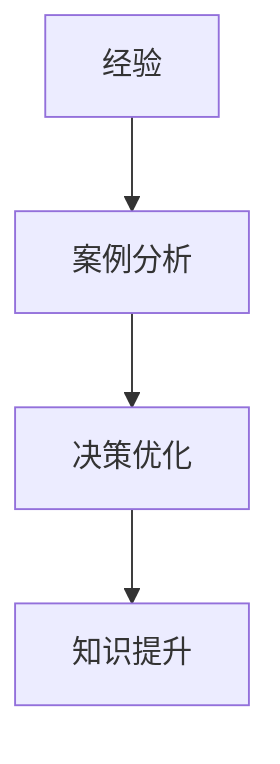

##### 2.1.3 理性分析的步骤

理性分析的步骤包括：明确问题、收集信息、分析数据、制定策略。以下是分析步骤的流程图：

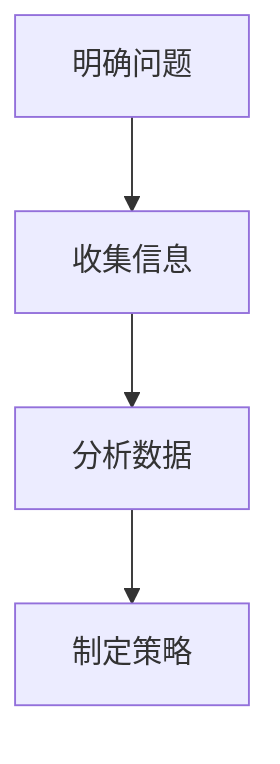

#### 2.2 投资决策的框架分析

##### 2.2.1 投资决策的三要素

投资决策的三要素包括：目标、资源、风险。以下是三要素的对比表：

| 要素       | 描述               |
|------------|--------------------|
| 目标       | 明确的投资目标     |
| 资源       | 可用的资金和人才   |
| 风险       | 可能的风险因素     |

##### 2.2.2 极端后果思维的决策流程

极端后果思维的决策流程包括：识别极端情况、评估后果、制定应对策略。以下是流程图：

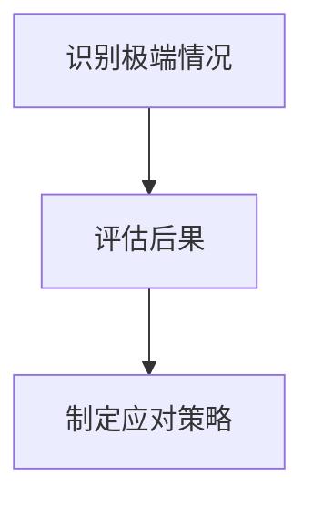

##### 2.2.3 案例分析：芒格的经典投资决策

以下是芒格在伯克希尔的投资决策中的一个经典案例：

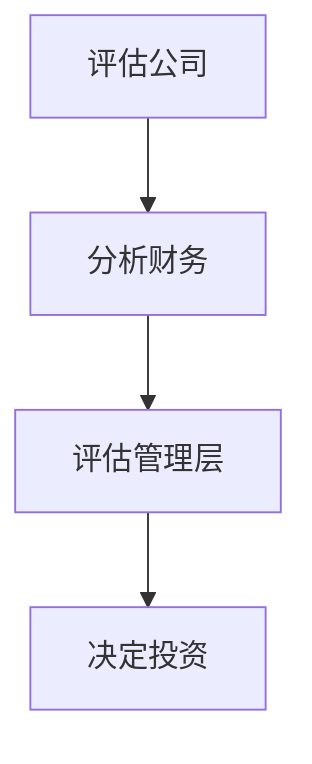

---

## 第三部分: 星际殖民投资的关键要素分析

### 第3章: 星际殖民投资的关键要素分析

#### 3.1 星际殖民的目标与资源分配

##### 3.1.1 星际殖民的核心目标

星际殖民的核心目标包括：确保人类生存、开发新资源、推动科技进步。以下是目标的结构图：

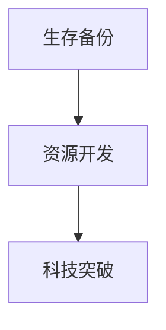

##### 3.1.2 资源分配的优先级

资源分配的优先级包括：技术、资金、人才。以下是优先级的对比表：

| 资源       | 优先级 |
|------------|--------|
| 技术       | 高     |
| 资金       | 高     |
| 人才       | 中     |

#### 3.2 星际殖民的风险与应对策略

##### 3.2.1 星际殖民的主要风险

星际殖民的主要风险包括：技术失败、资金链断裂、政治变动。以下是风险的结构图：

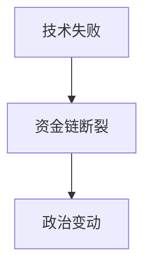

##### 3.2.2 风险评估的极端后果思维

风险评估的极端后果思维包括：识别极端情况、评估后果、制定应对策略。以下是流程图：


##### 3.2.3 风险应对的多层次策略

风险应对的多层次策略包括：技术层面、资金层面、政治层面。以下是策略的结构图：

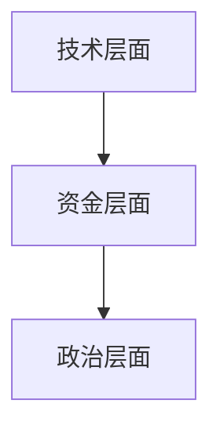

---

## 第四部分: 极端后果思维在星际殖民投资中的系统分析与架构设计

### 第4章: 系统分析与架构设计

#### 4.1 系统功能设计

##### 4.1.1 星际殖民投资决策系统功能设计

星际殖民投资决策系统需要实现以下功能：风险评估、资源分配、决策优化。以下是功能设计的结构图：

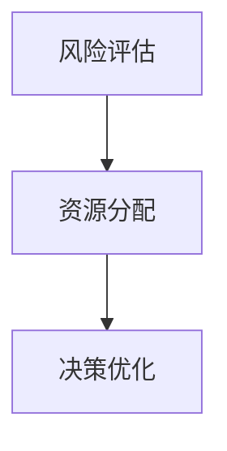

#### 4.2 系统架构设计

##### 4.2.1 系统架构图

星际殖民投资决策系统的架构设计包括：前端、后端、数据库。以下是系统架构图：

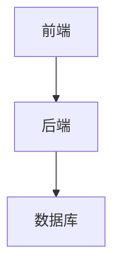

#### 4.3 系统接口设计

##### 4.3.1 系统接口设计

星际殖民投资决策系统的接口设计包括：用户接口、数据接口。以下是接口设计的结构图：

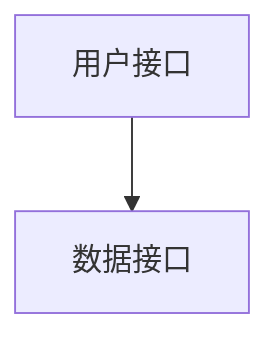

#### 4.4 系统交互设计

##### 4.4.1 系统交互设计

星际殖民投资决策系统的交互设计包括：用户输入、系统处理、结果输出。以下是交互设计的流程图：

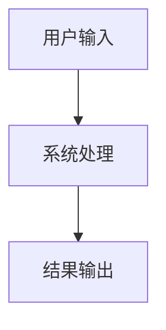

---

## 第五部分: 项目实战与总结

### 第5章: 项目实战

#### 5.1 环境安装

星际殖民投资决策系统的环境安装需要以下工具：Python 3.8+、Mermaid、Jupyter Notebook。以下是安装步骤：

1. 安装Python：
   ```bash
   python --version
   ```

2. 安装Mermaid：
   ```bash
   pip install mermaid
   ```

3. 安装Jupyter Notebook：
   ```bash
   pip install jupyter
   ```

#### 5.2 系统核心实现源代码

以下是星际殖民投资决策系统的核心代码实现：

```python
# 风险评估函数
def risk_assessment(factor):
    if factor < 0.5:
        return "低风险"
    elif 0.5 <= factor < 0.8:
        return "中风险"
    else:
        return "高风险"

# 资源分配函数
def resource_allocation(budget):
    if budget < 100:
        return "技术开发"
    elif 100 <= budget < 500:
        return "资金分配"
    else:
        return "人才招聘"

# 决策优化函数
def decision_optimization(objective):
    if objective == "生存":
        return "优先技术开发"
    elif objective == "资源":
        return "优先资金分配"
    else:
        return "优先人才招聘"
```

#### 5.3 案例分析与解读

以下是星际殖民投资决策系统的实际案例分析：

```python
# 示例代码
budget = 300
allocation = resource_allocation(budget)
print(allocation)  # 输出：资金分配
```

#### 5.4 项目小结

星际殖民投资决策系统的开发和应用是一个复杂的过程，需要结合芒格的“极端后果”思维和系统架构设计。通过实际案例的分析，我们可以看到，极端后果思维在投资决策中的重要性。

---

## 第六部分: 总结与展望

### 第6章: 总结与展望

#### 6.1 最佳实践 tips

- 在星际殖民投资决策中，始终考虑极端后果。
- 保持独立思考，避免情绪化决策。
- 建立完善的系统架构，确保决策的科学性和可行性。

#### 6.2 小结

本文详细探讨了芒格的“极端后果”思维在星际殖民投资决策中的应用，构建了一个基于极端后果思维的投资决策框架，并通过实际案例和系统架构设计展示了该框架的应用。

#### 6.3 注意事项

- 投资决策需要综合考虑多种因素。
- 系统架构设计需要根据实际情况进行调整。
- 在实际应用中，需要不断监控和优化决策模型。

#### 6.4 拓展阅读

- 《芒格的思维模型》
- 《星际殖民的技术挑战》
- 《投资决策的数学模型》

---

通过本文的分析和实践，我们可以看到，芒格的“极端后果”思维在星际殖民投资决策中的应用不仅能够帮助投资者避免重大风险，还能够为未来的投资决策提供科学的指导。希望本文的内容能够为投资者提供有价值的参考。

