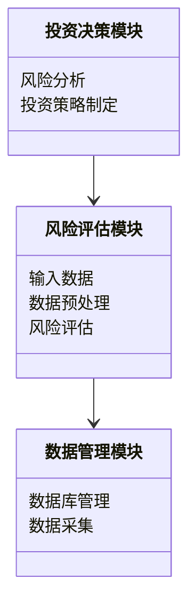
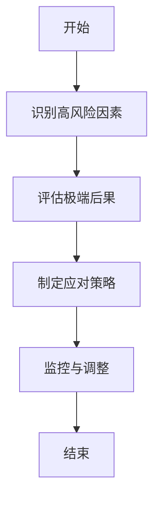
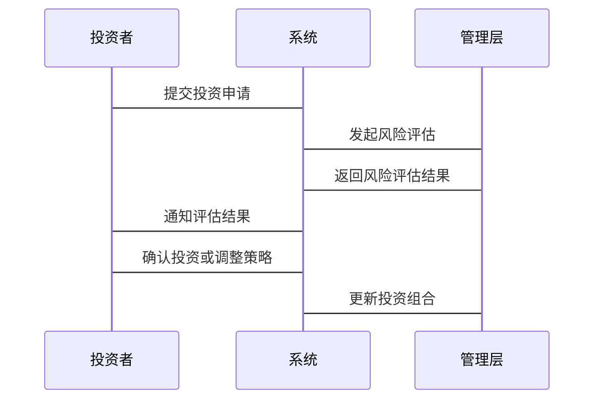

                 


# 第五部分: 气候科技投资中的风险分析与管理

# 第5章: 气候科技投资中的风险分析

## 5.1 气候科技投资中的主要风险

### 5.1.1 技术风险
#### 5.1.1.1 技术失败风险
#### 5.1.1.2 技术迭代风险
#### 5.1.1.3 技术锁定风险

### 5.1.2 市场风险
#### 5.1.2.1 市场需求波动风险
#### 5.1.2.2 市场竞争风险
#### 5.1.2.3 市场渗透风险

### 5.1.3 政策风险
#### 5.1.3.1 政策变化风险
#### 5.1.3.2 政策执行风险
#### 5.1.3.3 政策不确定性风险

### 5.1.4 财务风险
#### 5.1.4.1 资金链断裂风险
#### 5.1.4.2 资产贬值风险
#### 5.1.4.3 利率变化风险

## 5.2 "极端后果"思维在风险分析中的应用

### 5.2.1 风险的识别与评估
#### 5.2.1.1 风险识别的系统性方法
#### 5.2.1.2 风险评估的数学模型
#### 5.2.1.3 风险优先级排序

### 5.2.2 风险的预防与控制
#### 5.2.2.1 风险预防策略
#### 5.2.2.2 风险控制措施
#### 5.2.2.3 风险转移机制

### 5.2.3 风险的应对与恢复
#### 5.2.3.1 风险应对计划
#### 5.2.3.2 应急响应策略
#### 5.2.3.3 风险恢复机制

## 5.3 气候科技投资中的风险管理案例分析

### 5.3.1 某气候科技公司的风险管理实践
#### 5.3.1.1 公司概况与风险管理需求
#### 5.3.1.2 风险识别与评估过程
#### 5.3.1.3 风险管理策略的制定与实施
#### 5.3.1.4 风险管理效果的评估与反馈

### 5.3.2 某气候科技项目的风险管理案例
#### 5.3.2.1 项目背景与目标
#### 5.3.2.2 风险识别与评估
#### 5.3.2.3 风险管理策略
#### 5.3.2.4 项目风险管理的成果与启示

## 5.4 本章小结
### 5.4.1 气候科技投资中的主要风险类型
### 5.4.2 "极端后果"思维在风险管理中的应用
### 5.4.3 本章研究重点

# 第6章: 总结与展望

## 6.1 本书核心观点总结

### 6.1.1 芒格的"极端后果"思维的定义与核心概念
### 6.1.2 "极端后果"思维在气候科技投资中的应用框架
### 6.1.3 气候科技投资中的风险分析与管理

## 6.2 投资决策中的"极端后果"思维的实践意义
### 6.2.1 对投资者的启示
### 6.2.2 对投资机构的启示
### 6.2.3 对政策制定者的启示

## 6.3 未来研究方向
### 6.3.1 "极端后果"思维在其他投资领域的应用
### 6.3.2 气候科技投资中的风险管理创新
### 6.3.3 "极端后果"思维与人工智能的结合

## 6.4 本章小结
### 6.4.1 核心观点回顾
### 6.4.2 实践意义总结
### 6.4.3 未来研究展望

# 附录: 芒格"极端后果"思维在气候科技投资中的数学模型与系统架构设计

## 附录A: 风险评估数学模型
### A.1 风险概率计算公式
$$ R_p = \frac{\text{历史发生次数}}{\text{总样本数}} $$
### A.2 风险影响程度评估公式
$$ R_i = \sum_{j=1}^{n} w_j \times f_j $$
其中，$w_j$ 是第$j$个影响因素的权重，$f_j$ 是第$j$个影响因素的函数值
### A.3 综合风险评估公式
$$ R = R_p \times R_i $$

## 附录B: 系统架构设计
### B.1 系统功能模块


## 附录C: 算法流程图


## 附录D: 风险预防策略代码示例
```python
def risk_assessment(factor_list):
    # 输入参数：factor_list是一个包含风险因素的列表
    # 输出：返回一个风险评估结果字典
    risk_factors = {
        '技术失败': 0.2,
        '市场需求波动': 0.3,
        '政策变化': 0.4,
        '财务危机': 0.1
    }
    assessment = {}
    for factor in factor_list:
        if factor in risk_factors:
            assessment[factor] = risk_factors[factor]
        else:
            assessment[factor] = 0.0
    return assessment

# 示例使用
factors = ['技术失败', '市场需求波动', '政策变化', '财务危机', '其他风险']
result = risk_assessment(factors)
print(result)
```

## 附录E: 系统交互序列图


## 附录F: 最佳实践 tips
### F.1 风险预防
- 定期进行风险评估
- 建立风险预警机制
- 制定应急预案
### F.2 系统性思维
- 从整体视角分析问题
- 考虑各因素的相互影响
- 保持系统的动态平衡
### F.3 长期视角
- 设定长期投资目标
- 考虑多周期的风险与收益
- 坚持长期价值投资理念

## 附录G: 拓展阅读推荐
### G.1 经典书籍
- 《芒格的智慧：投资的哲学与实践》
- 《气候投资：风险与机遇》
- 《系统性风险管理》
### G.2 网站与资源
- 网站：[芒格投资哲学](https://www.mungerphilosophy.com)
- 网站：[气候科技投资](https://www.climatetechinvest.com)
- 网站：[风险管理协会](https://www.riskmanagement.org)
### G.3 专业报告与白皮书
- 报告：《全球气候变化投资趋势分析》
- 白皮书：《极端后果思维在投资中的应用》
- 研究报告：《气候科技投资的风险管理策略》

# 结语

通过对芒格的"极端后果"思维在气候科技投资中的系统性分析，我们不仅能够更好地理解这一投资理念的深刻内涵，还能将其有效地应用于实际投资决策中。希望本书的内容能够为投资者、投资机构以及政策制定者提供有价值的参考与启示，同时也为未来的相关研究提供有益的思路与方向。

