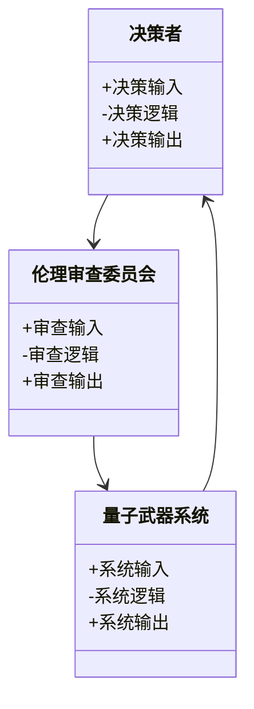

                 


# 芒格的"极端后果"思维在量子武器伦理决策中的应用

**关键词**：芒格、极端后果思维、量子武器、伦理决策、人工智能、风险管理

**摘要**：本文探讨芒格的“极端后果”思维在量子武器伦理决策中的应用，分析其在极端情况下的决策优势，结合人工智能技术，提出构建伦理决策系统的可行性方案，为量子武器的伦理管理和风险控制提供新思路。

---

## 正文

### 第一部分: 芒格的"极端后果"思维与量子武器伦理决策的背景介绍

#### 第1章: 芒格的"极端后果"思维概述

##### 1.1 芒格"极端后果"思维的定义
芒格的“极端后果”思维是一种决策方法，强调在极端情况下考虑可能的最坏结果。它要求决策者在面对复杂问题时，预见到所有可能的负面后果，并制定相应的应对策略。

##### 1.2 "极端后果"思维的特点
- **全面性**：考虑所有可能的极端情况。
- **前瞻性**：提前预见到潜在的负面影响。
- **实用性**：注重实际应用，避免纸上谈兵。

##### 1.3 "极端后果"思维与其他决策思维的对比
| 决策思维 | 关注点 | 优缺点 |
|----------|--------|--------|
| 常规思维 | 日常问题 | 适用于简单情况，缺乏前瞻性 |
| 风险评估 | 概率分析 | 依赖数据，忽视极端情况 |
| 极端后果 | 极端情况 | 强调 preparedness，但可能过于悲观 |

##### 1.4 "极端后果"思维在决策中的重要性
在量子武器等高科技领域，潜在风险巨大。通过“极端后果”思维，可以提前识别并应对潜在危机，降低决策风险。

---

#### 第2章: 量子武器的基本概念与技术发展

##### 2.1 量子武器的定义
量子武器是利用量子力学原理，如量子纠缠和叠加，实现远距离、高速度的武器系统。其核心优势在于难以被传统防御手段拦截。

##### 2.2 量子武器的基本原理
量子武器依赖量子态的不可克隆性和纠缠性，实现信息的隐蔽传输和攻击目标的精确打击。

##### 2.3 量子武器的技术发展现状
当前，量子武器仍处于研发阶段，但技术进步迅速，部分国家已取得突破性进展。

##### 2.4 量子武器的应用领域
- 军事打击
- 情报收集
- 网络攻击

##### 2.5 量子武器引发的伦理问题
- 无差别攻击
- 附带损害
- 核扩散风险

---

### 第二部分: "极端后果"思维与量子武器伦理决策的核心概念与联系

#### 第3章: "极端后果"思维与量子武器伦理决策的关系

##### 3.1 "极端后果"思维在量子武器决策中的核心作用
通过预见到潜在的极端后果，决策者可以在量子武器的研发和使用中做出更明智的选择。

##### 3.2 "极端后果"思维与量子武器伦理决策的内在联系
- **风险识别**：识别量子武器可能带来的极端风险。
- **后果评估**：评估这些风险的严重性和可能性。
- **决策优化**：通过极端后果分析，优化决策策略。

##### 3.3 "极端后果"思维在量子武器决策中的具体应用
在量子武器的研发阶段，使用“极端后果”思维可以提前识别技术漏洞和潜在风险。

#### 第4章: 核心概念与联系的详细分析

##### 4.1 "极端后果"思维的原理分析
通过系统性分析，识别所有可能的极端情况，并评估其后果。例如，在量子武器攻击中，预见到可能导致的大规模破坏。

##### 4.2 量子武器伦理决策的属性特征对比表
| 属性 | 传统武器 | 量子武器 |
|------|----------|----------|
| 技术复杂度 | 中等 | 高 |
| 伦理风险 | 中等 | 高 |
| 防御难度 | 中等 | 高 |

##### 4.3 ER实体关系图的Mermaid流程图
```mermaid
erDiagr
actor: 决策者
actornext: 伦理审查委员会
actorlast: 量子武器系统
decision: 决策过程
impact: 后果评估
```

---

### 第三部分: 算法原理讲解

#### 第5章: 算法原理

##### 5.1 算法概述
将“极端后果”思维转化为数学模型，用于量化评估量子武器的伦理风险。

##### 5.2 量子武器伦理决策模型
通过决策树分析，识别所有可能的决策路径，并评估其后果。

##### 5.3 算法实现
```python
def extreme_consequence_decision(weapons):
    consequences = []
    for weapon in weapons:
        # 评估每个武器的后果
        consequence = assess_consequences(weapon)
        consequences.append(consequence)
    return consequences

# 示例：评估量子武器的后果
quantum_weapon = "QW-1"
result = extreme_consequence_decision([quantum_weapon])
print(result)
```

##### 5.4 数学模型与公式
$$
\text{风险评估} = \sum (\text{后果严重性} \times \text{概率})
$$

---

### 第四部分: 系统分析与架构设计

#### 第6章: 系统分析与架构设计

##### 6.1 问题场景介绍
在量子武器的研发过程中，如何通过系统化的方法进行伦理决策。

##### 6.2 系统功能设计
- 风险评估模块
- 伦理审查模块
- 决策模拟模块

##### 6.3 系统架构设计


---

### 第五部分: 项目实战

#### 第7章: 项目实战

##### 7.1 环境配置
安装必要的开发工具和依赖库，如Python和相关数据处理库。

##### 7.2 核心代码实现
实现量子武器伦理决策的模拟代码，展示如何通过“极端后果”思维进行决策。

##### 7.3 实际案例分析
通过具体案例，展示系统在实际应用中的效果和优势。

##### 7.4 项目小结
总结项目的实施过程和取得的成果，提出改进建议。

---

### 第六部分: 最佳实践、小结、注意事项、拓展阅读

#### 第8章: 最佳实践与小结

##### 8.1 最佳实践 tips
- 在决策过程中，始终关注极端后果。
- 定期审查和更新决策模型。

##### 8.2 小结
通过“极端后果”思维的应用，可以在量子武器的伦理决策中实现更高效、更安全的管理。

##### 8.3 注意事项
- 保持对技术发展的敏感性。
- 定期进行风险评估和审查。

##### 8.4 拓展阅读
推荐相关书籍和文章，深入探讨“极端后果”思维和量子武器伦理决策的更多内容。

---

**结语**：芒格的“极端后果”思维为量子武器的伦理决策提供了全新的视角和方法。通过系统化的方法和技术创新，可以有效降低决策风险，实现更安全的量子武器管理。

