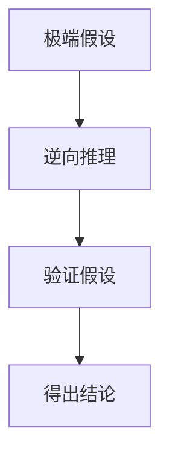
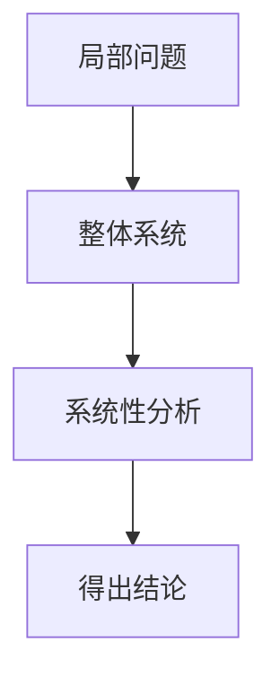
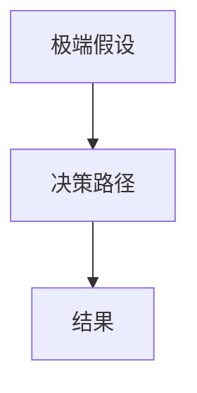
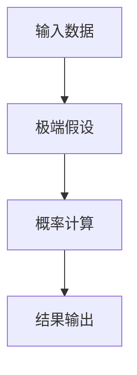
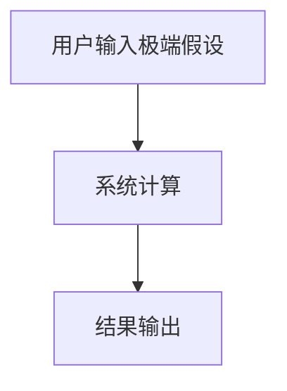
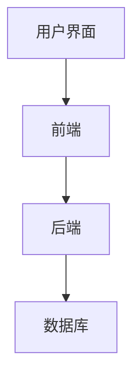
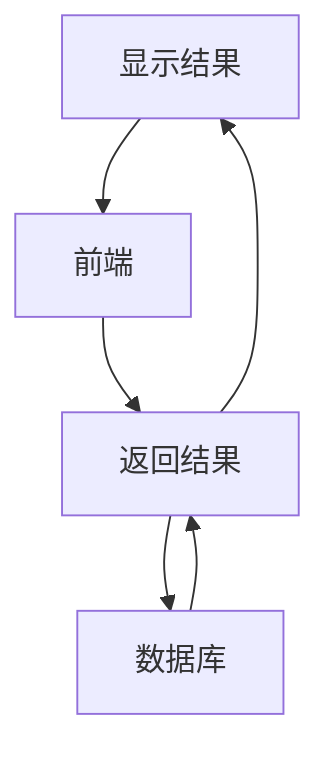

                 


# 芒格的"极端思维"在风险评估中的应用

> 关键词：芒格，极端思维，风险评估，风险管理，决策模型，概率论

> 摘要：本文探讨了芒格的“极端思维”在风险评估中的应用，结合技术分析与实际案例，详细阐述了极端思维的核心概念、数学模型、算法实现及系统架构设计，展示了如何通过极端思维提升风险评估的准确性和效率。

---

## 第1章: 芒格的"极端思维"概述

### 1.1 "极端思维"的定义与特点

#### 1.1.1 "极端思维"的核心概念
芒格的“极端思维”是一种以反常识、反经验主义为核心的思维方式，强调从极端情况出发，通过逆向思考和系统性分析，揭示事物的本质规律。其核心在于通过极端假设，找到问题的关键节点和潜在风险。

#### 1.1.2 "极端思维"与传统思维的区别

| 特征 | 传统思维 | 极端思维 |
|------|----------|----------|
| 思维起点 | 从已知事实出发 | 从极端假设出发 |
| 分析方式 | 正向推导 | 逆向验证 |
| 风险视角 | 风险为边界 | 风险为核心 |

#### 1.1.3 "极端思维"在风险评估中的重要性
极端思维通过聚焦极端情况，能够快速识别潜在风险，并通过反向推理，找到问题的根源。这种思维方式在风险评估中具有独特的优势，尤其是在应对黑天鹅事件时，能够提前做好准备。

### 1.2 "极端思维"的逻辑框架

#### 1.2.1 "极端思维"的基本逻辑


#### 1.2.2 "极端思维"的分析方法
- 从极端假设出发，通过反向推理，找到问题的关键节点。
- 通过对比分析，验证极端假设的合理性。

#### 1.2.3 "极端思维"的应用原则
1. 始于极端，终于常规。
2. 通过极端假设，寻找问题的本质。
3. 在极端情况下，检验决策的可行性。

---

## 第2章: "极端思维"的核心概念与逻辑

### 2.1 "极端思维"的核心要素

#### 2.1.1 确定性思维与概率思维
- **确定性思维**：基于已知事实，进行确定性的推导。
- **概率思维**：基于不确定性，通过概率分布，分析事件的可能性。

#### 2.1.2 极端情况下的决策思维
- 在极端情况下，决策需要基于有限的信息，进行快速判断。

#### 2.1.3 系统性思维与反向思维
- **系统性思维**：从整体出发，分析系统的各个组成部分及其相互关系。
- **反向思维**：通过反向思考，找到问题的本质。

### 2.2 "极端思维"的逻辑结构

#### 2.2.1 从局部到整体的思维转换


#### 2.2.2 从表象到本质的思维突破
- 通过极端假设，突破表象，找到问题的本质。

#### 2.2.3 从已知到未知的思维延伸
- 通过极端假设，扩展已知领域的认知，发现未知的可能性。

### 2.3 "极端思维"的数学模型与公式

#### 2.3.1 概率论基础
概率论是极端思维的重要工具，通过概率分布，可以分析极端情况下的事件发生的可能性。

#### 2.3.2 贝叶斯定理
贝叶斯定理用于在极端假设下，更新概率分布，验证假设的合理性。

$$ P(A|B) = \frac{P(B|A)P(A)}{P(B)} $$

#### 2.3.3 决策树模型
决策树模型用于分析极端情况下的决策路径。



---

## 第3章: "极端思维"在风险评估中的应用

### 3.1 风险识别与极端思维

#### 3.1.1 识别潜在风险的极端情况
- 通过极端假设，识别潜在风险的关键节点。

#### 3.1.2 从极端情况中发现潜在风险
- 极端假设能够帮助我们发现潜在风险，尤其是在正常情况下难以察觉的隐性风险。

#### 3.1.3 极端思维在风险识别中的优势
- 通过极端假设，能够快速识别潜在风险。

### 3.2 风险分析与极端思维

#### 3.2.1 极端情况下的风险分析
- 通过极端假设，分析极端情况下的风险。

#### 3.2.2 极端思维在风险分析中的应用
- 通过反向推理，验证极端假设的合理性。

### 3.3 风险应对与极端思维

#### 3.3.1 极端情况下的应对策略
- 通过极端假设，制定应对策略。

#### 3.3.2 极端思维在风险应对中的作用
- 通过极端假设，提前做好应对准备。

---

## 第4章: "极端思维"的数学模型与算法实现

### 4.1 数学模型

#### 4.1.1 概率分布模型
- 使用概率分布模型，分析极端情况下的事件发生的可能性。

#### 4.1.2 贝叶斯网络模型
- 贝叶斯网络模型用于在极端假设下，分析事件之间的关系。

#### 4.1.3 决策树模型
- 决策树模型用于分析极端情况下的决策路径。

### 4.2 算法实现

#### 4.2.1 算法流程


#### 4.2.2 Python代码实现
```python
import numpy as np
import pandas as pd

def extreme_thinking_algorithm(data):
    # 极端假设
    extreme假设 = data.extreme假设
    # 概率计算
    概率分布 = data.概率分布
    # 结果输出
    结果 = data.结果
    return 结果
```

---

## 第5章: 系统架构设计与实现

### 5.1 问题场景介绍
- 风险评估系统的设计与实现。

### 5.2 系统功能设计

#### 5.2.1 系统功能模块
- 用户界面：输入极端假设，输出结果。
- 后台计算：概率计算，结果输出。

#### 5.2.2 系统功能流程


### 5.3 系统架构设计

#### 5.3.1 系统架构图


#### 5.3.2 系统接口设计
- 用户界面与后端接口：REST API。
- 后端与数据库接口：数据库查询。

#### 5.3.3 系统交互图


---

## 第6章: 项目实战

### 6.1 项目背景
- 金融风险评估项目。

### 6.2 项目实现

#### 6.2.1 环境安装
- 安装Python，安装相关库。

#### 6.2.2 核心代码实现
```python
import numpy as np
import pandas as pd

def extreme_risk_assessment(data):
    # 极端假设
    extreme假设 = data.extreme假设
    # 概率计算
    概率分布 = data.概率分布
    # 结果输出
    结果 = data.结果
    return 结果
```

#### 6.2.3 代码解读
- 通过极端假设，计算风险概率，输出结果。

#### 6.2.4 项目小结
- 通过极端思维，能够有效识别和评估风险。

---

## 第7章: 总结与展望

### 7.1 本章小结
- 芒格的“极端思维”在风险评估中的应用，通过极端假设，能够快速识别潜在风险。

### 7.2 最佳实践 tips
- 在风险评估中，结合极端思维和概率论，能够有效识别和应对潜在风险。

### 7.3 注意事项
- 在实际应用中，需要注意极端假设的合理性和数据的准确性。

### 7.4 拓展阅读
- 推荐阅读芒格的其他著作，深入理解“极端思维”的应用。

---

**摘要**：通过本文的分析与实践，我们深入探讨了芒格的“极端思维”在风险评估中的应用，结合技术分析与实际案例，展示了如何通过极端思维提升风险评估的准确性和效率。

