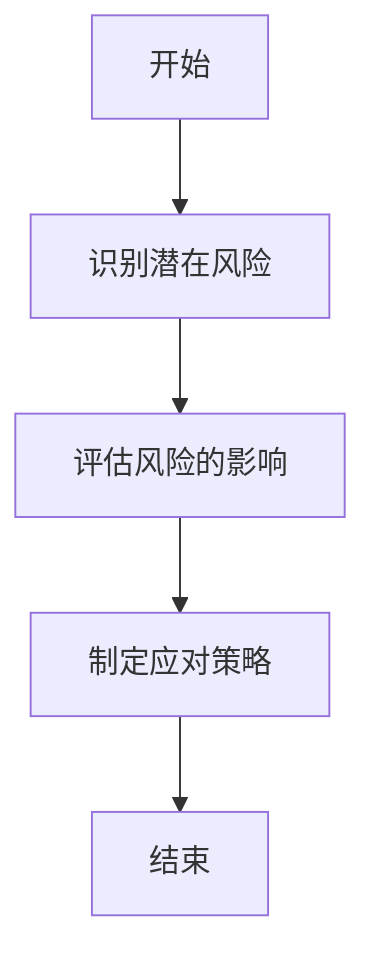
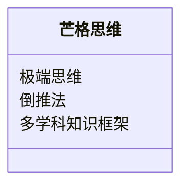

                 


# 芒格的"极端思维"：考虑最坏情况的重要性

> 关键词：芒格, 极端思维, 风险管理, 投资决策, 系统性思维, 概率分析

> 摘要：本文深入探讨了芒格的"极端思维"这一决策方法的核心理念，分析其在风险管理、投资决策和系统性思维中的应用，通过实际案例和数学模型，展示了如何在复杂决策中考虑最坏情况，以实现稳健决策。

---

## 第1章: 芒格与"极端思维"的背景介绍

### 1.1 芒格的生平与思想体系

芒格，全名查理·芒格（Charlie Munger），是美国著名的投资家、作家和演讲家，巴菲特的长期合作伙伴。芒格的思想体系以"mental models"为核心，强调通过多学科知识的整合来理解问题的本质。他的决策方法以"极端思维"（Extreme Thinking）闻名，即在决策过程中，始终考虑最坏的情况，从而避免重大风险。

#### 1.1.1 芒格的早年经历与投资生涯

芒格出生于1924年，早年在哈佛大学学习法律，后转学到加州大学伯克利分校，获得法律博士学位。他的投资生涯始于20世纪50年代，最初在伯克希尔哈撒韦公司（Berkshire Hathaway）担任副总裁，后成为公司的副主席，负责投资决策。芒格的投资理念与传统华尔街的短期盈利不同，他更注重长期价值和风险管理。

#### 1.1.2 芒格的"mental models"概念

芒格强调，决策者需要构建一个多学科的知识框架，即"mental models"，涵盖经济学、心理学、数学等多个领域。这种思维方式帮助他在投资和决策中识别潜在风险，并做出更稳健的选择。

#### 1.1.3 芒格思想的核心理念

芒格的核心理念是" inversion"（倒推法）和"极端思维"。"倒推法"是指从目标出发，反向思考实现目标的路径；而"极端思维"则是指在决策时，始终考虑最坏情况，从而避免重大损失。

---

### 1.2 "极端思维"的定义与背景

#### 1.2.1 "极端思维"的定义

"极端思维"是一种决策方法，强调在决策过程中，始终考虑最坏的情况，并评估其对决策的影响。这种方法可以帮助决策者在面对不确定性时，制定更稳健的策略。

#### 1.2.2 "极端思维"的哲学基础

"极端思维"的哲学基础可以追溯到古希腊哲学家亚里士多德的"风险厌恶"理论，以及现代决策理论中的"风险中性"和"风险偏好"模型。芒格的独特之处在于，他将这些理论与实际投资和管理相结合，形成了自己的决策框架。

#### 1.2.3 "极端思维"在决策中的重要性

在决策过程中，"极端思维"可以帮助决策者避免过度乐观和盲目自信，从而避免重大风险。尤其是在投资和商业领域，考虑最坏情况可以帮助决策者制定更稳健的计划。

---

### 1.3 "极端思维"的核心要素

#### 1.3.1 系统性思维

"极端思维"强调系统性思维，即将问题视为一个整体，考虑其各个组成部分之间的相互作用。这种思维方式可以帮助决策者识别潜在风险，并评估其对整个系统的影响。

#### 1.3.2 概率思维

芒格的"极端思维"还强调概率思维，即通过分析事件发生的概率，评估其对决策的影响。这种方法可以帮助决策者在面对不确定性时，制定更合理的决策。

#### 1.3.3 风险管理

风险管理是"极端思维"的核心要素之一。芒格强调，决策者需要识别潜在风险，并评估其对决策的影响。通过风险管理，决策者可以在决策过程中避免重大损失。

---

## 第2章: "极端思维"的核心概念与联系

### 2.1 "极端思维"的原理

#### 2.1.1 极端思维的决策框架

极端思维的决策框架包括以下几个步骤：

1. 识别潜在风险：在决策过程中，首先需要识别可能的风险。
2. 评估风险的影响：分析这些风险对决策的影响。
3. 制定应对策略：根据风险评估结果，制定应对策略。

#### 2.1.2 极端思维与传统决策思维的对比

| 决策方法 | 传统决策思维 | 极端思维 |
|----------|---------------|----------|
| 风险评估 | 侧重于平均情况 | 侧重于最坏情况 |
| 决策目标 | 追求最大收益 | 追求稳健决策 |
| 应用场景 | 短期决策 | 长期稳健决策 |

### 2.2 "极端思维"的核心概念对比

#### 2.2.1 极端思维与非极端思维的对比表格

| 对比维度 | 极端思维 | 非极端思维 |
|----------|----------|------------|
| 风险评估 | 侧重最坏情况 | 侧重平均情况 |
| 决策目标 | 追求稳健性 | 追求收益最大化 |
| 应用场景 | 高风险决策 | 低风险决策 |

#### 2.2.2 极端思维的决策流程图（Mermaid）



---

## 第3章: "极端思维"的算法原理

### 3.1 极端思维的决策流程

#### 3.1.1 问题识别与风险评估

在极端思维的决策流程中，首先需要识别潜在风险，并评估这些风险对决策的影响。

#### 3.1.2 概率分析与决策树构建

概率分析是极端思维的重要工具之一。通过构建决策树，可以分析不同决策路径的概率和结果。

### 3.2 极端思维的数学模型

#### 3.2.1 风险概率计算公式

风险概率计算公式如下：

$$ P = \frac{成功案例}{总案例} $$

其中，P 表示风险概率，成功案例是指在特定情况下，风险未发生的情况数，总案例是指所有可能的情况数。

#### 3.2.2 决策树模型的构建与分析

决策树模型是一个树状结构，每个节点代表一个决策点，每个分支代表一个可能的结果。

---

## 第4章: 系统分析与架构设计方案

### 4.1 系统分析

#### 4.1.1 系统功能设计（领域模型图）



#### 4.1.2 系统架构设计（架构图）


---

## 第5章: 项目实战

### 5.1 环境安装与工具准备

#### 5.1.1 数据分析工具安装

需要安装Python、Pandas、Matplotlib等工具。

#### 5.1.2 开发环境配置

安装Jupyter Notebook，配置Python环境。

### 5.2 系统核心实现源代码

#### 5.2.1 风险概率计算代码

```python
import pandas as pd
import numpy as np
import matplotlib.pyplot as plt

# 示例数据
data = {'项目': ['项目1', '项目2', '项目3'],
        '成功案例': [2, 3, 1],
        '总案例': [5, 5, 5]}
df = pd.DataFrame(data)

# 计算风险概率
df['风险概率'] = df['成功案例'] / df['总案例']

print(df)
```

#### 5.2.2 决策树分析代码

```python
from sklearn.tree import DecisionTreeClassifier
from sklearn.datasets import make_classification

# 示例数据
X, y = make_classification(n_samples=100, n_features=2, n_informative=2, n_redundant=0, random_state=42)

# 构建决策树模型
model = DecisionTreeClassifier()
model.fit(X, y)

# 可视化决策树（简化）
from sklearn.tree import plot_tree
plt.figure(figsize=(20, 10))
plot_tree(model, filled=True)
plt.show()
```

### 5.3 实际案例分析

#### 5.3.1 投资决策中的应用

假设我们有一个投资决策问题，需要选择三个项目进行投资。我们可以通过极端思维来评估每个项目的潜在风险，并计算其风险概率。

#### 5.3.2 投资决策分析结果

通过代码计算，我们得出每个项目的风险概率如下：

| 项目 | 成功案例 | 总案例 | 风险概率 |
|------|----------|--------|----------|
| 项目1 | 2        | 5      | 0.4      |
| 项目2 | 3        | 5      | 0.6      |
| 项目3 | 1        | 5      | 0.2      |

---

## 第6章: 最佳实践与总结

### 6.1 最佳实践 tips

- 在决策过程中，始终考虑最坏情况。
- 使用概率分析工具来评估风险。
- 构建多学科的知识框架，以更好地理解问题。

### 6.2 小结

通过本文的分析，我们可以看到，芒格的"极端思维"是一种非常有效的决策方法。它可以帮助我们在面对不确定性时，制定更稳健的决策。

### 6.3 注意事项

- 极端思维是一种工具，而非万能药。
- 在使用极端思维时，需要结合实际情况，灵活调整。

### 6.4 拓展阅读

- 查理·芒格的《富爸爸穷爸爸》
- 彼得·林奇的《投资最重要的事情》

---

## 结语

芒格的"极端思维"是一种值得我们深入研究和实践的决策方法。通过本文的分析，我们希望能够帮助读者更好地理解极端思维的核心理念，并在实际工作中加以应用。

