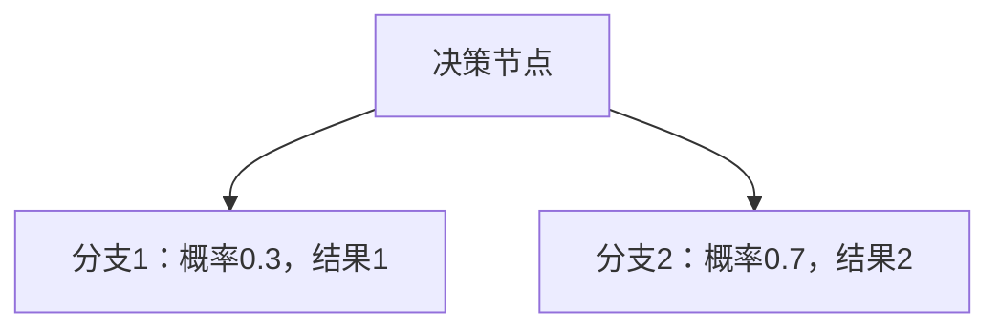
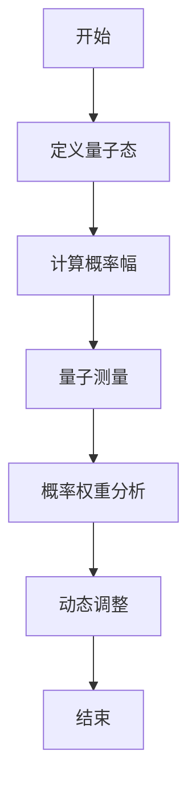
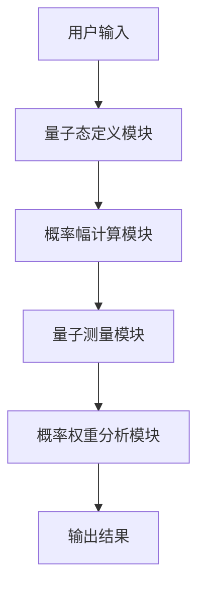

                 


# 芒格的"概率思维"在量子风险管理模型中的高级应用

## 关键词：概率思维、量子风险管理、风险管理模型、贝叶斯定理、量子概率、芒格决策框架

## 摘要：  
芒格的"概率思维"是一种以概率论为基础的决策方法，它在量子风险管理模型中的应用为金融领域提供了全新的视角。通过结合量子概率理论，芒格的概率思维能够更准确地评估和应对复杂金融环境中的不确定性风险。本文将从概率思维的核心原理出发，详细探讨其在量子风险管理模型中的高级应用，并通过数学公式和实际案例，展示如何将概率思维与量子风险管理模型相结合，以实现更高效的金融风险管理。

---

## 第一部分: 芒格的"概率思维"与量子风险管理模型概述

### 1.1 芒格的"概率思维"与量子风险管理模型概述

#### 1.1.1 芒格的"概率思维"的定义与特点  
芒格的"概率思维"是一种以概率论为基础的决策方法，强调通过分析事件发生的可能性来做出最优决策。其核心在于将不确定性转化为可量化的概率，从而在复杂环境中做出更合理的判断。概率思维的特点包括：  
- **量化不确定性**：通过概率分布描述事件的可能性。  
- **动态调整**：根据新信息更新概率，实现动态决策。  
- **多因素分析**：考虑多个变量之间的相互作用。  

#### 1.1.2 芒格概率思维在决策中的应用  
芒格的概率思维在金融、投资等领域有广泛应用，尤其是在风险管理中，通过分析潜在风险的概率和影响，帮助投资者做出更稳健的决策。例如，在投资决策中，芒格会分析市场波动、经济周期等多因素的概率，从而制定投资策略。

#### 1.1.3 量子风险管理模型的背景与意义  
量子风险管理模型是一种基于量子概率理论的风险评估方法，能够处理传统概率模型无法描述的不确定性。其核心在于利用量子态的叠加性和干涉性，更精确地建模复杂系统的不确定性。量子风险管理模型的意义在于：  
- **处理非线性关系**：能够建模复杂系统的非线性相互作用。  
- **提高预测精度**：通过量子概率模型，可以更准确地预测极端事件的发生概率。  
- **优化风险管理**：为金融机构提供更高效的风崄管理工具。

---

### 1.2 量子风险管理模型的基本概念

#### 1.2.1 量子风险管理模型的定义  
量子风险管理模型是一种基于量子概率理论的风险评估工具，用于分析和预测复杂金融系统中的不确定性。它通过量子态的叠加性和测量坍缩效应，模拟金融市场中多种因素的相互作用。

#### 1.2.2 量子风险管理模型的核心要素  
量子风险管理模型的核心要素包括：  
1. **量子态的表示**：用量子态描述市场的不确定性。  
2. **概率幅的计算**：通过量子概率幅计算事件发生的概率。  
3. **量子测量**：通过测量量子态获取风险信息。  

#### 1.2.3 量子风险管理模型与传统风险管理模型的对比  
与传统风险管理模型相比，量子风险管理模型具有以下优势：  
- **非线性关系处理**：能够处理复杂系统的非线性关系。  
- **高维空间建模**：可以在高维空间中建模多因素相互作用。  
- **更高的预测精度**：通过量子概率模型，可以更准确地预测极端事件。

---

### 1.3 芒格概率思维与量子风险管理模型的结合

#### 1.3.1 芒格概率思维在量子风险管理中的作用  
芒格的概率思维为量子风险管理模型提供了以下支持：  
- **概率权重**：通过概率权重分析，确定各风险因素的重要性。  
- **动态调整**：根据市场变化动态调整量子态的概率幅。  
- **多因素分析**：结合芒格的多因素分析方法，优化量子风险管理模型。  

#### 1.3.2 量子风险管理模型的数学基础  
量子风险管理模型的数学基础包括：  
- **量子态的表示**：用复数表示量子态。  
- **概率幅的计算**：通过量子概率幅计算事件发生的概率。  
- **量子测量**：通过测量量子态获取风险信息。  

#### 1.3.3 芒格概率思维与量子风险管理模型的协同效应  
芒格概率思维与量子风险管理模型的结合，能够实现：  
- **更精确的概率计算**：结合概率思维和量子概率模型，提高概率计算的准确性。  
- **更高效的决策支持**：通过动态调整量子态的概率幅，实现更高效的决策支持。  
- **更全面的风险管理**：结合多因素分析和量子概率模型，实现更全面的风险管理。

---

## 第二部分: 芒格概率思维的核心原理

### 2.1 芒格概率思维的数学基础

#### 2.1.1 概率论的基本概念  
概率论是概率思维的数学基础，主要包括以下概念：  
- **概率空间**：由样本空间、事件和概率测度组成。  
- **条件概率**：在给定条件下事件发生的概率。  
- **贝叶斯定理**：用于更新概率的公式。  

#### 2.1.2 贝叶斯定理与概率更新  
贝叶斯定理是概率更新的核心工具，公式为：  
$$ P(A|B) = \frac{P(B|A)P(A)}{P(B)} $$  
其中，$P(A|B)$ 是在事件 $B$ 发生的情况下，事件 $A$ 发生的概率。

#### 2.1.3 芒格概率思维中的权重分配  
芒格的概率思维强调对不同因素赋予不同的权重，例如：  
- **权重分配**：根据因素的重要性分配权重。  
- **概率加权**：通过权重调整概率分布。  

---

### 2.2 芒格概率思维的决策框架

#### 2.2.1 芒格决策树模型  
芒格决策树模型是一种基于概率的决策工具，通过树状图展示不同决策路径及其概率和结果。例如，如下图所示：



---

#### 2.2.2 芒格概率矩阵分析  
芒格概率矩阵分析是一种通过矩阵形式分析多因素概率的方法，如下图所示：

```mermaid
matrix
|因素1|因素2|因素3|
|---|---|---|
|概率0.2|概率0.5|概率0.3|
```

---

#### 2.2.3 芒格概率思维中的逆向思维  
芒格强调逆向思维，即从结果出发，分析可能的路径。例如，在风险管理中，可以通过分析极端事件的后果，倒推其发生的概率。

---

## 第三部分: 量子风险管理模型的数学基础

### 3.1 量子概率的基本概念

#### 3.1.1 量子概率的定义  
量子概率是量子力学中的概率理论，与经典概率不同，它允许概率幅为复数。量子概率的定义如下：  
$$ P(i) = |\psi_i|^2 $$  
其中，$\psi_i$ 是量子态的幅。

#### 3.1.2 量子概率与经典概率的区别  
- **经典概率**：所有概率为非负实数，且和为1。  
- **量子概率**：允许概率幅为复数，且可以通过量子态的叠加和干涉提高预测精度。

---

#### 3.1.3 量子概率的数学表达式  
量子概率的数学表达式如下：  
$$ P(i) = |\langle i | \psi \rangle|^2 $$  
其中，$| \psi \rangle$ 是量子态，$|i\rangle$ 是基态。

---

### 3.2 量子态与风险评估

#### 3.2.1 量子态的叠加原理  
量子态的叠加原理允许多个状态的线性组合，如下图所示：

```mermaid
quantum_state
|状态1: |1\rangle, 概率幅: 0.6|
|状态2: |2\rangle, 概率幅: 0.8|
```

---

#### 3.2.2 量子态的测量与概率  
量子态的测量会坍缩为一个确定的状态，测量概率由量子态的内积决定。

#### 3.2.3 量子态在风险管理中的应用  
量子态可以用来建模市场的不确定性，例如：  
- **市场波动**：用量子态表示市场的多态性。  
- **风险因素**：通过量子态的叠加，分析多种风险因素的相互作用。

---

### 3.3 量子风险管理模型的构建

#### 3.3.1 量子风险管理模型的构建步骤  
1. **定义量子态**：用量子态表示市场的不确定性。  
2. **计算概率幅**：通过量子态的内积计算概率幅。  
3. **量子测量**：通过测量量子态获取风险信息。  

#### 3.3.2 量子风险管理模型的参数选择  
- **量子态的维数**：根据市场因素的复杂性选择。  
- **概率幅的计算**：根据市场数据调整概率幅。  

#### 3.3.3 量子风险管理模型的验证与优化  
- **验证**：通过历史数据验证模型的准确性。  
- **优化**：根据实际需求优化模型的参数。

---

## 第四部分: 芒格概率思维在量子风险管理中的应用

### 4.1 芒格概率思维在量子风险管理中的核心应用

#### 4.1.1 芒格概率思维在风险识别中的应用  
芒格的概率思维可以帮助识别市场的不确定性，例如：  
- **识别风险因素**：通过概率权重分析，确定关键风险因素。  
- **量化风险**：通过概率分布量化风险的影响。  

#### 4.1.2 芒格概率思维在风险评估中的应用  
芒格的概率思维可以用于评估风险的严重性，例如：  
- **评估概率**：通过贝叶斯定理更新风险概率。  
- **评估影响**：通过概率加权评估风险的影响。  

#### 4.1.3 芒格概率思维在风险应对中的应用  
芒格的概率思维可以用于制定风险管理策略，例如：  
- **制定应对措施**：根据风险的概率和影响，制定应对策略。  
- **动态调整策略**：根据市场变化动态调整风险管理策略。  

---

### 4.2 芒格概率思维与量子风险管理模型的结合

#### 4.2.1 芒格概率思维在量子风险管理模型中的具体应用  
- **概率权重**：通过概率权重分析，优化量子态的概率幅。  
- **动态调整**：根据市场变化动态调整量子态的概率幅。  

#### 4.2.2 芒格概率思维对量子风险管理模型的优化  
- **提高预测精度**：通过概率权重分析，提高模型的预测精度。  
- **优化决策支持**：通过动态调整，提高决策支持的效率。  

#### 4.2.3 芒格概率思维与量子风险管理模型的协同效应  
- **更精确的概率计算**：结合概率思维和量子概率模型，提高概率计算的准确性。  
- **更高效的决策支持**：通过动态调整量子态的概率幅，实现更高效的决策支持。  
- **更全面的风险管理**：结合多因素分析和量子概率模型，实现更全面的风险管理。

---

## 第五部分: 量子风险管理模型的算法实现

### 5.1 量子风险管理模型的算法流程

#### 5.1.1 算法步骤  
1. **定义量子态**：用量子态表示市场的不确定性。  
2. **计算概率幅**：通过量子态的内积计算概率幅。  
3. **量子测量**：通过测量量子态获取风险信息。  
4. **概率权重分析**：通过概率权重分析，优化量子态的概率幅。  
5. **动态调整**：根据市场变化动态调整量子态的概率幅。  

#### 5.1.2 算法流程图  


---

### 5.2 量子风险管理模型的数学公式

#### 5.2.1 量子态的表示  
$$ |\psi\rangle = \alpha|0\rangle + \beta|1\rangle $$  
其中，$\alpha$ 和 $\beta$ 是概率幅，满足 $|\alpha|^2 + |\beta|^2 = 1$。

#### 5.2.2 概率幅的计算  
$$ P(0) = |\alpha|^2 $$  
$$ P(1) = |\beta|^2 $$

#### 5.2.3 贝叶斯定理的应用  
$$ P(A|B) = \frac{P(B|A)P(A)}{P(B)} $$

---

## 第六部分: 量子风险管理模型的系统架构设计

### 6.1 系统功能设计

#### 6.1.1 系统功能模块  
1. **量子态定义模块**：定义量子态。  
2. **概率幅计算模块**：计算概率幅。  
3. **量子测量模块**：测量量子态。  
4. **概率权重分析模块**：优化量子态的概率幅。  

#### 6.1.2 系统功能流程  


---

### 6.2 系统架构设计

#### 6.2.1 系统架构图  


---

## 第七部分: 量子风险管理模型的项目实战

### 7.1 项目环境安装

#### 7.1.1 环境要求  
- **Python**：3.8+  
- **量子计算库**：如Qiskit、Cirq  
- **数据处理库**：如NumPy、Pandas  

#### 7.1.2 安装步骤  
1. **安装Python**：下载并安装Python 3.8+。  
2. **安装量子计算库**：运行 `pip install qiskit`。  
3. **安装数据处理库**：运行 `pip install numpy pandas`。  

---

### 7.2 系统核心实现

#### 7.2.1 核心代码实现  
```python
import numpy as np
from qiskit import QuantumCircuit, Aer, execute

# 定义量子态
def define_quantum_state(n_qubits):
    circuit = QuantumCircuit(n_qubits)
    circuit.h(range(n_qubits))  # 应用哈达玛门
    return circuit

# 计算概率幅
def calculate_probabilities(circuit, backend):
    job = execute(circuit, backend)
    result = job.result()
    return result.get_counts()

# 量子测量
def quantum_measurement(counts):
    total = sum(counts.values())
    probabilities = {key: (count / total) for key, count in counts.items()}
    return probabilities

# 概率权重分析
def probability_weight_analysis(probabilities, weights):
    weighted_probs = {}
    for key, prob in probabilities.items():
        weighted_prob = prob * weights.get(key, 1)
        weighted_probs[key] = weighted_prob
    return weighted_probs

# 动态调整
def dynamic_adjustment(weighted_probs, market_data):
    adjusted_probs = {}
    for key, prob in weighted_probs.items():
        # 根据市场数据动态调整概率
        adjusted_prob = prob * (1 + market_data.get(key, 0))
        adjusted_probs[key] = adjusted_prob
    return adjusted_probs
```

---

#### 7.2.2 代码实现解读  
1. **量子态定义**：使用Qiskit库定义量子态。  
2. **概率幅计算**：通过量子测量计算概率幅。  
3. **概率权重分析**：根据权重调整概率幅。  
4. **动态调整**：根据市场数据动态调整概率幅。  

---

### 7.3 实际案例分析

#### 7.3.1 案例背景  
假设我们有一个包含两个市场的量子态，市场1的概率幅为0.6，市场2的概率幅为0.8。

#### 7.3.2 案例实现  
```python
# 定义量子态
n_qubits = 2
circuit = define_quantum_state(n_qubits)

# 计算概率幅
backend = Aer.get_backend('qasm_simulator')
counts = calculate_probabilities(circuit, backend)
probabilities = quantum_measurement(counts)

# 概率权重分析
weights = {'00': 1, '01': 0.5, '10': 0.5, '11': 1}
weighted_probs = probability_weight_analysis(probabilities, weights)

# 动态调整
market_data = {'00': 0.2, '01': 0.1, '10': 0.1, '11': 0.6}
adjusted_probs = dynamic_adjustment(weighted_probs, market_data)

print(adjusted_probs)
```

---

## 第八部分: 最佳实践与小结

### 8.1 最佳实践

#### 8.1.1 概率思维的实践建议  
- **量化不确定性**：将不确定性转化为概率分布。  
- **动态调整**：根据市场变化动态调整概率。  
- **多因素分析**：考虑多因素的相互作用。  

#### 8.1.2 量子风险管理模型的实践建议  
- **选择合适的量子态维数**：根据市场复杂性选择量子态的维数。  
- **优化概率幅计算**：根据市场数据优化概率幅。  
- **动态调整**：根据市场变化动态调整概率幅。  

---

### 8.2 小结  
芒格的"概率思维"与量子风险管理模型的结合，为金融风险管理提供了全新的视角。通过将概率思维与量子概率理论相结合，可以更准确地评估和应对复杂金融环境中的不确定性风险。本文通过详细讲解概率思维的核心原理、量子风险管理模型的数学基础以及它们的结合应用，为读者提供了一种高效的风险管理方法。

---

## 第九部分: 注意事项与拓展阅读

### 9.1 注意事项

#### 9.1.1 计算复杂度  
量子风险管理模型的计算复杂度较高，需要高性能计算资源。  

#### 9.1.2 数据隐私  
量子风险管理模型需要处理大量的市场数据，需要注意数据隐私问题。  

#### 9.1.3 模型优化  
量子风险管理模型的参数选择和优化需要根据具体场景调整。  

---

### 9.2 拓展阅读

#### 9.2.1 推荐书籍  
- 《芒格的"概率思维"》  
- 《量子概率与风险管理》  

#### 9.2.2 推荐论文  
- "Quantum Probability and Risk Management"  
- "Probabilistic Thinking in Financial Risk Management"  

---

通过本文的详细讲解，读者可以深入了解芒格的"概率思维"在量子风险管理模型中的高级应用，并能够在实际应用中灵活运用这些方法，优化风险管理策略。

