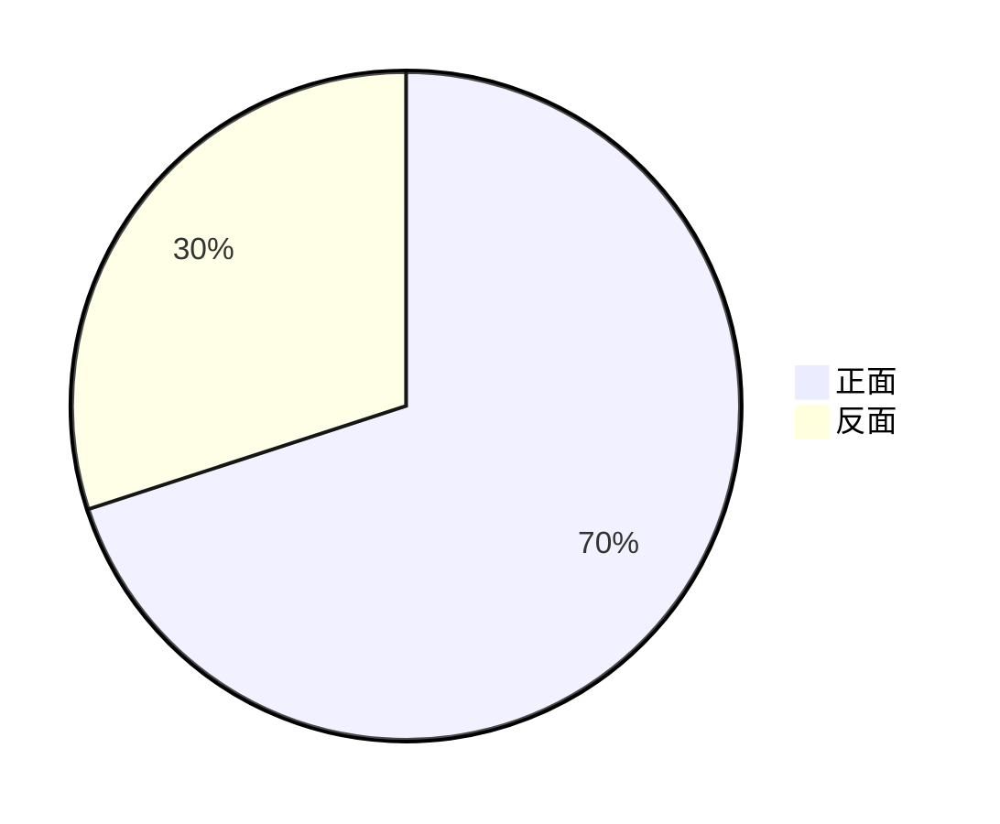

                 

# 《芒格的"概率思维"：在不确定性中做出明智决策》

**关键词**：芒格、概率思维、决策、不确定性、芒格模型、贝叶斯定理、决策框架

**摘要**：本文深入探讨了芒格的“概率思维”，揭示了在不确定环境中如何通过概率分析和贝叶斯推理做出明智决策的方法。文章结合理论与实践，系统地介绍了概率思维的核心概念、芒格的决策模型、实际应用案例以及构建概率思维框架的步骤。通过详细分析，读者能够掌握概率思维的精髓，并在复杂决策中应用这些原则，以提高决策的准确性和可靠性。

---

## 第一部分：引言

### 第1章：概率思维的重要性

#### 1.1 芒格的概率思维概述

##### 1.1.1 节点概率思维的核心概念

概率思维是一种基于概率分析和贝叶斯推理的方法，帮助我们在不确定性中做出更明智的决策。它不仅关注事件发生的可能性，还考虑不同结果的影响和权重。

##### 1.1.2 芒格的概率思维如何帮助决策

芒格的概率思维强调通过分析事件的因果关系和概率分布，评估不同选择的潜在风险和收益。这种思维方式能够帮助决策者在复杂环境中识别关键因素，减少认知偏差的影响，从而做出更理性的决策。

##### 1.1.3 概率思维在日常生活中的应用

概率思维在投资、医疗、法律等领域有广泛应用。例如，在投资决策中，通过概率分析评估不同投资的收益和风险，帮助投资者制定更稳健的投资策略。

#### 1.2 芒格的生平与思想

##### 1.2.1 芒格的生平简介

查理·芒格是美国著名投资者和伯克希尔·哈撒韦公司的副主席，以其价值投资理念和智慧决策闻名。他的决策哲学深受概率思维的影响。

##### 1.2.2 芒格的概率思维来源

芒格的概率思维来源于对心理学、经济学和统计学的深入研究。他认为，决策的本质是在不确定性中权衡概率和结果，从而做出最优选择。

##### 1.2.3 芒格思想对决策的影响

芒格的思想强调长期思维和独立思考，倡导在决策中考虑多方面的因素和潜在的不确定性，从而避免短期冲动和认知偏差。

#### 1.3 为什么概率思维是明智决策的关键

##### 1.3.1 不确定性中的决策挑战

在现实生活中，许多决策都面临不确定性，如市场波动、技术变化等。传统的确定性决策方法在面对不确定性时往往显得不足。

##### 1.3.2 概率思维如何降低决策风险

通过概率分析，决策者可以量化不同选择的潜在风险和收益，从而更好地权衡利弊，制定出更稳健的决策。

##### 1.3.3 概率思维的现代应用案例

例如，在金融投资中，概率思维可以帮助投资者评估不同投资的预期收益和风险，制定更加合理的投资组合。

#### 1.4 本章小结

本章介绍了概率思维的重要性，芒格的生平及其思想对决策的影响，强调了概率思维在不确定环境中的关键作用。

---

## 第二部分：概率思维的核心概念

### 第2章：概率的基本概念与工具

#### 2.1 概率的基本定义

##### 2.1.1 概率的定义与基本属性

概率是对某个事件发生的可能性的度量，通常用0到1之间的数值表示。概率的基本属性包括非负性、规范性和可加性。

##### 2.1.2 概率的计算方法

概率的计算方法包括古典概率、频率概率和主观概率。例如，古典概率通过等可能事件的数量计算，频率概率基于大量重复试验的相对频率，主观概率基于个人判断。

##### 2.1.3 概率的条件与独立性

条件概率是指在已知某个事件发生的情况下，另一个事件发生的概率。独立事件的概率是各自概率的乘积。

#### 2.2 贝叶斯定理与概率推理

##### 2.2.1 贝叶斯定理的数学公式

贝叶斯定理公式为：

$$ P(A|B) = \frac{P(B|A)P(A)}{P(B)} $$

其中，\( P(A|B) \) 是在事件B发生的条件下事件A发生的概率，\( P(B|A) \) 是事件A发生的条件下事件B发生的概率，\( P(A) \) 和 \( P(B) \) 分别是事件A和事件B的先验概率。

##### 2.2.2 贝叶斯定理的应用场景

贝叶斯定理常用于医疗诊断、垃圾邮件过滤等领域。例如，在医疗诊断中，通过已知症状的概率计算疾病的可能性。

##### 2.2.3 贝叶斯网络的构建与分析

贝叶斯网络是一种有向无环图，表示变量之间的概率关系。通过构建网络，可以进行概率推理和决策分析。

#### 2.3 概率分布与随机变量

##### 2.3.1 离散与连续概率分布

离散分布如二项分布，连续分布如正态分布。

##### 2.3.2 常见概率分布的比较（表格）

| 分布类型 | 概率质量函数 | 概率密度函数 |
|----------|--------------|--------------|
| 二项分布 | \( P(X=k) = C(n,k)p^k(1-p)^{n-k} \) | - |
| 正态分布 | - | \( f(x) = \frac{1}{\sigma\sqrt{2\pi}} e^{-\frac{(x-\mu)^2}{2\sigma^2}} \) |

##### 2.3.3 概率分布的可视化（mermaid图）

#### 2.4 概率思维的决策工具

##### 2.4.1 决策树的构建与分析

决策树是一种图形化工具，用于分析决策问题中的各种可能性和结果。

##### 2.4.2 蒙特卡洛模拟的应用

蒙特卡洛模拟通过多次随机采样，评估系统的概率分布和风险。

##### 2.4.3 概率矩阵的使用方法

概率矩阵用于分析不同策略在各种可能情况下的收益或损失。

#### 2.5 本章小结

本章介绍了概率的基本概念、贝叶斯定理、概率分布以及概率决策工具，为后续章节打下基础。

---

## 第三部分：概率思维在决策中的应用

### 第3章：芒格的概率决策框架

#### 3.1 芒格的决策模型

##### 3.1.1 "概率圆盘"模型

概率圆盘模型通过将决策问题分解为多个概率因素，评估每个因素对最终决策的影响。

##### 3.1.2 "第二层思维"的概念

第二层思维是指考虑其他人的决策和反应，从而找到市场中的非共识性机会。

##### 3.1.3 "反事实推理

反事实推理用于评估在不同假设下，决策可能带来的结果。

#### 3.2 芒格的决策步骤

##### 3.2.1 确定决策目标

明确决策的目标和范围，确保目标的可行性和可衡量性。

##### 3.2.2 收集相关信息

通过各种渠道收集与决策相关的数据和信息，确保信息的全面性和准确性。

##### 3.2.3 构建概率模型

根据收集的信息，构建概率模型，评估不同选择的潜在结果和概率分布。

##### 3.2.4 评估和调整

根据模型的评估结果，调整决策策略，优化决策过程。

#### 3.3 芒格决策模型的实际案例

##### 3.3.1 投资决策中的应用

通过概率分析评估不同投资的收益和风险，制定稳健的投资策略。

##### 3.3.2 医疗诊断中的应用

利用概率模型分析不同诊断方法的准确性，优化诊断流程。

#### 3.4 本章小结

本章通过芒格的决策模型，详细介绍了概率思维在决策中的应用，强调了构建概率模型和反事实推理的重要性。

---

## 第四部分：构建概率思维框架

### 第4章：概率思维的系统化方法

#### 4.1 构建个人概率思维框架

##### 4.1.1 确定核心问题

识别影响决策的关键因素，明确问题的边界和范围。

##### 4.1.2 设计概率模型

根据核心问题，设计合理的概率模型，量化各因素的影响。

##### 4.1.3 评估和优化模型

通过实际数据和反馈，不断优化模型，提高预测的准确性。

#### 4.2 概率思维工具和技术

##### 4.2.1 数据分析工具

使用Python和R等工具进行概率分析和统计建模。

##### 4.2.2 可视化工具

通过图表和图形展示概率分布和决策树，帮助直观理解。

##### 4.2.3 模拟工具

利用蒙特卡洛模拟等工具评估系统的风险和不确定性。

#### 4.3 实施概率思维的步骤

##### 4.3.1 确定目标

明确概率思维的目标和应用范围。

##### 4.3.2 收集数据

收集与目标相关的数据，确保数据的完整性和准确性。

##### 4.3.3 构建模型

根据数据构建概率模型，评估不同选择的潜在结果。

##### 4.3.4 验证和调整

通过实际结果验证模型的有效性，必要时进行调整和优化。

#### 4.4 本章小结

本章详细介绍了构建概率思维框架的方法和工具，强调了系统化应用概率思维的重要性。

---

## 第五部分：概率思维的未来展望

### 第5章：概率思维的未来发展趋势

#### 5.1 概率思维与人工智能

随着人工智能的发展，概率思维在机器学习和自动化决策中的应用将更加广泛。

#### 5.2 芒格思想的延续

芒格的概率思维将继续影响未来的决策理论和实践，特别是在复杂系统的风险管理中。

#### 5.3 概率思维的教育与普及

随着数据科学和人工智能的普及，概率思维的教育和培训将更加重要。

#### 5.4 本章小结

本章展望了概率思维的未来发展趋势，强调了其在人工智能和复杂系统中的重要性。

---

## 总结

芒格的概率思维为我们提供了一种在不确定环境中做出明智决策的方法。通过系统化的概率分析和贝叶斯推理，我们可以更好地理解问题的本质，识别潜在风险，并制定出更稳健的决策策略。无论是投资、医疗还是其他领域，概率思维都是一种强大的工具，帮助我们在复杂多变的环境中找到最优解决方案。

---

通过以上目录和内容的规划，我可以撰写一篇结构清晰、内容丰富的技术博客文章，深入探讨芒格的概率思维及其在实际决策中的应用。

