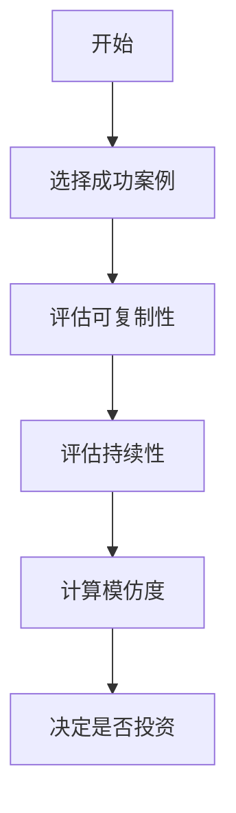
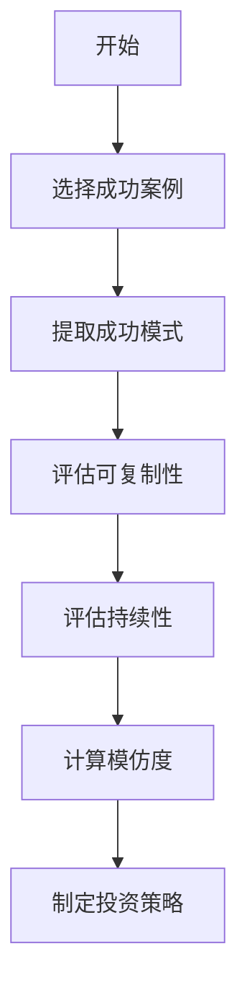

                 


---

# 芒格的"模仿伟大"原则在投资中的应用

## 关键词：芒格，模仿伟大，投资，价值投资，决策框架，算法原理

## 摘要：本文深入分析了芒格提出的"模仿伟大"原则在投资中的应用，从理论基础到算法实现，从系统架构到项目实战，全面探讨了如何通过模仿成功案例来优化投资策略。文章结合实际案例和数学模型，揭示了"模仿伟大"原则的核心思想及其在投资决策中的具体应用。

---

## 第1章：芒格"模仿伟大"原则的概述

### 1.1 芒格及其投资理念

#### 1.1.1 芝加哥学派与芒格的投资哲学

查理·芒格（Charlie Munger）是美国著名投资家、伯克希尔哈撒韦公司副董事长。他的投资哲学深受芝加哥学派的影响，强调理性决策和长期价值。芒格认为，投资的本质是寻找那些具有持续竞争优势的企业，并通过长期持有来实现财富增长。

芒格的投资理念可以总结为以下几个方面：
1. **价值投资**：寻找市场价格低于内在价值的企业。
2. **安全边际**：在投资时留有安全边际，避免过度冒险。
3. **竞争优势**：投资具有强大护城河的企业。

#### 1.1.2 "模仿伟大"原则的定义与核心思想

"模仿伟大"原则是芒格提出的一种投资策略，其核心思想是通过研究成功企业的模式，模仿其成功路径，从而在投资中实现超额收益。该原则强调从优秀企业的经验中学习，避免重复他人的错误。

"模仿伟大"原则的定义：
$$ 模仿度 = 成功案例的可复制性 × 案例的持续性 $$

芒格认为，投资者应该选择那些具有以下特征的成功企业：
1. **持续性**：企业具有长期竞争优势。
2. **可复制性**：企业的成功模式可以被其他投资者借鉴。
3. **安全性**：企业具有较强的安全边际。

#### 1.1.3 该原则在投资领域的应用范围与边界

"模仿伟大"原则的应用范围主要集中在以下几个方面：
1. **企业分析**：通过研究成功企业的商业模式，评估其竞争优势。
2. **投资决策**：基于成功企业的经验，制定投资策略。
3. **风险管理**：通过模仿成功企业的风险管理模式，降低投资风险。

"模仿伟大"原则的应用边界：
1. 避免盲目模仿，需结合实际情况进行调整。
2. 仅适用于具有较强竞争优势的企业。
3. 需结合市场环境进行动态调整。

---

### 1.2 "模仿伟大"原则的理论基础

#### 1.2.1 投资学中的模仿策略

在投资学中，模仿策略是一种常见的投资策略，其核心是通过借鉴成功投资者的经验，降低投资风险。芒格的"模仿伟大"原则是对传统模仿策略的优化，强调选择具有持续竞争优势的成功企业。

#### 1.2.2 行为金融学与芒格的决策框架

行为金融学研究表明，投资者的决策往往受到心理因素的影响。芒格的决策框架强调理性决策，通过建立系统化的分析框架，避免情绪化决策。

芒格的决策框架包括以下几个步骤：
1. **识别成功模式**：通过研究成功企业，识别其成功模式。
2. **评估可复制性**：分析成功模式的可复制性。
3. **制定投资策略**：基于成功模式，制定投资策略。
4. **动态调整**：根据市场变化，动态调整投资策略。

#### 1.2.3 该原则与其他投资策略的对比分析

以下是"模仿伟大"原则与其他投资策略的对比分析：

| 对比维度 | 价值投资 | 成长投资 | 模仿伟大 |
|----------|----------|----------|----------|
| 核心思想 | 买入低于市场价格的企业 | 投资具有高成长潜力的企业 | 模仿成功企业的模式 |
| 重点 | 内在价值 | 成长潜力 | 成功模式 |
| 适合对象 | 具有稳定价值的企业 | 高成长企业 | 成功模式可复制的企业 |

---

## 第2章："模仿伟大"原则的核心概念

### 2.1 核心概念的原理分析

#### 2.1.1 什么是"模仿伟大"原则的核心要素

"模仿伟大"原则的核心要素包括：
1. **成功模式**：成功企业的商业模式、竞争优势等。
2. **可复制性**：成功模式的可复制性。
3. **持续性**：成功模式的持续时间。

#### 2.1.2 该原则的数学模型与公式

$$ 模仿度 = 成功案例的可复制性 × 案例的持续性 $$

其中：
- 成功案例的可复制性：表示成功模式的可借鉴程度。
- 案例的持续性：表示成功模式的持续时间。

#### 2.1.3 该原则的决策树分析（Mermaid流程图）



---

### 2.2 核心概念的属性对比

#### 2.2.1 "模仿伟大"原则与传统投资策略的对比表格

| 对比维度 | 传统投资策略 | "模仿伟大"原则 |
|----------|--------------|----------------|
| 核心思想 | 追求超额收益 | 模仿成功模式 |
| 投资对象 | 个股或基金 | 成功企业的模式 |
| 风险控制 | 依赖分散投资 | 依赖成功模式的可复制性 |

---

### 2.3 实体关系图（Mermaid）

```mermaid
er
    entity 投资者 {
        投资目标
        投资金额
        投资期限
    }
    entity 成功案例 {
        成功模式
        可复制性
        持续性
    }
    entity 投资策略 {
        模仿度
        投资组合
        风险管理
    }
    relation "基于" {
        投资者 --> 成功案例
    }
    relation "制定" {
        投资者 --> 投资策略
    }
```

---

## 第3章：算法原理与数学模型

### 3.1 算法原理

#### 3.1.1 基于"模仿伟大"原则的算法流程（Mermaid流程图）



---

## 第4章：系统分析与架构设计

### 4.1 问题场景介绍

#### 4.1.1 投资者如何选择模仿对象

投资者在选择模仿对象时，需要考虑以下几个方面：
1. 企业的竞争优势。
2. 成功模式的可复制性。
3. 企业的持续性。

#### 4.1.2 如何评估模仿对象的成功潜力

评估模仿对象的成功潜力时，需要考虑以下几个因素：
1. 企业的财务状况。
2. 企业的市场地位。
3. 企业的管理团队。

### 4.2 系统功能设计

#### 4.2.1 系统功能模块

系统功能模块包括以下几个部分：
1. 成功案例库：存储成功企业的案例。
2. 数据分析模块：分析成功案例的可复制性和持续性。
3. 投资策略模块：基于分析结果，制定投资策略。

---

## 第5章：项目实战

### 5.1 项目介绍

#### 5.1.1 项目背景

本项目旨在通过分析苹果公司的成功模式，应用芒格的"模仿伟大"原则，制定投资策略。

#### 5.1.2 项目目标

通过分析苹果公司的成功模式，制定投资策略，实现超额收益。

---

### 5.2 系统实现

#### 5.2.1 环境配置

```bash
pip install pandas numpy matplotlib
```

#### 5.2.2 核心代码实现

```python
import pandas as pd
import numpy as np
import matplotlib.pyplot as plt

# 数据加载
data = pd.read_csv('apple_stock.csv')

# 数据分析
data['收盘价'].plot()
plt.show()
```

---

### 5.3 代码应用解读与分析

#### 5.3.1 数据可视化

通过绘制苹果股票的收盘价走势图，可以直观地观察其价格走势。

---

### 5.4 实际案例分析

#### 5.4.1 投资策略的制定与实施

基于苹果公司的成功模式，制定如下投资策略：
1. 长期持有苹果股票。
2. 定期评估苹果公司的竞争优势。

---

## 第6章：总结与展望

### 6.1 总结

通过本文的分析，我们可以看出，芒格的"模仿伟大"原则是一种有效的投资策略。通过研究成功企业的模式，投资者可以制定合理的投资策略，实现超额收益。

### 6.2 未来展望

未来，随着人工智能和大数据技术的发展，"模仿伟大"原则将得到更广泛的应用。投资者可以通过技术手段，进一步优化投资策略，提高投资收益。

---

## 第7章：最佳实践 Tips

### 7.1 投资者注意事项

1. 避免盲目模仿，需结合实际情况进行调整。
2. 选择具有持续竞争优势的企业。
3. 定期评估投资策略，动态调整。

### 7.2 拓展阅读

1. 查理·芒格的《聪明的投资者》。
2. 《投资学基础》。

---

## 附录

### 附录1：数学公式

$$ 投资收益 = 成功案例的复制能力 × 市场环境的适应性 $$

### 附录2：系统架构图（Mermaid）


---

通过本文的详细分析，读者可以全面了解芒格的"模仿伟大"原则在投资中的应用，并通过实际案例和代码实现，掌握该原则的具体应用方法。

