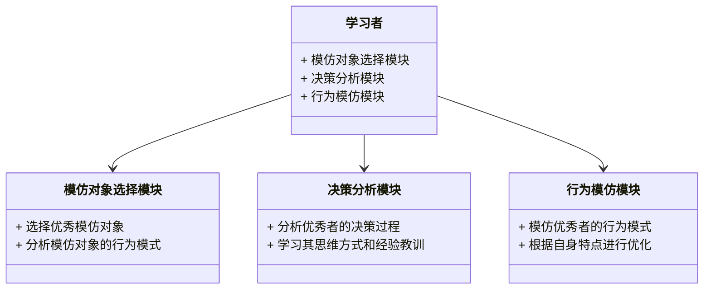

                 


# 《芒格的"模仿伟大"原则：向最优秀的人学习》

---

## 关键词：芒格, 模仿伟大, 学习方法, 决策科学, 投资策略

---

## 摘要：芒格的"模仿伟大"原则是一种通过学习和模仿优秀个体或群体的决策和行为模式来提升自身能力的方法。本文从背景介绍、核心概念、算法原理、系统分析、项目实战等多个维度，详细解读了“模仿伟大”原则的内涵、应用及其在个人成长和投资决策中的实际案例。通过本文，读者可以系统地了解如何通过模仿优秀人物来优化自己的决策过程和实现目标。

---

# 正文

## 第1章 芒格的"模仿伟大"原则概述

### 1.1 芒格的"模仿伟大"原则的背景与起源

#### 1.1.1 芒格的生平与思想体系

查理·芒格（Charlie Munger）是世界著名投资者、巴菲特的合作伙伴，也是认知心理学家和决策科学家。他的思想体系以“心理模型”为核心，强调通过多学科思维的交叉应用来优化决策过程。芒格的“模仿伟大”原则是其思想体系中的重要组成部分，强调通过学习和模仿优秀个体或群体的行为模式来提升自身能力。

#### 1.1.2 "模仿伟大"原则的核心理念

“模仿伟大”原则的核心理念是：通过分析和模仿优秀个体或群体的决策过程和行为模式，学习他们的思维方式和经验教训，从而优化自己的决策能力和行为习惯。这一原则不仅适用于个人成长，也适用于投资、管理等领域。

#### 1.1.3 该原则在投资与决策中的应用

芒格将“模仿伟大”原则广泛应用于投资决策中。他认为，优秀的投资者通常具备独特的思维方式和决策模式，通过分析和模仿这些模式，可以快速提升自己的投资能力。

### 1.2 "模仿伟大"原则的核心概念与特点

#### 1.2.1 什么是"模仿伟大"

“模仿伟大”是一种学习方法，强调通过分析和模仿优秀个体或群体的行为模式来提升自身能力。与传统学习方法不同，“模仿伟大”更注重实践和应用，强调从优秀案例中学习经验教训。

#### 1.2.2 "模仿伟大"与传统学习方法的区别

| **传统学习方法** | **模仿伟大原则** |
|------------------|------------------|
| 强调知识的理论学习 | 强调实践和行为模式的学习 |
| 知识点分散学习 | 系统性地学习优秀个体或群体的行为模式 |
| 侧重于记忆和理解 | 侧重于模仿和优化 |

#### 1.2.3 该原则的适用场景与边界

“模仿伟大”原则适用于需要快速学习和提升能力的场景，如个人成长、投资决策、职业发展等。其边界在于，模仿的对象必须具备可学习的优秀特质，且模仿者需要具备一定的分析能力。

---

## 第2章 "模仿伟大"原则的核心理念

### 2.1 "模仿伟大"原则的核心要素

#### 2.1.1 选择优秀的模仿对象

选择优秀的模仿对象是“模仿伟大”原则的关键一步。优秀的对象通常具备以下特质：
- 丰富的经验
- 成功的案例
- 独特的思维方式
- 可学习的行为模式

#### 2.1.2 分析优秀者的决策过程

分析优秀者的决策过程是“模仿伟大”原则的核心步骤。这包括：
- 理解其思维方式
- 分析其决策逻辑
- 学习其经验教训

#### 2.1.3 模仿并优化

模仿并优化是“模仿伟大”原则的最终目标。这包括：
- 将优秀者的决策模式应用到自己的实践中
- 根据自身特点进行调整和优化
- 在实践中不断验证和改进

### 2.2 "模仿伟大"原则与其他学习方法的对比

#### 2.2.1 传统学习方法的局限性

传统学习方法通常侧重于理论知识的积累，忽视了实践中的应用和优化。这种方法虽然能够打下坚实的基础，但在实际操作中往往显得不够灵活。

#### 2.2.2 "模仿伟大"的独特优势

“模仿伟大”原则的独特优势在于其实践性和可操作性。通过分析和模仿优秀个体的行为模式，学习者可以快速掌握实用的技能和经验。

#### 2.2.3 两种方法的优缺点对比

| **传统学习方法** | **模仿伟大原则** |
|------------------|------------------|
| 优点：系统性强，理论基础扎实 | 优点：实践性强，快速见效 |
| 缺点：缺乏实际操作经验 | 缺点：依赖优秀模仿对象的选择 |

---

## 第3章 "模仿伟大"原则在个人成长中的应用

### 3.1 个人成长中的关键要素

#### 3.1.1 价值观的塑造

价值观是个人成长的核心，决定了一个人的行为方向和判断标准。通过模仿优秀个体，可以逐步形成正确的价值观。

#### 3.1.2 思维方式的培养

思维方式决定了一个人的思考深度和广度。通过模仿优秀个体，可以学习到更高效的思维方式。

#### 3.1.3 行为习惯的养成

行为习惯是个人成长的重要组成部分。通过模仿优秀个体，可以培养良好的行为习惯。

### 3.2 "模仿伟大"原则在个人成长中的具体应用

#### 3.2.1 寻找并分析优秀榜样

寻找并分析优秀榜样是“模仿伟大”原则的第一步。这包括：
- 确定自己的学习目标
- 分析优秀榜样的行为模式
- 学习其思维方式和经验教训

#### 3.2.2 模仿优秀榜样的行为模式

模仿优秀榜样的行为模式是“模仿伟大”原则的核心步骤。这包括：
- 复制其行为习惯
- 学习其思维方式
- 优化其决策过程

#### 3.2.3 在实践中不断优化

在实践中不断优化是“模仿伟大”原则的最终目标。这包括：
- 将模仿到的行为模式应用到实际生活中
- 根据自身特点进行调整和优化
- 在实践中不断验证和改进

---

## 第4章 "模仿伟大"原则在投资决策中的应用

### 4.1 投资决策中的关键要素

#### 4.1.1 投资理念的形成

投资理念是投资决策的核心。通过模仿优秀投资者，可以形成正确的投资理念。

#### 4.1.2 投资策略的选择

投资策略是投资决策的重要组成部分。通过模仿优秀投资者，可以学习到有效的投资策略。

#### 4.1.3 投资决策的执行

投资决策的执行是投资成功的关键。通过模仿优秀投资者，可以优化投资决策的执行过程。

### 4.2 "模仿伟大"原则在投资中的具体应用

#### 4.2.1 分析优秀投资者的决策过程

分析优秀投资者的决策过程是“模仿伟大”原则的关键步骤。这包括：
- 理解其投资理念
- 分析其投资策略
- 学习其决策逻辑

#### 4.2.2 模仿并优化投资策略

模仿并优化投资策略是“模仿伟大”原则的核心目标。这包括：
- 复制其投资策略
- 根据自身特点进行调整
- 在实践中不断优化

#### 4.2.3 在实践中不断调整和改进

在实践中不断调整和改进是“模仿伟大”原则的最终目标。这包括：
- 根据市场变化调整投资策略
- 根据自身经验优化决策过程
- 在实践中不断验证和改进

---

## 第5章 "模仿伟大"原则的系统分析与架构设计

### 5.1 问题场景介绍

在实际应用中，“模仿伟大”原则可以通过系统化的方法来实现。本文将从系统架构设计的角度，探讨如何构建一个基于“模仿伟大”原则的学习系统。

### 5.2 系统功能设计

#### 5.2.1 领域模型（Mermaid 类图）



#### 5.2.2 系统架构设计（Mermaid 架构图）


---

## 第6章 项目实战：基于"模仿伟大"原则的学习系统

### 6.1 环境安装

为了实现基于“模仿伟大”原则的学习系统，我们需要以下环境：
- Python 3.8+
- Mermaid 绘图工具
- Markdown 编辑器

### 6.2 系统核心实现源代码

```python
# 基于"模仿伟大"原则的学习系统实现

class Learner:
    def __init__(self):
        self.mimic_objects = []
        self.decision_analysis = {}
        self.behavior_improvement = {}

    def add_mimic_object(self, obj):
        self.mimic_objects.append(obj)

    def analyze_decision_process(self, obj):
        self.decision_analysis[obj] = {
            'thought_process': obj.thought_process,
            'decision_strategy': obj.decision_strategy
        }

    def improve_behavior(self, obj):
        self.behavior_improvement[obj] = {
            'current_behavior': obj.current_behavior,
            'improved_behavior': self.optimize_behavior(obj)
        }

    def optimize_behavior(self, obj):
        # 根据自身特点优化行为
        return obj.current_behavior + '优化'

# 示例用法
learner = Learner()
learner.add_mimic_object('优秀投资者A')
learner.analyze_decision_process('优秀投资者A')
learner.improve_behavior('优秀投资者A')
```

### 6.3 代码应用解读与分析

上述代码实现了一个基于“模仿伟大”原则的学习系统。Learner 类包含了添加模仿对象、分析决策过程和优化行为的方法。通过这些方法，学习者可以系统地学习和优化自己的行为模式。

### 6.4 实际案例分析

以投资领域为例，假设我们选择巴菲特作为模仿对象，可以通过以下步骤来优化自己的投资策略：
1. 分析巴菲特的投资理念和决策过程。
2. 学习巴菲特的思维方式和经验教训。
3. 模仿巴菲特的投资策略，并根据自身特点进行优化。

### 6.5 项目小结

通过上述项目实战，我们可以看到，“模仿伟大”原则在实际应用中具有强大的实践性和可操作性。通过系统化的学习和优化，学习者可以快速提升自己的能力。

---

## 第7章 最佳实践、小结、注意事项与拓展阅读

### 7.1 最佳实践

- **选择优秀的模仿对象**：确保模仿对象具备可学习的优秀特质。
- **分析优秀者的决策过程**：深入理解其思维方式和经验教训。
- **模仿并优化**：将优秀者的决策模式应用到实际生活中，并根据自身特点进行优化。

### 7.2 小结

芒格的“模仿伟大”原则是一种通过学习和模仿优秀个体或群体的决策和行为模式来提升自身能力的方法。本文从背景介绍、核心概念、算法原理、系统分析、项目实战等多个维度，详细解读了“模仿伟大”原则的内涵、应用及其在个人成长和投资决策中的实际案例。

### 7.3 注意事项

- **避免盲目模仿**：确保模仿的对象具备可学习的优秀特质。
- **注重实践与优化**：将模仿到的行为模式应用到实际生活中，并根据自身特点进行优化。

### 7.4 拓展阅读

- 查理·芒格的《芒格桥格思考法》
- 投资经典《巴菲特与芒格的投资案例研究》

---

## 结语

通过本文的详细解读和实际案例分析，我们可以看到，“模仿伟大”原则在实际应用中具有强大的实践性和可操作性。通过系统化的学习和优化，学习者可以快速提升自己的能力，并在个人成长和投资决策中取得更大的成功。

