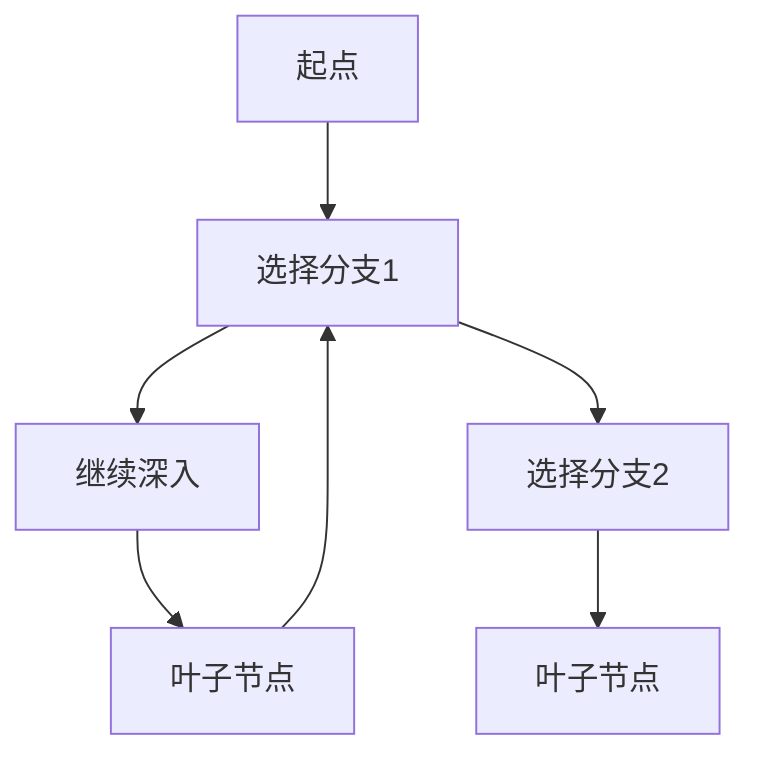
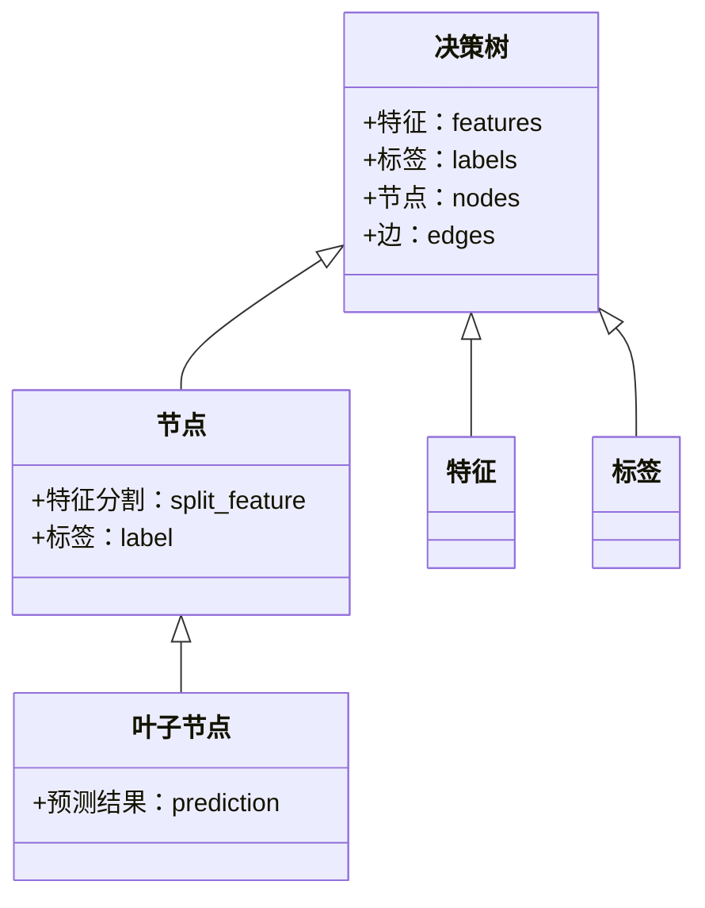
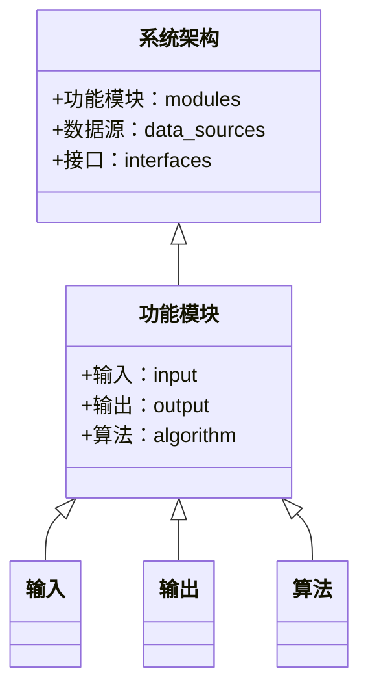
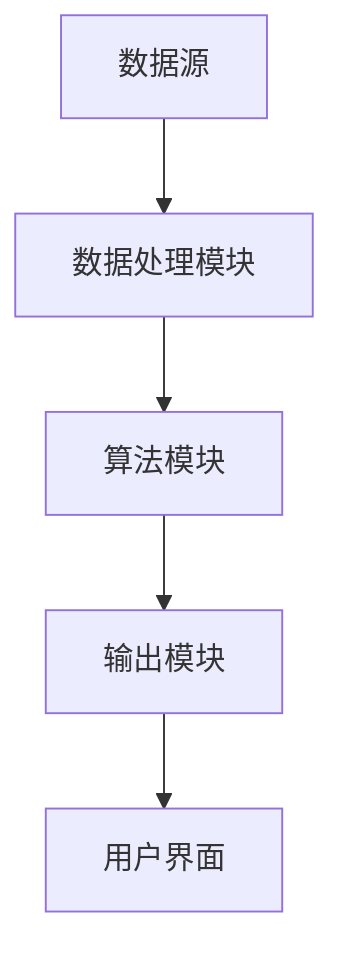
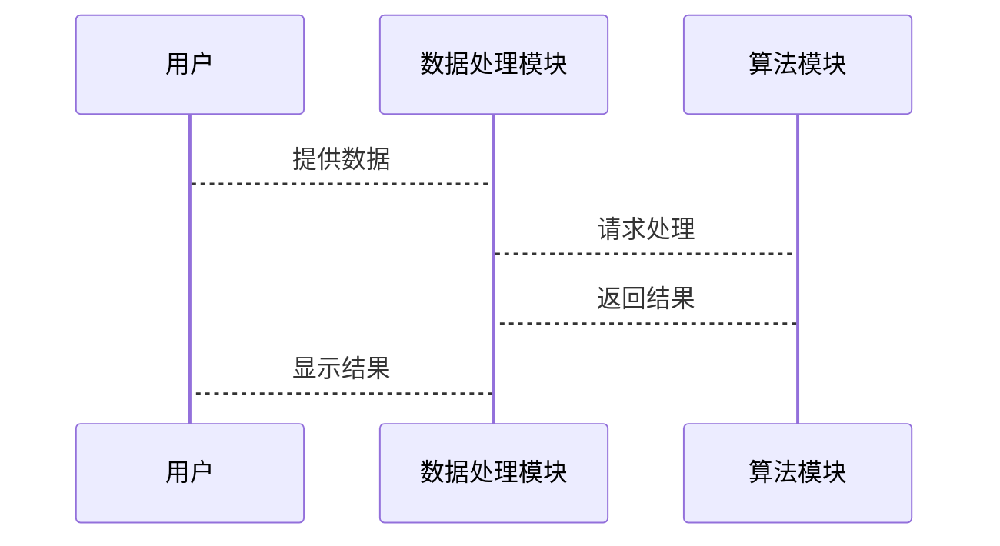

                 


# 芒格的"深度优先"学习在人工智能时代的重要性

---

## 关键词  
芒格, 深度优先学习, 人工智能, 决策树, 人工智能算法, 投资决策, 系统架构

---

## 摘要  
芒格的"深度优先"学习是一种以系统性和深度为核心的思维方式，在人工智能时代具有重要的应用价值。本文从芒格的背景与思维方式出发，结合深度优先学习的核心概念、算法原理、系统架构以及实际案例，详细阐述了深度优先学习在人工智能领域的应用与优势。文章通过对比分析、算法实现、系统设计和实战案例，全面探讨了深度优先学习在数据爆炸、计算能力提升的AI时代的重要性，并展望了其未来的发展方向。

---

# 第1章: 芒格的深度优先学习概述

## 1.1 芒格的背景与思维方式

### 1.1.1 芒格的生平简介  
查理·芒格（Charlie Munger）是美国著名投资家沃伦·巴菲特的长期合作伙伴，被誉为“价值投资的第二人”。他不仅在投资领域取得了巨大成功，还以其独特的思维方式闻名于世。芒格提倡的“芒格式思维”强调通过多个思维模型的综合运用，以系统性的方式理解问题。

### 1.1.2 芒格的"芒格式思维"特点  
芒格的思维方式具有以下特点：  
1. **系统性**：通过多个学科的交叉融合，形成对问题的全面理解。  
2. **深度性**：注重对问题本质的深入挖掘，而非浅层的表面现象。  
3. **实用性**：将理论与实践相结合，注重实际应用场景。  

### 1.1.3 芒格与人工智能的关联  
芒格的思维方式与人工智能的核心理念高度契合。人工智能需要通过对大量数据的深度分析和系统性推理，而芒格的“芒格式思维”正是这种思维方式的体现。

---

## 1.2 深度优先学习的核心概念

### 1.2.1 深度优先学习的定义  
深度优先学习（Depth-First Learning）是一种以问题为导向的学习方法，强调通过深入探索某一领域，逐步构建系统的知识体系。其核心在于“深度”而非“广度”，注重对问题本质的理解和解决。

### 1.2.2 深度优先学习与广度优先学习的对比  
| 对比维度             | 深度优先学习                     | 广度优先学习                     |  
|----------------------|----------------------------------|----------------------------------|  
| 学习策略             | 以问题为导向，逐步深入           | 以知识点为导向，全面覆盖         |  
| 知识结构             | 形成树状结构，注重分支间的联系   | 形成网状结构，注重知识点的独立性 |  
| 适用场景             | 复杂问题的解决、系统性思考       | 知识储备、基础学习             |  

### 1.2.3 深度优先学习在AI中的应用  
在人工智能领域，深度优先学习可以帮助算法更好地理解问题本质，构建更合理的模型。例如，在自然语言处理和图像识别领域，深度优先学习能够帮助模型更准确地理解上下文和场景。

---

# 第2章: 深度优先学习的算法原理

## 2.1 深度优先搜索与决策树

### 2.1.1 深度优先搜索的原理  
深度优先搜索（DFS）是一种树或图遍历算法，其核心思想是“先深入再扩展”。DFS通过不断深入探索某一路径，直到达到叶子节点，然后再回溯到上一层节点，继续探索其他路径。

#### 使用mermaid绘制DFS流程图  


### 2.1.2 决策树的构建与优化  
决策树是一种基于树状结构的分类模型，其构建过程类似于深度优先搜索。通过不断分割数据，逐步构建决策树的分支。

#### 使用mermaid绘制决策树类图  


### 2.1.3 决策树的分类与回归  
决策树可以用于分类和回归任务。分类任务通过预测类别标签，而回归任务则通过预测连续值。

---

## 2.2 深度优先学习与决策树的关联

### 2.2.1 决策树的深度优先特性  
决策树的构建过程体现了深度优先学习的核心思想：通过逐步深入探索数据的特征，构建层次化的决策逻辑。

### 2.2.2 决策树的复杂度分析  
决策树的复杂度包括时间复杂度和空间复杂度。时间复杂度主要取决于树的深度，空间复杂度主要取决于节点的数量。

### 2.2.3 决策树的适用场景  
决策树适用于数据清晰、特征明确的分类和回归任务。例如，在金融领域，决策树可以用于信用评分和风险评估。

---

# 第3章: AI时代的数据与计算特点

## 3.1 AI时代的数据特点

### 3.1.1 数据的规模与多样性  
人工智能时代，数据的规模呈指数级增长，且数据类型多样，包括文本、图像、音频等。

### 3.1.2 数据的复杂性与关联性  
数据之间的关联性增强，需要通过复杂的模型来捕捉数据间的隐含关系。

### 3.1.3 数据的处理与存储  
数据的处理和存储需要高效的算法和分布式系统支持。

## 3.2 计算能力的提升

### 3.2.1 算力的指数级增长  
随着计算能力的提升，人工智能算法的复杂度可以不断提高。

### 3.2.2 并行计算与分布式计算  
并行计算和分布式计算为大规模数据处理提供了技术支持。

### 3.2.3 算法的加速与优化  
通过算法优化和硬件加速，进一步提升计算效率。

## 3.3 深度优先学习的优势

### 3.3.1 深度优先学习的准确性  
深度优先学习能够通过深入的数据分析，提高模型的准确性。

### 3.3.2 深度优先学习的可解释性  
与黑箱模型不同，深度优先学习的决策过程具有较高的可解释性。

### 3.3.3 深度优先学习的适应性  
深度优先学习能够适应数据的多样性和复杂性，具有较强的灵活性。

---

# 第4章: 深度优先学习的实际案例

## 4.1 金融领域的应用

### 4.1.1 风险评估与信用评分  
通过深度优先学习构建决策树，可以更准确地评估客户信用风险。

### 4.1.2 股票价格预测  
利用深度优先学习分析历史数据，预测股票价格走势。

### 4.1.3 投资组合优化  
通过深度优先学习优化投资组合，降低风险，提高收益。

## 4.2 案例分析: 芒格式思维在投资决策中的应用

### 4.2.1 投资决策的深度优先特性  
芒格的思维方式通过深度优先学习，帮助投资者更好地分析和评估投资机会。

### 4.2.2 投资决策的多因素分析  
通过深度优先学习，投资者可以综合考虑多个因素，做出更科学的投资决策。

---

# 第5章: 深度优先学习的系统架构

## 5.1 系统功能设计

### 5.1.1 领域模型设计  
通过类图展示系统的功能模块及其关系。

#### 使用mermaid绘制领域模型类图  


### 5.1.2 系统架构设计  
通过架构图展示系统的整体设计。

#### 使用mermaid绘制系统架构图  


## 5.2 系统接口设计

### 5.2.1 输入接口设计  
定义系统的输入接口和数据格式。

### 5.2.2 输出接口设计  
定义系统的输出接口和数据格式。

## 5.3 系统交互设计

### 5.3.1 使用mermaid绘制交互序列图  


---

# 第6章: 深度优先学习的项目实战

## 6.1 环境安装

### 6.1.1 Python环境安装  
安装Python和必要的库，如scikit-learn。

### 6.1.2 数据集准备  
准备相关的数据集，如Titanic生存数据集。

## 6.2 系统核心实现

### 6.2.1 决策树实现代码  
```python
from sklearn.tree import DecisionTreeClassifier
from sklearn.model_selection import train_test_split
from sklearn.metrics import accuracy_score

# 加载数据集
data = {
    'Survived': [0, 1, 1, 0, 1, 0],
    'Pclass': [3, 1, 2, 3, 1, 3],
    'Age': [22, 35, 28, 25, 22, 45],
    'Sex': ['male', 'female', 'female', 'male', 'female', 'male']
}
X = data[['Pclass', 'Age', 'Sex']]
y = data['Survived']

# 数据预处理
X = pd.get_dummies(X)

# 划分训练集和测试集
X_train, X_test, y_train, y_test = train_test_split(X, y, test_size=0.3)

# 模型训练
model = DecisionTreeClassifier()
model.fit(X_train, y_train)

# 模型预测
y_pred = model.predict(X_test)

# 模型评估
print("Accuracy:", accuracy_score(y_test, y_pred))
```

### 6.2.2 代码解读  
上述代码通过sklearn库实现决策树分类，展示了深度优先学习在实际项目中的应用。

## 6.3 案例分析

### 6.3.1 案例背景  
以Titanic生存数据集为例，分析乘客的生存概率。

### 6.3.2 案例分析  
通过决策树模型，分析乘客的Pclass、Age和Sex对生存概率的影响。

---

# 第7章: 总结与展望

## 7.1 本章小结  
深度优先学习在人工智能时代具有重要的应用价值，其系统性和深度性的特点能够帮助模型更好地理解问题本质。

## 7.2 未来展望  
随着人工智能技术的不断发展，深度优先学习将在更多领域发挥重要作用，尤其是在需要系统性思考和深度分析的场景中。

---

# 第8章: 最佳实践与注意事项

## 8.1 最佳实践

### 8.1.1 数据质量的重要性  
确保数据的准确性和完整性，避免噪声数据的干扰。

### 8.1.2 模型的可解释性  
注重模型的可解释性，避免过度依赖黑箱模型。

### 8.1.3 模型的泛化能力  
通过交叉验证和正则化等方法，提升模型的泛化能力。

## 8.2 注意事项

### 8.2.1 数据偏倚问题  
注意数据偏倚对模型的影响，避免模型的不公平性。

### 8.2.2 模型过拟合问题  
通过模型优化和交叉验证，避免过拟合问题。

## 8.3 拓展阅读  
建议阅读《机器学习实战》、《深度学习》等书籍，进一步深入理解深度优先学习的核心思想。

--- 

通过上述内容，我们可以看到深度优先学习在人工智能时代的重要性和广泛应用。深度优先学习不仅是一种算法，更是一种思维方式，它能够帮助我们更好地理解和解决复杂问题。

