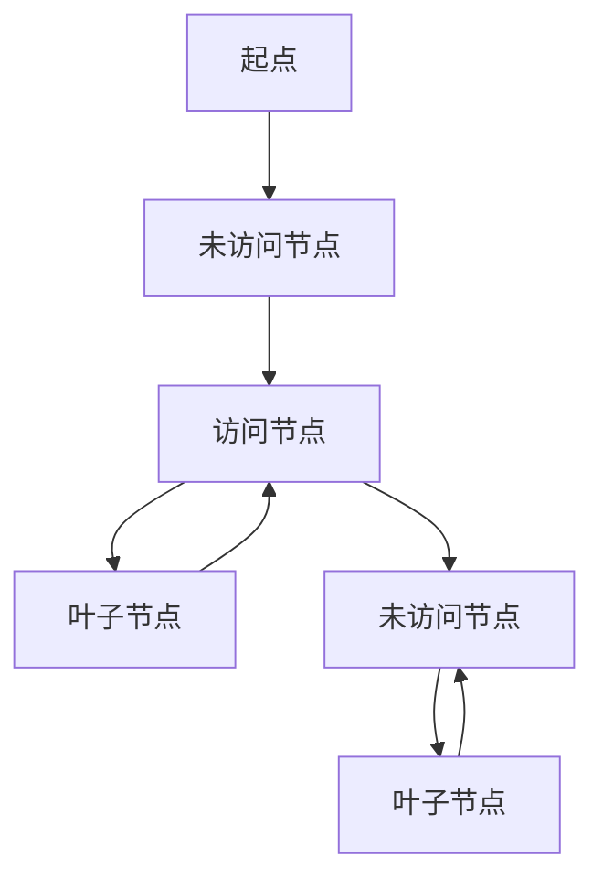
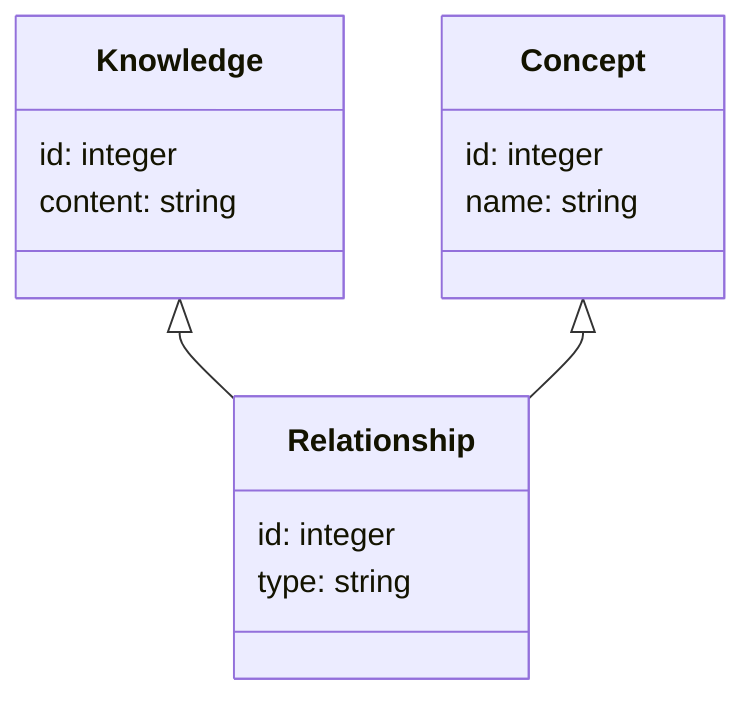
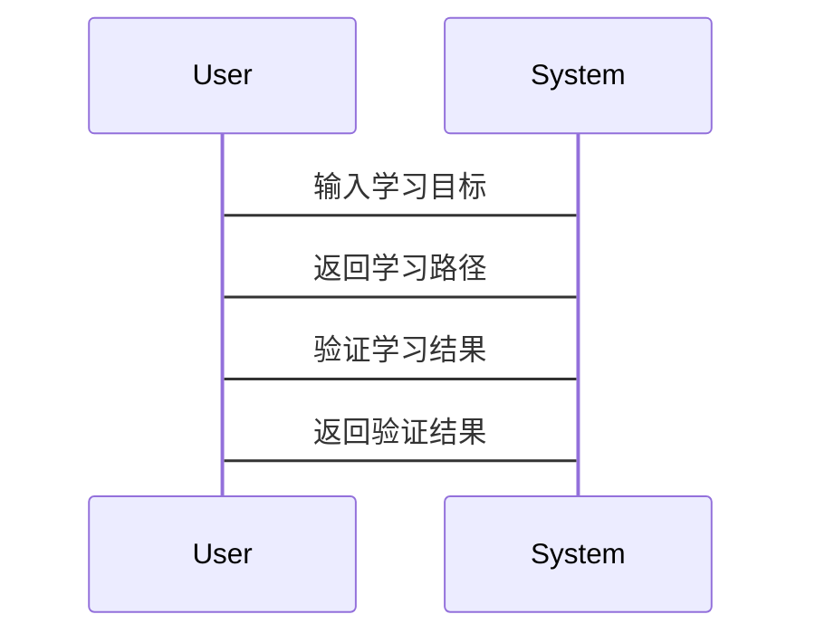

                 


# 芒格的"深度优先"学习在快速迭代技术环境中的重要性

## 关键词：
芒格，深度优先学习，快速迭代，技术环境，学习方法，系统设计，算法原理

## 摘要：
本文将探讨芒格的“深度优先”学习方法在快速迭代技术环境中的重要性。通过分析芒格的学习理念，结合深度优先学习的算法原理和系统设计，探讨其在现代技术环境中的应用价值。本文将从深度优先学习的核心概念出发，结合实际案例和数学模型，详细阐述其在技术快速迭代背景下的优势和挑战，并提供实践中的最佳实践建议。

---

# 第一部分: 芒格的深度优先学习概述

## 第1章: 芒格的生平与学习理念

### 1.1 芒格的生平简介
#### 1.1.1 芒格的早期经历
查理·芒格（Charlie Munger）是美国著名的投资者和作家，以其独特的投资哲学和学习方法闻名。他在年轻时就展现了对知识的极大热情，尤其擅长通过“深度优先”的方式探索问题，这种方法在他的投资决策和学习生涯中发挥了重要作用。

#### 1.1.2 芒格的职业生涯
芒格的职业生涯从律师开始，后来转向投资领域，成为巴菲特的合伙人。他的成功不仅源于对市场的深刻理解，更源于他对知识的系统化学习和深度思考。

#### 1.1.3 芒格的学习哲学
芒格强调“深度优先”学习，即通过深入理解某一领域的核心原理，构建知识的框架，并在此基础上进行扩展。他认为，快速迭代的技术环境要求学习者必须掌握知识的本质，而不是追求表面的广度。

### 1.2 深度优先学习的定义与特点
#### 1.2.1 深度优先学习的定义
深度优先学习是一种以系统性和结构性的方式学习知识的方法。其核心在于通过深入探索某一领域的核心问题，构建知识的逻辑框架，并在此基础上向外扩展。

#### 1.2.2 深度优先学习的核心特点
- **系统性**：注重知识的内在逻辑和结构。
- **深度性**：强调对核心原理的深入理解。
- **长期性**：注重知识的积累和持续应用。

#### 1.2.3 深度优先学习与传统学习的区别
| 特性         | 深度优先学习            | 传统学习             |
|--------------|------------------------|----------------------|
| 学习目标     | 理解知识的本质          | 掌握知识的表面       |
| 学习方式     | 系统性思考             | 分散式学习           |
| 应用场景     | 复杂问题解决            | 简单问题处理         |

---

## 第2章: 深度优先学习的核心概念

### 2.1 深度优先学习的原理
#### 2.1.1 深度优先学习的基本原理
深度优先学习强调通过“树状结构”构建知识框架。每个节点代表一个核心概念，通过不断深入探索，逐步扩展知识的广度和深度。

#### 2.1.2 深度优先学习的关键要素
- 核心概念：构建知识的逻辑起点。
- 系统性思考：通过逻辑推理连接各个知识点。
- 实践应用：通过实际问题验证知识的正确性。

#### 2.1.3 深度优先学习的数学模型
深度优先学习可以用图论中的树状结构来表示。假设每个节点代表一个知识点，边代表知识点之间的逻辑关系。数学模型可以表示为：
$$
\text{知识结构} = \{ (C_i, C_j) | C_i \text{ 和 } C_j \text{ 有逻辑关系} \}
$$
其中，$C_i$ 和 $C_j$ 分别代表不同的知识点。

### 2.2 深度优先学习的属性特征对比
#### 2.2.1 深度优先学习与其他学习方法的对比
| 方法         | 深度优先学习            | 浅层学习             |
|--------------|------------------------|----------------------|
| 学习目标     | 掌握知识的本质          | 掌握知识的表面       |
| 学习效率     | 高                     | 低                   |
| 学习效果     | 长期有效               | 短期有效             |

#### 2.2.2 深度优先学习的ER实体关系图
```mermaid
erDiagram
    knowledge_base {
        entity knowledge {
            id       : integer
            content  : string
            relation : string
        }
        entity concept {
            id       : integer
            name     : string
        }
        knowledge_base.knowledge <--- many concept
    }
```

---

## 第3章: 深度优先学习的算法原理

### 3.1 深度优先搜索算法
#### 3.1.1 深度优先搜索的基本原理
深度优先搜索（DFS）是一种用于遍历树或图的算法，通过不断深入探索某一路径，直到达到叶子节点，然后回溯到上一节点，继续探索其他路径。

#### 3.1.2 深度优先搜索的实现步骤
1. 从起点开始，访问未访问的节点。
2. 记录访问路径。
3. 当到达叶子节点时，回溯到上一节点，继续探索其他路径。

#### 3.1.3 深度优先搜索的数学模型
深度优先搜索可以用递归的方式实现，数学表达式为：
$$
\text{DFS}(v) = \begin{cases}
\text{访问节点 } v & \text{如果 } v \text{ 未访问} \\
\text{遍历所有未访问的邻接节点 } u & \text{递归调用 } \text{DFS}(u)
\end{cases}
$$

#### 3.1.4 深度优先搜索的Mermaid流程图


#### 3.1.5 深度优先搜索的Python代码实现
```python
def dfs(visited, graph, node):
    if node not in visited:
        visited.add(node)
        for neighbor in graph[node]:
            dfs(visited, graph, neighbor)
    return visited

graph = {
    'A': ['B', 'C'],
    'B': ['D'],
    'C': ['D'],
    'D': []
}

visited = set()
dfs(visited, graph, 'A')
print(visited)
```

---

## 第4章: 深度优先学习的系统分析与架构设计

### 4.1 问题场景介绍
在快速迭代的技术环境中，深度优先学习可以帮助学习者更好地应对复杂问题。例如，在软件开发中，深度优先学习可以帮助开发者快速理解技术的核心原理，并在实际项目中应用。

### 4.2 系统功能设计
#### 4.2.1 领域模型Mermaid类图


#### 4.2.2 系统架构设计Mermaid架构图
```mermaid
containerDiagram
    container Knowledge Base {
        component Knowledge Storage
        component Concept Mapping
    }
    container User Interface {
        component Input
        component Output
    }
    Knowledge Base -->> User Interface
```

### 4.3 系统接口设计
- 输入接口：用户输入需要学习的知识点。
- 输出接口：系统输出学习路径和相关知识。

### 4.4 系统交互Mermaid序列图


---

## 第5章: 深度优先学习的项目实战

### 5.1 环境安装
- 安装Python和相关库（如networkx、mermaid）。

### 5.2 核心代码实现
```python
import networkx as nx
from matplotlib import pyplot as plt

G = nx.DiGraph()
G.add_edge('起点', '未访问节点')
G.add_edge('未访问节点', '访问节点')
G.add_edge('访问节点', '叶子节点')
nx.draw(G, with_labels=True, edge_color='red')
plt.show()
```

### 5.3 代码应用解读与分析
上述代码使用NetworkX库绘制了深度优先搜索的树状结构，展示了知识的逻辑关系。通过这种方式，学习者可以直观地理解知识的内在联系。

### 5.4 实际案例分析
以软件开发为例，深度优先学习可以帮助开发者快速掌握技术的核心原理，并在实际项目中应用。

---

## 第6章: 深度优先学习的最佳实践

### 6.1 小结
深度优先学习是一种高效的学习方法，尤其适用于快速迭代的技术环境。

### 6.2 注意事项
- 确保对核心知识点的深入理解。
- 避免过度追求广度，忽略深度。

### 6.3 拓展阅读
- 《深度优先学习：原理与实践》
- 《芒格的投资哲学》

---

# 结语

芒格的深度优先学习方法在快速迭代的技术环境中具有重要的应用价值。通过系统性地构建知识框架，学习者可以更好地应对复杂问题，并在实际项目中取得成功。希望本文能够为读者提供有价值的启发和指导。

