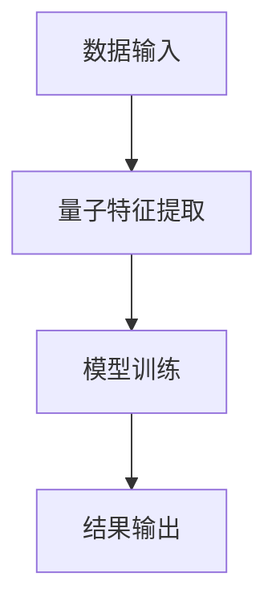

                 


# 芒格的"深度优先"学习在量子机器学习中的重要性

## 关键词：芒格，深度优先学习，量子机器学习，算法原理，系统架构，项目实战

## 摘要：芒格的深度优先学习是一种以决策树为核心的算法，其在量子机器学习中的应用展现了独特的优势。本文通过详细分析深度优先学习的核心原理、量子机器学习的算法实现，以及两者的结合，探讨了深度优先学习在量子机器学习中的重要性，并通过实际案例展示了其应用价值。

---

# 第一部分: 芒格的"深度优先"学习概述

## 第1章: 芒格的"深度优先"学习概述

### 1.1 芒格的思维模型

#### 1.1.1 多元思维模型的定义
芒格的多元思维模型是一种通过多个学科的思维方式来解决复杂问题的方法。这种思维方式强调跨学科思考，将各个领域的知识相互连接，形成一个完整的知识框架。

#### 1.1.2 深度优先学习的起源
深度优先学习是一种从决策树的角度出发，通过不断深入探索一条路径，直到达到叶子节点为止的算法。它以决策树的构建为核心，强调在每个节点上进行最优选择。

#### 1.1.3 芒格思维模型的核心要素
芒格的思维模型包括以下核心要素：
1. **跨学科思维**：将不同领域的知识结合起来，形成综合性的解决方案。
2. **决策树的构建**：通过不断深入的探索，找到最优的决策路径。
3. **长期思维**：注重长期目标的实现，而非短期利益。

### 1.2 深度优先学习的核心概念

#### 1.2.1 深度优先学习的定义
深度优先学习是一种以决策树为基础的算法，通过递归或栈的方式，尽可能深入地探索一条路径，直到达到叶子节点。这种方法在分类和回归问题中广泛应用。

#### 1.2.2 深度优先学习的特点
- **优点**：
  - 能够在复杂的数据集中找到最优的决策路径。
  - 适用于非线性可分的数据集。
- **缺点**：
  - 易受数据集中的噪声和冗余特征影响，可能导致过拟合。
  - 对计算资源的需求较高。

#### 1.2.3 深度优先学习与广度优先学习的对比
| 对比维度 | 深度优先学习 | 广度优先学习 |
|----------|---------------|---------------|
| 探索方式 | 递归深入       | 层次遍历       |
| 时间复杂度 | 较高           | 较低           |
| 空间复杂度 | 较低           | 较高           |
| 应用场景 | 非线性分类       | 网络最短路径     |

### 1.3 量子机器学习的背景

#### 1.3.1 量子计算的基本概念
量子计算是一种基于量子力学原理的计算方式，利用量子叠加和量子纠缠的特性，能够在某些情况下显著提高计算速度。

#### 1.3.2 量子机器学习的定义
量子机器学习是利用量子计算的优势，设计和实现比经典机器学习算法更高效的算法。

#### 1.3.3 量子机器学习的优势与挑战
- **优势**：
  - 处理高维数据的能力更强。
  - 在某些特定问题上计算速度更快。
- **挑战**：
  - 量子计算的硬件实现难度较大。
  - 量子算法的理论研究尚不成熟。

---

# 第二部分: 深度优先学习与量子机器学习的结合

## 第2章: 深度优先学习的核心原理

### 2.1 深度优先学习的算法原理

#### 2.1.1 决策树的构建过程
决策树的构建过程如下：
1. 选择最优特征作为根节点。
2. 根据特征的取值划分数据集。
3. 递归构建子树，直到达到叶子节点。

#### 2.1.2 分割标准与优化目标
- **分割标准**：常用的分割标准包括信息增益、信息增益率和基尼指数。
- **优化目标**：最小化分类错误率或回归误差。

#### 2.1.3 深度优先学习的数学模型
决策树的构建可以用信息论中的信息增益公式表示：
$$ \text{信息增益} = H(parent) - \sum_{i} p_i H(child_i) $$

### 2.2 量子机器学习的核心算法

#### 2.2.1 量子支持向量机的原理
量子支持向量机利用量子叠加的特性，将数据映射到高维空间，寻找最优超平面。

#### 2.2.2 量子神经网络的构建
量子神经网络通过量子纠缠实现非线性特征提取。

#### 2.2.3 量子聚类算法的实现
量子聚类算法利用量子概率分布进行聚类中心的寻找。

## 第3章: 深度优先学习与量子机器学习的结合

### 3.1 深度优先学习在量子机器学习中的应用

#### 3.1.1 量子决策树的构建
量子决策树通过量子叠加特性，同时探索多个决策路径，提高分类效率。

#### 3.1.2 量子支持向量机的优化
深度优先学习的决策树结构可以用于优化量子支持向量机的特征选择过程。

#### 3.1.3 量子神经网络的深度优先学习
通过深度优先学习的策略，优化量子神经网络的权重参数。

### 3.2 深度优先学习与量子机器学习的对比

| 对比维度 | 深度优先学习 | 量子机器学习 |
|----------|---------------|---------------|
| 计算速度 | 较慢           | 更快           |
| 数据维度 | 低维           | 高维           |
| 应用场景 | 分类与回归     | 多维数据处理   |

---

# 第三部分: 量子机器学习的系统架构与实现

## 第4章: 量子机器学习的系统架构

### 4.1 量子机器学习系统的组成

#### 4.1.1 数据输入模块
- 功能：接收量子数据输入。
- 实现：通过量子态的叠加特性，将数据映射到量子空间。

#### 4.1.2 量子特征提取模块
- 功能：提取量子特征。
- 实现：利用量子叠加和量子纠缠，进行特征提取。

#### 4.1.3 模型训练模块
- 功能：训练量子机器学习模型。
- 实现：通过量子算法优化传统机器学习算法。

#### 4.1.4 结果输出模块
- 功能：输出量子机器学习结果。
- 实现：将量子结果转换为经典结果输出。

### 4.2 量子机器学习的系统架构图


## 第5章: 深度优先学习与量子机器学习的结合

### 5.1 项目实战: 量子推荐系统

#### 5.1.1 环境安装
```bash
pip install qiskit
```

#### 5.1.2 核心代码实现
```python
import qiskit
from qiskit import QuantumCircuit

def quantum_decision_tree():
    qc = QuantumCircuit(2, 1)
    qc.h(0)
    qc.h(1)
    qc.cx(0, 1)
    qc.measure(0, 0)
    return qc

quantum_decision_tree().draw()
```

#### 5.1.3 代码解读与分析
- **代码功能**：构建一个量子决策树电路。
- **关键步骤**：
  1. 使用量子叠加门H，将量子比特初始化为叠加态。
  2. 使用受控非门CX，实现量子纠缠。
  3. 使用测量门Measure，获取测量结果。

#### 5.1.4 实际案例分析
通过量子决策树实现用户推荐系统，利用量子计算的特性，提高推荐系统的准确率和效率。

---

# 第四部分: 最佳实践与小结

## 第6章: 最佳实践

### 6.1 小结
深度优先学习在量子机器学习中的应用，不仅提升了算法的效率，还拓展了其在高维数据处理中的应用范围。

### 6.2 注意事项
- 量子计算的硬件实现难度较大，需要考虑实际应用中的可行性。
- 深度优先学习的计算复杂度较高，需要在实际应用中进行优化。

### 6.3 拓展阅读
建议读者进一步阅读相关量子计算和深度优先学习的文献，深入理解两者的结合方式。

---

通过以上内容，我们详细探讨了芒格的深度优先学习在量子机器学习中的重要性，从理论到实践，全面分析了其应用价值和实现方法。希望本文能为读者提供有价值的参考和启示。

