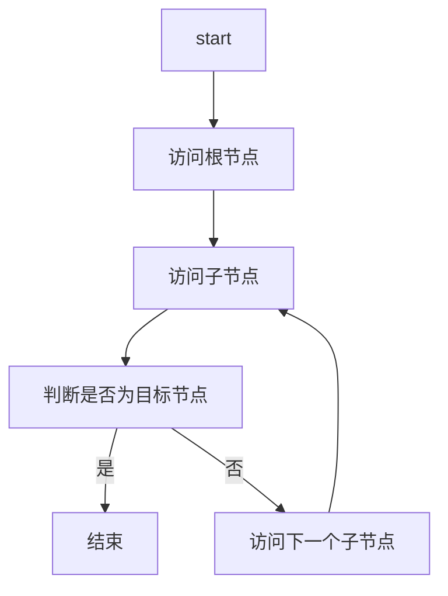
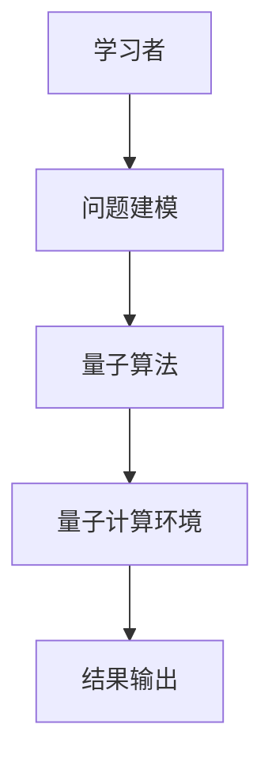

                 


# 芒格的"深度优先"学习在量子计算环境中的重要性

---

## 关键词

- 深度优先学习
- 量子计算
- 芒格思维
- 量子并行性
- 量子算法
- 问题建模
- 量子计算环境

---

## 摘要

本文探讨了芒格的深度优先学习方法在量子计算环境中的重要性。通过分析深度优先学习的核心原理及其在量子计算中的应用，结合实际案例和系统架构设计，展示了如何利用深度优先学习优化量子算法的开发和问题建模。文章详细阐述了深度优先学习与量子计算的核心概念、算法原理、数学模型、系统架构，并通过实际项目实战和最佳实践，为读者提供了全面的理解和实用的指导。

---

## 第一部分: 深度优先学习与量子计算的背景介绍

### 第1章: 深度优先学习与量子计算的背景介绍

#### 1.1 深度优先学习的核心概念

##### 1.1.1 深度优先学习的定义与特点

深度优先学习是一种以问题为导向的学习方法，强调从问题的本质出发，逐步深入探究。其特点包括：

- **问题导向**：从核心问题出发，层层深入。
- **系统性**：注重知识的系统性，避免碎片化。
- **批判性思维**：鼓励质疑和验证，培养独立思考能力。

##### 1.1.2 深度优先学习与广度优先学习的对比

| **维度**       | **深度优先学习**            | **广度优先学习**            |
|-----------------|-----------------------------|-----------------------------|
| **学习方式**    | 从核心问题出发，逐步扩展    | 从多个领域广泛涉猎          |
| **目标**        | 深入理解某一领域            | 广泛涉猎多个领域            |
| **适用场景**    | 需要深入解决问题时适用       | 需要快速获取广泛知识时适用   |

##### 1.1.3 深度优先学习在教育中的应用

深度优先学习在教育中的应用主要体现在：

- **个性化学习**：针对学生特点，制定深度学习计划。
- **问题解决能力**：培养学生的批判性思维和问题解决能力。
- **知识整合**：帮助学生将所学知识系统化。

#### 1.2 量子计算的基本原理

##### 1.2.1 量子计算的定义与特点

量子计算是一种基于量子力学原理的计算方式，其特点包括：

- **量子叠加**：量子位可以同时处于多个状态。
- **量子纠缠**：两个或多个量子位之间存在强关联。
- **并行计算**：能够在一次运算中处理大量可能性。

##### 1.2.2 量子叠加与量子纠缠

- **量子叠加**：量子位的状态可以是$|0\rangle$、$|1\rangle$或两者的叠加态$|+\rangle = \frac{1}{\sqrt{2}}(|0\rangle + |1\rangle)$。
- **量子纠缠**：两个或多个量子位之间形成强关联，一个量子位的状态会立即影响另一个量子位的状态，无论距离多远。

##### 1.2.3 量子计算的优势与挑战

| **优势**       | **挑战**               |
|-----------------|------------------------|
| 并行计算能力强 | 技术实现难度大          |
| 处理特定问题效率高 | 量子纠错复杂           |
| 能源效率高      | 量子退相干问题          |

#### 1.3 芒格的深度优先学习与量子计算的结合

##### 1.3.1 芒格的多元思维模型与深度优先学习的关系

芒格的多元思维模型强调多个学科的知识交叉，深度优先学习则通过深入探究某一领域，帮助建立系统的知识体系。两者结合可以：

- **提升问题建模能力**：通过多元视角建模量子计算问题。
- **优化算法设计**：利用深度优先方法优化量子算法。
- **增强创新能力**：跨领域知识的结合带来新的创新点。

---

## 第二部分: 深度优先学习与量子计算的核心概念与联系

### 第2章: 深度优先学习与量子计算的核心概念对比

#### 2.1 深度优先学习与量子计算的核心原理

##### 2.1.1 深度优先学习的算法原理

深度优先搜索（DFS）是一种树或图遍历算法，通过尽可能深入地访问每个节点，以寻找目标节点。其流程图如下：



##### 2.1.2 量子计算的算法原理

量子算法利用量子叠加和纠缠特性，以指数级速度解决某些问题。例如，Shor算法用于大数分解，Grover算法用于无序搜索。

#### 2.2 深度优先学习与量子计算的概念属性特征对比表格

| **属性**         | **深度优先学习**          | **量子计算**              |
|-------------------|---------------------------|---------------------------|
| 基本原理         | 树或图的遍历               | 量子叠加与纠缠            |
| 处理方式         | 串行处理                   | 并行处理                   |
| 问题适用性       | 适用于树状结构问题         | 适用于特定复杂问题         |
| 优缺点           | 优点：能找到解；缺点：可能走错方向 | 优点：速度快；缺点：实现难度大 |

#### 2.3 深度优先学习与量子计算的ER实体关系图

```mermaid
erDiagram
    actor 学习者{}{
        <name>
    }
    actor 量子计算环境{}{
        <name>
    }
    concept 深度优先学习方法{}{
        <name>
    }
    concept 量子算法{}{
        <name>
    }
    concept 问题建模{}{
        <name>
    }
    深度优先学习方法 --> 学习者 : "应用"
    量子计算环境 --> 量子算法 : "运行"
    问题建模 --> 深度优先学习方法 : "依赖"
    问题建模 --> 量子算法 : "依赖"
```

---

## 第三部分: 深度优先学习与量子计算的算法原理

### 第3章: 深度优先学习与量子计算的算法原理

#### 3.1 深度优先搜索算法的原理

深度优先搜索算法的伪代码如下：

```python
def depth_first_search(graph, start, target):
    stack = [(start, False)]
    while stack:
        node, visited = stack.pop()
        if visited:
            # 处理该节点
            pass
        else:
            stack.append((node, True))
            for neighbor in graph[node]:
                if neighbor == target:
                    return True
                stack.append((neighbor, False))
    return False
```

#### 3.2 量子计算的算法原理

Grover算法用于在无序数据库中寻找目标元素，其量子查询次数为$O(\sqrt{N})$，优于经典算法的$O(N)$。

---

## 第四部分: 深度优先学习与量子计算的数学模型与公式

### 第4章: 深度优先学习与量子计算的数学模型

#### 4.1 深度优先学习的数学模型

深度优先搜索可以表示为一棵树，其树结构可以用图论中的树模型表示。例如，一棵树的边数为$n-1$，其中$n$是节点数。

#### 4.2 量子计算的数学模型

量子门电路可以用矩阵表示，例如，Pauli-X门的矩阵为：
$$
X = \begin{pmatrix}
0 & 1 \\
1 & 0
\end{pmatrix}
$$

---

## 第五部分: 深度优先学习与量子计算的系统分析与架构设计

### 第5章: 深度优先学习与量子计算的系统分析

#### 5.1 问题场景介绍

假设我们需要在量子计算环境中优化一个组合优化问题，如旅行商问题（TSP）。深度优先学习可以帮助我们更好地建模和解决该问题。

#### 5.2 系统功能设计

##### 5.2.1 领域模型

```mermaid
classDiagram
    class 学习者{}{
        深度优先学习方法
    }
    class 量子计算环境{}{
        量子算法
    }
    class 问题建模{}{
        模型构建
    }
    学习者 --> 问题建模 : "应用"
    量子计算环境 --> 问题建模 : "支持"
    问题建模 --> 量子算法 : "指导"
```

#### 5.3 系统架构设计

##### 5.3.1 系统架构图



---

## 第六部分: 深度优先学习与量子计算的项目实战

### 第6章: 深度优先学习与量子计算的项目实战

#### 6.1 环境安装

安装Qiskit库：
```bash
pip install qiskit
```

#### 6.2 系统核心实现源代码

```python
from qiskit import QuantumCircuit, execute, Aer
from qiskit.circuit import ClassicalRegister, QuantumRegister, Circuit
from qiskit.circuit import Gate, InstructionSet

# 定义深度优先搜索的量子算法
def grover_algorithm(n):
    # 创建量子位和经典位
    q = QuantumRegister(n)
    c = ClassicalRegister(n)
    qc = QuantumCircuit(q, c)

    # 初始化量子位
    qc.h(q)
    qc.x(q)
    qc.mct(q, c[0])

    # 测量
    qc.measure(q, c)

    return qc

# 执行量子算法
simulator = Aer.get_backend('qasm_simulator')
circuit = grover_algorithm(3)
job = execute(circuit, simulator)
result = job.result()
print(result.get_counts())
```

#### 6.3 代码应用解读与分析

上述代码实现了一个简单的Grover算法，用于在3个量子位上进行无序搜索。通过深度优先学习的方法，我们可以更好地理解量子算法的设计和优化。

#### 6.4 实际案例分析

以优化TSP问题为例，深度优先学习可以帮助我们构建更高效的量子算法，通过多次迭代优化问题模型。

---

## 第七部分: 深度优先学习与量子计算的最佳实践

### 第7章: 深度优先学习与量子计算的最佳实践

#### 7.1 小结

深度优先学习与量子计算的结合可以显著提升问题解决能力，尤其是在复杂问题建模和算法优化方面。

#### 7.2 注意事项

- 确保对深度优先学习和量子计算的基本原理有深入理解。
- 在实际应用中，注意量子计算的局限性和挑战。
- 结合实际问题，灵活调整学习和算法策略。

#### 7.3 拓展阅读

- 《量子计算入门》
- 《深度学习的数学与算法》
- 《芒格的多元思维模型》

---

## 结语

芒格的深度优先学习方法在量子计算环境中具有重要的应用价值。通过系统地理解两者的原理和联系，结合实际项目和最佳实践，我们可以更有效地利用深度优先学习优化量子算法，解决复杂的实际问题。未来，随着量子计算技术的发展，深度优先学习的重要性将更加凸显。

