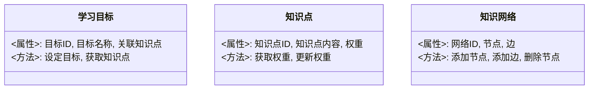
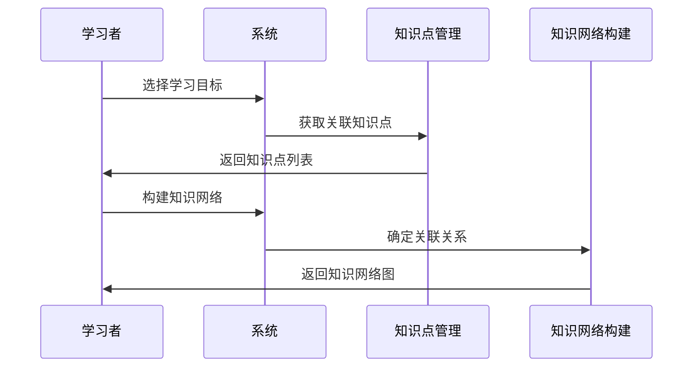

                 


# 芒格的"深度优先"学习方法：培养专业知识

> **关键词**: 深度优先学习, 芒格方法, 专业知识, 系统化思维, 决策模型, 思维导图, 知识网络

> **摘要**: 本文深入探讨了芒格的“深度优先”学习方法，分析其核心原理、算法模型和实际应用，通过系统化的方法论帮助读者培养专业知识，构建高效的知识体系。

---

# 第一部分: 芒格的深度优先学习方法概述

## 第1章: 深度优先学习方法的背景介绍

### 1.1 深度优先学习方法的概念起源

#### 1.1.1 问题背景与问题描述
在知识爆炸的时代，传统学习方法往往注重广度而非深度，导致学习者难以真正掌握核心知识。芒格的深度优先学习方法提供了一种解决方案，强调通过系统化思考和深度挖掘，构建坚实的知识体系。

#### 1.1.2 问题解决的思路与方法
芒格提出，学习者应专注于某一领域，深入挖掘其核心原理，构建知识网络。这种学习方式不同于传统的浅层学习，而是通过“深度优先”的思维方式，逐步扩展知识的广度。

#### 1.1.3 深度优先学习方法的边界与外延
深度优先学习方法不仅适用于学术领域，还可以应用于实际问题的解决。其核心在于通过系统的知识网络构建，提升学习者的综合能力。

---

## 第2章: 深度优先学习方法的核心概念与联系

### 2.1 深度优先学习方法的原理分析

#### 2.1.1 思维模型的构建与应用
芒格的深度优先学习方法强调构建思维模型。例如，通过分析问题的因果关系，构建决策树模型，帮助学习者快速找到问题的关键点。

#### 2.1.2 知识网络的构建与关联
通过思维导图的方式，将零散的知识点连接起来，形成知识网络。例如，将“数据分析”领域的知识点（如数据清洗、特征工程、模型训练）通过思维导图串联起来，形成完整的知识体系。

#### 2.1.3 系统化决策方法的实现
芒格的决策模型通过系统化的方法，将问题分解为多个子问题，逐一解决。例如，在数据分析项目中，通过明确目标、收集数据、建立模型、验证假设等步骤，系统化地解决问题。

---

## 第3章: 深度优先学习方法的算法原理

### 3.1 算法原理分析

#### 3.1.1 知识关联度的数学表达式
$$
关联度 = \frac{知识点A的权重 \times 知识点B的权重}{总权重}
$$

#### 3.1.2 决策树的构建与优化
通过信息论中的熵值法，构建决策树。例如，在分类问题中，选择信息增益最大的特征作为决策节点，逐步分割数据集，直到达到叶节点。

#### 3.1.3 知识网络的图论表示
使用图论中的节点和边表示知识网络。例如，将知识点表示为节点，知识点之间的关联关系表示为边，构建知识图谱。

---

## 第4章: 深度优先学习方法的系统分析与架构设计

### 4.1 系统分析

#### 4.1.1 问题场景介绍
以数据分析项目为例，深度优先学习方法可以帮助学习者系统化地掌握数据分析的各个步骤。

#### 4.1.2 项目介绍与目标设定
通过构建数据分析的知识体系，提升学习者的实践能力。

### 4.2 系统功能设计

#### 4.2.1 领域模型类图


#### 4.2.2 系统架构设计


#### 4.2.3 接口设计与交互流程


---

## 第5章: 深度优先学习方法的项目实战

### 5.1 环境安装与配置

#### 5.1.1 安装必要的工具
- 安装Python和相关库（如numpy、pandas、matplotlib）
- 安装思维导图工具（如MindMaple）

#### 5.1.2 配置开发环境
- 配置Jupyter Notebook
- 配置思维导图工具

### 5.2 核心代码实现

#### 5.2.1 知识网络构建的代码实现
```python
import numpy as np
import pandas as pd
from sklearn.tree import DecisionTreeClassifier

# 示例数据
X = np.array([[2, 3], [5, 4], [6, 7], [8, 9]])
y = np.array([0, 1, 1, 0])

# 构建决策树模型
model = DecisionTreeClassifier()
model.fit(X, y)

# 提取模型决策路径
def get_decision_path(model, X):
    return model.predict(X)

# 输出决策路径
print(get_decision_path(model, X))
```

#### 5.2.2 思维导图的代码实现
```python
from mindmap import MindMap

# 创建思维导图
mm = MindMap("数据分析")
mm.add_node("数据清洗", "数据预处理")
mm.add_node("特征工程", "数据预处理")
mm.add_node("模型训练", "数据分析")
mm.add_node("结果验证", "数据分析")

# 保存思维导图
mm.save("data_analysis.mm")
```

### 5.3 实际案例分析与解读

#### 5.3.1 案例背景
以数据分析项目为例，假设我们需要构建一个预测股票价格的模型。

#### 5.3.2 案例分析
通过深度优先学习方法，逐步分析数据预处理、特征工程、模型训练和结果验证的每个步骤。

### 5.4 项目小结

---

## 第6章: 深度优先学习方法的最佳实践与小结

### 6.1 最佳实践 tips

#### 6.1.1 选择合适的学习目标
根据自身需求选择学习目标，避免盲目学习。

#### 6.1.2 构建完善的知识网络
通过思维导图等工具，系统化地构建知识网络。

#### 6.1.3 定期复习与优化
定期复习知识点，优化知识网络结构。

### 6.2 小结

通过芒格的深度优先学习方法，学习者可以系统化地掌握专业知识，构建高效的知识体系。

### 6.3 注意事项

- 学习过程中要注重理论与实践的结合。
- 知识网络的构建需要持续优化和更新。

### 6.4 拓展阅读

- 《思考，快与慢》
- 《深度学习》
- 《系统化思维》

---

# 结语

芒格的深度优先学习方法是一种高效的知识学习方式，通过系统化的方法论，帮助学习者构建坚实的知识体系。希望本文能够为读者提供有价值的指导和启发。

