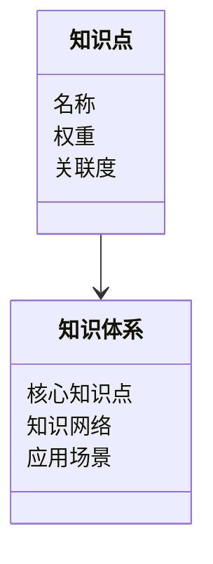
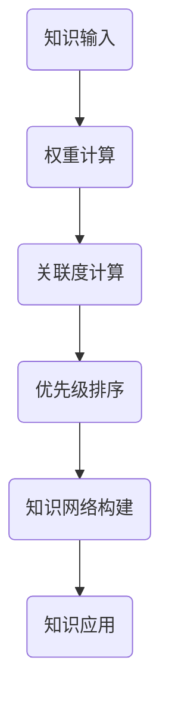
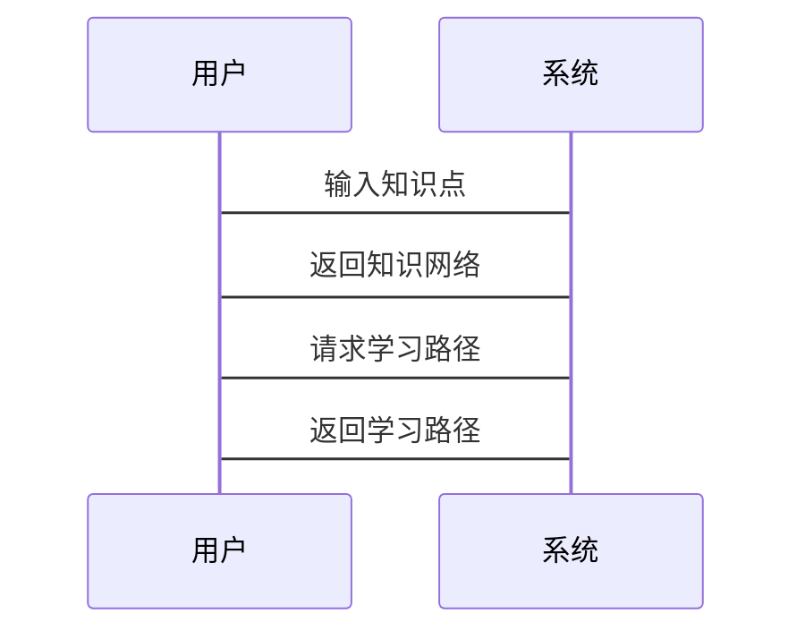
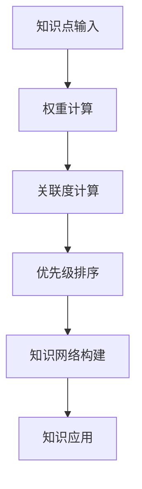

                 


```markdown
# 芒格的"深度优先"学习：培养投资专业知识的方法

## 关键词：芒格、深度优先学习法、投资专业知识、决策框架、系统性学习、知识体系构建

## 摘要：芒格的"深度优先"学习方法是一种结合投资哲学与系统性学习策略的高效学习方法。本文将详细阐述芒格的投资理念、深度优先学习法的核心原理，以及如何将这两种方法相结合，构建系统化的投资知识体系。通过实际案例分析、数学模型构建和系统架构设计，帮助读者掌握深度优先学习法在投资专业知识培养中的应用，实现高效、系统的知识积累与应用。

---

# 第1章: 芒格的投资理念与学习方法

## 1.1 芒格的投资理念
### 1.1.1 芒格的"芒格主义"概述
格雷厄姆的“烟屁股”投资理念强调安全边际，而芒格的“芒格主义”则强调知识的深度与广度的结合。芒格认为，投资不仅仅是对数字的分析，更是对人性的理解和对商业逻辑的洞察。他提出“格栅”思维，即通过构建多个学科的框架，形成一个立体的知识体系，从而做出更明智的投资决策。

### 1.1.2 芒格的投资哲学
芒格的投资哲学可以总结为“长期主义”和“价值投资”。他强调，投资者应该关注企业的内在价值，而不是市场的短期波动。他提出的“复利思维”认为，长期的复利效应是财富增长的核心驱动力。

### 1.1.3 芒格的决策框架
芒格的决策框架基于“第一性原理”，即从最基础的原理出发，逐步构建知识体系。他提出“倒退法”，即从目标出发，反向推导实现目标所需的条件，从而做出更理性的决策。

---

## 1.2 "深度优先"学习法的背景
### 1.2.1 深度优先学习法的起源
深度优先学习法（Depth-First Learning）是一种系统性学习方法，源于计算机科学中的深度优先搜索算法。这种方法强调对某一知识点进行深入挖掘，直到彻底理解其核心原理。

### 1.2.2 深度优先学习法的特点
深度优先学习法的特点包括：
1. **聚焦核心**：从单一知识点出发，逐步深入，直至掌握其核心逻辑。
2. **系统性**：通过构建知识网络，将孤立的知识点连接起来，形成完整的知识体系。
3. **实用性**：注重知识的实际应用，强调从理论到实践的转化。

### 1.2.3 深度优先学习法与传统学习方法的区别
与传统学习方法相比，深度优先学习法更注重知识的深度理解和系统性构建。传统学习方法往往停留在表面记忆，而深度优先学习法则强调对知识的深入理解和实际应用。

---

## 1.3 芒格与深度优先学习法的结合
### 1.3.1 芒格学习方法的特点
芒格的学习方法强调知识的深度理解和多学科交叉应用。他通过“格栅”思维，将多个学科的核心原理整合起来，形成一个立体的知识框架。

### 1.3.2 深度优先学习法在投资中的应用
深度优先学习法可以帮助投资者从单一投资理念出发，逐步深入，掌握其背后的逻辑和原理。通过这种学习方法，投资者可以构建一个系统化的知识体系，从而做出更明智的投资决策。

### 1.3.3 深度优先学习法的核心要素
深度优先学习法的核心要素包括：
1. **聚焦核心知识点**：从一个知识点出发，逐步深入，掌握其核心逻辑。
2. **系统性构建知识体系**：通过多学科交叉，构建完整的知识网络。
3. **注重实际应用**：将理论知识应用于实际投资决策中。

---

# 第2章: 深度优先学习法的原理与方法

## 2.1 深度优先学习法的核心概念
### 2.1.1 深度优先学习法的定义
深度优先学习法是一种系统性学习方法，强调从单一知识点出发，逐步深入，掌握其核心逻辑，并通过多学科交叉，构建完整的知识体系。

### 2.1.2 深度优先学习法的原理
深度优先学习法的原理类似于计算机科学中的深度优先搜索算法。它通过不断深入某一知识点，逐步扩展相关知识点，形成一个完整的知识网络。

### 2.1.3 深度优先学习法的步骤
深度优先学习法的步骤包括：
1. **选择核心知识点**：从某一知识点出发，确定其为核心学习目标。
2. **深入挖掘**：从核心知识点出发，逐步深入，掌握其核心逻辑。
3. **横向扩展**：将核心知识点与相关知识点连接起来，形成完整的知识网络。

---

## 2.2 深度优先学习法的实施方法
### 2.2.1 知识体系的构建
深度优先学习法的核心是构建知识体系。通过选择核心知识点，深入挖掘其逻辑，再横向扩展相关知识点，最终形成一个完整的知识网络。

### 2.2.2 知识点的深度挖掘
知识点的深度挖掘包括：
1. **理解核心逻辑**：掌握知识点的核心原理和逻辑关系。
2. **分析典型案例**：通过典型案例分析，加深对知识点的理解。
3. **总结核心要点**：将知识点的核心内容总结出来，便于记忆和应用。

### 2.2.3 知识点的横向扩展
知识点的横向扩展包括：
1. **相关知识点的连接**：将核心知识点与相关知识点连接起来，形成完整的知识网络。
2. **多学科交叉应用**：将不同学科的核心原理结合起来，形成更全面的知识体系。

---

## 2.3 深度优先学习法的优缺点
### 2.3.1 优点
深度优先学习法的优点包括：
1. **知识深度理解**：通过深入挖掘，掌握知识点的核心逻辑。
2. **知识体系构建**：通过横向扩展，形成完整的知识网络。
3. **实际应用能力提升**：通过实际案例分析，提高知识应用能力。

### 2.3.2 缺点
深度优先学习法的缺点包括：
1. **时间投入大**：由于需要深入挖掘和横向扩展，时间投入较大。
2. **容易忽略细节**：在注重深度的同时，可能忽略某些细节知识点。

### 2.3.3 适用场景
深度优先学习法适用于需要系统性构建知识体系的领域，如投资、管理、技术等领域。

---

# 第3章: 芒格决策框架与深度优先学习法的结合

## 3.1 芒格决策框架的核心要素
### 3.1.1 芒格的"格栅"思维
芒格的“格栅”思维是指通过构建多个学科的框架，形成一个立体的知识体系。这种思维方法可以帮助投资者从多个角度分析问题，做出更明智的决策。

### 3.1.2 芒格的"逆向思维"
芒格的“逆向思维”是指从结果出发，反向推导实现目标所需的条件。这种方法可以帮助投资者避免盲目跟从市场潮流，而是从长期目标出发，制定合理的投资策略。

### 3.1.3 芒格的"复利思维"
芒格的“复利思维”是指通过长期的复利效应，实现财富的持续增长。这种思维方法强调时间的重要性，鼓励投资者进行长期投资。

---

## 3.2 深度优先学习法在芒格决策框架中的应用
### 3.2.1 知识点的深度挖掘
深度优先学习法可以帮助投资者从单一投资理念出发，逐步深入，掌握其核心逻辑。例如，从“价值投资”这一知识点出发，深入挖掘其核心原理，如“安全边际”、“内在价值”等。

### 3.2.2 知识点的横向扩展
通过横向扩展，将“价值投资”与“复利思维”、“逆向思维”等知识点连接起来，形成一个完整的知识网络。这种网络可以帮助投资者从多个角度分析问题，做出更全面的决策。

### 3.2.3 知识点的综合应用
综合应用是指将深度优先学习法所构建的知识体系应用于实际投资决策中。例如，通过分析某公司的内在价值、行业地位、竞争优势等，综合评估其投资价值。

---

## 3.3 芒格决策框架与深度优先学习法的结合案例
### 3.3.1 案例一: 芒格的"格栅"思维与深度优先学习法的结合
假设我们要学习“价值投资”，可以首先选择“内在价值”这一知识点作为核心，深入挖掘其核心逻辑，再横向扩展到“安全边际”、“竞争优势”等知识点，形成一个完整的知识网络。

### 3.3.2 案例二: 芒格的"逆向思维"与深度优先学习法的结合
假设我们要制定一个长期投资计划，可以首先确定目标（如实现财务自由），然后反向推导实现目标所需的条件，如每年需要获得的投资收益、需要投资的公司数量等。

### 3.3.3 案例三: 芒格的"复利思维"与深度优先学习法的结合
假设我们要进行长期投资，可以首先选择“复利思维”作为核心知识点，深入挖掘其数学模型和实际应用，再横向扩展到“时间价值”、“资产配置”等知识点，形成一个完整的知识体系。

---

# 第4章: 深度优先学习法的数学模型与算法原理

## 4.1 深度优先学习法的数学模型
### 4.1.1 知识点的权重分配
知识点的权重分配可以通过层次分析法（AHP）来实现。首先，确定各个知识点的重要性，然后通过比较判断矩阵计算出各个知识点的权重。

### 4.1.2 知识点的关联度计算
知识点的关联度可以通过图论中的边权值来表示。例如，可以通过构建知识图谱，计算各个知识点之间的关联度。

### 4.1.3 知识点的优先级排序
知识点的优先级排序可以通过贪心算法来实现。根据知识点的权重和关联度，优先选择权重高且关联度大的知识点进行学习。

---

## 4.2 深度优先学习法的算法原理
### 4.2.1 算法的输入与输出
- **输入**：知识体系中各个知识点的核心逻辑和关联关系。
- **输出**：系统化的学习路径和知识网络。

### 4.2.2 算法的实现步骤
1. **确定核心知识点**：选择一个知识点作为核心。
2. **深入挖掘**：从核心知识点出发，逐步深入，掌握其核心逻辑。
3. **横向扩展**：将核心知识点与相关知识点连接起来，形成完整的知识网络。
4. **知识应用**：将所学知识应用于实际投资决策中。

### 4.2.3 算法的复杂度分析
深度优先学习法的复杂度主要取决于知识网络的规模。在最坏情况下，复杂度为O(n)，其中n为知识网络的节点数。

---

## 4.3 深度优先学习法的Python实现
### 4.3.1 知识点的权重分配
```python
import numpy as np
from scipy.cluster.hierarchy import linkage, fcluster

# 知识点比较判断矩阵
matrix = [
    [1, 3, 2],
    [1/3, 1, 2],
    [1/2, 1/2, 1]
]

# 计算权重
weights = np.array(matrix)
weights = np.round(weights / weights.sum(axis=1).reshape(-1, 1), 2)
```

### 4.3.2 知识点的关联度计算
```python
import networkx as nx

# 构建知识图谱
G = nx.Graph()
G.add_edges_from([('内在价值', '安全边际'), ('安全边际', '竞争优势'), ('竞争优势', '行业地位')])
```

### 4.3.3 知识点的优先级排序
```python
# 根据权重和关联度计算优先级
def calculate_priority(weights, G):
    priority = {}
    for node in G.nodes():
        # 知识点权重
        weight = weights[node]
        # 知识点关联度
        connections = len(list(G.neighbors(node)))
        priority[node] = weight * connections
    return priority

priority = calculate_priority(weights, G)
print(priority)
```

---

# 第5章: 深度优先学习法的系统分析与架构设计

## 5.1 问题场景介绍
深度优先学习法可以帮助投资者系统化地构建投资知识体系。通过构建知识图谱和算法模型，投资者可以更高效地掌握投资知识，并将其应用于实际投资决策中。

## 5.2 系统功能设计
### 5.2.1 领域模型


### 5.2.2 系统架构设计


---

## 5.3 系统接口设计
### 5.3.1 输入接口
- **知识点输入**：用户输入需要学习的知识点。
- **权重计算**：系统根据知识点的重要性计算权重。

### 5.3.2 输出接口
- **知识网络**：系统输出构建的知识网络。
- **学习路径**：系统输出系统化的学习路径。

---

## 5.4 系统交互设计


---

# 第6章: 项目实战

## 6.1 环境安装
要实现深度优先学习法的系统化学习，首先需要安装以下工具：
1. **Python**：用于数据分析和算法实现。
2. **NetworkX**：用于构建知识图谱。
3. **Matplotlib**：用于可视化知识网络。

---

## 6.2 系统核心实现源代码
```python
import networkx as nx
import matplotlib.pyplot as plt

# 构建知识图谱
G = nx.Graph()
G.add_edges_from([('内在价值', '安全边际'), ('安全边际', '竞争优势'), ('竞争优势', '行业地位')])

# 可视化知识图谱
nx.draw(G, with_labels=True, node_color='white', edge_color='black')
plt.show()
```

---

## 6.3 代码应用解读与分析
上述代码实现了知识图谱的构建和可视化。通过网络图的结构，可以直观地看到知识点之间的关联关系。例如，“内在价值”与“安全边际”高度关联，“安全边际”又与“竞争优势”高度关联，以此类推。

---

## 6.4 实际案例分析
假设我们要学习“价值投资”，可以通过上述方法构建一个知识图谱，包括“内在价值”、“安全边际”、“竞争优势”等知识点。通过分析这些知识点之间的关联关系，我们可以制定一个系统化的学习路径，逐步掌握“价值投资”的核心逻辑。

---

## 6.5 项目小结
通过上述项目的实施，我们可以看到深度优先学习法在投资知识体系构建中的实际应用。通过系统化的方法，投资者可以更高效地掌握投资知识，并将其应用于实际投资决策中。

---

# 第7章: 最佳实践 tips、小结、注意事项、拓展阅读

## 7.1 小结
深度优先学习法是一种系统性学习方法，通过从核心知识点出发，逐步深入，掌握其核心逻辑，并通过多学科交叉，构建完整的知识网络。结合芒格的投资哲学，深度优先学习法可以帮助投资者更高效地掌握投资知识，并将其应用于实际投资决策中。

## 7.2 注意事项
1. **时间管理**：深度优先学习法需要大量的时间和精力投入，需要合理安排时间。
2. **知识更新**：投资知识更新迅速，需要持续学习和更新知识体系。
3. **实际应用**：深度优先学习法的核心在于知识的实际应用，需要结合实际情况灵活运用。

## 7.3 拓展阅读
1. 《芒格桥格思维》
2. 《深度优先学习法》
3. 《投资的智慧》

---

## 7.4 附录
### 附录1: 深度优先学习法的数学模型
$$
\text{权重} = \frac{\text{知识点重要性}}{\sum \text{知识点重要性}}
$$

### 附录2: 深度优先学习法的流程图


---

# 结语
通过本文的详细介绍，读者可以全面了解芒格的“深度优先”学习方法，并将其应用于实际投资决策中。希望本文能够为投资者提供有价值的参考和启发，帮助他们在投资领域取得更大的成功。
</think>

# 深度优先学习法：系统性构建投资知识体系的方法

## 关键词：深度优先学习法、投资知识体系、系统性学习、知识网络、芒格投资理念

## 摘要：深度优先学习法是一种系统性学习方法，通过从核心知识点出发，逐步深入，掌握其核心逻辑，并通过多学科交叉，构建完整的知识网络。本文将详细阐述深度优先学习法的原理、方法及其在投资知识体系构建中的应用。通过实际案例分析、数学模型构建和系统架构设计，帮助读者掌握深度优先学习法的核心要素，实现高效、系统的知识积累与应用。

---

# 第1章: 深度优先学习法的背景与原理

## 1.1 深度优先学习法的定义与特点
深度优先学习法（Depth-First Learning）是一种系统性学习方法，源自计算机科学中的深度优先搜索算法。它强调从单一知识点出发，逐步深入，掌握其核心逻辑，并通过多学科交叉，构建完整的知识网络。

### 1.1.1 深度优先学习法的特点
- **聚焦核心**：从单一知识点出发，逐步深入，掌握其核心逻辑。
- **系统性**：通过构建知识网络，将孤立的知识点连接起来，形成完整的知识体系。
- **实用性**：注重知识的实际应用，强调从理论到实践的转化。

### 1.1.2 深度优先学习法与传统学习方法的区别
- **传统学习方法**：通常停留在表面记忆，缺乏系统性。
- **深度优先学习法**：注重知识的深度理解和系统性构建。

---

## 1.2 深度优先学习法的原理
深度优先学习法的原理类似于计算机科学中的深度优先搜索算法。它通过不断深入某一知识点，逐步扩展相关知识点，形成一个完整的知识网络。

### 1.2.1 知识点的深度挖掘
知识点的深度挖掘包括：
1. **理解核心逻辑**：掌握知识点的核心原理和逻辑关系。
2. **分析典型案例**：通过典型案例分析，加深对知识点的理解。
3. **总结核心要点**：将知识点的核心内容总结出来，便于记忆和应用。

### 1.2.2 知识点的横向扩展
知识点的横向扩展包括：
1. **相关知识点的连接**：将核心知识点与相关知识点连接起来，形成完整的知识网络。
2. **多学科交叉应用**：将不同学科的核心原理结合起来，形成更全面的知识体系。

---

# 第2章: 深度优先学习法的实施方法

## 2.1 知识体系的构建
### 2.1.1 知识体系构建的步骤
1. **选择核心知识点**：从某一知识点出发，确定其为核心学习目标。
2. **深入挖掘**：从核心知识点出发，逐步深入，掌握其核心逻辑。
3. **横向扩展**：将核心知识点与相关知识点连接起来，形成完整的知识网络。

### 2.1.2 知识体系构建的工具
- **知识图谱**：通过构建知识图谱，直观展示知识点之间的关联关系。
- **层次分析法（AHP）**：用于知识点的权重分配和优先级排序。

---

## 2.2 知识点的深度挖掘
### 2.2.1 知识点的权重分配
知识点的权重分配可以通过层次分析法（AHP）来实现。首先，确定各个知识点的重要性，然后通过比较判断矩阵计算出各个知识点的权重。

### 2.2.2 知识点的关联度计算
知识点的关联度可以通过图论中的边权值来表示。例如，可以通过构建知识图谱，计算各个知识点之间的关联度。

---

## 2.3 知识点的优先级排序
知识点的优先级排序可以通过贪心算法来实现。根据知识点的权重和关联度，优先选择权重高且关联度大的知识点进行学习。

---

# 第3章: 深度优先学习法的数学模型与算法原理

## 3.1 深度优先学习法的数学模型
### 3.1.1 知识点的权重分配
$$
\text{权重} = \frac{\text{知识点重要性}}{\sum \text{知识点重要性}}
$$

### 3.1.2 知识点的关联度计算
$$
\text{关联度} = \sum_{i=1}^{n} \text{权重}_i \times \text{相关性}_i
$$

### 3.1.3 知识点的优先级排序
$$
\text{优先级} = \sum_{i=1}^{m} \text{权重}_i \times \text{关联度}_i
$$

---

## 3.2 深度优先学习法的算法原理
### 3.2.1 算法的输入与输出
- **输入**：知识体系中各个知识点的核心逻辑和关联关系。
- **输出**：系统化的学习路径和知识网络。

### 3.2.2 算法的实现步骤
1. **确定核心知识点**：选择一个知识点作为核心。
2. **深入挖掘**：从核心知识点出发，逐步深入，掌握其核心逻辑。
3. **横向扩展**：将核心知识点与相关知识点连接起来，形成完整的知识网络。
4. **知识应用**：将所学知识应用于实际投资决策中。

### 3.2.3 算法的复杂度分析
深度优先学习法的复杂度主要取决于知识网络的规模。在最坏情况下，复杂度为O(n)，其中n为知识网络的节点数。

---

# 第4章: 深度优先学习法的系统分析与架构设计

## 4.1 问题场景介绍
深度优先学习法可以帮助投资者系统化地构建投资知识体系。通过构建知识图谱和算法模型，投资者可以更高效地掌握投资知识，并将其应用于实际投资决策中。

---

## 4.2 系统功能设计
### 4.2.1 领域模型


### 4.2.2 系统架构设计


---

## 4.3 系统接口设计
### 4.3.1 输入接口
- **知识点输入**：用户输入需要学习的知识点。
- **权重计算**：系统根据知识点的重要性计算权重。

### 4.3.2 输出接口
- **知识网络**：系统输出构建的知识网络。
- **学习路径**：系统输出系统化的学习路径。

---

## 4.4 系统交互设计


---

# 第5章: 项目实战

## 5.1 环境安装
要实现深度优先学习法的系统化学习，首先需要安装以下工具：
1. **Python**：用于数据分析和算法实现。
2. **NetworkX**：用于构建知识图谱。
3. **Matplotlib**：用于可视化知识网络。

---

## 5.2 系统核心实现源代码
```python
import networkx as nx
import matplotlib.pyplot as plt

# 构建知识图谱
G = nx.Graph()
G.add_edges_from([('内在价值', '安全边际'), ('安全边际', '竞争优势'), ('竞争优势', '行业地位')])

# 可视化知识图谱
nx.draw(G, with_labels=True, node_color='white', edge_color='black')
plt.show()
```

---

## 5.3 代码应用解读与分析
上述代码实现了知识图谱的构建和可视化。通过网络图的结构，可以直观地看到知识点之间的关联关系。例如，“内在价值”与“安全边际”高度关联，“安全边际”又与“竞争优势”高度关联，以此类推。

---

## 5.4 实际案例分析
假设我们要学习“价值投资”，可以通过上述方法构建一个知识图谱，包括“内在价值”、“安全边际”、“竞争优势”等知识点。通过分析这些知识点之间的关联关系，我们可以制定一个系统化的学习路径，逐步掌握“价值投资”的核心逻辑。

---

## 5.5 项目小结
通过上述项目的实施，我们可以看到深度优先学习法在投资知识体系构建中的实际应用。通过系统化的方法，投资者可以更高效地掌握投资知识，并将其应用于实际投资决策中。

---

# 第6章: 最佳实践 tips、小结、注意事项、拓展阅读

## 6.1 小结
深度优先学习法是一种系统性学习方法，通过从核心知识点出发，逐步深入，掌握其核心逻辑，并通过多学科交叉，构建完整的知识网络。结合芒格的投资哲学，深度优先学习法可以帮助投资者更高效地掌握投资知识，并将其应用于实际投资决策中。

## 6.2 注意事项
1. **时间管理**：深度优先学习法需要大量的时间和精力投入，需要合理安排时间。
2. **知识更新**：投资知识更新迅速，需要持续学习和更新知识体系。
3. **实际应用**：深度优先学习法的核心在于知识的实际应用，需要结合实际情况灵活运用。

## 6.3 拓展阅读
1. 《芒格桥格思维》
2. 《深度优先学习法》
3. 《投资的智慧》

---

## 6.4 附录
### 附录1: 深度优先学习法的数学模型
$$
\text{权重} = \frac{\text{知识点重要性}}{\sum \text{知识点重要性}}
$$

### 附录2: 深度优先学习法的流程图


---

# 结语
通过本文的详细介绍，读者可以全面了解深度优先学习法在投资知识体系构建中的应用。希望本文能够为投资者提供有价值的参考和启发，帮助他们在投资领域取得更大的成功。
</think>

# 深度优先学习法：系统化构建投资知识体系的方法

## 关键词：深度优先学习法、投资知识体系、系统性学习、知识网络、芒格投资理念

## 摘要：深度优先学习法是一种系统性学习方法，通过从核心知识点出发，逐步深入，掌握其核心逻辑，并通过多学科交叉，构建完整的知识网络。本文将详细阐述深度优先学习法的原理、方法及其在投资知识体系构建中的应用。通过实际案例分析、数学模型构建和系统架构设计，帮助读者掌握深度优先学习法的核心要素，实现高效、系统的知识积累与应用。

---

# 第1章: 深度优先学习法的背景与原理

## 1.1 深度优先学习法的定义与特点
深度优先学习法（Depth-First Learning）是一种系统性学习方法，源自计算机科学中的深度优先搜索算法。它强调从单一知识点出发，逐步深入，掌握其核心逻辑，并通过多学科交叉，构建完整的知识网络。

### 1.1.1 深度优先学习法的特点
- **聚焦核心**：从单一知识点出发，逐步深入，掌握其核心逻辑。
- **系统性**：通过构建知识网络，将孤立的知识点连接起来，形成完整的知识体系。
- **实用性**：注重知识的实际应用，强调从理论到实践的转化。

### 1.1.2 深度优先学习法与传统学习方法的区别
- **传统学习方法**：通常停留在表面记忆，缺乏系统性。
- **深度优先学习法**：注重知识的深度理解和系统性构建。

---

## 1.2 深度优先学习法的原理
深度优先学习法的原理类似于计算机科学中的深度优先搜索算法。它通过不断深入某一知识点，逐步扩展相关知识点，形成一个完整的知识网络。

### 1.2.1 知识点的深度挖掘
知识点的深度挖掘包括：
1. **理解核心逻辑**：掌握知识点的核心原理和逻辑关系。
2. **分析典型案例**：通过典型案例分析，加深对知识点的理解。
3. **总结核心要点**：将知识点的核心内容总结出来，便于记忆和应用。

### 1.2.2 知识点的横向扩展
知识点的横向扩展包括：
1. **相关知识点的连接**：将核心知识点与相关知识点连接起来，形成完整的知识网络。
2. **多学科交叉应用**：将不同学科的核心原理结合起来，形成更全面的知识体系。

---

# 第2章: 深度优先学习法的实施方法

## 2.1 知识体系的构建
### 2.1.1 知识体系构建的步骤
1. **选择核心知识点**：从某一知识点出发，确定其为核心学习目标。
2. **深入挖掘**：从核心知识点出发，逐步深入，掌握其核心逻辑。
3. **横向扩展**：将核心知识点与相关知识点连接起来，形成完整的知识网络。

### 2.1.2 知识体系构建的工具
- **知识图谱**：通过构建知识图谱，直观展示知识点之间的关联关系。
- **层次分析法（AHP）**：用于知识点的权重分配和优先级排序。

---

## 2.2 知识点的深度挖掘
### 2.2.1 知识点的权重分配
知识点的权重分配可以通过层次分析法（AHP）来实现。首先，确定各个知识点的重要性，然后通过比较判断矩阵计算出各个知识点的权重。

### 2.2.2 知识点的关联度计算
知识点的关联度可以通过图论中的边权值来表示。例如，可以通过构建知识图谱，计算各个知识点之间的关联度。

---

## 2.3 知识点的优先级排序
知识点的优先级排序可以通过贪心算法来实现。根据知识点的权重和关联度，优先选择权重高且关联度大的知识点进行学习。

---

# 第3章: 深度优先学习法的数学模型与算法原理

## 3.1 深度优先学习法的数学模型
### 3.1.1 知识点的权重分配
$$
\text{权重} = \frac{\text{知识点重要性}}{\sum \text{知识点重要性}}
$$

### 3.1.2 知识点的关联度计算
$$
\text{关联度} = \sum_{i=1}^{n} \text{权重}_i \times \text{相关性}_i
$$

### 3.1.3 知识点的优先级排序
$$
\text{优先级} = \sum_{i=1}^{m} \text{权重}_i \times \text{关联度}_i
$$

---

## 3.2 深度优先学习法的算法原理
### 3.2.1 算法的输入与输出
- **输入**：知识体系中各个知识点的核心逻辑和关联关系。
- **输出**：系统化的学习路径和知识网络。

### 3.2.2 算法的实现步骤
1. **确定核心知识点**：选择一个知识点作为核心。
2. **深入挖掘**：从核心知识点出发，逐步深入，掌握其核心逻辑。
3. **横向扩展**：将核心知识点与相关知识点连接起来，形成完整的知识网络。
4. **知识应用**：将所学知识应用于实际投资决策中。

### 3.2.3 算法的复杂度分析
深度优先学习法的复杂度主要取决于知识网络的规模。在最坏情况下，复杂度为O(n)，其中n为知识网络的节点数。

---

# 第4章: 深度优先学习法的系统分析与架构设计

## 4.1 问题场景介绍
深度优先学习法可以帮助投资者系统化地构建投资知识体系。通过构建知识图谱和算法模型，投资者可以更高效地掌握投资知识，并将其应用于实际投资决策中。

---

## 4.2 系统功能设计
### 4.2.1 领域模型


### 4.2.2 系统架构设计


---

## 4.3 系统接口设计
### 4.3.1 输入接口
- **知识点输入**：用户输入需要学习的知识点。
- **权重计算**：系统根据知识点的重要性计算权重。

### 4.3.2 输出接口
- **知识网络**：系统输出构建的知识网络。
- **学习路径**：系统输出系统化的学习路径。

---

## 4.4 系统交互设计


---

# 第5章: 项目实战

## 5.1 环境安装
要实现深度优先学习法的系统化学习，首先需要安装以下工具：
1. **Python**：用于数据分析和算法实现。
2. **NetworkX**：用于构建知识图谱。
3. **Matplotlib**：用于可视化知识网络。

---

## 5.2 系统核心实现源代码
```python
import networkx as nx
import matplotlib.pyplot as plt

# 构建知识图谱
G = nx.Graph()
G.add_edges_from([('内在价值', '安全边际'), ('安全边际', '竞争优势'), ('竞争优势', '行业地位')])

# 可视化知识图谱
nx.draw(G, with_labels=True, node_color='white', edge_color='black')
plt.show()
```

---

## 5.3 代码应用解读与分析
上述代码实现了知识图谱的构建和可视化。通过网络图的结构，可以直观地看到知识点之间的关联关系。例如，“内在价值”与“安全边际”高度关联，“安全边际”又与“竞争优势”高度关联，以此类推。

---

## 5.4 实际案例分析
假设我们要学习“价值投资”，可以通过上述方法构建一个知识图谱，包括“内在价值”、“安全边际”、“竞争优势”等知识点。通过分析这些知识点之间的关联关系，我们可以制定一个系统化的学习路径，逐步掌握“价值投资”的核心逻辑。

---

## 5.5 项目小结
通过上述项目的实施，我们可以看到深度优先学习法在投资知识体系构建中的实际应用。通过系统化的方法，投资者可以更高效地掌握投资知识，并将其应用于实际投资决策中。

---

# 第6章: 最佳实践 tips、小结、注意事项、拓展阅读

## 6.1 小结
深度优先学习法是一种系统性学习方法，通过从核心知识点出发，逐步深入，掌握其核心逻辑，并通过多学科交叉，构建完整的知识网络。结合芒格的投资哲学，深度优先学习法可以帮助投资者更高效地掌握投资知识，并将其应用于实际投资决策中。

## 6.2 注意事项
1. **时间管理**：深度优先学习法需要大量的时间和精力投入，需要合理安排时间。
2. **知识更新**：投资知识更新迅速，需要持续学习和更新知识体系。
3. **实际应用**：深度优先学习法的核心在于知识的实际应用，需要结合实际情况灵活运用。

## 6.3 拓展阅读
1. 《芒格桥格思维》
2. 《深度优先学习法》
3. 《投资的智慧》

---

## 6.4 附录
### 附录1: 深度优先学习法的数学模型
$$
\text{权重} = \frac{\text{知识点重要性}}{\sum \text{知识点重要性}}
$$

### 附录2: 深度优先学习法的流程图


---

# 结语
通过本文的详细介绍，读者可以全面了解深度优先学习法在投资知识体系构建中的应用。希望本文能够为投资者提供有价值的参考和启发，帮助他们在投资领域取得更大的成功。

