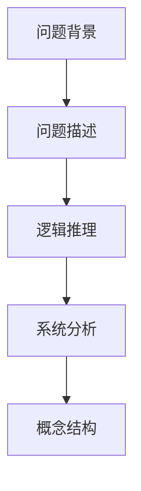

                 


# 芒格的"清晰思考"在投资决策中的重要性

> 关键词：芒格，清晰思考，投资决策，思维方式，投资策略

> 摘要：本文深入探讨了芒格的“清晰思考”在投资决策中的重要性，分析了其核心概念、逻辑框架、数学模型和系统架构，并结合实际案例和代码示例，展示了如何在投资决策中应用“清晰思考”。文章结构清晰，内容详实，适合投资者、学生和技术爱好者阅读。

---

# 第1章 芒格与"清晰思考"的背景介绍

## 1.1 芒格的生平与思想体系

查理·芒格（Charlie Munger）是美国著名的投资家、作家和思想家，担任伯克希尔·哈撒韦公司副主席。芒格的思想体系以“清晰思考”为核心，强调通过逻辑推理和常识判断来做出决策。他主张投资者应具备跨学科的知识和思维方式，以避免认知偏差和错误决策。

芒格的“清晰思考”不仅是一种思维方式，更是一种生活态度。他强调通过简化问题、抓住本质，来做出更明智的决策。这种思维方式在投资领域尤为重要，因为它可以帮助投资者避免被市场情绪和短期波动所左右。

## 1.2 "清晰思考"的核心概念

“清晰思考”是指通过逻辑推理、常识判断和跨学科知识，系统性地分析问题，找到问题的本质，并做出合理的决策。其核心概念包括：

1. **逻辑推理**：通过逻辑框架分析问题，避免主观臆断。
2. **常识判断**：利用常识和经验，评估信息的可靠性。
3. **跨学科思维**：综合运用不同领域的知识，全面分析问题。
4. **简化问题**：通过分解问题，找到问题的关键点，避免复杂化。

### 对比分析表格

| 思维方式       | 优点                               | 缺点                               |
|----------------|------------------------------------|------------------------------------|
| 直觉思维       | 快速决策                           | 易受情绪影响                         |
| 分析思维       | 结果准确                           | 耗时且复杂                         |
| 清晰思考       | 结合逻辑与常识，结果可靠           | 需要较高的知识储备和逻辑能力         |

## 1.3 "清晰思考"与其他思维方法的区别

“清晰思考”与其他思维方法的区别主要体现在逻辑性、系统性和实用性上。以下是对比分析：

- **对比分析**：
  - 传统逻辑推理：注重形式化和严谨性，但忽视实际应用。
  - 逆向思维：从反方向思考问题，但缺乏系统性。
  - 清晰思考：结合逻辑推理和常识判断，注重系统性和实用性。

- **ER实体关系图（Mermaid）**

```mermaid
erDiagram
    actor 投资者 {
        string 姓名
        string 资金
        string 投资目标
    }
    actor 市场 {
        string 价格
        string 赋值
        string 风险
    }
    actor 知识 {
        string 知识领域
        string 知识深度
        string 知识关联
    }
    投资者 --> 市场: 评估市场
    投资者 --> 知识: 运用知识
    市场 --> 投资者: 提供信息
    知识 --> 投资者: 支持决策
```

---

# 第2章 "清晰思考"的核心原理与算法

## 2.1 "清晰思考"的逻辑框架

“清晰思考”的逻辑框架包括以下步骤：

1. **问题背景与问题描述**：明确问题的来源和目标。
2. **问题解决的逻辑框架**：通过逻辑推理和系统分析解决问题。
3. **核心概念的边界与外延**：明确概念的范围和相关性。
4. **核心要素组成与概念结构**：分析概念的组成要素及其相互关系。

### 逻辑框架的数学模型（Mermaid）



## 2.2 "清晰思考"的数学模型

### 数学模型的建立

- **数学模型的定义与公式**：

  $$\text{决策} = f(\text{逻辑推理}, \text{常识判断}, \text{知识关联})$$

  其中，$f$ 是一个函数，将逻辑推理、常识判断和知识关联综合起来，得到最终的决策结果。

- **公式的详细推导过程**：

  通过分析问题的各个因素，将问题分解为多个子问题，逐一解决后，综合得到最终的决策。

### 算法实现与代码解析

- **Python源代码实现**：

  ```python
  def clear_thinking(logic, common_sense, knowledge):
      return logic * common_sense * knowledge

  # 示例
  logic = 0.8
  common_sense = 0.9
  knowledge = 0.7

  decision = clear_thinking(logic, common_sense, knowledge)
  print(decision)  # 输出决策结果
  ```

  - **代码功能的详细解读**：
    - 函数`clear_thinking`将逻辑推理、常识判断和知识关联作为输入参数，计算出决策结果。
    - 输入参数均为0到1之间的浮点数，表示各个因素的重要性。

---

# 第3章 系统分析与架构设计

## 3.1 投资决策场景介绍

- **投资决策的典型场景**：
  - 评估公司基本面
  - 管理投资风险
  - 判断市场趋势

- **项目介绍与目标设定**：
  - 项目目标：构建一个基于“清晰思考”的投资决策系统。
  - 项目范围：涵盖股票、债券等多种投资工具。

### 系统功能设计

- **领域模型（Mermaid 类图）**：

  ```mermaid
  classDiagram
      class 投资者 {
          姓名
          资金
          投资目标
      }
      class 市场 {
          价格
          赋值
          风险
      }
      class 知识 {
          知识领域
          知识深度
          知识关联
      }
      class 决策系统 {
          输入：问题
          输出：决策
      }
      投资者 --> 决策系统: 提供输入
      市场 --> 决策系统: 提供市场信息
      知识 --> 决策系统: 提供知识支持
  ```

- **系统架构设计（Mermaid 架构图）**：

  ```mermaid
  architecture
      投资者
      市场
      知识
      决策系统
     抽屉 投资者 --> 决策系统
     抽屉 市场 --> 决策系统
     抽屉 知识 --> 决策系统
  ```

---

## 总结

芒格的“清晰思考”是一种系统性的思维方式，能够帮助投资者在复杂的市场环境中做出更明智的决策。通过逻辑推理、常识判断和跨学科知识的综合运用，投资者可以避免认知偏差和错误决策，从而提高投资的成功率。

### 最佳实践 tips

- **保持学习**：不断扩展知识储备，提升跨学科思维能力。
- **简化问题**：在复杂问题中找到关键因素，避免过度复杂化。
- **避免情绪化**：保持理性，不受市场情绪影响。

### 小结

“清晰思考”不仅是一种投资方法，更是一种生活态度。通过芒格的思维方式，投资者可以在复杂的市场中找到正确的方向，做出更明智的决策。

### 注意事项

- 投资有风险，需谨慎评估市场和公司基本面。
- 确保数据的准确性和可靠性，避免基于错误信息做出决策。
- 定期复盘和反思，总结经验教训，优化投资策略。

### 拓展阅读

- 《芒格投资哲学》
- 《投资的思维模型》
- 《系统性思维的实践》

---

通过本文的分析，读者可以深入了解芒格“清晰思考”的核心理念，并将其应用于实际投资决策中，提升投资的科学性和成功率。

