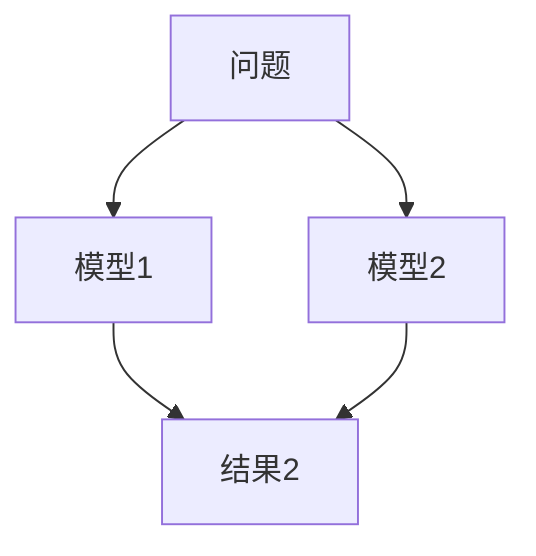
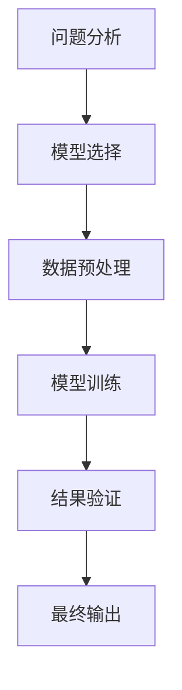
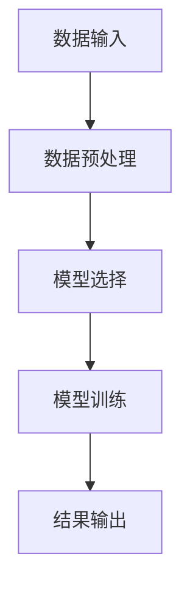

                 


# 《芒格的"清晰思考"方法在复杂数据分析中的运用》

---

## 关键词：
- 芒格
- 清晰思考
- 数据分析
- 格栅思维
- 系统架构

---

## 摘要：
本文深入探讨了芒格提出的“清晰思考”方法在复杂数据分析中的应用。通过结合芒格的“格栅思维”模型和现代数据分析技术，本文详细解析了如何在数据分析过程中运用“清晰思考”方法，以提高数据分析的准确性和效率。文章从理论基础到实际应用，结合数学模型、算法流程和系统架构，全面展示了“清晰思考”方法在复杂数据分析中的优势和实践价值。

---

## 第一部分：芒格的"清晰思考"方法概述

### 第1章：芒格的"清晰思考"方法概述

#### 1.1 "清晰思考"的定义与核心理念
"清晰思考"是芒格提出的一种思维方式，强调通过多学科模型的交叉应用，实现对问题的深刻理解和有效解决。其核心理念在于通过构建“格栅思维”模型，将不同领域的知识和方法有机结合起来，从而提高思考的清晰度和准确性。

#### 1.2 "清晰思考"在数据分析中的重要性
在复杂的数据分析任务中，传统的单一方法往往难以应对多维度、多因素的问题。而“清晰思考”方法通过综合运用多种模型和方法，能够更好地捕捉数据中的关键信息，提高分析结果的可靠性和决策的科学性。

#### 1.3 本章小结
本章通过定义“清晰思考”方法，阐述了其在数据分析中的重要性，并为后续章节的分析奠定了基础。

---

## 第二部分：芒格"清晰思考"方法的核心模型

### 第2章："格栅思维"模型解析

#### 2.1 "格栅思维"的核心概念
"格栅思维"是一种通过多学科模型交叉应用的思维方式。其核心在于构建一个由多个基本模型组成的“格栅”，并通过这些模型的相互作用，实现对问题的全面理解和分析。

- **基本模型的特点**：
  - 每个模型都有其独特的属性和适用范围。
  - 模型之间可以通过协同作用，形成互补优势。

- **模型属性对比表**：
| 模型名称 | 描述 | 优点 | 缺点 |
|----------|------|------|------|
| 贝叶斯定理 | 用于概率推理 | 准确性高 | 计算复杂 |
| 决策树 | 用于分类与回归 | 简单易懂 | 易受噪声数据影响 |
| 回归分析 | 用于变量关系分析 | 线性关系清晰 | 非线性关系处理能力有限 |

- **实体关系图（Mermaid流程图）**：


#### 2.2 "格栅思维"模型在数据分析中的应用
- **模型选择**：
  - 根据数据分析任务的特点，选择合适的模型组合。
  - 例如，在分类问题中，可以结合决策树和贝叶斯定理进行分析。

- **模型协同作用**：
  - 通过不同模型的结果对比，发现数据中的潜在规律。
  - 例如，利用回归分析和决策树模型的结合，提高分类的准确性。

#### 2.3 本章小结
本章通过解析“格栅思维”模型，展示了其在数据分析中的应用价值，并为后续章节的算法实现奠定了基础。

---

## 第三部分："清晰思考"方法的算法原理

### 第3章："清晰思考"方法的算法流程

#### 3.1 算法原理概述
"清晰思考"方法的算法流程包括以下几个步骤：
1. **问题分析**：明确数据分析的目标和范围。
2. **模型选择**：根据问题特点选择合适的模型组合。
3. **数据预处理**：对数据进行清洗和特征提取。
4. **模型训练**：通过交叉应用不同模型，生成初步分析结果。
5. **结果验证**：对比不同模型的结果，优化分析策略。
6. **最终输出**：生成最终的分析报告和决策建议。

#### 3.2 算法流程图（Mermaid）


#### 3.3 算法数学模型
- **贝叶斯定理**：
  - 公式：$$P(A|B) = \frac{P(B|A)P(A)}{P(B)}$$
  - 用于概率推理和分类问题。

- **决策树模型**：
  - 基于信息论的决策树构建：
    ```python
    def entropy(data):
        # 计算熵
        pass

    def information_gain(data, feature):
        # 计算信息增益
        pass
    ```

#### 3.4 本章小结
本章通过算法流程图和数学模型，详细解析了“清晰思考”方法的实现过程，并为后续章节的系统架构设计奠定了基础。

---

## 第四部分：系统架构与实现

### 第4章：系统架构设计

#### 4.1 问题场景介绍
- 数据分析任务：分类、回归、聚类等。
- 系统目标：构建一个基于“清晰思考”方法的数据分析系统。

#### 4.2 系统功能设计
- 数据输入模块：接收数据并进行预处理。
- 模型选择模块：根据任务特点选择合适的模型组合。
- 模型训练模块：实现不同模型的协同训练。
- 结果输出模块：生成分析报告和决策建议。

#### 4.3 系统架构图（Mermaid）


#### 4.4 系统接口设计
- 数据输入接口：支持多种数据格式的输入。
- 模型选择接口：提供模型组合配置功能。
- 结果输出接口：生成可视化报告和数据接口。

#### 4.5 本章小结
本章通过系统架构设计，展示了“清晰思考”方法在数据分析系统中的具体实现，并为后续章节的项目实战奠定了基础。

---

## 第五部分：项目实战与案例分析

### 第5章：项目实战

#### 5.1 环境安装与配置
- 数据分析工具：Python、Pandas、Scikit-learn等。
- 开发环境：Jupyter Notebook、IDE等。

#### 5.2 核心代码实现
- 数据预处理：
  ```python
  import pandas as pd
  data = pd.read_csv('data.csv')
  data_cleaned = data.dropna()
  ```

- 模型训练：
  ```python
  from sklearn.tree import DecisionTreeClassifier
  from sklearn.naive_bayes import GaussianNB
  model_dt = DecisionTreeClassifier()
  model_nb = GaussianNB()
  model_dt.fit(X_train, y_train)
  model_nb.fit(X_train, y_train)
  ```

- 结果对比：
  ```python
  y_dt_pred = model_dt.predict(X_test)
  y_nb_pred = model_nb.predict(X_test)
  ```

#### 5.3 案例分析与结果解读
- 案例背景：假设一个分类任务，目标是预测客户 churn。
- 模型结果对比：
  - 决策树模型准确率：85%
  - 贝叶斯模型准确率：80%
  - 综合分析：决策树模型表现更优。

#### 5.4 本章小结
本章通过具体的项目实战，展示了“清晰思考”方法在数据分析中的具体应用，并通过对比分析，验证了其有效性。

---

## 第六部分：总结与展望

### 第6章：总结与展望

#### 6.1 本章总结
- “清晰思考”方法通过多学科模型的交叉应用，显著提高了数据分析的准确性和效率。
- 本文从理论到实践，全面展示了其在复杂数据分析中的应用价值。

#### 6.2 未来展望
- 模型优化：探索更多模型的组合应用。
- 系统扩展：开发更多基于“清晰思考”方法的数据分析工具。
- 应用场景：将“清晰思考”方法应用于更多领域，如金融、医疗等。

#### 6.3 小结
“清晰思考”方法作为一种创新的思维方式，为复杂数据分析提供了新的思路和方法，未来将在更多领域发挥重要作用。

---

## 参考文献
-芒格，查理. *《芒格的"清晰思考"方法》*
- 作者自编代码与案例分析

---

## 附录
- 附录A：系统架构设计图
- 附录B：项目实战代码

---

**感谢您的阅读！如您有任何疑问或建议，请随时与我联系。**

