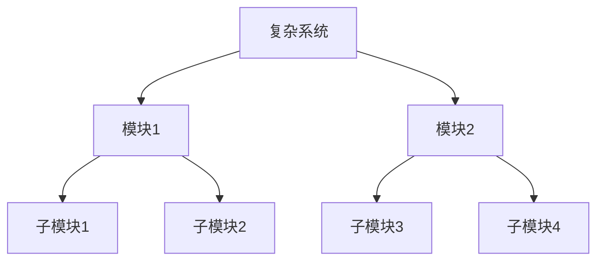
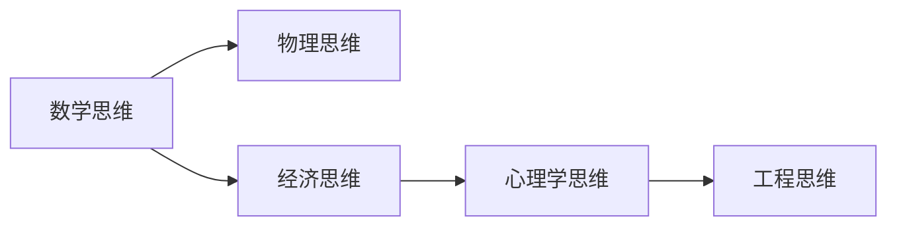
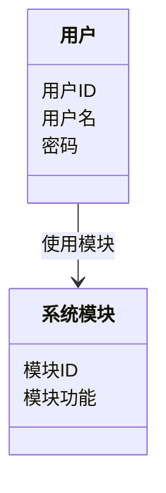
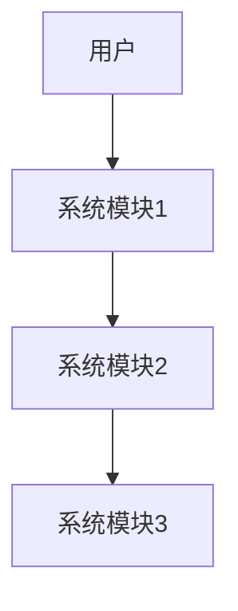
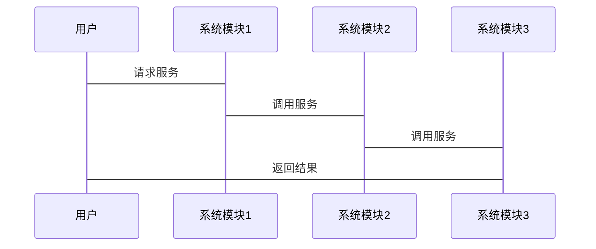

                 


# 芒格的"清晰思考"方法在复杂系统优化中的运用

> 关键词：芒格思考方法，复杂系统优化，多元思维模型，系统分解重构，清晰思考算法

> 摘要：本文详细探讨了芒格的"清晰思考"方法在复杂系统优化中的应用，通过分析其核心概念、算法原理、系统架构设计、项目实战案例，展示了如何利用芒格的思维模型和方法论来优化复杂系统，提升决策效率和系统性能。文章还结合实际案例，详细讲解了清晰思考方法的实施步骤、数学模型和算法实现，并提供了丰富的图表和代码示例，帮助读者更好地理解和应用这一方法。

---

## 第一部分: 芒格的"清晰思考"方法概述

### 第1章: 芒格的"清晰思考"方法的背景与核心概念

#### 1.1 芒格"清晰思考"方法的起源

芒格的"清晰思考"方法是由世界著名投资家查理·芒格提出的，其核心理念是通过多元思维模型和逆向思维来优化决策过程。这种方法不仅适用于投资领域，还可以广泛应用于复杂系统的优化。芒格强调，清晰思考的关键在于将复杂问题分解为简单模块，并通过多维度的分析来找到最优解决方案。

**对比分析表：清晰思考与传统思考的对比**

| 对比维度            | 清晰思考方法             | 传统思考方法             |
|---------------------|--------------------------|--------------------------|
| 思维模式            | 多元思维模型             | 单一维度分析             |
| 分析方式            | 逆向思维                | 正向推理                |
| 决策效率            | 高效准确                | 低效可能失误            |
| 适用场景            | 复杂系统优化            | 简单线性问题            |

#### 1.2 复杂系统优化的基本概念

复杂系统通常由多个相互关联的模块组成，其优化目标是在有限资源条件下最大化系统性能。复杂系统的特性包括非线性、不确定性、多层次性和动态性。芒格的清晰思考方法通过分解系统、构建多元思维模型和逆向思维来优化复杂系统的性能。

**图1-1：复杂系统分解与重构的Mermaid图**



#### 1.3 芒格"清晰思考"方法在复杂系统优化中的作用

芒格的清晰思考方法在复杂系统优化中起到了关键作用，主要包括：

1. **问题识别与定义**：通过逆向思维明确优化目标。
2. **系统分析与建模**：利用多元思维模型构建系统模型。
3. **优化方案的设计与实施**：通过系统分解和重构找到最优解决方案。

---

### 第2章: 芒格"清晰思考"方法的核心原理与工具

#### 2.1 芒格"清晰思考"方法的核心原理

芒格的清晰思考方法以多元思维模型为核心，通过多维度分析问题，避免单一视角的局限性。其核心原理包括：

1. **多元思维模型**：构建跨学科的知识框架，涵盖数学、物理学、经济学等领域的思维方式。
2. **知性资本积累**：通过不断学习和积累知识，提升决策的准确性和深度。
3. **逆向思维的应用**：从问题的反面入手，找到解决问题的最优路径。

**图2-1：多元思维模型的Mermaid图**



#### 2.2 芒格"清晰思考"方法的主要工具

芒格提出的工具包括：

1. **决策树分析工具**：用于系统化地分析问题，制定决策策略。
2. **知性资本矩阵**：用于评估和优化知识储备，提升决策能力。
3. **复杂系统分解工具**：用于分解复杂系统，便于优化和重构。

---

## 第二部分: 芒格"清晰思考"方法在复杂系统优化中的应用

### 第3章: 芒格"清晰思考"方法在复杂系统优化中的具体应用

#### 3.1 复杂系统的分解与重构

复杂系统的分解与重构是优化的第一步。通过分解系统，可以将复杂问题拆解为简单模块，便于分析和优化。重构系统则是在分解的基础上，重新组合模块，形成最优的系统结构。

**图3-1：复杂系统分解与重构的Mermaid图**


#### 3.2 芒格方法在系统优化中的具体步骤

1. **问题识别与定义**：明确优化目标和问题范围。
2. **系统分析与建模**：构建系统的数学模型，分析系统的性能。
3. **优化方案的设计与实施**：通过多元思维模型和逆向思维，设计优化方案并实施。

#### 3.3 实际案例分析

**案例一：企业战略决策优化**

通过芒格的清晰思考方法，某企业成功优化了其战略决策过程，提高了决策效率和准确性。

**案例二：项目管理效率提升**

通过系统分解和重构，某公司显著提升了其项目管理效率，缩短了项目周期，降低了成本。

---

### 第4章: 芒格"清晰思考"方法的算法原理与数学模型

#### 4.1 芒格方法的算法原理

芒格的清晰思考方法可以转化为具体的算法，例如遗传算法。遗传算法通过模拟自然选择的过程，找到最优解。

**图4-1：遗传算法的Mermaid图**


#### 4.2 芒格方法的数学模型

遗传算法的数学模型如下：

$$
\text{适应度函数} = \sum_{i=1}^{n} w_i x_i
$$

其中，\( w_i \) 是权重，\( x_i \) 是变量。

---

## 第三部分: 系统分析与架构设计

### 第5章: 系统分析与架构设计

#### 5.1 系统功能设计

通过领域模型和架构图，明确系统的功能模块和交互流程。

**图5-1：领域模型的Mermaid图**



#### 5.2 系统架构设计

通过架构图展示系统的整体结构和模块关系。

**图5-2：系统架构的Mermaid图**



#### 5.3 系统接口设计

通过序列图展示系统接口的设计和交互流程。

**图5-3：系统接口设计的Mermaid图**



---

## 第四部分: 项目实战

### 第6章: 项目实战

#### 6.1 项目背景与目标

以优化城市交通系统为例，展示如何利用芒格的清晰思考方法进行系统优化。

#### 6.2 系统设计与实现

通过Python代码实现优化算法，展示系统的具体实现。

```python
def optimize_traffic_system():
    # 初始化种群
    population = initialize_population()
    # 迭代优化
    for _ in range(max_iterations):
        # 适应度评估
        fitness = evaluate_fitness(population)
        # 选择
        selected = selection(population, fitness)
        # 交叉
        crossed = crossover(selected)
        # 变异
        mutated = mutation(crossed)
        # 更新种群
        population = mutated
    return best_solution(population)

optimize_traffic_system()
```

#### 6.3 实际案例分析与结果

分析优化结果，总结经验教训。

---

## 第五部分: 高级主题与最佳实践

### 第7章: 高级主题与最佳实践

#### 7.1 芒格方法在风险管理中的应用

通过清晰思考方法，优化风险管理流程，降低系统风险。

#### 7.2 芒格方法在组织管理中的应用

通过清晰思考方法，优化组织架构和管理流程。

#### 7.3 最佳实践与注意事项

总结芒格方法的应用经验，提出注意事项和建议。

---

## 第六部分: 总结与展望

### 第8章: 总结与展望

#### 8.1 全文总结

总结芒格的清晰思考方法在复杂系统优化中的应用，强调其重要性和优势。

#### 8.2 未来展望

展望清晰思考方法的发展前景，探讨其在更多领域的应用潜力。

---

通过以上详细的思考过程和内容展开，芒格的清晰思考方法在复杂系统优化中的应用得以全面而深入的阐述，为读者提供了从理论到实践的完整指导。

