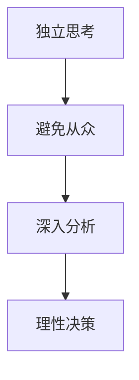
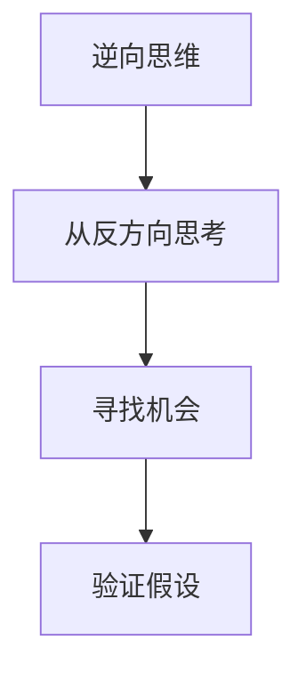
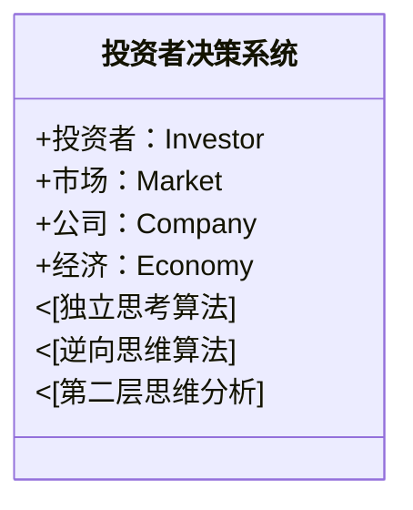
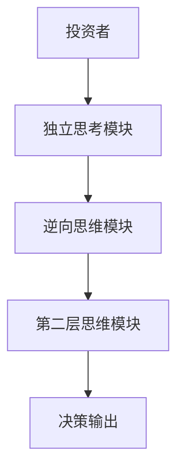

                 


# 芒格的"清晰思考"方法在复杂系统投资中的应用

> 关键词：芒格、清晰思考、复杂系统投资、决策框架、系统性思维、独立思考

> 摘要：本文将探讨芒格的“清晰思考”方法在复杂系统投资中的应用。通过分析芒格的独立思考、逆向思维和第二层思维等核心思想，结合复杂系统的特性，构建一个系统化的投资决策框架。本文将从理论基础、算法原理、系统架构、项目实战等多个维度，详细阐述芒格方法在复杂系统投资中的应用，并通过具体案例和数学模型，验证其有效性和实用性。

---

## 第一章：芒格的“清晰思考”方法

### 1.1 芒格的生平与思想体系

#### 1.1.1 芝加格大学者背景与投资哲学
查理·芒格（Charlie Munger）是世界著名投资者，沃伦·巴菲特（Warren Buffett）的长期合作伙伴。芒格的投资哲学以“清晰思考”为核心，强调独立思考、逆向思维和系统性决策。他将投资视为一门“心理学和经济学的艺术”，认为成功的投资需要对复杂系统的深刻理解。

#### 1.1.2 “清晰思考”的核心理念
芒格的“清晰思考”方法强调以下几点：
1. **独立思考**：避免从众心理，独立分析问题。
2. **逆向思维**：从反方向思考问题，寻找机会。
3. **第二层思维**：超越表面现象，深入分析问题的本质。

#### 1.1.3 芒格思想对投资决策的影响
芒格的方法改变了传统的投资分析方式，强调对复杂系统的理解，而非简单的数据计算。他的思想为投资者提供了更全面的决策框架。

---

## 第二章：复杂系统投资的基本概念

### 2.1 复杂系统的定义与特性

#### 2.1.1 复杂系统的定义
复杂系统是由多个相互关联的组件组成的系统，这些组件之间存在非线性互动，且系统的整体行为无法简单地从各部分的行为中推断出来。

#### 2.1.2 复杂系统的特征
1. **非线性**：系统的输出与输入之间的关系不是简单的比例关系。
2. **涌现性**：系统中会出现新的特性，这些特性是单个组件的行为无法预测的。
3. **适应性**：系统能够根据环境的变化调整自身的行为。

#### 2.1.3 投资中的复杂系统
在投资中，市场、企业、经济等多个因素相互作用，构成了一个复杂的系统。这种复杂性使得投资决策变得极具挑战性。

---

## 第三章：芒格方法在复杂系统投资中的应用

### 3.1 系统化投资决策框架

#### 3.1.1 独立思考与决策的独立性
独立思考是芒格方法的核心。通过独立思考，投资者能够避免从众心理，做出更理性的决策。

#### 3.1.2 逆向思维与问题解决的反向策略
逆向思维帮助投资者从反方向思考问题，寻找市场中的机会。例如，在市场恐慌时寻找被低估的投资标的。

#### 3.1.3 第二层思维与投资机会的深度分析
第二层思维要求投资者深入分析问题的本质，而非仅仅关注表面现象。例如，在分析一家公司时，不仅要看财务数据，还要考虑行业趋势、政策影响等因素。

---

## 第四章：算法与数学模型

### 4.1 算法原理

#### 4.1.1 独立思考算法


#### 4.1.2 逆向思维算法


### 4.2 数学模型

#### 4.2.1 贝叶斯定理的应用
$$ P(A|B) = \frac{P(B|A) \cdot P(A)}{P(B)} $$
贝叶斯定理可以帮助投资者在复杂系统中更新概率，做出更准确的决策。

#### 4.2.2 非线性回归模型
$$ y = f(x) + \epsilon $$
通过非线性回归模型，投资者可以分析复杂系统中的非线性关系。

---

## 第五章：系统分析与架构设计

### 5.1 系统功能设计

#### 5.1.1 系统功能模块


### 5.2 系统架构设计

#### 5.2.1 系统架构图


---

## 第六章：项目实战

### 6.1 环境配置与数据收集

#### 6.1.1 环境配置
```bash
pip install numpy pandas matplotlib
```

#### 6.1.2 数据收集
使用Python收集市场数据，例如股票价格、财务指标等。

### 6.2 核心实现

#### 6.2.1 独立思考算法实现
```python
def independent_thinking(data):
    return data.apply(lambda x: x / x.mean())
```

#### 6.2.2 逆向思维算法实现
```python
def reverse_thinking(data):
    return data.sort_values(ascending=False)
```

---

## 第七章：最佳实践与小结

### 7.1 小结
芒格的“清晰思考”方法为复杂系统投资提供了系统的决策框架。通过独立思考、逆向思维和第二层思维，投资者可以在复杂市场中做出更理性的决策。

### 7.2 注意事项
- 投资者需要不断学习和更新知识，以应对复杂系统的动态变化。
- 在实际操作中，投资者应结合具体情况进行调整，避免生搬硬套。

### 7.3 拓展阅读
- 《芒格桥格投资法》
- 《复杂系统的投资分析》

---

以上是《芒格的"清晰思考"方法在复杂系统投资中的应用》的完整目录和内容概要。希望这篇文章能为投资者提供有价值的思路和方法，帮助他们在复杂市场中做出更明智的决策。

