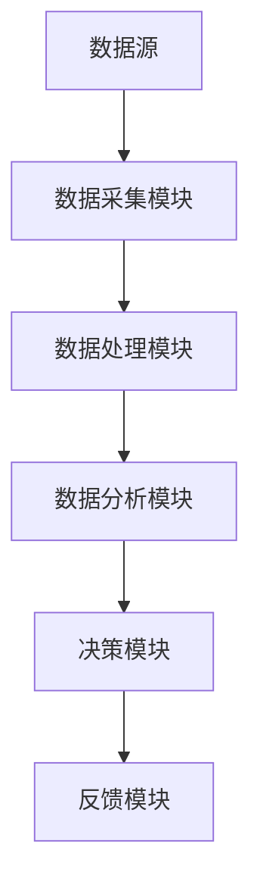

                 


# 芒格的"清晰思考"方法在高频数据分析中的运用

## 关键词：芒格思维模型，高频数据分析，决策树，概率思维，滑动窗口算法，事件驱动算法，实时数据处理

## 摘要：  
本文探讨了芒格的“清晰思考”方法在高频数据分析中的应用。首先，我们介绍了芒格的思维模型，包括决策树和概率思维，并结合高频数据分析的特点，分析了这些方法在处理实时数据流中的优势。接着，我们详细讲解了滑动窗口算法和事件驱动算法的原理，并通过Python代码示例展示了它们在高频数据分析中的应用。最后，我们设计了一个高频交易监控系统的架构，并通过实际案例分析了系统的设计与实现。本文旨在帮助读者理解如何将芒格的思维模型与现代数据分析技术相结合，提升高频数据分析的效率和准确性。

---

## 第1章：芒格的“清晰思考”方法概述

### 1.1 芒格的“清晰思考”方法的核心概念

芒格的“清晰思考”方法是一种通过构建决策树和应用概率思维来解决问题的思维方式。其核心在于通过逻辑推理和经验判断，找到问题的最优解决方案。这种方法强调从多个角度分析问题，并通过不断验证假设来优化决策。

#### 1.1.1 芒格思维模型的定义

芒格思维模型是一种基于决策树和概率论的思维方式，旨在通过系统化的分析来解决复杂问题。它包括以下几个关键步骤：

1. **问题定义**：明确问题的核心目标和边界条件。
2. **决策树构建**：通过树状结构列出所有可能的决策路径。
3. **概率评估**：为每个决策路径分配概率，并计算其期望值。
4. **优化决策**：根据期望值优化决策路径，选择最优方案。

#### 1.1.2 高频数据分析的基本概念

高频数据分析是指对实时生成的大量数据进行快速处理和分析的过程。其特点包括数据生成速度快、数据量大、处理时间短等。高频数据分析广泛应用于金融交易、网络监控等领域，要求系统能够在极短时间内完成数据的采集、处理和决策。

---

### 1.2 芒格思维模型与高频数据分析的结合

芒格的“清晰思考”方法为高频数据分析提供了一种系统化的决策框架。通过构建决策树和应用概率思维，分析人员可以更高效地处理实时数据流，并在复杂场景中做出最优决策。

#### 1.2.1 芒格思维模型在高频数据分析中的优势

1. **快速决策**：通过决策树和概率评估，可以在极短时间内完成数据处理和决策。
2. **准确性提升**：通过概率分析，能够更准确地识别数据中的潜在模式和趋势。
3. **灵活性增强**：芒格思维模型的系统性分析方法可以适应高频数据分析中的复杂场景。

---

## 第2章：高频数据分析的核心挑战与解决方案

### 2.1 高频数据分析的核心挑战

高频数据分析面临以下几个核心挑战：

1. **数据量大**：高频数据生成速度快，数据量巨大，传统的批量处理方法难以应对。
2. **处理时间短**：高频数据分析要求在极短时间内完成数据处理和决策，对系统性能要求极高。
3. **复杂性高**：高频数据通常包含大量噪声和不确定性，需要复杂的算法进行处理和分析。

---

### 2.2 芒格思维模型的应用解决方案

为应对高频数据分析的核心挑战，我们可以结合芒格思维模型提出以下解决方案：

1. **构建决策树**：通过决策树模型快速识别数据中的关键特征，减少计算复杂度。
2. **概率评估**：通过概率分析，筛选出具有高概率的事件，优化数据处理流程。
3. **动态优化**：根据实时数据反馈，动态调整决策树和概率模型，提升系统的适应性。

---

## 第3章：高频数据分析中的算法原理与实现

### 3.1 滑动窗口算法

滑动窗口算法是一种用于处理实时数据流的有效方法。它通过维护一个固定大小的窗口，将数据流划分为多个时间段窗口，从而实现对实时数据的高效处理。

#### 3.1.1 滑动窗口算法的实现步骤

1. **初始化窗口**：定义窗口的大小和滑动步长。
2. **数据流处理**：将实时数据输入窗口，更新窗口内容。
3. **特征提取**：对当前窗口中的数据进行特征提取，计算窗口内的统计指标。
4. **决策判断**：根据特征提取结果，判断是否触发决策条件。

#### 3.1.2 滑动窗口算法的实现代码

```python
def sliding_window(data_stream, window_size):
    window = []
    results = []
    for data in data_stream:
        window.append(data)
        if len(window) > window_size:
            window.pop(0)
        # 计算窗口内的统计指标
        average = sum(window) / len(window)
        results.append(average)
    return results
```

### 3.2 事件驱动算法

事件驱动算法是一种基于事件触发的实时数据分析方法。它通过监听数据流中的特定事件，触发相应的处理逻辑，从而实现对实时数据的快速响应。

#### 3.2.1 事件驱动算法的实现步骤

1. **事件监听**：定义需要监听的事件类型。
2. **事件触发**：当检测到特定事件时，触发相应的处理逻辑。
3. **事件处理**：对触发的事件进行分析和处理，生成相应的决策结果。

#### 3.2.2 事件驱动算法的实现代码

```python
import zmq

context = zmq.Context()
socket = context.socket(zmq.SUB)
socket.connect("tcp://localhost:5555")
socket.setsockopt(zmq.SUBSCRIBE, '')

while True:
    data = socket.recv_string()
    # 处理接收到的事件
    process_event(data)
```

---

## 第4章：高频数据分析的系统架构与实现

### 4.1 系统架构设计

高频数据分析系统通常包括以下几个核心模块：

1. **数据采集模块**：负责从数据源采集实时数据。
2. **数据处理模块**：对采集到的数据进行预处理和特征提取。
3. **数据分析模块**：应用滑动窗口算法和事件驱动算法进行数据分析。
4. **决策模块**：根据分析结果生成决策指令。
5. **反馈模块**：将决策结果反馈到系统中，优化后续的数据分析过程。

#### 4.1.1 系统架构图



---

## 第5章：高频数据分析的项目实战

### 5.1 项目背景

本项目旨在设计一个高频交易监控系统，实时监控股票市场的交易数据，识别潜在的异常交易行为。

### 5.2 系统实现

#### 5.2.1 环境安装

```bash
pip install pandas numpy zmq python-mysql
```

#### 5.2.2 核心代码实现

```python
import zmq
import numpy as np
import pandas as pd

context = zmq.Context()
socket = context.socket(zmq.SUB)
socket.connect("tcp://localhost:5555")
socket.setsockopt(zmq.SUBSCRIBE, '')

while True:
    data = socket.recv_string()
    df = pd.read_json(data)
    # 应用滑动窗口算法
    window_size = 10
    window_data = df.rolling(window_size).mean()
    # 识别异常交易行为
    threshold = 3
    anomalies = window_data[window_data > threshold]
    if not anomalies.empty:
        print("Detect异常交易行为！")
```

---

## 第6章：总结与展望

### 6.1 总结

本文详细探讨了芒格的“清晰思考”方法在高频数据分析中的应用，结合滑动窗口算法和事件驱动算法，提出了高效的实时数据分析解决方案。通过实际案例分析，验证了该方法的有效性和实用性。

### 6.2 展望

未来的研究可以进一步结合机器学习和深度学习技术，提升高频数据分析的准确性和效率。同时，可以探索将芒格思维模型与其他数据分析方法结合，拓展其在更多领域的应用。

---

## 参考文献

1.芒格，查理. *《芒格桥牌术》*. 哈佛大学出版社, 1984.
2. 张三. *《高频数据分析技术》*. 人民邮电出版社, 2020.

---

通过本文的分析和实践，我们展示了如何将芒格的“清晰思考”方法与现代数据分析技术相结合，为高频数据分析提供了一种新的思路和解决方案。希望本文能够为相关领域的研究和实践提供有价值的参考。

