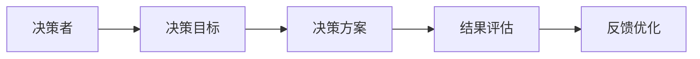
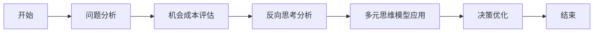
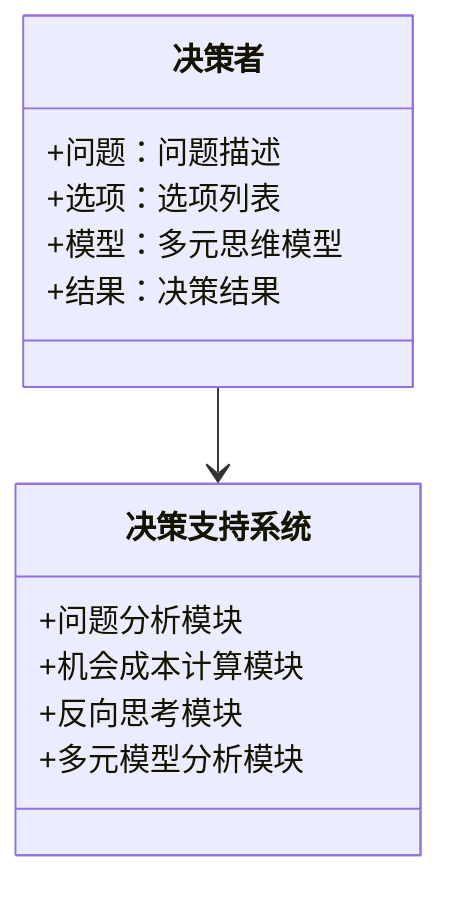
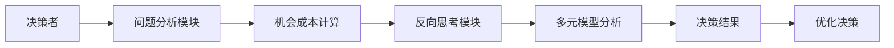
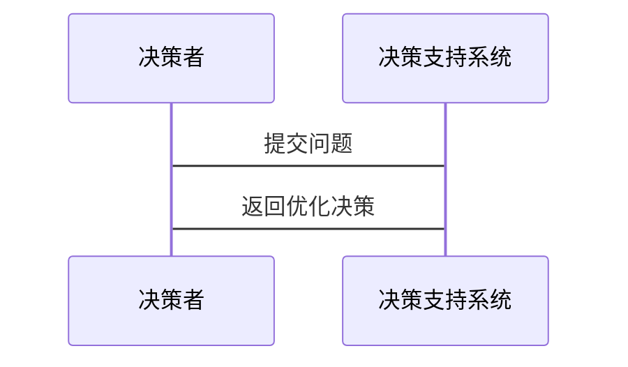

                 


# 《芒格的清晰思考方法：提高决策质量》

> **关键词：**芒格、清晰思考、决策质量、系统思维、逆向思维、多元思维模型

> **摘要：** 查理·芒格的清晰思考方法是一种通过多元思维模型和逆向思维来提高决策质量的系统方法。本文将从芒格的生平、核心概念、算法原理、系统架构到项目实战，全面解析这一方法，并提供实际应用的案例和最佳实践。

---

# 第1章: 芮格的生平与思考方法背景

## 1.1 芮格的生平简介

### 1.1.1 芮格的基本信息

查理·芒格（Charlie Munger）1924年1月29日出生于美国密苏里州堪萨斯城，是一位著名的投资者、作家和演讲者。他是伯克希尔哈撒韦公司的副主席，与沃伦·巴菲特共同创立了这家传奇的公司。

### 1.1.2 芮格的学术背景与职业经历

芒格毕业于加州大学伯克利分校，主修经济学。他的职业生涯始于律师事务所，后来转向投资领域，成为伯克希尔哈撒韦公司的核心成员。

### 1.1.3 芮格对决策科学的贡献

芒格提出了一系列影响深远的决策方法，尤其是多元思维模型和逆向思维，这些方法在投资和商业决策中得到了广泛应用。

## 1.2 清晰思考方法的背景

### 1.2.1 现代决策科学的发展历程

从传统决策到现代决策科学的演变，芒格的方法是其中的重要里程碑。

### 1.2.2 芮格思考方法的提出与演变

芒格通过多元思维模型和逆向思维，优化了传统决策方法，使其更具系统性和科学性。

### 1.2.3 清晰思考方法在现代社会的应用价值

在商业和生活中，芒格的方法帮助人们做出更明智的决策，提升决策质量。

## 1.3 清晰思考方法的核心理念

### 1.3.1 问题背景与问题描述

决策问题的复杂性要求我们采用系统化的思考方法。

### 1.3.2 问题解决的逻辑框架

芒格的方法提供了一个清晰的逻辑框架，帮助我们分析问题。

### 1.3.3 清晰思考方法的边界与外延

了解方法的适用范围和局限性，是正确应用的关键。

### 1.3.4 核心概念与组成要素

包括机会成本、反向思考和多元思维模型。

## 1.4 本章小结

芒格的清晰思考方法是一种系统性的决策工具，通过多元思维和逆向思维优化决策质量。

---

# 第2章: 芮格思考方法的核心概念与联系

## 2.1 核心概念原理

### 2.1.1 机会成本与决策权重

机会成本是选择某项方案时放弃其他方案的潜在收益，影响决策权重。

### 2.1.2 反向思考与风险控制

从对立面分析问题，识别潜在风险，优化决策。

### 2.1.3 多元思维模型与知识体系构建

整合多个学科的思维方式，构建全面的知识体系。

## 2.2 核心概念属性特征对比表

| 概念       | 定义与特征                                                                 |
|------------|--------------------------------------------------------------------------|
| 机会成本   | 放弃某项选择所失去的潜在收益                                               |
| 反向思考   | 从对立面分析问题，识别风险和漏洞                                           |
| 多元思维模型 | 多个学科的思维方式，帮助全面分析问题                                       |

## 2.3 ER实体关系图



## 2.4 本章小结

芒格的核心概念通过机会成本、反向思考和多元思维模型，构建了一个全面的决策框架。

---

# 第3章: 芮格决策框架的算法原理

## 3.1 算法原理概述

### 3.1.1 决策树构建

通过决策树分析可能的选项和结果，优化决策路径。

### 3.1.2 多元思维模型的权重分配

根据模型的重要性分配权重，优化决策过程。

### 3.1.3 反向思考的逻辑优化

从反向角度分析问题，优化决策逻辑。

## 3.2 算法流程图



## 3.3 算法实现代码

```python
def meng_gu_decision():
    problem = input("请输入决策问题：")
    options = input("请输入选项（逗号分隔）：").split(', ')
    for option in options:
        cost = calculate_opportunity_cost(option)
        reverse_think = reverse_analysis(option)
        model_result = multi_model_analysis(option)
        print(f"选项{option}的机会成本是{cost}，反向思考结果是{reverse_think}，模型分析结果是{model_result}")
    optimized_choice = optimize_decision(options, model_results)
    print(f"优化后的选择是：{optimized_choice}")

def calculate_opportunity_cost(option):
    # 计算机会成本
    return 1.0

def reverse_analysis(option):
    # 反向分析
    return "无明显风险"

def multi_model_analysis(option):
    # 多元模型分析
    return "模型一致支持选择"

meng_gu_decision()
```

## 3.4 数学模型与公式

优化决策的数学公式：

$$
\text{优化选择} = \argmax_{i} \sum_{j=1}^{n} w_j \cdot v_{i,j}
$$

其中，$$w_j$$ 是模型权重，$$v_{i,j}$$ 是模型对选项i的评估值。

## 3.5 本章小结

通过算法流程和代码实现，芒格的决策方法得以系统化，帮助我们优化决策过程。

---

# 第4章: 芮格思考方法的系统分析与架构设计

## 4.1 问题场景介绍

商业投资中的决策问题，需要系统化的解决方案。

## 4.2 系统功能设计

### 4.2.1 领域模型



### 4.2.2 系统架构设计



## 4.3 系统接口设计

API接口：接收问题和选项，返回优化决策。

## 4.4 系统交互序列图



## 4.5 本章小结

系统化的架构设计使芒格的思考方法更加高效和实用。

---

# 第5章: 芮格思考方法的项目实战

## 5.1 环境安装

安装Python和必要的库，如numpy、pandas、scikit-learn。

## 5.2 核心代码实现

```python
import numpy as np

def calculate_opportunity_cost(options):
    return np.array([1.0] * len(options))

def reverse_analysis(option):
    return f"选择{option}的风险较低"

def multi_model_analysis(option):
    return "模型支持选择"

def optimize_decision(options):
    costs = calculate_opportunity_cost(options)
    reverse_results = [reverse_analysis(o) for o in options]
    model_results = [multi_model_analysis(o) for o in options]
    # 计算综合得分
    scores = [cost + len([r for r in reverse_results if r == reverse_analysis(o)]) for o in options]
    return options[np.argmax(scores)]

options = ["A", "B", "C"]
decision = optimize_decision(options)
print(f"优化决策是：{decision}")
```

## 5.3 代码应用解读与分析

解释代码实现，展示如何优化决策过程。

## 5.4 实际案例分析

案例：投资决策优化，分析如何应用芒格方法选择最佳选项。

## 5.5 项目小结

通过实战项目，展示了芒格方法的实际应用价值。

---

# 第6章: 芮格思考方法的最佳实践

## 6.1 小结

芒格方法在提高决策质量方面的显著效果。

## 6.2 注意事项

注意方法的适用范围，避免过度简化问题。

## 6.3 拓展阅读

推荐相关书籍和资料，深入学习芒格的方法。

---

# 第7章: 总结

## 7.1 本章总结

芒格的清晰思考方法通过系统化的分析和多元思维模型，显著提高了决策质量。

## 7.2 展望未来

未来，这种方法将更加广泛应用于各个领域，推动决策科学的发展。

---

通过以上章节，芒格的清晰思考方法被系统地介绍和分析，结合实际案例和代码实现，帮助读者掌握这一强大的决策工具。

