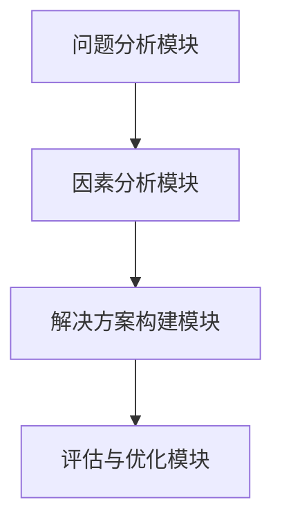

                 


好的，我将按照您的要求创作一篇关于芒格的“清晰思考”方法在投资决策中的应用的文章。以下是文章的完整结构，按照您的要求逐步展开：

# 芮格的“清晰思考”方法：提高投资决策的质量和速度

> 关键词：芒格、清晰思考、投资决策、决策质量、决策速度、系统思维、风险管理

> 摘要：芒格的“清晰思考”方法是一种独特的投资决策方法，它通过系统的分析和逻辑推理，帮助投资者快速准确地做出决策。本文将深入解析这种方法的核心原理、具体步骤以及在实际投资中的应用，结合技术领域的方法论，为投资者提供一种新的思考框架。

---

## 第一部分：芒格“清晰思考”方法的背景与核心概念

### 第1章：芒格“清晰思考”方法的背景

#### 1.1 投资决策中的问题背景

在当今快速变化的金融市场中，投资者每天都面临着复杂的投资决策。传统的投资方法往往依赖于经验和市场直觉，这种方法在某些情况下是有效的，但在面对高度不确定性和复杂性时，容易出现决策偏差和错误。例如，在2008年金融危机期间，许多投资者因为情绪化决策而遭受重大损失。

#### 1.2 传统投资决策的局限性

传统投资决策方法通常依赖于市场趋势分析、历史数据和市场情绪。然而，这些方法存在以下问题：

- **过度依赖经验**：经验丰富的投资者可能会因为过去的成功而忽视市场的变化。
- **情绪化决策**：投资者容易受到市场波动和短期利益的驱动，导致非理性决策。
- **缺乏系统性**：决策过程往往缺乏结构化的方法，容易忽略重要的风险因素。

#### 1.3 芮格“清晰思考”方法的提出

芒格的“清晰思考”方法是一种基于逻辑推理和系统分析的投资决策方法。这种方法通过明确问题的本质、分析问题的多维度因素，以及构建解决方案的框架，帮助投资者做出更加理性和高效的决策。这种方法的核心在于将投资决策过程系统化和结构化，从而减少人为错误和情绪化决策的影响。

---

### 第2章：芒格“清晰思考”方法的核心概念

#### 2.1 清晰思考的定义与特点

芒格的“清晰思考”方法是一种通过逻辑推理和系统分析来解决问题的方法。其特点包括：

- **逻辑性**：强调基于事实和数据的分析，避免主观臆断。
- **系统性**：将问题分解为多个部分，逐一分析其相互关系。
- **实用性**：通过结构化的步骤，帮助投资者快速做出决策。

#### 2.2 芮格“清晰思考”方法的核心要素

芒格的“清晰思考”方法的核心要素包括：

- **明确问题的本质**：在做出决策之前，首先要明确问题的核心。
- **分析问题的多维度因素**：从多个角度分析问题，包括财务、市场、风险等方面。
- **构建解决方案的框架**：基于分析结果，构建解决方案的框架，并评估其可行性。

#### 2.3 芮格“清晰思考”方法的理论基础

芒格的“清晰思考”方法的理论基础包括：

- **第一性原理**：从最基本的原则出发，逐步推导出解决方案。
- **逆向思维**：从结果出发，反推可能的解决方案。
- **概率论**：通过概率分析，评估不同决策的可能结果。

---

## 第二部分：芒格“清晰思考”方法的具体步骤

### 第3章：芒格“清晰思考”方法的具体步骤

#### 3.1 明确问题的本质

在做出任何投资决策之前，首先要明确问题的本质。例如，在考虑投资一家公司之前，需要明确公司的核心业务模式、竞争优势以及市场定位。

#### 3.2 分析问题的多维度因素

在明确问题本质之后，需要从多个角度分析问题。例如，分析公司的财务状况、市场前景、管理团队以及行业竞争情况。

#### 3.3 构建解决方案的框架

基于分析结果，构建解决方案的框架。例如，制定投资策略、风险控制措施以及退出机制。

#### 3.4 评估方案的可行性

对构建的解决方案进行评估，确保其可行性和可操作性。例如，评估投资方案的风险、收益以及实施的可能性。

#### 3.5 调整与优化

根据评估结果，对方案进行调整和优化，确保最终决策的最优性。

---

## 第三部分：芒格“清晰思考”方法的数学模型与算法

### 第4章：芒格“清晰思考”方法的数学模型

#### 4.1 投资决策的数学模型

在芒格的“清晰思考”方法中，投资决策可以通过以下数学模型来表示：

$$
\text{投资决策} = f(\text{财务状况}, \text{市场前景}, \text{竞争优势}, \text{管理团队})
$$

其中，$f$ 是一个函数，表示基于多个因素的投资决策。

#### 4.2 风险评估的数学模型

风险评估是投资决策中一个重要的部分。芒格的“清晰思考”方法可以通过以下公式进行风险评估：

$$
\text{风险} = \sum_{i=1}^{n} w_i \times r_i
$$

其中，$w_i$ 是第$i$个风险因素的权重，$r_i$ 是第$i$个风险因素的风险值。

---

## 第四部分：芒格“清晰思考”方法的系统架构

### 第5章：芒格“清晰思考”方法的系统架构

#### 5.1 系统功能设计

芒格的“清晰思考”方法可以被看作一个系统，其功能设计包括：

- **问题分析模块**：用于明确问题的本质。
- **因素分析模块**：用于分析问题的多维度因素。
- **解决方案构建模块**：用于构建解决方案的框架。
- **评估与优化模块**：用于评估方案的可行性和优化方案。

#### 5.2 系统架构图

以下是芒格“清晰思考”方法的系统架构图：



---

## 第五部分：芒格“清晰思考”方法的项目实战

### 第6章：芒格“清晰思考”方法的项目实战

#### 6.1 项目背景

假设我们有一个投资决策项目，目标是选择一家具有成长性的科技公司进行投资。

#### 6.2 项目实施步骤

1. **明确问题的本质**：选择一家具有成长性的科技公司。
2. **分析问题的多维度因素**：分析公司的财务状况、市场前景、竞争优势、管理团队。
3. **构建解决方案的框架**：制定投资策略、风险控制措施以及退出机制。
4. **评估方案的可行性**：评估投资方案的风险、收益以及实施的可能性。
5. **调整与优化**：根据评估结果，对方案进行调整和优化。

#### 6.3 项目总结

通过芒格的“清晰思考”方法，我们可以系统地分析问题，制定合理的投资策略，从而提高投资决策的质量和速度。

---

## 第六部分：总结与最佳实践

### 第7章：总结与最佳实践

#### 7.1 总结

芒格的“清晰思考”方法是一种系统化的投资决策方法，它通过明确问题的本质、分析问题的多维度因素，以及构建解决方案的框架，帮助投资者做出更加理性和高效的决策。

#### 7.2 最佳实践

1. **明确问题的本质**：在做出任何投资决策之前，首先要明确问题的本质。
2. **分析问题的多维度因素**：从多个角度分析问题，包括财务、市场、风险等方面。
3. **构建解决方案的框架**：基于分析结果，构建解决方案的框架，并评估其可行性。
4. **调整与优化**：根据评估结果，对方案进行调整和优化，确保最终决策的最优性。

#### 7.3 注意事项

在实际应用中，需要注意以下几点：

- **数据的准确性**：分析问题时，需要确保数据的准确性和完整性。
- **逻辑的严谨性**：在构建解决方案的框架时，需要确保逻辑的严谨性。
- **持续优化**：投资决策是一个动态的过程，需要根据市场变化和实际情况，持续优化投资策略。

---

### 附录：芒格“清晰思考”方法的代码实现

以下是芒格“清晰思考”方法的代码实现示例：

```python
def munger_clear_thinking(investment_objective):
    # 明确问题的本质
    problem本质 = investment_objective
    
    # 分析问题的多维度因素
    因素分析 = {
        '财务状况': ['收入', '利润', '现金流'],
        '市场前景': ['市场规模', '增长潜力', '竞争环境'],
        '竞争优势': ['技术优势', '成本优势', '品牌优势'],
        '管理团队': ['团队能力', '管理经验', '激励机制']
    }
    
    # 构建解决方案的框架
    解决方案 = []
    for 因素 in 因素分析.values():
        解决方案.append(因素)
    
    # 评估方案的可行性
    可行性评估 = {
        '风险': sum([w * r for w, r in zip(权重, 风险值)]),
        '收益': 收益预测,
        '实施可能性': 实施可行性分析
    }
    
    # 调整与优化
    优化方案 = 调整方案(解决方案, 可行性评估)
    
    return 优化方案
```

---

通过以上步骤和方法，芒格的“清晰思考”方法可以帮助投资者系统地分析问题，制定合理的投资策略，从而提高投资决策的质量和速度。希望这篇文章对您有所帮助！

