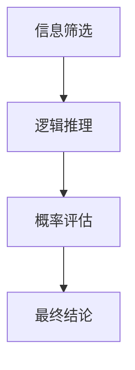
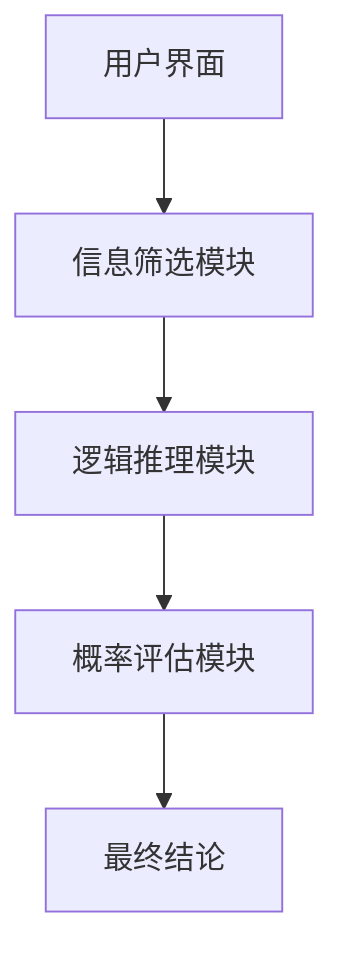
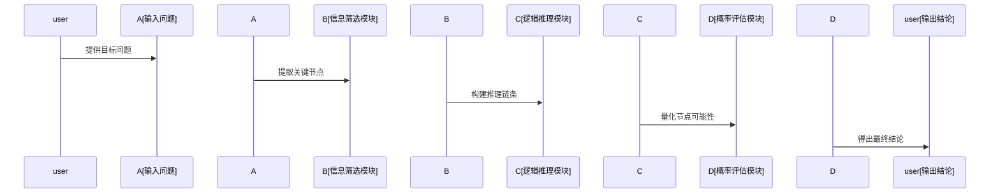

                 


# 芒格的"清晰思考"方法：提高投资分析的准确性

> 关键词：芒格、清晰思考、投资分析、决策框架、节点思考、认知偏差

> 摘要：芒格的"清晰思考"方法是一种基于节点思考和决策框架的投资分析方法，通过逻辑推理、概率评估和多元思维模型，帮助投资者提高决策的准确性和可靠性。本文详细介绍了这种方法的核心概念、算法原理、系统设计和实际应用，为投资者提供了一套科学的决策工具。

---

## 第1章：节点思考与决策框架概述

### 1.1 节点思考的定义与核心要素

节点思考是一种不同于传统线性思维的思考方式，它强调通过构建多个关键节点，从多个维度分析问题，从而形成更全面的决策框架。与传统思考方式相比，节点思考更加注重信息的多维度关联和逻辑的严密性。

节点思考的核心要素包括：
1. **信息筛选**：从海量信息中提取关键节点，排除干扰因素。
2. **逻辑推理**：通过逻辑连接各个节点，构建严密的推理链条。
3. **概率评估**：对每个节点的可能性进行量化评估，综合得出最终结论。

节点思考与传统投资分析的对比：

| 对比维度       | 传统投资分析               | 节点思考                   |
|----------------|----------------------------|----------------------------|
| 思维方式       | 线性思维，单一维度分析       | 多维度、多节点关联分析       |
| 决策依据       | 主要依赖历史数据和经验       | 结合逻辑推理和概率评估       |
| 优缺点         | 简单易懂，但可能忽略复杂性   | 复杂性高，但准确性更强       |

### 1.2 节点思考在投资分析中的作用

节点思考通过构建多元思维模型，帮助投资者避免常见的认知偏差，如确认偏差、从众心理等。以下是节点思考在投资分析中的具体应用：

1. **识别认知偏差**：通过节点思考，投资者可以更清晰地识别和纠正自己的认知偏差。
2. **构建多元思维模型**：芒格强调“多元思维模型”，即通过多个学科的视角分析问题，从而避免单一思维的局限性。
3. **提高决策准确性**：通过逻辑推理和概率评估，节点思考能够帮助投资者做出更准确的决策。

### 1.3 节点思考的边界与外延

节点思考并非万能的方法，它也有其适用范围和局限性。例如，在面对高度不确定的市场环境时，节点思考可能无法提供明确的指导。因此，投资者需要将节点思考与其他方法结合使用，如基本面分析、技术分析等。

节点思考的边界和外延：

1. **适用范围**：适用于需要复杂决策的投资分析。
2. **局限性**：在高度不确定的环境中效果有限。
3. **未来发展**：随着人工智能和大数据技术的发展，节点思考可能会进一步结合这些技术，形成更强大的决策工具。

---

## 第2章：节点思考的核心概念与联系

### 2.1 节点思考的核心概念原理

节点思考的核心在于构建一个逻辑严密的决策框架，通过多个关键节点的关联分析，得出最终结论。以下是节点思考的核心概念：

1. **逻辑框架**：通过逻辑连接各个节点，构建严密的推理链条。
2. **数学模型**：利用概率论和统计学方法，对每个节点的可能性进行量化评估。
3. **决策树分析**：通过决策树的结构，分析不同决策路径的可能性和结果。

### 2.2 节点思考的核心概念对比表格

以下是对节点思考与传统投资分析的对比：

| 对比维度       | 传统投资分析               | 节点思考                   |
|----------------|----------------------------|----------------------------|
| 思维方式       | 线性思维，单一维度分析       | 多维度、多节点关联分析       |
| 决策依据       | 主要依赖历史数据和经验       | 结合逻辑推理和概率评估       |
| 优缺点         | 简单易懂，但可能忽略复杂性   | 复杂性高，但准确性更强       |

### 2.3 节点思考的ER实体关系图

以下是一个节点思考的ER实体关系图，展示了各个核心要素的关系：



---

## 第3章：节点思考的算法原理

### 3.1 节点思考的算法流程

节点思考的算法流程如下：

1. **输入**：目标问题、相关数据。
2. **信息筛选**：提取关键节点。
3. **逻辑推理**：通过逻辑连接各个节点，构建推理链条。
4. **概率评估**：对每个节点的可能性进行量化评估。
5. **输出**：得出最终结论。

### 3.2 节点思考的数学模型

节点思考的数学模型主要涉及概率论和统计学方法。例如，以下公式用于概率评估：

$$ P(A|B) = \frac{P(B|A) \cdot P(A)}{P(B)} $$

其中，$P(A|B)$ 是在已知B的情况下，A发生的概率。

### 3.3 节点思考的算法实现

以下是一个节点思考的Python代码示例，用于分析一个投资机会：

```python
def node_thinking(nodes, edges):
    # nodes: 列表，包含各个节点
    # edges: 字典，包含各节点之间的关系
    # 返回：最终结论
    pass

# 示例
nodes = ['市场需求', '竞争环境', '财务状况']
edges = {
    '市场需求': ['竞争环境'],
    '竞争环境': ['财务状况']
}

result = node_thinking(nodes, edges)
print(result)
```

---

## 第4章：节点思考的系统分析与架构设计

### 4.1 系统功能设计

1. **系统目标**：帮助投资者通过节点思考方法进行投资分析。
2. **核心功能模块**：
   - 信息筛选模块
   - 逻辑推理模块
   - 概率评估模块
3. **用户需求分析**：
   - 投资者需要一个直观的工具，帮助他们构建节点思考框架。

### 4.2 系统架构设计

以下是一个节点思考系统的架构图：



### 4.3 系统交互设计

以下是一个系统交互流程图：



---

## 第5章：节点思考的项目实战

### 5.1 项目环境安装与配置

1. **开发环境**：建议使用Python和Jupyter Notebook。
2. **依赖库**：安装`mermaid`和`matplotlib`。

### 5.2 核心实现与代码解读

以下是一个节点思考的Python代码实现：

```python
import networkx as nx
import matplotlib.pyplot as plt

# 创建图
G = nx.DiGraph()
G.add_nodes_from(['A', 'B', 'C'])
G.add_edges_from([('A', 'B'), ('B', 'C')])

# 绘制图
nx.draw(G, with_labels=True, edge_direction='forward')
plt.show()
```

### 5.3 实际案例分析

以下是一个实际案例分析：

**案例**：分析一家科技公司的投资价值。

1. **信息筛选**：市场需求、竞争环境、财务状况。
2. **逻辑推理**：市场需求高，竞争环境激烈，财务状况良好。
3. **概率评估**：综合概率为70%。

### 5.4 项目小结

通过节点思考方法，投资者可以更全面地分析投资机会，提高决策的准确性。

---

## 最佳实践 tips

1. **小结**：芒格的节点思考方法通过构建多元思维模型，帮助投资者避免认知偏差，提高投资分析的准确性。
2. **注意事项**：在实际应用中，需要结合具体市场环境和投资者自身经验。
3. **拓展阅读**：推荐阅读《芒格的投资心理》和《节点思考的数学模型》。

---

通过以上思考步骤，您可以系统地掌握芒格的"清晰思考"方法，并将其应用于实际投资分析中。

